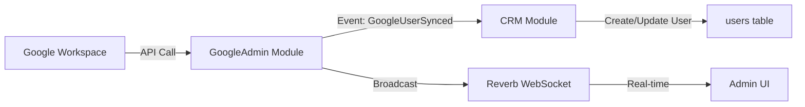
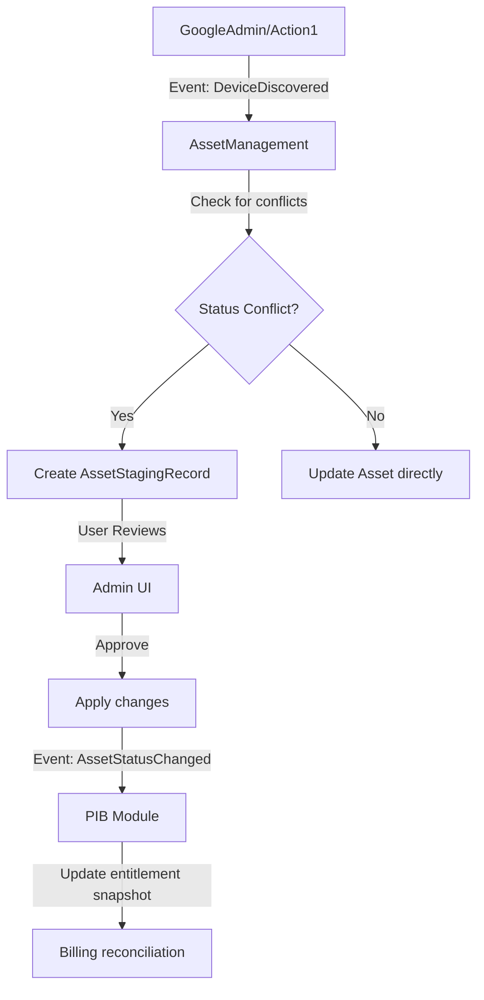
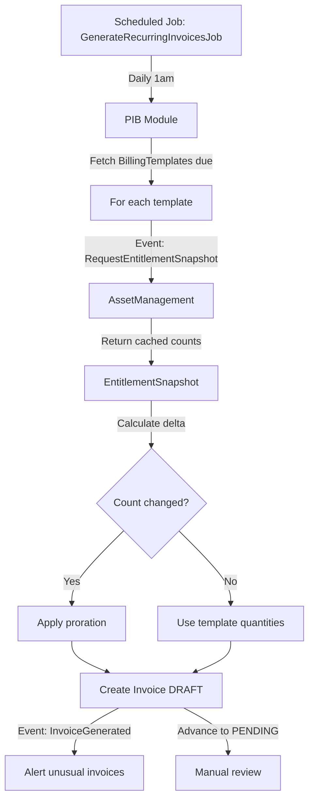
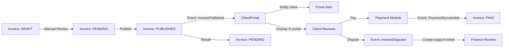
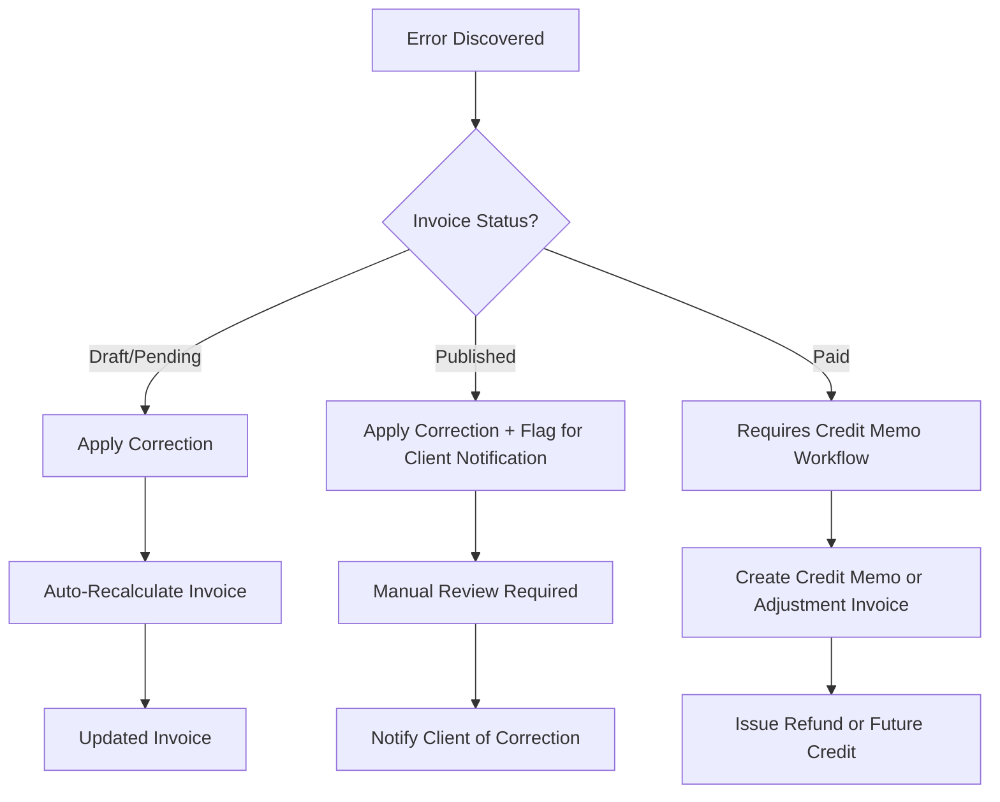

# System Architecture
**Version:** 4.9
**Date:** March 3, 2026
**Status:** Production-Ready Design Document (Implementation-Tracked)

---

## 📊 Implementation Status Legend

**This document uses status indicators to distinguish between implemented and planned features:**

| Symbol | Status | Meaning |
|--------|--------|----------|
| ✅ | **Implemented** | Feature is fully functional in the codebase |
| ⏳ | **Planned** | Feature is documented but not yet implemented |
| ⚠️ | **Partial** | Partially implemented, requires completion |
| 🐛 | **Bug/Gap** | Implementation exists but has known issues |
| 🧑‍💻 | **In Progress** | Currently being developed |
| ❌ | **Deprecated** | No longer planned or being removed |

**Documentation Best Practices:**
1. **Separate Current State from Future Plans** - Use status indicators consistently
2. **Update Regularly** - Review status quarterly or after major releases
3. **Link to Issues** - Reference GitHub issues/PRs for planned features
4. **Version Documentation** - Update version number and date when making significant changes
5. **Maintain Accuracy** - Documentation should reflect reality, not aspirations alone

---

## 📚 Documentation Navigation

**You are here:** System Architecture v4.9 (Design Specification) — for the document index, see **[README.md](README.md)**.

**Recent Updates (v4.9 - March 3, 2026):**
- ✅ **Architecture compliance**: All Core Blindness violations resolved — 9 components moved to their owning modules
- ✅ **Queue isolation**: Confirmed all PIB jobs dispatch to the `billing` queue

**Previous (v4.7 - Feb 13, 2026):**
- ✅ Infrastructure Standardization: PHP 8.2 across Docker and OrbStack
- ✅ Deployment Reliability: Unified deployment flows
- ✅ Module Deployment: Standardized migration logic (`module:migrate --all --force`)

**Previous Updates (v4.5 - Feb 8, 2026):**
- ⭐ **Added Section 14: Performance & Scalability Architecture** - Horizontal scaling, caching strategy, performance targets
- ⭐ **Added Section 15: Observability & Monitoring** - Logs, metrics (Prometheus), traces (Sentry), health checks
- ⭐ **Added Section 16: Transaction Management Guidelines** - When to use transactions, patterns, anti-patterns
- ⭐ **Added Section 17: Disaster Recovery & Business Continuity** - Backup strategy, recovery procedures, RTO/RPO
- ⭐ **Added Section 18: API Standards & Versioning** - URL versioning, compatibility policy, authentication (Sanctum)
- ✅ Addressed all critical architecture gaps identified in best practices review

**Previous Updates (v4.4 - Feb 2026):**
- ✅ Updated module status: Alerts, SoftwareSubscriptions, WidgetRegistry confirmed as implemented
- ✅ Clarified service naming: GoogleWorkspaceService, Action1Service, InvoiceGenerator
- ✅ Added implementation status tracking with clear indicators (✅/⏳/⚠️)
- ⏳ Documented planned features: Queue isolation, webhook support, ADR-006 shared components
- ✅ Added missing services to documentation: AssetStatusService, AssetCounterService, TimeEntryService

**Recent Updates (v4.2):**
- ✅ Extracted billing fields from CRM `client_conversations` to PIB `conversation_billing_metadata`
- ✅ CRM fires `ConversationLinkedToClient` with `clientConversationId` for PIB to create billing records
- ✅ Core Blindness fully enforced: CRM owns ticket↔client link, PIB owns billing classification
- ✅ Dynamic relationship: `ClientConversation::billingMetadata()` registered by PIBServiceProvider

**Previous Updates (v4.1):**
- ✅ Resolved all core blindness violations (controllers moved to modules)
- ✅ Documented admin aggregator controller pattern
- ✅ Established data ownership principles (financial data → billing modules)
- ✅ Added complete case study: Credit system migration (CRM → PIB)
- ✅ Enhanced MODULE_DEVELOPMENT_GUIDE with controller organization patterns

---

## Executive Summary

This document defines the comprehensive architecture for an event-driven, modular MSP management platform. The system orchestrates customer relationship management, asset tracking, billing automation, contract management, and client portal interactions through loosely coupled modules communicating via Laravel Events and Reverb WebSockets.

**Architectural Compliance Status (March 2, 2026):**
- ✅ **Core blindness** - No `app/` code imports feature module classes (violation resolved March 2, 2026 — see [MODULAR_SYSTEM_QA.md](MODULAR_SYSTEM_QA.md))
- ✅ **Proper data ownership** - Financial data isolated in billing modules (PIB)
- ✅ **Ticket billing separation** - CRM owns ticket↔client links, PIB owns billing metadata
- ✅ **Controller organization** - Module controllers live in their respective modules
- ✅ **Dynamic class checking** - Cross-module aggregators use graceful degradation
- ✅ **Complete case study** - Credit system migration demonstrates all patterns
- ✅ **Queue isolation** - All PIB jobs (`GenerateInvoiceJob`, `GenerateRecurringInvoicesJob`, `MonthEndTimeAggregationJob`) dispatch to the `billing` queue

---

## Table of Contents

1. [Architecture Principles](#1-architecture-principles)
2. [Module Ecosystem](#2-module-ecosystem)
3. [Data Flow & Event Architecture](#3-data-flow--event-architecture)
4. [API Rate Limiting & Batch Sync Strategy](#4-api-rate-limiting--batch-sync-strategy)
5. [Proration & Billing Reconciliation](#5-proration--billing-reconciliation)
6. [Billing Entitlement Engine & Advanced Products](#6-billing-entitlement-engine--advanced-products)
7. [Idempotency & Event Deduplication](#7-idempotency--event-deduplication)
8. [Role-Based Access Control (RBAC)](#8-role-based-access-control-rbac)
9. [Database Schema Design](#9-database-schema-design)
10. [Event Catalog](#10-event-catalog)
11. [API Contracts](#11-api-contracts)
12. [Implementation Roadmap](#12-implementation-roadmap)
13. [Module Development Best Practices](#13-module-development-best-practices)
14. [Performance & Scalability Architecture](#14-performance--scalability-architecture) ⭐ **NEW**
15. [Observability & Monitoring](#15-observability--monitoring) ⭐ **NEW**
16. [Transaction Management Guidelines](#16-transaction-management-guidelines) ⭐ **NEW**
17. [Disaster Recovery & Business Continuity](#17-disaster-recovery--business-continuity) ⭐ **NEW**
18. [API Standards & Versioning](#18-api-standards--versioning) ⭐ **NEW**
19. [Case Study: Credit System Migration](#19-case-study-credit-system-migration-crm--pib)
20. [Open Questions](#20-open-questions)

---

## 1. Architecture Principles

### 1.1 Core Blindness Pattern

**Rule:** Core modules (CRM) must never depend on feature modules (PIB, Payment, etc.). Feature modules extend core functionality via dynamic relationships and event listeners.

```php
// ❌ BAD: CRM depends on PIB
namespace Modules\Crm\Models;
use Modules\PIB\Models\Invoice;

class Client extends Model {
    public function invoices() {
        return $this->hasMany(Invoice::class);
    }
}

// ✅ GOOD: PIB extends CRM dynamically
namespace Modules\PIB\Providers;

Client::resolveRelationUsing('invoices', function ($client) {
    return $client->hasMany(Invoice::class);
});
```

### 1.2 Event-Driven Communication

**Primary Pattern:** Modules communicate through Laravel Events. Synchronous queries allowed for read-only operations.

```php
// Module A publishes event
event(new AssetStatusChanged($asset, 'active', 'retired'));

// Module B listens
class UpdateBillingOnAssetChange {
    public function handle(AssetStatusChanged $event) {
        // Update billing template asynchronously
    }
}
```

### 1.3 Eventual Consistency

**Queue Strategy:** Use queued jobs for cross-module writes. Accept eventual consistency for better resilience.

**Real-Time Updates:** Use Reverb/WebSockets for UI updates, not as primary data synchronization mechanism.

### 1.4 Modular Boundaries

Each module owns its domain:
- **CRM**: Customer/Company records, contacts, relationships
- **AssetManagement**: Asset inventory, status, assignments
- **GoogleAdmin**: Google Workspace API integration
- **Action1**: Windows/macOS/Linux RMM integration
- **ContractManager**: Quote creation, contract management, billing template configuration ("what the client agreed to pay")
- **PIB**: Invoice generation, entitlement calculation, credit balances, proration ("billing execution engine")
- **Payment**: Payment processing, transaction ledger
- **ClientPortal**: Client-facing aggregator (no domain logic)
- **Alerts**: Notification subscription and routing

**Critical Data Ownership Rule:** Financial data belongs in billing modules, not CRM.

✅ **Correct Placement:**
- Client credit balances → PIB module (`client_credits` table)
- Invoice data → PIB module (`invoices` table)
- Payment transactions → Payment module (`transactions` table)
- Customer metadata → CRM module (`clients` table)

❌ **Incorrect Placement:**
- `clients.credit_balance` column (financial data in CRM) → Move to `client_credits.balance_cents` in PIB
- Billing logic in CRM services → Move to PIB services

**Rationale:** Proper separation of concerns allows:
- Independent module testing
- Billing features can be disabled without breaking CRM
- Clear audit trails for financial data
- Simplified compliance (PCI, SOX, etc.)

### 1.5 Module Discovery Pattern

**Problem:** Centralized `EventServiceProvider` becomes a merge conflict magnet and violates core blindness.

**Solution:** Each module self-registers its event listeners in its own `ServiceProvider::boot()` method.

```php
// ❌ BAD: Centralized (Core knows about all modules)
// app/Providers/EventServiceProvider.php
protected $listen = [
    \Modules\GoogleAdmin\Events\GoogleUserSynced::class => [
        \Modules\Crm\Listeners\SyncGoogleUserListener::class, // Core shouldn't know about this
        \Modules\AssetManagement\Listeners\LogGoogleSyncListener::class,
    ],
];

// ✅ GOOD: Decentralized (Modules register themselves)
// Modules/Crm/Providers/CrmServiceProvider.php
public function boot() {
    if (class_exists(\Modules\GoogleAdmin\Events\GoogleUserSynced::class)) {
        Event::listen(
            \Modules\GoogleAdmin\Events\GoogleUserSynced::class,
            \Modules\Crm\Listeners\SyncGoogleUserListener::class
        );
    }
}

// Modules/AssetManagement/Providers/AssetManagementServiceProvider.php
public function boot() {
    if (class_exists(\Modules\GoogleAdmin\Events\GoogleUserSynced::class)) {
        Event::listen(
            \Modules\GoogleAdmin\Events\GoogleUserSynced::class,
            \Modules\AssetManagement\Listeners\LogGoogleSyncListener::class
        );
    }
}
```

**Benefits:**
- ✅ Core module never knows who listens to its events
- ✅ No merge conflicts - each module modifies only its own files
- ✅ Modules can be enabled/disabled independently
- ✅ True loose coupling - add/remove listeners without touching core
- ✅ Easy to see all listeners for a module in one place

### 1.6 Shared UI Component Library (ADR-006)

**Problem:** Micro-frontend modules developed independently risk inconsistent UX. Without governance, PIB invoices might use different table styles, buttons, colors than AssetManagement device lists—making the portal feel like "different apps."

**Solution:** Enforce **shared component library** that all modules MUST use.

**Implementation:**
```
resources/js/components/ui/
├── Button.vue          # Consistent buttons (primary, secondary, danger, ghost)
├── DataTable.vue       # Standardized tables with pagination/sorting
├── Card.vue,Modal.vue, Badge.vue, Alert.vue, Form.vue

resources/css/design-tokens.css
--color-primary: #3b82f6; --color-success: #10b981; --space-4: 1rem;
```

**Implementation Status:** ⏳ **Planned (Not Yet Implemented)**

**Proposed Enforcement:**
1. ESLint rules block direct CSS classes, require @/components/ui/ imports
2. ClientPortal validates components before tab registration
3. CI/CD fails builds with unapproved components

**Module Usage:**
```blade
{{-- PIB Module --}}
<x-data-table :columns="..." :data="$invoices">
    <x-badge variant="success">Paid</x-badge>
</x-data-table>

{{-- AssetManagement Module (uses SAME components) --}}
<x-data-table :columns="..." :data="$assets">
    <x-badge variant="success">Active</x-badge>
</x-data-table>
```

**Governance:** Platform Team owns library, RFC process for new components, monthly design reviews.

✅ **Benefits:** Consistent UX, faster development, single source of truth
❌ **Trade-offs:** Modules cannot customize UI, requires governance overhead

### 1.7 UI Widget Registry Pattern (Replaced Aggregator Pattern)

**Problem:** Admin interfaces need to display data from multiple modules in a single view (e.g., client 360-degree view) without Core knowing about specific modules.

**Old Solution (Deprecated):** Dynamic class checking in controllers.
**New Solution:** **Widget Registry**. Modules register UI components during boot, and Core renders them via hooks.

**Implementation:**
1. **Core Service:** `Modules\WidgetRegistry\Services\WidgetRegistryService` (Infrastructure Module).
2. **Module Provider:**
   ```php
   public function boot() {
       $registry = app(WidgetRegistryService::class);
       $registry->register('admin.client.show.financials', function($client) {
           return view('pib::widgets.financials', compact('client'))->render();
       });
   }
   ```
3. **Core Controller:**
   ```php
   use Modules\WidgetRegistry\Services\WidgetRegistryService;

   public function show($id, WidgetRegistryService $registry) {
       $widgets = $registry->getWidgetsForHook('admin.client.show.financials', $client);
       return view('admin.clients.show', compact('widgets'));
   }
   ```

**Benefits:**
- **Zero Coupling:** Core knows nothing about PIB or AssetManagement classes.
- **Open/Closed:** Add new modules without touching Core controllers.
- **Extensible:** Modules can inject tabs, sidebar items, or dashboard widgets.

---

## 2. Module Ecosystem

### 2.1 Dependency Graph

> **Legend:** ✅ = Implemented, ⏳ = Planned/Not Yet Implemented

```
┌─────────────────────────────────────────────────────────┐
│              CRM (Foundation Module) [REQUIRED] ✅       │
│  - Companies, Contacts, Users                           │
│  - No dependencies - Always enabled                     │
│  NOTE: CRM is imported by core aggregators via          │
│        use Modules\\Crm\\Models\\Client (allowed)       │
└────────────┬──────────────┬─────────────┬──────────────┘
             │              │             │
    ┌────────▼──────┐  ┌───▼─────────┐  ┌▼───────────────┐
    │ GoogleAdmin ✅ │  │  Action1 ✅  │  │ContractManager✅│
    │ (Integration) │  │(Integration)│  │(Quotes/Billing)│
    │ Depends: CRM  │  │Depends: CRM │  │  Depends: CRM  │
    └────────┬──────┘  └───┬─────────┘  └┬───────────────┘
             │              │             │
             └──────┬───────┘             │
                    │                     │
         ┌──────────▼──────────────┐      │
         │   AssetManagement ✅     │      │
         │   Depends: CRM,         │      │
         │   GoogleAdmin, Action1  │      │
         └──────────┬──────────────┘      │
                    │                     │
    ┌───────────────┼─────────────────────┤
    │               │                     │
    ▼               ▼                     ▼
┌───────────────────┐ ┌─────────────────────────────────────┐
│SoftwareSubs ✅    │ │              PIB ✅                  │
│ [IMPLEMENTED]     │ │    (Billing Execution Engine)       │
│Depends: CRM,      │ │  Depends: CRM, ContractManager,     │
│AssetMgmt,         │ │  AssetMgmt                          │
│GoogleAdmin,       │ │  Reads BillingTemplates from CM     │
│Action1            │ │                                      │
└──────┬────────────┘ └─────────────────┬───────────────────┘
       │                          │
       └────────┬─────────────────┘
                │
         ┌──────▼─────────────┐
         │    Payment ✅       │
         │(Helcim Integration)│
         │Depends: CRM, PIB   │
         └──────────┬─────────┘
                    │
         ┌──────────▼──────────────┐
         │    ClientPortal ✅       │
         │   (Aggregator View)     │
         │   Depends: CRM,         │
         │   ContractManager, PIB, │
         │   Payment, AssetMgmt    │
         └─────────────────────────┘

┌─────────────────────────────────────────────────────────┐
│         Standalone/Utility Modules (No Dependencies)    │
├─────────────────────────────────────────────────────────┤
│  DevFeedback ✅    - Developer feedback collection      │
│  EmailMigration ✅ - IMAP email migration platform      │
└─────────────────────────────────────────────────────────┘

┌─────────────────────────────────────────────────────────┐
│         Infrastructure Modules (Cross-Cutting) ✅        │
├─────────────────────────────────────────────────────────┤
│  Alerts ✅         - Alert routing, throttling, digests │
│  WidgetRegistry ✅ - Dynamic UI composition             │
│  KnowledgeBase ✅  - Help article management            │
└─────────────────────────────────────────────────────────┘
```

### 2.2 Module Specifications

#### **CRM** (Foundation Module - REQUIRED)
- **Purpose**: Core customer and company management
- **Models**: `Client`, `Contact`, `User`, `Company` (if separate from Client)
- **Dependencies**: None
- **Status**: ✅ **Foundation Module** - Always enabled, other modules depend on it
- **Special Note**: CRM models may be imported by core aggregator controllers in `app/Http/Controllers/Admin/` (e.g., `Client360Controller`). This is the **only** allowed exception to core blindness for CRM, because CRM functions as a foundation layer.
- **Responsibilities**:
  - User authentication (Google OAuth)
  - Company/client records
  - Contact management
  - Custom fields system

#### **WidgetRegistry** (Infrastructure Module)
- **Purpose**: Dynamic UI composition for cross-module views
- **Dependencies**: None
- **Status**: ✅ **Infrastructure Module** - Core depends on this for UI composition
- **Responsibilities**:
  - Registry of UI widgets/hooks
  - Rendering logic for widget zones
  - Ensuring module independence in UI composition

#### **GoogleAdmin**
- **Purpose**: Google Workspace API integration
- **Models**: Configuration stored in module Config
- **Dependencies**: CRM
- **Status**: ✅ **Implemented** (polling-based sync)
- **Services**:
  - `GoogleWorkspaceService`: Main sync orchestration
  - `GoogleUserProvider`: User data provider for authentication
- **Responsibilities**:
  - Sync users from Google Workspace to CRM
  - Sync Chromebooks to AssetManagement (via events)
  - OAuth token management
- **Events Published**:
  - `GoogleUserSynced`
  - `GoogleChromebookDiscovered`
  - `GoogleLicenseDiscovered`
  - `GoogleSyncFailed`
- **Webhook Support**: ⏳ **Planned (Future)** - Directory API push notifications, Chrome device status updates

#### **Action1**
- **Purpose**: Action1 RMM API integration
- **Models**: Configuration stored in module Config
- **Dependencies**: CRM
- **Status**: ✅ **Implemented** (polling-based sync)
- **Services**:
  - `Action1Service`: Main API client and sync orchestration
- **Responsibilities**:
  - Sync Windows/macOS/Linux devices to AssetManagement
  - API credential management
- **Events Published**:
  - `Action1DeviceDiscovered`
  - `Action1DeviceUpdated`
  - `Action1SoftwareDiscovered`
  - `Action1SyncFailed`
- **Future Enhancements**: ⏳ Execute remote scripts, webhook support for real-time device status

#### **AssetManagement**
- **Purpose**: Central asset inventory and status management
- **Models**: `Asset`, `AssetStagingRecord`
- **Dependencies**: CRM, GoogleAdmin, Action1
- **Status**: ✅ **Implemented**
- **Services**:
  - `AssetStatusService`: Asset state machine management (Singleton)
  - `AssetCounterService`: Asset quantity tracking with atomic operations (Singleton)
  - `AssetReconciliationService`: Conflict resolution for asset data
- **Responsibilities**:
  - Asset records (Chromebooks, Windows, macOS, Linux)
  - Asset-to-client assignments
  - Status change staging/conflict resolution
  - Asset count tracking for billing via AtomicCounterService
- **Events Published**:
  - `AssetStatusChanged`
  - `AssetCountChanged`
- **Events Listened**:
  - `GoogleChromebookDiscovered` → Create/update assets (GoogleChromebookDiscoveredListener)
  - `Action1DeviceDiscovered` → Create/update assets (Action1DeviceDiscoveredListener)

#### **ContractManager** (Evolved from QuoteWizard)
- **Purpose**: Quote creation, contract management, and billing configuration
- **Models**: `Quote`, `QuoteRevision`, `QuoteLineItem`, `Contract`, `ContractSchedule`, `BillingTemplate`, `Milestone`
- **Dependencies**: CRM
- **Responsibilities**:
  - Multi-step quote creation wizard
  - Contract generation from approved quotes
  - Revision tracking with amendment history
  - Client approval workflow (integrates with ClientPortal)
  - **Billing template configuration** ("what the client agreed to pay")
  - Contract renewal scheduling
- **Events Published**:
  - `QuoteCreated`
  - `QuoteRevised`
  - `QuoteApproved` → Creates Contract
  - `QuoteSentToClient`
  - `ContractActivated` → Triggers billing schedule
  - `ContractRevised` → ✅ **Implemented:** Triggers proration in PIB (RecalculateProrationOnContractChange listener)
  - `BillingTemplateDue` → PIB generates invoice (BillingTemplateDueListener)
- **Database Tables**:
  - `cm_quotes`: Quote proposals
  - `cm_quote_line_items`: Line items on quotes
  - `cm_quote_revisions`: Revision history
  - `cm_contracts`: Signed agreements (terms, dates, signatures)
  - `cm_contract_schedules`: Renewal dates, billing schedule
  - `cm_billing_templates`: Billing configuration from contracts
- **Rationale for BillingTemplate Ownership**:
  - Single source of truth for "what the client agreed to pay"
  - Natural lifecycle: Quote → Contract → BillingTemplate
  - PIB becomes pure execution engine (stateless invoice generation)
  - Clear separation: ContractManager = Configuration, PIB = Execution

#### **PIB** (Partner Invoicing & Billing - Execution Engine)
- **Purpose**: Billing execution engine + Financial Operations
- **Models**: `Invoice`, `InvoiceLineItem`, `EntitlementSnapshot`, `ClientCredit`, `ClientCreditLedger`, `ReconciliationRun`, `ReconciliationDiscrepancy`
- **Dependencies**: CRM, ContractManager, AssetManagement
- **Responsibilities**:
  - Invoice generation from BillingTemplates (owned by ContractManager)
  - Entitlement calculation via resolvers (ServicePlanEntitlementResolver, etc.)
  - Usage-based/entitlement billing reconciliation
  - Invoice state management (draft → published → paid)
  - Proration calculations for mid-cycle changes
  - **Financial Operations**: Client credit balance tracking (atomic operations)
  - **Financial Audit Trail**: Complete ledger of all credit transactions
- **Services**:
  - `ClientCreditService`: Manage client credit balances with atomic operations (implements CreditLedgerInterface)
    - `addCredit()`: Add pre-payment credits (hardware prepayments)
    - `deductCredit()`: Deduct credits on asset assignment
    - `getBalance()`: Get current credit balance
    - `getLedger()`: Get audit trail of all transactions
    - `hasSufficientCredit()`: Check if client can make a purchase
  - `BillingService`: Invoice queries and client billing data (implements BillingServiceInterface)
  - `InvoiceGenerator`: Generate invoices from billing templates
  - `TimeEntryService`: Time tracking for billable work
  - `BillingAnalysisService`: Billing analytics and reporting
- **Database Tables**:
  - `pib_invoices`: Generated invoices
  - `pib_invoice_line_items`: Line items on invoices
  - `pib_entitlement_snapshots`: Point-in-time billing snapshots
  - `client_credits`: Current balance (balance_cents stored as integer for atomic operations)
  - `client_credit_ledger`: Full audit trail of credits/debits
- **Events Published**:
  - `InvoiceGenerated`
  - `InvoicePublished`
  - `InvoiceRecalled`
  - `InvoiceDisputed`
  - `InvoiceOverdue`
  - `InvoiceUnusual` → Alert Finance roles
- **Events Listened**:
  - `BillingTemplateDue` → Generate invoice from template (BillingTemplateDueListener)
  - `ConversationLinkedToClient` → Create billing metadata for ticket (ConversationLinkedToClientListener)
  - `ContractActivated` → Generate first invoice (GenerateFirstInvoice listener)
  - `PaymentDisputed` → Handle payment disputes (PaymentDisputedListener)
  - ✅ **Implemented:** `AssetCountChanged` → Update entitlement snapshots (UpdateEntitlementSnapshots listener)
  - ✅ **Implemented:** `ContractRevised` → Calculate proration for mid-cycle changes (RecalculateProrationOnContractChange listener)
  - ✅ **Implemented:** `SoftwareCountChanged` → Recalculate subscription costs (AdjustBillingOnSoftwareCountChange listener)
- **Architecture Note**: Credit balance tracking lives in PIB (not CRM) because credits are a **billing product** (the "up-front asset credit" offering). This maintains proper separation of concerns: CRM owns customer data, PIB owns financial data. ✅ Respects Core Blindness principle.
- **Module Boundary**: PIB is a **stateless execution engine**. It receives billing templates from ContractManager and generates invoices. This separation means:
  - ContractManager: "What did the client agree to pay?" (configuration)
  - PIB: "Generate the invoice and track payments" (execution)
- **Cross-Module Access Pattern**: Other modules (e.g., ClientPortal) access credit data through PIB's `ClientCreditService` using dynamic class checking:
  ```php
  // ClientPortal controller example
  if (class_exists('\Modules\PIB\Services\ClientCreditService')) {
      $creditService = app(\Modules\PIB\Services\ClientCreditService::class);
      $balance = $creditService->getBalance($clientId);
  }
  ```
  This pattern allows modules to integrate with PIB when available while remaining functional if PIB is disabled.

#### **Payment** (Existing - Integrate with ClientPortal)
- **Purpose**: Helcim payment processing
- **Models**: `PaymentMethod`, `Transaction`, `Refund`
- **Dependencies**: CRM, PIB
- **Current State**: Helcim API integration, vaulting, webhooks, refunds
- **Enhancements Needed**:
  - Expose payment methods to ClientPortal
  - Client-initiated payments
  - Dispute workflow integration
- **Events Published**:
  - `PaymentMethodAdded`
  - `PaymentSucceeded`
  - `PaymentFailed`
  - `RefundProcessed`
- **Events Listened**:
  - `InvoicePublished` → Trigger auto-payment for enrolled clients

#### **SoftwareSubscriptions** (✅ IMPLEMENTED)

- **Purpose**: Software license tracking, cost allocation, and deployment management
- **Models**: `SoftwareProduct`, `ClientSoftwareSubscription`, `SoftwareAssignment`, `SoftwareSubscriptionSnapshot`
- **Dependencies**: CRM, AssetManagement (optional)
- **Responsibilities**:
  - Software product catalog management (vendors, pricing tiers, licensing models)
  - Client subscription tracking (which clients have which software)
  - Assignment tracking (which users/devices have specific software installed)
  - Subscription count management for billing integration
  - Deployment status tracking (pending, deployed, failed)
  - Vendor reconciliation support (compare internal counts to vendor invoices)
- **Services**:
  - `SubscriptionCounterService`: Atomic counter operations for assignment counts
    - `getAssignedCount()`: Get current assignment count for a subscription
    - `incrementAssignment()`: Add assignment with atomic count update
    - `decrementAssignment()`: Remove assignment with atomic count update
  - `LicenseDeploymentService`: Track deployment status and trigger automation
    - `markDeployed()`: Update assignment status after software installation
    - `getPendingDeployments()`: Get assignments awaiting installation
  - `VendorReconciliationService`: Compare internal vs vendor counts
    - `generateReconciliationReport()`: Identify count mismatches
    - `flagDiscrepancies()`: Alert on significant variances
- **Database Tables**:
  - `software_products`: Product catalog (name, vendor, category, licensing_model, pricing_tiers JSON)
  - `client_software_subscriptions`: Client-product relationships (billing_behavior, custom_pricing)
  - `software_assignments`: Individual user/device assignments (polymorphic: contact or asset)
  - `software_subscription_snapshots`: Monthly snapshots for billing and audit
- **Resolvers**:
  - `SoftwareProductEntitlementResolver`: Calculate subscription cost based on assignment count and tier
    - Supports per-user, per-device, per-site, and flat licensing models
    - Handles tiered pricing (tier selection based on count)
    - Supports billing behaviors: included, passthrough, markup, direct
- **Events Published**:
  - `SoftwareSubscriptionCreated` → New subscription for client
  - `SoftwareAssignmentAdded` → User/device assigned to software
  - `SoftwareAssignmentRevoked` → User/device removed from software
  - `SoftwareCountChanged` → Assignment count changed (triggers billing recalc)
  - `SoftwareDeploymentCompleted` → Software successfully deployed
  - `SoftwareDeploymentFailed` → Deployment failure (alert operations)
- **Events Listened**:
  - `ContactCreated` → Suggest software assignments for new users
  - `AssetCreated` → Suggest software assignments for new devices
  - `ContactDeactivated` → Auto-revoke software assignments
  - `AssetRetired` → Auto-revoke software assignments
  - `QuoteApproved` → Create subscriptions from quote line items
- **Billing Integration Pattern**:
  ```php
  // PIB listens for SoftwareCountChanged
  Event::listen(SoftwareCountChanged::class, function ($event) {
      $subscription = $event->subscription;
      $billingTemplate = $subscription->billingTemplate;

      // Recalculate using SoftwareProductEntitlementResolver
      $result = app(SoftwareProductEntitlementResolver::class)
          ->calculate($billingTemplate);

      // Update snapshot for next invoice
      $billingTemplate->updateProductConfig([
          'software_count' => $event->newCount,
          'tier' => $result->breakdown['tier'],
          'calculated_cost' => $result->amount,
      ]);
  });
  ```
- **Assignment Lifecycle**:
  ```php
  // Auto-revoke when contact deactivated
  Event::listen(ContactDeactivated::class, function ($event) {
      $assignments = SoftwareAssignment::where('assignable_type', 'contact')
          ->where('assignable_id', $event->contact->id)
          ->whereNull('revoked_at')
          ->get();

      foreach ($assignments as $assignment) {
          $assignment->update(['revoked_at' => now()]);
          event(new SoftwareAssignmentRevoked($assignment));
      }
  });
  ```
- **Financial Reports Enabled**:
  - Subscription Cost Summary (total vendor costs by product)
  - Client Software Breakdown (per-client software costs vs revenue)
  - Vendor Reconciliation (internal counts vs vendor invoices)
  - Unassigned License Report (purchased but unassigned = waste)
  - Margin Analysis (markup revenue vs vendor costs)
- **External Discovery Integration**:
  - **Action1 Integration**: Receives `Action1SoftwareDiscovered` events from Action1 module
    - Matches discovered software to `SoftwareProduct` catalog
    - Links Asset → Client → ClientSoftwareSubscription chain
    - Creates `SoftwareDiscovery` records for audit trail
    - Flags over-deployed software (found but no license assigned)
  - **GoogleAdmin Integration**: Receives `GoogleLicenseDiscovered` events from GoogleAdmin module
    - Syncs Google Workspace license assignments daily
    - Matches user_email to CRM Contact
    - Auto-creates assignments for discovered licenses
    - Tracks Google-specific products (Workspace tiers, Cloud Identity, etc.)
  - **Reconciliation Service**: `SoftwareReconciliationService`
    - `reconcileFromDiscovery()`: Compare discovered vs assigned
    - `flagComplianceIssues()`: Alert on over-deployed or under-licensed
    - `generateReconciliationReport()`: Summary for finance/compliance review
- **Discovery Database Tables**:
  ```sql
  -- software_discoveries (Raw discovery data from external sources)
  CREATE TABLE software_discoveries (
      id BIGINT UNSIGNED AUTO_INCREMENT PRIMARY KEY,
      source ENUM('action1', 'google', 'intune', 'manual') NOT NULL,
      source_identifier VARCHAR(255) NOT NULL,  -- Asset ID or User Email
      software_product_id BIGINT UNSIGNED DEFAULT NULL,  -- NULL if unrecognized
      raw_software_name VARCHAR(255) NOT NULL,
      version VARCHAR(100) DEFAULT NULL,
      discovered_at TIMESTAMP NOT NULL,
      reconciliation_status ENUM('verified', 'over_deployed', 'under_utilized', 'unrecognized') DEFAULT 'unrecognized',
      reconciled_at TIMESTAMP DEFAULT NULL,
      assignment_id BIGINT UNSIGNED DEFAULT NULL,  -- Link to matched assignment
      client_id BIGINT UNSIGNED NOT NULL,
      created_at TIMESTAMP DEFAULT CURRENT_TIMESTAMP,
      updated_at TIMESTAMP DEFAULT CURRENT_TIMESTAMP ON UPDATE CURRENT_TIMESTAMP,

      FOREIGN KEY (software_product_id) REFERENCES software_products(id) ON DELETE SET NULL,
      FOREIGN KEY (assignment_id) REFERENCES software_assignments(id) ON DELETE SET NULL,
      FOREIGN KEY (client_id) REFERENCES clients(id) ON DELETE CASCADE,
      INDEX idx_source (source, source_identifier),
      INDEX idx_status (reconciliation_status),
      INDEX idx_client (client_id)
  ) ENGINE=InnoDB;
  ```
- **Discovery Events Listened**:
  - `Action1SoftwareDiscovered` → Create discovery record, attempt reconciliation
  - `GoogleLicenseDiscovered` → Create discovery record, auto-assign if subscription exists
  - `Action1DeviceDiscovered` → Link Asset to enable software discovery correlation
  - `GoogleChromebookDiscovered` → Link Asset for Chromebook-specific software
- **Discovery Events Published**:
  - `SoftwareReconciled` → Discovery matched to assignment (verified)
  - `SoftwareComplianceAlert` → Over-deployed or under-licensed detected
  - `UnrecognizedSoftwareDetected` → Software found not in catalog (suggest adding)

#### **ClientPortal**
- **Purpose**: Client-facing portal aggregator
- **Models**: None (reads from other modules)
- **Dependencies**: CRM, ContractManager, PIB, Payment, AssetManagement
- **Status**: ✅ **Implemented** (Portal functional with tab registry system)
- **Responsibilities**:
  - Dashboard showing quotes, contracts, invoices, payments, assets, software
  - Quote approval interface (triggers ContractManager events)
  - Contract signature workflow
  - Invoice payment interface
  - Invoice dispute submission
  - Tab registration system for modules
- **Architecture Pattern**: Micro-frontend aggregator
  ```php
  // Other modules register tabs via PortalTabRegistry service
  // In module's ServiceProvider boot() method:
  $registry = $this->app->make(\Modules\ClientPortal\Services\PortalTabRegistry::class);
  $registry->registerTab(
      label: 'Invoices',
      view: 'pib::portal.invoices',
      permission: 'view_billing',
      icon: 'heroicon-o-document-text',
      order: 10
  );
  ```
- **Events Published**:
  - `ClientApprovedQuote`
  - `ClientDisputedInvoice`
  - `ClientInitiatedPayment`
- **Real-Time**: Subscribe to Reverb channels for live updates

#### **DevFeedback** (✅ IMPLEMENTED)
- **Purpose**: In-app developer feedback collection for bug reports and feature requests
- **Models**: None (uses Option for configuration)
- **Dependencies**: None (standalone utility module)
- **Responsibilities**:
  - Floating feedback button on all admin pages
  - Capture page URL context with feedback
  - Email feedback to configured developer address
  - Settings page to configure recipient email
- **Controllers**:
  - `DevFeedbackController`: Processes feedback submissions, sends email
  - `SettingsController`: Manages feedback recipient configuration
- **Mail**:
  - `DevFeedbackSubmitted`: Mailable containing feedback, user info, and page URL
- **Permissions**:
  - `manage_dev_feedback`: Access to settings page
- **Database**: Uses core `options` table for `devfeedback_email` setting
- **Architecture Notes**: Simple standalone module, no cross-module dependencies

#### **EmailMigration** (✅ IMPLEMENTED)
- **Purpose**: Enterprise-grade IMAP-to-IMAP email migration platform
- **Models**: `MigrationProject`, `MigrationBatch`, `MigrationMapping`, `MigrationMessage`, `MigrationSubscription`
- **Dependencies**: None (standalone tool module)
- **Responsibilities**:
  - Four-stage migration workflow (Discovery → Mapping → Verification → Execution)
  - Flight Deck UI for migration management
  - CSV-based mailbox mapping and renaming
  - Delta-sync capable migrations with resume support
  - Firewatch alert system for migration monitoring
  - Docker Lab verification environment
- **Services**:
  - `ImapMigrationService`: Core migration engine with RFC 3501 compliance
  - `DiscoveryService`: Source server scanning and folder enumeration
  - `VerificationService`: Dry-run simulation in Docker Lab
  - `DeltaSyncService`: Incremental sync for cutover migrations
- **Events Published**:
  - `MigrationPhaseStarted`
  - `MigrationPhaseCompleted`
  - `MigrationMilestoneReached`
  - `MigrationErrorThresholdExceeded`
- **Database Tables**:
  - `migration_projects`: Top-level migration configuration (12-stage state machine)
  - `migration_batches`: Job group tracking for phases
  - `migration_mappings`: Per-mailbox configuration
  - `migration_messages`: Relational idempotency tracking (O(log N) lookups)
  - `migration_subscriptions`: Firewatch alert configurations
- **Permissions**:
  - `view_email_migration`: View migration projects
  - `manage_email_migration`: Create/edit/execute migrations
- **Architecture Notes**:
  - Uses Circuit Breaker pattern for IMAP connection resilience
  - WebSocket broadcasts for real-time progress updates
  - See `Modules/EmailMigration/ARCHITECTURE.md` for detailed V2.1 specification

#### **Alerts** (✅ IMPLEMENTED)

> **Status Update (Feb 2026):** This module has been fully implemented with multi-channel delivery, throttling, and digest support. See Modules/Alerts/README.md for API documentation.

- **Purpose**: Centralized alert subscription and routing system
- **Models**: `AlertType`, `AlertSubscription`, `AlertDeliveryLog`, `AlertThrottle`, `AlertDigestQueue`, `NotificationSubscription`
- **Dependencies**: None (infrastructure layer)
- **Status**: ✅ **Fully Operational**
- **Services**:
  - `AlertService`: Central routing service for dispatching alerts with throttling
  - `AlertSubscriptionService`: User subscription preference management
- **Features**:
  - **Multi-channel delivery**: Email, Slack, SMS, and database notifications
  - **Alert throttling**: Prevents alert fatigue (1 alert per type per client per hour by default)
  - **Digest support**: Hourly, daily, or weekly aggregated notifications
  - **User subscriptions**: Users configure which alerts they receive and how
  - **Client filtering**: Subscribe to alerts for specific clients only
  - **Audit logging**: Complete delivery audit trail via AlertDeliveryLog
  - **Cross-module integration**: Listens to events from PIB, Payment, GoogleAdmin, Action1, SoftwareSubscriptions
- **Events Listened**:
  - `PaymentFailed` (Payment) → Alert code: `payment.failed`
  - `InvoiceUnusual` (PIB) → Alert code: `invoice.unusual`
  - `GoogleSyncFailed` (GoogleAdmin) → Alert code: `sync.google.failed`
  - `Action1SyncFailed` (Action1) → Alert code: `sync.action1.failed`
  - `SoftwareDeploymentFailed` (SoftwareSubscriptions) → Alert code: `software.deployment.failed`
- **API Endpoints**:
  - `GET /api/v1/alert-subscriptions/matrix` - Get subscription matrix
  - `GET /api/v1/alert-subscriptions` - List user's subscriptions
  - `POST /api/v1/alert-subscriptions/subscribe` - Subscribe to alert type
  - `GET /api/v1/alert-types` - List all alert types (admin)
  - `GET /api/v1/alert-logs` - Delivery logs with filtering
  - `GET /api/v1/alert-logs/stats` - Delivery statistics
- **Configuration Example**:
  ```php
  use Modules\Alerts\DataTransferObjects\AlertPayload;
  use Modules\Alerts\Services\AlertService;

  $alertService = app(AlertService::class);
  $alertService->dispatch(new AlertPayload(
      alertTypeCode: 'payment.failed',
      title: 'Payment Failed - $150.00',
      message: 'Payment transaction failed. Reason: Card declined.',
      clientId: 123,
      clientName: 'Acme Corp',
      eventId: 'evt_abc123',
      metadata: ['invoice_id' => 456],
      actionUrl: '/invoices/456',
      actionLabel: 'View Invoice',
  ));
  ```
- **Listeners**:
  - `PaymentFailedListener` → Dispatches `payment.failed` alert
  - `InvoiceUnusualListener` → Dispatches `invoice.unusual` alert
  - `GoogleSyncFailedListener` → Dispatches `sync.google.failed` alert
  - `Action1SyncFailedListener` → Dispatches `sync.action1.failed` alert
  - `SoftwareDeploymentFailedListener` → Dispatches `software.deployment.failed` alert

#### **WidgetRegistry** (✅ IMPLEMENTED)
- **Purpose**: Dynamic UI composition for cross-module views
- **Dependencies**: None (infrastructure module)
- **Status**: ✅ **Fully Operational**
- **Service**: `WidgetRegistryService` - Widget registration and rendering engine
- **Contract**: `Modules\WidgetRegistry\Contracts\Widget` interface
- **Implementation Pattern**:
  ```php
  // Modules register widgets in ServiceProvider boot()
  $registry = app(WidgetRegistryService::class);
  $registry->register(new class implements Widget {
      public function getId(): string { return 'client_summary'; }
      public function getTitle(): string { return 'Client Summary'; }
      public function getZone(): string { return 'client_360.top'; }
      public function getPermission(): ?string { return null; }
      public function render(array $data): ?string {
          $client = $data['client'];
          return view('crm::widgets.summary', compact('client'))->render();
      }
  });
  ```
- **Widget Zones**:
  - `client_360.top` - Top of client detail page
  - `client_360.sidebar` - Right sidebar on client detail
  - `dashboard.overview` - Main dashboard widgets
  - `admin.reports` - Report widgets
- **Features**:
  - Permission-based widget filtering
  - Zone-based widget organization
  - Module isolation (Core never imports module classes)
  - Graceful degradation when modules disabled

#### **KnowledgeBase** (✅ IMPLEMENTED)
- **Purpose**: Internal help articles and documentation system
- **Dependencies**: None (standalone utility)
- **Status**: ✅ **Operational**
- **Features**:
  - Article management with categories
  - Full-text search
  - Permission-based access control
  - Markdown support

### 3.1 User Synchronization Flow



**Implementation:**
```php
// GoogleAdmin: SyncGoogleUsersJob
dispatch(new SyncGoogleUsersJob($orgUnitPath));

// Inside job
foreach ($googleUsers as $googleUser) {
    event(new GoogleUserSynced([
        'email' => $googleUser->primaryEmail,
        'first_name' => $googleUser->name->givenName,
        'last_name' => $googleUser->name->familyName,
        'google_id' => $googleUser->id,
        'suspended' => $googleUser->suspended,
        'org_unit_path' => $googleUser->orgUnitPath,
    ]));
}

// CRM: GoogleUserSyncedListener
class GoogleUserSyncedListener {
    public function handle(GoogleUserSynced $event) {
        User::updateOrCreate(
            ['email' => $event->data['email']],
            [
                'first_name' => $event->data['first_name'],
                'last_name' => $event->data['last_name'],
                'google_id' => $event->data['google_id'],
                'status' => $event->data['suspended'] ? User::STATUS_INACTIVE : User::STATUS_ACTIVE,
            ]
        );
    }
}
```

### 3.2 Asset Synchronization with Conflict Resolution



**Implementation:**
```php
// GoogleAdmin: Chromebook sync
event(new GoogleChromebookDiscovered([
    'serial_number' => $device->serialNumber,
    'model' => $device->model,
    'status' => $this->mapGoogleStatus($device->status),
    'last_sync' => $device->lastSync,
    'assigned_user' => $device->userEmail,
]));

// AssetManagement: GoogleChromebookDiscoveredListener
class GoogleChromebookDiscoveredListener {
    public function handle(GoogleChromebookDiscovered $event) {
        $asset = Asset::where('serial_number', $event->data['serial_number'])->first();

        if ($asset && $asset->status !== $event->data['status']) {
            // Conflict detected - stage for review
            AssetStagingRecord::create([
                'asset_id' => $asset->id,
                'source' => 'GoogleAdmin',
                'proposed_changes' => [
                    'status' => ['old' => $asset->status, 'new' => $event->data['status']]
                ],
                'status' => 'pending_review',
            ]);
        } else {
            // No conflict - apply directly
            $asset = Asset::updateOrCreate(
                ['serial_number' => $event->data['serial_number']],
                $event->data
            );

            event(new AssetStatusChanged($asset, $asset->getOriginal('status'), $asset->status));
        }
    }
}
```

### 3.3 Quote → Contract → Billing Flow

```mermaid
graph LR
    A[ContractManager] -->|User Creates| B[Quote Draft]
    B -->|Send to Client| C[ClientPortal]
    C -->|Client Approves| D[Event: QuoteApproved]
    D -->|Listener| E[ContractManager: CreateContractListener]
    E -->|Create| F[Contract + BillingTemplate]
    F -->|Schedule| G[Event: BillingTemplateDue]
    G -->|PIB Listens| H[Invoice Generated]
```



**Implementation:**
```php
// ContractManager: Quote approval
$quote->status = 'approved';
$quote->approved_at = now();
$quote->approved_by = auth()->id();
$quote->save();

event(new QuoteApproved($quote));

// ContractManager: CreateContractListener (within same module)
class CreateContractListener {
    public function handle(QuoteApproved $event) {
        $quote = $event->quote;

        // Create the contract
        $contract = Contract::create([
            'quote_id' => $quote->id,
            'client_id' => $quote->client_id,
            'contract_number' => $this->generateContractNumber(),
            'start_date' => now(),
            'end_date' => now()->addYear(),
            'status' => 'active',
        ]);

        // Create billing template (owned by ContractManager)
        $billingTemplate = BillingTemplate::create([
            'client_id' => $quote->client_id,
            'contract_id' => $contract->id,
            'product_type' => $quote->billing_type, // service_plan, rent_to_own, etc.
            'billing_cycle' => $quote->billing_cycle,
            'next_invoice_date' => $this->calculateNextInvoiceDate($quote),
            'product_config' => $quote->lineItems->map(function($item) {
                return [
                    'description' => $item->description,
                    'quantity_type' => $item->quantity_type, // fixed, per_user, per_asset
                    'unit_price' => $item->unit_price,
                    'quantity' => $item->quantity,
                ];
            })->toArray(),
        ]);
    }
}
```

### 3.4 Billing Reconciliation with Proration



**Implementation:**
```php
// PIB: GenerateRecurringInvoicesJob (scheduled daily)
class GenerateRecurringInvoicesJob {
    public function handle() {
        $templates = BillingTemplate::where('next_invoice_date', '<=', today())->get();

        foreach ($templates as $template) {
            // Request current counts
            $snapshot = event(new RequestEntitlementSnapshot($template->client_id));

            $invoice = Invoice::create([
                'client_id' => $template->client_id,
                'billing_template_id' => $template->id,
                'status' => 'draft',
                'invoice_date' => today(),
                'due_date' => today()->addDays(30),
            ]);

            foreach ($template->line_items as $item) {
                $quantity = $this->calculateQuantity($item, $snapshot);
                $amount = $quantity * $item['unit_price'];

                InvoiceLineItem::create([
                    'invoice_id' => $invoice->id,
                    'description' => $item['description'],
                    'quantity' => $quantity,
                    'unit_price' => $item['unit_price'],
                    'amount' => $amount,
                ]);
            }

            // Check if invoice is unusual (large variance)
            if ($this->isUnusual($invoice, $template)) {
                event(new InvoiceUnusual($invoice, 'Amount variance > 20%'));
                $invoice->update(['requires_review' => true]);
            } else {
                $invoice->update(['status' => 'pending']);
            }

            event(new InvoiceGenerated($invoice));
        }
    }
}

// AssetManagement: Entitlement snapshot cache
class RequestEntitlementSnapshotListener {
    public function handle(RequestEntitlementSnapshot $event) {
        return EntitlementSnapshot::where('client_id', $event->clientId)
            ->whereDate('snapshot_date', today())
            ->firstOrFail();
    }
}

// Scheduled job to cache daily snapshots
class RecordDailyAssetCountJob {
    public function handle() {
        foreach (Client::all() as $client) {
            EntitlementSnapshot::create([
                'client_id' => $client->id,
                'snapshot_date' => today(),
                'user_count' => $client->users()->active()->count(),
                'chromebook_count' => $client->assets()->where('type', 'chromebook')->active()->count(),
                'windows_count' => $client->assets()->where('type', 'windows')->active()->count(),
                // ... other asset types
            ]);
        }
    }
}
```

### 3.5 Invoice Lifecycle & Client Portal



**Implementation:**
```php
// PIB: Publish invoice to client portal
Route::post('/invoices/{invoice}/publish', function(Invoice $invoice) {
    $invoice->update([
        'status' => 'published',
        'published_at' => now(),
    ]);

    event(new InvoicePublished($invoice));

    return redirect()->back()->with('success', 'Invoice published to client portal');
});

// ClientPortal: InvoicePublishedListener
class InvoicePublishedListener {
    public function handle(InvoicePublished $event) {
        $invoice = $event->invoice;

        // Notify subscribed client contacts
        $contacts = $invoice->client->contacts()
            ->whereHas('alertSubscriptions', function($q) {
                $q->where('alert_types', 'like', '%invoice.new%');
            })->get();

        foreach ($contacts as $contact) {
            Mail::to($contact->email)->send(new NewInvoiceNotification($invoice));
        }

        // Broadcast to WebSocket for real-time UI update
        broadcast(new InvoicePublishedEvent($invoice))->toOthers();
    }
}

// ClientPortal: Dispute invoice
Route::post('/portal/invoices/{invoice}/dispute', function(Invoice $invoice) {
    $this->authorize('viewPortal', $invoice->client);

    $invoice->update(['status' => 'disputed']);

    event(new InvoiceDisputed($invoice, request('reason')));

    return redirect()->back()->with('success', 'Dispute submitted');
});

// Alerts: InvoiceDisputedListener
class InvoiceDisputedListener {
    public function handle(InvoiceDisputed $event) {
        // Alert Finance roles
        $financeUsers = User::role('Finance')->get();

        foreach ($financeUsers as $user) {
            if ($user->isSubscribedToAlert('invoice.disputed', $event->invoice->client_id)) {
                Mail::to($user->email)->send(new InvoiceDisputedAlert($event->invoice, $event->reason));
            }
        }
    }
}
```

---

## 4. API Rate Limiting & Batch Sync Strategy

### 4.1 Problem Statement

**Challenge:** Large initial syncs (1000+ users, 5000+ devices) will hit API rate limits:
- **Google Workspace API:** 1500 requests/minute per project
- **Action1 API:** 100 requests/minute (varies by plan)
- **Consequence:** Without rate limiting, sync jobs fail repeatedly → alert spam → incomplete data

**Requirements:**
1. Respect API rate limits with safety margin
2. Resume interrupted syncs without re-processing
3. Provide progress visibility for long-running syncs
4. Throttle failure alerts (don't spam on rate limits)
5. Support both initial sync (full) and incremental sync (delta)

### 4.2 Database Schema for Sync Tracking

```sql
-- sync_operations (track long-running sync jobs)
CREATE TABLE sync_operations (
    id BIGINT UNSIGNED AUTO_INCREMENT PRIMARY KEY,
    operation_id VARCHAR(36) UNIQUE NOT NULL, -- UUID for idempotency

    -- Sync metadata
    sync_type ENUM('google_users', 'google_chromebooks', 'action1_devices') NOT NULL,
    client_id BIGINT UNSIGNED NOT NULL,
    sync_mode ENUM('full', 'incremental') NOT NULL,

    -- Progress tracking
    status ENUM('pending', 'in_progress', 'paused', 'completed', 'failed') NOT NULL DEFAULT 'pending',
    total_items INT UNSIGNED,
    processed_items INT UNSIGNED DEFAULT 0,
    failed_items INT UNSIGNED DEFAULT 0,
    last_processed_id VARCHAR(255), -- Cursor for resuming (e.g., Google pageToken)

    -- Timing
    started_at TIMESTAMP NULL,
    completed_at TIMESTAMP NULL,
    last_activity_at TIMESTAMP NULL,
    estimated_completion_at TIMESTAMP NULL,

    -- Rate limiting
    api_calls_made INT UNSIGNED DEFAULT 0,
    rate_limit_hits INT UNSIGNED DEFAULT 0,

    -- Error tracking
    error_count INT UNSIGNED DEFAULT 0,
    last_error TEXT,

    -- Configuration snapshot (for resume)
    config JSON,

    created_at TIMESTAMP DEFAULT CURRENT_TIMESTAMP,
    updated_at TIMESTAMP DEFAULT CURRENT_TIMESTAMP ON UPDATE CURRENT_TIMESTAMP,

    INDEX idx_status (status),
    INDEX idx_client_type (client_id, sync_type),
    INDEX idx_started (started_at),
    FOREIGN KEY (client_id) REFERENCES clients(id) ON DELETE CASCADE
) ENGINE=InnoDB;

-- api_rate_limit_tracking (track rate limit consumption)
CREATE TABLE api_rate_limit_tracking (
    id BIGINT UNSIGNED AUTO_INCREMENT PRIMARY KEY,
    service VARCHAR(50) NOT NULL, -- 'google_workspace', 'action1'
    client_id BIGINT UNSIGNED NOT NULL,

    -- Rate limit window
    window_start TIMESTAMP NOT NULL,
    window_duration_seconds INT NOT NULL, -- 60 for per-minute limits

    -- Consumption tracking
    requests_made INT UNSIGNED DEFAULT 0,
    requests_limit INT UNSIGNED NOT NULL,
    requests_remaining INT UNSIGNED NOT NULL,

    -- Status
    is_throttled BOOLEAN DEFAULT FALSE,
    throttled_until TIMESTAMP NULL,

    created_at TIMESTAMP DEFAULT CURRENT_TIMESTAMP,
    updated_at TIMESTAMP DEFAULT CURRENT_TIMESTAMP ON UPDATE CURRENT_TIMESTAMP,

    UNIQUE KEY unique_window (service, client_id, window_start),
    INDEX idx_throttled (service, is_throttled, throttled_until)
) ENGINE=InnoDB;
```

### 4.3 Rate Limiter Service

```php
// app/Services/RateLimiter.php
namespace App\Services;

use Carbon\Carbon;
use Illuminate\Support\Facades\DB;
use Illuminate\Support\Facades\Cache;

class RateLimiter
{
    protected array $config = [
        'google_workspace' => [
            'limit' => 1200, // 20% safety margin below 1500/min
            'window_seconds' => 60,
            'backoff_seconds' => 30,
        ],
        'action1' => [
            'limit' => 80, // 20% safety margin below 100/min
            'window_seconds' => 60,
            'backoff_seconds' => 60,
        ],
    ];

    public function canMakeRequest(string $service, int $clientId): bool
    {
        $cacheKey = "rate_limit:{$service}:{$clientId}";

        // Check cache first (faster than DB)
        if (Cache::has($cacheKey)) {
            $cached = Cache::get($cacheKey);
            if ($cached['throttled_until'] && now()->lt($cached['throttled_until'])) {
                return false;
            }
        }

        $config = $this->config[$service] ?? throw new \InvalidArgumentException("Unknown service: {$service}");

        // Get or create current window
        $window = DB::table('api_rate_limit_tracking')
            ->where('service', $service)
            ->where('client_id', $clientId)
            ->where('window_start', '>=', now()->subSeconds($config['window_seconds']))
            ->lockForUpdate()
            ->first();

        if (!$window) {
            // Start new window
            DB::table('api_rate_limit_tracking')->insert([
                'service' => $service,
                'client_id' => $clientId,
                'window_start' => now(),
                'window_duration_seconds' => $config['window_seconds'],
                'requests_made' => 0,
                'requests_limit' => $config['limit'],
                'requests_remaining' => $config['limit'],
                'is_throttled' => false,
            ]);

            return true;
        }

        // Check if throttled
        if ($window->is_throttled && $window->throttled_until && now()->lt($window->throttled_until)) {
            Cache::put($cacheKey, [
                'throttled_until' => Carbon::parse($window->throttled_until),
            ], now()->diffInSeconds($window->throttled_until));

            return false;
        }

        // Check remaining quota
        return $window->requests_remaining > 0;
    }

    public function recordRequest(string $service, int $clientId, bool $success = true): void
    {
        $config = $this->config[$service];

        DB::table('api_rate_limit_tracking')
            ->where('service', $service)
            ->where('client_id', $clientId)
            ->where('window_start', '>=', now()->subSeconds($config['window_seconds']))
            ->update([
                'requests_made' => DB::raw('requests_made + 1'),
                'requests_remaining' => DB::raw('GREATEST(requests_remaining - 1, 0)'),
            ]);
    }

    public function recordRateLimitHit(string $service, int $clientId, ?int $retryAfterSeconds = null): void
    {
        $config = $this->config[$service];
        $backoffSeconds = $retryAfterSeconds ?? $config['backoff_seconds'];
        $throttledUntil = now()->addSeconds($backoffSeconds);

        DB::table('api_rate_limit_tracking')
            ->where('service', $service)
            ->where('client_id', $clientId)
            ->where('window_start', '>=', now()->subSeconds($config['window_seconds']))
            ->update([
                'is_throttled' => true,
                'throttled_until' => $throttledUntil,
            ]);

        // Cache the throttle status
        Cache::put(
            "rate_limit:{$service}:{$clientId}",
            ['throttled_until' => $throttledUntil],
            $backoffSeconds
        );

        Log::warning('API rate limit hit', [
            'service' => $service,
            'client_id' => $clientId,
            'throttled_until' => $throttledUntil,
            'backoff_seconds' => $backoffSeconds,
        ]);
    }

    public function waitIfNeeded(string $service, int $clientId): void
    {
        while (!$this->canMakeRequest($service, $clientId)) {
            $waitSeconds = 5;
            Log::debug('Rate limit throttling', [
                'service' => $service,
                'client_id' => $clientId,
                'waiting_seconds' => $waitSeconds,
            ]);

            sleep($waitSeconds);
        }
    }

    public function getStatus(string $service, int $clientId): array
    {
        $window = DB::table('api_rate_limit_tracking')
            ->where('service', $service)
            ->where('client_id', $clientId)
            ->where('window_start', '>=', now()->subSeconds(60))
            ->first();

        if (!$window) {
            return [
                'requests_made' => 0,
                'requests_remaining' => $this->config[$service]['limit'],
                'is_throttled' => false,
            ];
        }

        return [
            'requests_made' => $window->requests_made,
            'requests_remaining' => $window->requests_remaining,
            'is_throttled' => $window->is_throttled,
            'throttled_until' => $window->throttled_until,
        ];
    }
}
```

### 4.4 Batch Sync Job with Rate Limiting

```php
// Modules/GoogleAdmin/Jobs/SyncGoogleUsersJob.php
namespace Modules\GoogleAdmin\Jobs;

use App\Services\RateLimiter;
use Illuminate\Bus\Queueable;
use Illuminate\Contracts\Queue\ShouldQueue;
use Illuminate\Queue\InteractsWithQueue;
use Illuminate\Queue\SerializesModels;
use Illuminate\Support\Facades\DB;
use Modules\GoogleAdmin\Services\GoogleWorkspaceService;
use Modules\GoogleAdmin\Events\GoogleUserSynced;
use Modules\GoogleAdmin\Events\GoogleSyncProgressUpdated;
use Modules\GoogleAdmin\Events\GoogleSyncCompleted;
use Modules\GoogleAdmin\Events\GoogleSyncFailed;

class SyncGoogleUsersJob implements ShouldQueue
{
    use InteractsWithQueue, Queueable, SerializesModels;

    public int $timeout = 3600; // 1 hour for large syncs
    public int $tries = 3;
    public int $maxExceptions = 3;

    protected int $clientId;
    protected string $operationId;
    protected string $syncMode;
    protected ?string $pageToken;

    public function __construct(
        int $clientId,
        string $syncMode = 'full',
        ?string $operationId = null,
        ?string $pageToken = null
    ) {
        $this->clientId = $clientId;
        $this->syncMode = $syncMode;
        $this->operationId = $operationId ?? (string) Str::uuid();
        $this->pageToken = $pageToken;

        $this->onQueue('sync'); // Dedicated queue for sync operations
    }

    public function handle(GoogleWorkspaceService $googleService, RateLimiter $rateLimiter): void
    {
        $operation = $this->getOrCreateOperation();

        try {
            $this->updateOperationStatus('in_progress');

            $batchSize = 100; // Process 100 users per batch
            $processedInBatch = 0;
            $currentPageToken = $this->pageToken;

            do {
                // Wait if rate limited
                $rateLimiter->waitIfNeeded('google_workspace', $this->clientId);

                // Fetch users from Google API
                $response = $googleService->listUsers($this->clientId, [
                    'maxResults' => $batchSize,
                    'pageToken' => $currentPageToken,
                ]);

                $rateLimiter->recordRequest('google_workspace', $this->clientId);

                $this->updateOperationMetrics(
                    apiCallsMade: 1,
                    totalItems: $response['total'] ?? null
                );

                // Process each user
                foreach ($response['users'] as $googleUser) {
                    try {
                        // Dispatch event for each user (listeners will handle idempotency)
                        event(new GoogleUserSynced([
                            'client_id' => $this->clientId,
                            'google_user' => $googleUser,
                            'sync_operation_id' => $this->operationId,
                        ]));

                        $processedInBatch++;

                    } catch (\Exception $e) {
                        $this->recordItemFailure($googleUser['primaryEmail'], $e);
                    }
                }

                // Update progress
                $this->updateOperationProgress($processedInBatch);

                // Emit progress event (for real-time UI updates)
                event(new GoogleSyncProgressUpdated([
                    'operation_id' => $this->operationId,
                    'client_id' => $this->clientId,
                    'processed' => $operation->processed_items + $processedInBatch,
                    'total' => $operation->total_items,
                    'sync_type' => 'google_users',
                ]));

                $currentPageToken = $response['nextPageToken'] ?? null;

                // If we have more pages, dispatch next batch job
                if ($currentPageToken) {
                    // Save cursor for resume capability
                    $this->updateOperationCursor($currentPageToken);

                    // Dispatch next batch (chain jobs)
                    dispatch(new self(
                        $this->clientId,
                        $this->syncMode,
                        $this->operationId,
                        $currentPageToken
                    ))->delay(now()->addSeconds(2)); // Small delay between batches

                    break; // Exit this job, next job will continue
                }

            } while ($currentPageToken);

            // If no more pages, mark as completed
            if (!$currentPageToken) {
                $this->updateOperationStatus('completed');

                event(new GoogleSyncCompleted([
                    'operation_id' => $this->operationId,
                    'client_id' => $this->clientId,
                    'sync_type' => 'google_users',
                    'processed_items' => $operation->processed_items + $processedInBatch,
                    'failed_items' => $operation->failed_items,
                    'duration_seconds' => now()->diffInSeconds($operation->started_at),
                ]));
            }

        } catch (\Google\Service\Exception $e) {
            // Handle Google API specific errors
            if ($e->getCode() === 429) {
                // Rate limit hit
                $retryAfter = $e->getErrors()[0]['retryAfter'] ?? 60;
                $rateLimiter->recordRateLimitHit('google_workspace', $this->clientId, $retryAfter);

                // Don't spam alerts - throttle sync failures
                if ($this->shouldAlertOnRateLimit($operation)) {
                    event(new GoogleSyncFailed([
                        'client_id' => $this->clientId,
                        'sync_type' => 'google_users',
                        'error' => 'Rate limit exceeded',
                        'retry_after' => $retryAfter,
                        'operation_id' => $this->operationId,
                    ]));
                }

                // Re-dispatch job with delay
                $this->release($retryAfter);

            } else {
                throw $e;
            }

        } catch (\Exception $e) {
            $this->updateOperationStatus('failed', $e->getMessage());

            event(new GoogleSyncFailed([
                'client_id' => $this->clientId,
                'sync_type' => 'google_users',
                'error' => $e->getMessage(),
                'operation_id' => $this->operationId,
            ]));

            throw $e;
        }
    }

    protected function getOrCreateOperation()
    {
        return DB::table('sync_operations')
            ->where('operation_id', $this->operationId)
            ->first() ?? $this->createOperation();
    }

    protected function createOperation()
    {
        DB::table('sync_operations')->insert([
            'operation_id' => $this->operationId,
            'sync_type' => 'google_users',
            'client_id' => $this->clientId,
            'sync_mode' => $this->syncMode,
            'status' => 'pending',
            'started_at' => now(),
            'last_activity_at' => now(),
        ]);

        return DB::table('sync_operations')
            ->where('operation_id', $this->operationId)
            ->first();
    }

    protected function updateOperationStatus(string $status, ?string $error = null): void
    {
        $updates = [
            'status' => $status,
            'last_activity_at' => now(),
        ];

        if ($status === 'completed') {
            $updates['completed_at'] = now();
        }

        if ($error) {
            $updates['last_error'] = $error;
            $updates['error_count'] = DB::raw('error_count + 1');
        }

        DB::table('sync_operations')
            ->where('operation_id', $this->operationId)
            ->update($updates);
    }

    protected function updateOperationProgress(int $processedCount): void
    {
        DB::table('sync_operations')
            ->where('operation_id', $this->operationId)
            ->update([
                'processed_items' => DB::raw("processed_items + {$processedCount}"),
                'last_activity_at' => now(),
            ]);
    }

    protected function updateOperationMetrics(int $apiCallsMade = 0, ?int $totalItems = null): void
    {
        $updates = [
            'api_calls_made' => DB::raw("api_calls_made + {$apiCallsMade}"),
            'last_activity_at' => now(),
        ];

        if ($totalItems !== null) {
            $updates['total_items'] = $totalItems;
        }

        DB::table('sync_operations')
            ->where('operation_id', $this->operationId)
            ->update($updates);
    }

    protected function updateOperationCursor(string $pageToken): void
    {
        DB::table('sync_operations')
            ->where('operation_id', $this->operationId)
            ->update([
                'last_processed_id' => $pageToken,
                'last_activity_at' => now(),
            ]);
    }

    protected function recordItemFailure(string $itemId, \Exception $e): void
    {
        DB::table('sync_operations')
            ->where('operation_id', $this->operationId)
            ->update([
                'failed_items' => DB::raw('failed_items + 1'),
                'last_error' => "Failed to process {$itemId}: " . $e->getMessage(),
            ]);

        Log::error('Sync item failure', [
            'operation_id' => $this->operationId,
            'item_id' => $itemId,
            'error' => $e->getMessage(),
        ]);
    }

    protected function shouldAlertOnRateLimit($operation): bool
    {
        // Only alert on first rate limit hit per operation
        // Prevents spam when hitting limits multiple times
        return $operation->rate_limit_hits === 0;
    }

    public function failed(\Throwable $exception): void
    {
        $this->updateOperationStatus('failed', $exception->getMessage());

        event(new GoogleSyncFailed([
            'client_id' => $this->clientId,
            'sync_type' => 'google_users',
            'error' => $exception->getMessage(),
            'operation_id' => $this->operationId,
        ]));
    }
}
```

### 4.5 Alert Throttling for Sync Failures

```php
// Modules/Alerts/Listeners/GoogleSyncFailedListener.php
namespace Modules\Alerts\Listeners;

use App\Listeners\IdempotentListener;
use Modules\GoogleAdmin\Events\GoogleSyncFailed;
use Modules\Alerts\Models\Alert;
use Illuminate\Support\Facades\Cache;

class GoogleSyncFailedListener extends IdempotentListener
{
    protected function handleIdempotent($event): void
    {
        // Throttle alerts: Don't send more than 1 alert per client per hour
        $throttleKey = "sync_alert_throttle:{$event->data['client_id']}:google_users";

        if (Cache::has($throttleKey)) {
            Log::debug('Sync failure alert throttled', [
                'client_id' => $event->data['client_id'],
                'sync_type' => $event->data['sync_type'],
            ]);
            return;
        }

        // Create alert
        Alert::create([
            'client_id' => $event->data['client_id'],
            'alert_type' => 'sync_failure',
            'severity' => $this->determineSeverity($event),
            'title' => 'Google Workspace Sync Failed',
            'message' => $this->buildMessage($event),
            'metadata' => [
                'sync_type' => $event->data['sync_type'],
                'operation_id' => $event->data['operation_id'],
                'error' => $event->data['error'],
                'retry_after' => $event->data['retry_after'] ?? null,
            ],
        ]);

        // Set throttle (1 hour)
        Cache::put($throttleKey, true, now()->addHour());
    }

    protected function determineSeverity($event): string
    {
        // Rate limit errors are "warning" not "critical"
        if (str_contains(strtolower($event->data['error']), 'rate limit')) {
            return 'warning';
        }

        // Authentication errors are critical
        if (str_contains(strtolower($event->data['error']), 'auth')) {
            return 'critical';
        }

        return 'error';
    }

    protected function buildMessage($event): string
    {
        $message = "Google Workspace sync failed for " . $event->data['sync_type'];

        if (isset($event->data['retry_after'])) {
            $message .= ". Rate limit exceeded. Retrying in {$event->data['retry_after']} seconds.";
        } else {
            $message .= ". Error: " . $event->data['error'];
        }

        return $message;
    }
}
```

### 4.6 Resume Interrupted Syncs

```php
// app/Console/Commands/ResumeSyncOperations.php
namespace App\Console\Commands;

use Illuminate\Console\Command;
use Illuminate\Support\Facades\DB;
use Modules\GoogleAdmin\Jobs\SyncGoogleUsersJob;
use Modules\GoogleAdmin\Jobs\SyncGoogleChromebooksJob;
use Modules\Action1\Jobs\SyncAction1DevicesJob;

class ResumeSyncOperations extends Command
{
    protected $signature = 'sync:resume {--operation-id=}';
    protected $description = 'Resume interrupted sync operations';

    public function handle(): int
    {
        $query = DB::table('sync_operations')
            ->whereIn('status', ['in_progress', 'paused'])
            ->where('last_activity_at', '<', now()->subMinutes(10)); // Stalled for 10+ min

        if ($this->option('operation-id')) {
            $query->where('operation_id', $this->option('operation-id'));
        }

        $stalled = $query->get();

        if ($stalled->isEmpty()) {
            $this->info('No stalled sync operations found.');
            return 0;
        }

        $this->info("Found {$stalled->count()} stalled sync operation(s). Resuming...");

        foreach ($stalled as $operation) {
            $this->resumeOperation($operation);
        }

        return 0;
    }

    protected function resumeOperation($operation): void
    {
        $this->info("Resuming {$operation->sync_type} for client {$operation->client_id}...");

        // Dispatch appropriate job based on sync type
        $job = match($operation->sync_type) {
            'google_users' => new SyncGoogleUsersJob(
                $operation->client_id,
                $operation->sync_mode,
                $operation->operation_id,
                $operation->last_processed_id // Resume from cursor
            ),
            'google_chromebooks' => new SyncGoogleChromebooksJob(
                $operation->client_id,
                $operation->sync_mode,
                $operation->operation_id,
                $operation->last_processed_id
            ),
            'action1_devices' => new SyncAction1DevicesJob(
                $operation->client_id,
                $operation->sync_mode,
                $operation->operation_id,
                $operation->last_processed_id
            ),
            default => null,
        };

        if ($job) {
            dispatch($job);
            $this->info("✓ Resumed operation {$operation->operation_id}");
        } else {
            $this->error("✗ Unknown sync type: {$operation->sync_type}");
        }
    }
}
```

### 4.7 Configuration & Monitoring

```php
// config/services.php
return [
    'google_workspace' => [
        // ... existing config
        'rate_limit' => [
            'requests_per_minute' => env('GOOGLE_RATE_LIMIT', 1200),
            'backoff_seconds' => env('GOOGLE_BACKOFF_SECONDS', 30),
        ],
    ],

    'action1' => [
        // ... existing config
        'rate_limit' => [
            'requests_per_minute' => env('ACTION1_RATE_LIMIT', 80),
            'backoff_seconds' => env('ACTION1_BACKOFF_SECONDS', 60),
        ],
    ],
];

// Monitoring command
// app/Console/Commands/MonitorSyncOperations.php
class MonitorSyncOperations extends Command
{
    protected $signature = 'sync:monitor';

    public function handle(): int
    {
        // Check for stalled operations
        $stalled = DB::table('sync_operations')
            ->where('status', 'in_progress')
            ->where('last_activity_at', '<', now()->subMinutes(15))
            ->count();

        if ($stalled > 0) {
            Log::warning("Stalled sync operations detected", ['count' => $stalled]);
        }

        // Check for rate limit issues
        $rateLimited = DB::table('api_rate_limit_tracking')
            ->where('is_throttled', true)
            ->where('throttled_until', '>', now())
            ->get();

        foreach ($rateLimited as $limit) {
            Log::info("API throttled", [
                'service' => $limit->service,
                'client_id' => $limit->client_id,
                'throttled_until' => $limit->throttled_until,
            ]);
        }

        return 0;
    }
}
```

### 4.8 Webhook Receivers (Real-Time Alternative to Polling)

**Problem:** Polling APIs every 15 minutes creates 15-minute lag for critical events (user suspended, device stolen).

**Solution:** Implement webhook receivers for Google Workspace & Action1 to enable real-time updates.

#### 4.8.1 Google Workspace Push Notifications

```php
// Modules/GoogleAdmin/Http/Controllers/GoogleWebhookController.php
namespace Modules\GoogleAdmin\Http\Controllers;

use Illuminate\Http\Request;
use Illuminate\Support\Facades\Log;
use Modules\GoogleAdmin\Events\GoogleUserSynced;
use Modules\GoogleAdmin\Events\GoogleChromebookDiscovered;

class GoogleWebhookController extends Controller
{
    public function handleDirectoryWebhook(Request $request)
    {
        // Verify Google's webhook signature
        if (!$this->verifyGoogleSignature($request)) {
            Log::warning('Invalid Google webhook signature');
            return response()->json(['error' => 'Invalid signature'], 401);
        }

        $channelId = $request->header('X-Goog-Channel-ID');
        $resourceState = $request->header('X-Goog-Resource-State'); // 'sync', 'add', 'remove', 'update'
        $resourceId = $request->header('X-Goog-Resource-ID');

        // Sync notification = initial channel setup, ignore
        if ($resourceState === 'sync') {
            return response()->json(['status' => 'ok']);
        }

        // Find client from channel ID
        $config = DB::table('google_push_channels')
            ->where('channel_id', $channelId)
            ->where('expires_at', '>', now())
            ->first();

        if (!$config) {
            Log::warning('Unknown or expired Google push channel', ['channel_id' => $channelId]);
            return response()->json(['error' => 'Unknown channel'], 404);
        }

        // Fetch the changed resource from Google API
        try {
            $googleService = app(\Modules\GoogleAdmin\Services\GoogleWorkspaceService::class);

            if ($config->resource_type === 'users') {
                $user = $googleService->getUser($config->client_id, $resourceId);

                event(new GoogleUserSynced([
                    'client_id' => $config->client_id,
                    'google_user' => $user,
                    'sync_operation_id' => null,
                    'source' => 'webhook',
                ]));

            } elseif ($config->resource_type === 'chromebooks') {
                $device = $googleService->getChromebook($config->client_id, $resourceId);

                event(new GoogleChromebookDiscovered([
                    'client_id' => $config->client_id,
                    'google_device' => $device,
                    'source' => 'webhook',
                ]));
            }

            Log::info('Google webhook processed', [
                'client_id' => $config->client_id,
                'resource_type' => $config->resource_type,
                'resource_state' => $resourceState,
            ]);

        } catch (\Exception $e) {
            Log::error('Google webhook processing failed', [
                'error' => $e->getMessage(),
                'channel_id' => $channelId,
            ]);

            return response()->json(['error' => 'Processing failed'], 500);
        }

        return response()->json(['status' => 'processed']);
    }

    protected function verifyGoogleSignature(Request $request): bool
    {
        // Verify X-Goog-Channel-Token matches our stored token
        $channelId = $request->header('X-Goog-Channel-ID');
        $token = $request->header('X-Goog-Channel-Token');

        $stored = DB::table('google_push_channels')
            ->where('channel_id', $channelId)
            ->value('channel_token');

        return hash_equals($stored ?? '', $token ?? '');
    }
}

// Database schema for push channel tracking
CREATE TABLE google_push_channels (
    id BIGINT UNSIGNED AUTO_INCREMENT PRIMARY KEY,
    client_id BIGINT UNSIGNED NOT NULL,
    channel_id VARCHAR(255) NOT NULL UNIQUE,
    channel_token VARCHAR(255) NOT NULL,
    resource_type ENUM('users', 'chromebooks') NOT NULL,
    resource_id VARCHAR(255) NOT NULL, -- Google's resource identifier
    webhook_url VARCHAR(512) NOT NULL,
    expires_at TIMESTAMP NOT NULL,
    created_at TIMESTAMP DEFAULT CURRENT_TIMESTAMP,
    FOREIGN KEY (client_id) REFERENCES clients(id) ON DELETE CASCADE,
    INDEX idx_expires (expires_at)
) ENGINE=InnoDB;

// Job to register/renew push notifications
// app/Console/Commands/RenewGooglePushChannels.php
class RenewGooglePushChannels extends Command
{
    protected $signature = 'google:renew-webhooks';

    public function handle(): int
    {
        // Google push notifications expire after 7 days, renew at 6 days
        $expiringSoon = DB::table('google_push_channels')
            ->where('expires_at', '<', now()->addDay())
            ->get();

        foreach ($expiringSoon as $channel) {
            $this->renewChannel($channel);
        }

        return 0;
    }

    protected function renewChannel($oldChannel): void
    {
        $googleService = app(\Modules\GoogleAdmin\Services\GoogleWorkspaceService::class);

        // Stop old channel
        $googleService->stopPushChannel($oldChannel->channel_id, $oldChannel->resource_id);

        // Start new channel
        $newChannelId = (string) Str::uuid();
        $newToken = Str::random(32);

        $response = $googleService->watchResource(
            clientId: $oldChannel->client_id,
            resourceType: $oldChannel->resource_type,
            channelId: $newChannelId,
            webhookUrl: route('google.webhook.directory'),
            token: $newToken
        );

        // Update database
        DB::table('google_push_channels')
            ->where('id', $oldChannel->id)
            ->update([
                'channel_id' => $newChannelId,
                'channel_token' => $newToken,
                'resource_id' => $response['resourceId'],
                'expires_at' => now()->addDays(7),
            ]);

        Log::info('Renewed Google push channel', [
            'client_id' => $oldChannel->client_id,
            'resource_type' => $oldChannel->resource_type,
        ]);
    }
}
```

#### 4.8.2 Action1 Webhook Receiver

```php
// Modules/Action1/Http/Controllers/Action1WebhookController.php
namespace Modules\Action1\Http\Controllers;

use Illuminate\Http\Request;
use Modules\Action1\Events\Action1DeviceDiscovered;
use Modules\Action1\Events\Action1DeviceUpdated;

class Action1WebhookController extends Controller
{
    public function handle(Request $request)
    {
        // Verify webhook signature
        if (!$this->verifySignature($request)) {
            return response()->json(['error' => 'Invalid signature'], 401);
        }

        $eventType = $request->input('event_type'); // 'device.created', 'device.updated', 'device.deleted'
        $device = $request->input('device');

        // Find client from Action1 organization ID
        $clientId = $this->getClientIdFromOrgId($device['organization_id']);

        if (!$clientId) {
            Log::warning('Unknown Action1 organization', ['org_id' => $device['organization_id']]);
            return response()->json(['error' => 'Unknown organization'], 404);
        }

        switch ($eventType) {
            case 'device.created':
            case 'device.updated':
                event(new Action1DeviceDiscovered([
                    'client_id' => $clientId,
                    'action1_device' => $device,
                    'source' => 'webhook',
                ]));
                break;

            case 'device.deleted':
                event(new Action1DeviceUpdated([
                    'client_id' => $clientId,
                    'device_id' => $device['id'],
                    'changes' => ['status' => 'deleted'],
                ]));
                break;
        }

        return response()->json(['status' => 'processed']);
    }

    protected function verifySignature(Request $request): bool
    {
        $signature = $request->header('X-Action1-Signature');
        $payload = $request->getContent();

        $secret = config('services.action1.webhook_secret');
        $expectedSignature = hash_hmac('sha256', $payload, $secret);

        return hash_equals($expectedSignature, $signature ?? '');
    }

    protected function getClientIdFromOrgId(string $orgId): ?int
    {
        return DB::table('action1_configs')
            ->where('organization_id', $orgId)
            ->value('client_id');
    }
}

// routes/api.php
Route::post('/webhooks/google/directory', [\Modules\GoogleAdmin\Http\Controllers\GoogleWebhookController::class, 'handleDirectoryWebhook'])
    ->name('google.webhook.directory')
    ->middleware('throttle:1000,1'); // High limit for Google

Route::post('/webhooks/action1', [\Modules\Action1\Http\Controllers\Action1WebhookController::class, 'handle'])
    ->name('action1.webhook')
    ->middleware('throttle:1000,1');
```

**Benefits:**
- ✅ Real-time updates (vs 15-minute polling lag)
- ✅ Reduced API quota consumption (no unnecessary polling)
- ✅ Immediate response to critical events (user suspended, device stolen)

**Setup Requirements:**
1. Public HTTPS endpoint for webhooks
2. Google: Register push notification channels (7-day expiry, auto-renew via cron)
3. Action1: Configure webhook URL in Action1 dashboard
4. Cron: `google:renew-webhooks` daily

### 4.9 Best Practices

✅ **DO:**
- Use 20% safety margin below documented rate limits
- Batch API requests (100-500 items per call when possible)
- Chain jobs for large syncs instead of monolithic processing
- Save cursor/pageToken for resume capability
- Throttle alerts (1 per client per hour max)
- Use dedicated `sync` queue with separate workers
- Monitor stalled operations (`sync:monitor` every 5 minutes)

❌ **DON'T:**
- Retry immediately on rate limit (use exponential backoff)
- Send alert for every rate limit hit (spam!)
- Process 10,000 users in single job (timeout risk)
- Forget to update `last_activity_at` (enables stall detection)
- Hard-code rate limits (use config for different API plans)

---

## 5. Proration & Billing Reconciliation

### 4.1 The Proration Problem

**Risk Scenario:**
> An asset is added on the 15th and removed on the 20th of a billing month. A naive "end-of-month snapshot" approach will either:
> - **Miss it entirely** (snapshot shows 0 assets)
> - **Overcharge** (snapshot shows full month even though asset was only active 6 days)

**The Challenge:**
Daily snapshots alone are insufficient for accurate billing. You need:
1. Event-driven change tracking
2. Period-based quantity calculations
3. Day-weighted proration

### 4.2 Formal Proration Formula

For accurate usage-based billing with mid-month changes:

$$C = \sum_{i=1}^{n} \left( Q_i \times P \times \frac{D_i}{D_m} \right)$$

Where:
- $C$ = Total charge for the billing period
- $Q_i$ = Quantity of assets during period $i$
- $P$ = Unit price per asset per month
- $D_i$ = Number of days that quantity $Q_i$ was active
- $D_m$ = Total days in the billing month
- $n$ = Number of distinct quantity periods

**Example Calculation:**

```
Billing Period: March 2026 (31 days)
Unit Price: $50/asset/month

Timeline:
- March 1-14:  10 assets (14 days)
- March 15:    +5 assets added (15 assets total)
- March 15-20: 15 assets (6 days)
- March 21:    -3 assets removed (12 assets total)
- March 21-31: 12 assets (11 days)

Calculation:
C = (10 × $50 × 14/31) + (15 × $50 × 6/31) + (12 × $50 × 11/31)
C = $225.81 + $145.16 + $212.90
C = $583.87

Without Proration (naive approach):
- End-of-month snapshot: 12 assets × $50 = $600 (overcharge of $16.13)
```

### 4.3 Database Schema for Proration

To support accurate proration, track **all quantity change events**:

```sql
-- asset_count_changes (critical for proration)
CREATE TABLE asset_count_changes (
    id BIGINT UNSIGNED AUTO_INCREMENT PRIMARY KEY,
    client_id BIGINT UNSIGNED NOT NULL,
    asset_type VARCHAR(50) NOT NULL, -- chromebook, windows, macos, linux
    old_quantity INT NOT NULL,
    new_quantity INT NOT NULL,
    change_date DATE NOT NULL, -- Date the change occurred
    change_timestamp TIMESTAMP NOT NULL, -- Exact time for ordering
    change_reason VARCHAR(255), -- 'asset_added', 'asset_removed', 'asset_retired'
    source_event_id VARCHAR(36), -- Link to originating event
    created_at TIMESTAMP NOT NULL,

    INDEX idx_client_billing (client_id, asset_type, change_date),
    INDEX idx_change_date (change_date),
    FOREIGN KEY (client_id) REFERENCES clients(id) ON DELETE CASCADE
) ENGINE=InnoDB;

-- billing_periods (track exactly what was billed)
CREATE TABLE billing_periods (
    id BIGINT UNSIGNED AUTO_INCREMENT PRIMARY KEY,
    invoice_id BIGINT UNSIGNED NOT NULL,
    line_item_id BIGINT UNSIGNED NOT NULL,
    asset_type VARCHAR(50) NOT NULL,
    quantity INT NOT NULL,
    start_date DATE NOT NULL,
    end_date DATE NOT NULL,
    days_active INT NOT NULL,
    days_in_month INT NOT NULL,
    unit_price DECIMAL(10,2) NOT NULL,
    prorated_amount DECIMAL(10,2) NOT NULL,
    created_at TIMESTAMP NOT NULL,

    INDEX idx_invoice (invoice_id),
    FOREIGN KEY (invoice_id) REFERENCES invoices(id) ON DELETE CASCADE,
    FOREIGN KEY (line_item_id) REFERENCES invoice_line_items(id) ON DELETE CASCADE
) ENGINE=InnoDB;
```

### 4.4 Event-Driven Change Tracking

Capture every asset quantity change:

```php
// Modules/AssetManagement/Listeners/TrackAssetCountChangeListener.php
namespace Modules\AssetManagement\Listeners;

use App\Listeners\IdempotentListener;
use Illuminate\Support\Facades\DB;
use Modules\AssetManagement\Events\AssetStatusChanged;

class TrackAssetCountChangeListener extends IdempotentListener
{
    protected function handleIdempotent($event): void
    {
        /** @var AssetStatusChanged $event */
        $asset = $event->asset;

        // Only track changes that affect billing (active <-> other statuses)
        $affectsBilling = $this->affectsBillingCount($event->oldStatus, $event->newStatus);

        if (!$affectsBilling) {
            return;
        }

        // Calculate old and new quantities for this client/asset type
        $oldQuantity = DB::table('assets')
            ->where('client_id', $asset->client_id)
            ->where('asset_type', $asset->asset_type)
            ->where('status', 'active')
            ->count();

        // Adjust for the asset that just changed
        $quantityDelta = $event->newStatus === 'active' ? 1 : -1;
        $newQuantity = $oldQuantity;
        $oldQuantity = $oldQuantity - $quantityDelta;

        // Record the change
        DB::table('asset_count_changes')->insert([
            'client_id' => $asset->client_id,
            'asset_type' => $asset->asset_type,
            'old_quantity' => $oldQuantity,
            'new_quantity' => $newQuantity,
            'change_date' => now()->toDateString(),
            'change_timestamp' => now(),
            'change_reason' => $this->determineReason($event->oldStatus, $event->newStatus),
            'source_event_id' => $event->eventId,
            'created_at' => now(),
        ]);

        Log::info('Asset count change tracked for billing', [
            'client_id' => $asset->client_id,
            'asset_type' => $asset->asset_type,
            'old_quantity' => $oldQuantity,
            'new_quantity' => $newQuantity,
        ]);
    }

    protected function affectsBillingCount(string $oldStatus, string $newStatus): bool
    {
        $billingStatuses = ['active'];

        $oldAffects = in_array($oldStatus, $billingStatuses);
        $newAffects = in_array($newStatus, $billingStatuses);

        return $oldAffects !== $newAffects; // Only track if billing status changes
    }

    protected function determineReason(string $oldStatus, string $newStatus): string
    {
        if ($newStatus === 'active') {
            return 'asset_activated';
        }

        return match($newStatus) {
            'retired' => 'asset_retired',
            'repair' => 'asset_in_repair',
            'lost' => 'asset_lost',
            default => 'asset_deactivated',
        };
    }
}
```

### 4.5 Proration Calculation Service

Implement the formal proration formula:

```php
// Modules/PIB/Services/ProrationService.php
namespace Modules\PIB\Services;

use Carbon\Carbon;
use Illuminate\Support\Collection;
use Illuminate\Support\Facades\DB;

class ProrationService
{
    /**
     * Calculate prorated charges for a client's asset type during a billing period.
     *
     * @param int $clientId
     * @param string $assetType
     * @param Carbon $startDate
     * @param Carbon $endDate
     * @param float $unitPrice
     * @return array ['total' => float, 'periods' => array]
     */
    public function calculateProration(
        int $clientId,
        string $assetType,
        Carbon $startDate,
        Carbon $endDate,
        float $unitPrice
    ): array {
        // Get all quantity changes during the billing period
        $changes = $this->getQuantityChanges($clientId, $assetType, $startDate, $endDate);

        // Get starting quantity (as of billing period start)
        $startingQuantity = $this->getQuantityAtDate($clientId, $assetType, $startDate);

        // Build periods
        $periods = $this->buildBillingPeriods($changes, $startingQuantity, $startDate, $endDate);

        // Calculate charges for each period
        $totalDaysInMonth = $endDate->diffInDays($startDate) + 1;
        $totalCharge = 0;
        $periodDetails = [];

        foreach ($periods as $period) {
            $periodCharge = $period['quantity']
                * $unitPrice
                * ($period['days'] / $totalDaysInMonth);

            $totalCharge += $periodCharge;

            $periodDetails[] = [
                'quantity' => $period['quantity'],
                'start_date' => $period['start_date']->toDateString(),
                'end_date' => $period['end_date']->toDateString(),
                'days_active' => $period['days'],
                'days_in_month' => $totalDaysInMonth,
                'unit_price' => $unitPrice,
                'prorated_amount' => round($periodCharge, 2),
            ];
        }

        return [
            'total' => round($totalCharge, 2),
            'periods' => $periodDetails,
            'formula' => $this->generateFormulaString($periodDetails, $totalDaysInMonth),
        ];
    }

    /**
     * Get all quantity changes during the billing period.
     */
    protected function getQuantityChanges(
        int $clientId,
        string $assetType,
        Carbon $startDate,
        Carbon $endDate
    ): Collection {
        return DB::table('asset_count_changes')
            ->where('client_id', $clientId)
            ->where('asset_type', $assetType)
            ->whereBetween('change_date', [$startDate->toDateString(), $endDate->toDateString()])
            ->orderBy('change_timestamp')
            ->get();
    }

    /**
     * Get quantity at a specific date (for starting point).
     */
    protected function getQuantityAtDate(int $clientId, string $assetType, Carbon $date): int
    {
        // Get the most recent change before or on this date
        $lastChange = DB::table('asset_count_changes')
            ->where('client_id', $clientId)
            ->where('asset_type', $assetType)
            ->where('change_date', '<=', $date->toDateString())
            ->orderByDesc('change_timestamp')
            ->first();

        if ($lastChange) {
            return $lastChange->new_quantity;
        }

        // No changes recorded - query current state
        return DB::table('assets')
            ->where('client_id', $clientId)
            ->where('asset_type', $assetType)
            ->where('status', 'active')
            ->count();
    }

    /**
     * Build billing periods from quantity changes.
     */
    protected function buildBillingPeriods(
        Collection $changes,
        int $startingQuantity,
        Carbon $startDate,
        Carbon $endDate
    ): array {
        $periods = [];
        $currentQuantity = $startingQuantity;
        $periodStart = $startDate->copy();

        foreach ($changes as $change) {
            $changeDate = Carbon::parse($change->change_date);

            // Close current period (day before change)
            $periodEnd = $changeDate->copy()->subDay();

            if ($periodEnd->gte($periodStart)) {
                $periods[] = [
                    'quantity' => $currentQuantity,
                    'start_date' => $periodStart->copy(),
                    'end_date' => $periodEnd->copy(),
                    'days' => $periodEnd->diffInDays($periodStart) + 1,
                ];
            }

            // Start new period with new quantity
            $currentQuantity = $change->new_quantity;
            $periodStart = $changeDate->copy();
        }

        // Final period (from last change to end date)
        if ($periodStart->lte($endDate)) {
            $periods[] = [
                'quantity' => $currentQuantity,
                'start_date' => $periodStart->copy(),
                'end_date' => $endDate->copy(),
                'days' => $endDate->diffInDays($periodStart) + 1,
            ];
        }

        return $periods;
    }

    /**
     * Generate human-readable formula string for invoice documentation.
     */
    protected function generateFormulaString(array $periods, int $totalDays): string
    {
        $parts = [];

        foreach ($periods as $period) {
            $parts[] = sprintf(
                '(%d × $%.2f × %d/%d)',
                $period['quantity'],
                $period['unit_price'],
                $period['days_active'],
                $totalDays
            );
        }

        return 'C = ' . implode(' + ', $parts);
    }
}
```

### 4.6 Invoice Generation with Proration

Integrate proration into invoice generation:

```php
// Modules/PIB/Jobs/GenerateRecurringInvoicesJob.php
namespace Modules\PIB\Jobs;

use Carbon\Carbon;
use Illuminate\Support\Facades\DB;
use Modules\PIB\Models\BillingTemplate;
use Modules\PIB\Models\Invoice;
use Modules\PIB\Models\InvoiceLineItem;
use Modules\PIB\Services\ProrationService;

class GenerateRecurringInvoicesJob
{
    protected ProrationService $prorationService;

    public function __construct()
    {
        $this->prorationService = app(ProrationService::class);
    }

    public function handle(): void
    {
        $templates = BillingTemplate::where('next_invoice_date', '<=', today())
            ->where('active', true)
            ->get();

        foreach ($templates as $template) {
            $this->generateInvoice($template);
        }
    }

    protected function generateInvoice(BillingTemplate $template): void
    {
        DB::transaction(function () use ($template) {
            // Determine billing period
            $billingPeriod = $this->calculateBillingPeriod($template);

            $invoice = Invoice::create([
                'client_id' => $template->client_id,
                'billing_template_id' => $template->id,
                'invoice_number' => $this->generateInvoiceNumber(),
                'status' => 'draft',
                'invoice_date' => today(),
                'due_date' => today()->addDays(30),
                'billing_period_start' => $billingPeriod['start'],
                'billing_period_end' => $billingPeriod['end'],
            ]);

            $subtotal = 0;

            foreach ($template->line_items as $item) {
                $lineTotal = $this->calculateLineItemAmount(
                    $invoice,
                    $item,
                    $billingPeriod,
                    $template->proration_enabled
                );

                $subtotal += $lineTotal;
            }

            // Calculate tax and total
            $tax = $subtotal * ($template->tax_rate ?? 0);
            $total = $subtotal + $tax;

            $invoice->update([
                'subtotal' => $subtotal,
                'tax' => $tax,
                'total' => $total,
            ]);

            // Check if invoice is unusual
            if ($this->isUnusual($invoice, $template)) {
                event(new InvoiceUnusual($invoice, 'Amount variance > 20%'));
                $invoice->update(['requires_review' => true, 'status' => 'pending']);
            } else {
                $invoice->update(['status' => 'pending']);
            }

            event(new InvoiceGenerated($invoice));
        });
    }

    protected function calculateLineItemAmount(
        Invoice $invoice,
        array $item,
        array $billingPeriod,
        bool $prorationEnabled
    ): float {
        $quantity = $item['quantity'];
        $unitPrice = $item['unit_price'];
        $description = $item['description'];

        // Handle usage-based line items (per_asset, per_user)
        if (in_array($item['quantity_type'], ['per_asset', 'per_user'])) {
            if ($prorationEnabled) {
                // Use proration service
                $assetType = $this->parseAssetType($description); // e.g., "Chromebook Management" -> "chromebook"

                $proration = $this->prorationService->calculateProration(
                    clientId: $invoice->client_id,
                    assetType: $assetType,
                    startDate: $billingPeriod['start'],
                    endDate: $billingPeriod['end'],
                    unitPrice: $unitPrice
                );

                // Create detailed line item
                $lineItem = InvoiceLineItem::create([
                    'invoice_id' => $invoice->id,
                    'description' => $description,
                    'quantity_type' => $item['quantity_type'],
                    'unit_price' => $unitPrice,
                    'amount' => $proration['total'],
                    'proration_formula' => $proration['formula'],
                    'proration_details' => json_encode($proration['periods']),
                ]);

                // Create billing_periods records for audit trail
                foreach ($proration['periods'] as $period) {
                    DB::table('billing_periods')->insert([
                        'invoice_id' => $invoice->id,
                        'line_item_id' => $lineItem->id,
                        'asset_type' => $assetType,
                        'quantity' => $period['quantity'],
                        'start_date' => $period['start_date'],
                        'end_date' => $period['end_date'],
                        'days_active' => $period['days_active'],
                        'days_in_month' => $period['days_in_month'],
                        'unit_price' => $period['unit_price'],
                        'prorated_amount' => $period['prorated_amount'],
                        'created_at' => now(),
                    ]);
                }

                return $proration['total'];
            } else {
                // Simple snapshot-based (end-of-month quantity)
                $quantity = $this->prorationService->getQuantityAtDate(
                    $invoice->client_id,
                    $assetType,
                    $billingPeriod['end']
                );

                $amount = $quantity * $unitPrice;

                InvoiceLineItem::create([
                    'invoice_id' => $invoice->id,
                    'description' => $description,
                    'quantity' => $quantity,
                    'quantity_type' => $item['quantity_type'],
                    'unit_price' => $unitPrice,
                    'amount' => $amount,
                ]);

                return $amount;
            }
        }

        // Fixed quantity items (monthly fee, etc.)
        $amount = $quantity * $unitPrice;

        InvoiceLineItem::create([
            'invoice_id' => $invoice->id,
            'description' => $description,
            'quantity' => $quantity,
            'quantity_type' => 'fixed',
            'unit_price' => $unitPrice,
            'amount' => $amount,
        ]);

        return $amount;
    }

    protected function parseAssetType(string $description): string
    {
        // Extract asset type from description
        // E.g., "Chromebook Management" -> "chromebook"
        $description = strtolower($description);

        if (str_contains($description, 'chromebook')) return 'chromebook';
        if (str_contains($description, 'windows')) return 'windows';
        if (str_contains($description, 'macos') || str_contains($description, 'mac')) return 'macos';
        if (str_contains($description, 'linux')) return 'linux';

        return 'unknown';
    }

    protected function calculateBillingPeriod(BillingTemplate $template): array
    {
        $start = Carbon::parse($template->next_invoice_date)
            ->subMonth()
            ->startOfMonth();

        $end = $start->copy()->endOfMonth();

        return [
            'start' => $start,
            'end' => $end,
        ];
    }

    protected function isUnusual(Invoice $invoice, BillingTemplate $template): bool
    {
        // Get previous invoice for this template
        $previousInvoice = Invoice::where('billing_template_id', $template->id)
            ->where('id', '!=', $invoice->id)
            ->orderByDesc('created_at')
            ->first();

        if (!$previousInvoice) {
            return false; // First invoice, can't compare
        }

        // Check for >20% variance
        $variance = abs($invoice->total - $previousInvoice->total) / $previousInvoice->total;

        return $variance > 0.20;
    }

    protected function generateInvoiceNumber(): string
    {
        $year = date('Y');
        $sequence = Invoice::whereYear('created_at', $year)->count() + 1;

        return sprintf('INV-%s-%05d', $year, $sequence);
    }
}
```

### 4.7 Client Portal Invoice Display

Show proration details to clients:

```blade
{{-- resources/views/pib/invoices/show.blade.php --}}
<div class="invoice-line-items">
    @foreach($invoice->lineItems as $lineItem)
        <div class="line-item">
            <div class="description">{{ $lineItem->description }}</div>

            @if($lineItem->proration_details)
                {{-- Show detailed proration breakdown --}}
                <div class="proration-details">
                    <button type="button" class="btn-link" @click="showDetails = !showDetails">
                        View Usage Details
                    </button>

                    <div x-show="showDetails" class="mt-2">
                        <table class="table-sm">
                            <thead>
                                <tr>
                                    <th>Period</th>
                                    <th>Quantity</th>
                                    <th>Days</th>
                                    <th>Amount</th>
                                </tr>
                            </thead>
                            <tbody>
                                @foreach(json_decode($lineItem->proration_details, true) as $period)
                                    <tr>
                                        <td>{{ $period['start_date'] }} to {{ $period['end_date'] }}</td>
                                        <td>{{ $period['quantity'] }} assets</td>
                                        <td>{{ $period['days_active'] }}/{{ $period['days_in_month'] }} days</td>
                                        <td>${{ number_format($period['prorated_amount'], 2) }}</td>
                                    </tr>
                                @endforeach
                            </tbody>
                        </table>

                        <div class="formula mt-2 text-sm text-gray-600">
                            <strong>Formula:</strong> {{ $lineItem->proration_formula }}
                        </div>
                    </div>
                </div>
            @else
                {{-- Simple quantity display --}}
                <div class="quantity">
                    {{ $lineItem->quantity }} × ${{ number_format($lineItem->unit_price, 2) }}
                </div>
            @endif

            <div class="amount">
                ${{ number_format($lineItem->amount, 2) }}
            </div>
        </div>
    @endforeach
</div>
```

### 4.8 Testing Proration Logic

```php
// Modules/PIB/Tests/Unit/ProrationServiceTest.php
namespace Modules\PIB\Tests\Unit;

use Carbon\Carbon;
use Illuminate\Foundation\Testing\RefreshDatabase;
use Modules\PIB\Services\ProrationService;
use Tests\TestCase;

class ProrationServiceTest extends TestCase
{
    use RefreshDatabase;

    protected ProrationService $service;

    protected function setUp(): void
    {
        parent::setUp();
        $this->service = new ProrationService();
    }

    public function test_proration_with_mid_month_changes()
    {
        $clientId = 1;
        $assetType = 'chromebook';
        $startDate = Carbon::parse('2026-03-01');
        $endDate = Carbon::parse('2026-03-31');
        $unitPrice = 50.00;

        // Setup: Insert quantity changes
        DB::table('asset_count_changes')->insert([
            ['client_id' => $clientId, 'asset_type' => $assetType, 'old_quantity' => 10, 'new_quantity' => 10, 'change_date' => '2026-03-01', 'change_timestamp' => '2026-03-01 00:00:00', 'created_at' => now()],
            ['client_id' => $clientId, 'asset_type' => $assetType, 'old_quantity' => 10, 'new_quantity' => 15, 'change_date' => '2026-03-15', 'change_timestamp' => '2026-03-15 10:00:00', 'created_at' => now()],
            ['client_id' => $clientId, 'asset_type' => $assetType, 'old_quantity' => 15, 'new_quantity' => 12, 'change_date' => '2026-03-21', 'change_timestamp' => '2026-03-21 14:00:00', 'created_at' => now()],
        ]);

        // Execute
        $result = $this->service->calculateProration($clientId, $assetType, $startDate, $endDate, $unitPrice);

        // Assert
        $this->assertCount(3, $result['periods']);

        // Period 1: March 1-14 (14 days, 10 assets)
        $this->assertEquals(10, $result['periods'][0]['quantity']);
        $this->assertEquals(14, $result['periods'][0]['days_active']);
        $this->assertEquals(225.81, $result['periods'][0]['prorated_amount']);

        // Period 2: March 15-20 (6 days, 15 assets)
        $this->assertEquals(15, $result['periods'][1]['quantity']);
        $this->assertEquals(6, $result['periods'][1]['days_active']);
        $this->assertEquals(145.16, $result['periods'][1]['prorated_amount']);

        // Period 3: March 21-31 (11 days, 12 assets)
        $this->assertEquals(12, $result['periods'][2]['quantity']);
        $this->assertEquals(11, $result['periods'][2]['days_active']);
        $this->assertEquals(212.90, $result['periods'][2]['prorated_amount']);

        // Total
        $this->assertEquals(583.87, $result['total']);
    }

    public function test_proration_with_asset_added_and_removed_same_billing_period()
    {
        // The "asset exists for 6 days" edge case
        $clientId = 1;
        $assetType = 'chromebook';
        $startDate = Carbon::parse('2026-03-01');
        $endDate = Carbon::parse('2026-03-31');
        $unitPrice = 50.00;

        // Asset added on 15th, removed on 20th
        DB::table('asset_count_changes')->insert([
            ['client_id' => $clientId, 'asset_type' => $assetType, 'old_quantity' => 10, 'new_quantity' => 10, 'change_date' => '2026-03-01', 'change_timestamp' => '2026-03-01 00:00:00', 'created_at' => now()],
            ['client_id' => $clientId, 'asset_type' => $assetType, 'old_quantity' => 10, 'new_quantity' => 11, 'change_date' => '2026-03-15', 'change_timestamp' => '2026-03-15 10:00:00', 'created_at' => now()],
            ['client_id' => $clientId, 'asset_type' => $assetType, 'old_quantity' => 11, 'new_quantity' => 10, 'change_date' => '2026-03-21', 'change_timestamp' => '2026-03-21 14:00:00', 'created_at' => now()],
        ]);

        $result = $this->service->calculateProration($clientId, $assetType, $startDate, $endDate, $unitPrice);

        // Should have 3 periods
        $this->assertCount(3, $result['periods']);

        // The asset active for 6 days (15th-20th) should be properly charged
        $period2 = $result['periods'][1];
        $this->assertEquals(11, $period2['quantity']);
        $this->assertEquals(6, $period2['days_active']);

        // Calculate expected: 11 assets × $50 × (6/31) = $106.45
        $this->assertEquals(106.45, $period2['prorated_amount']);
    }
}
```

### 4.9 Best Practices Summary

✅ **DO:**
- Track every asset status change that affects billing
- Store `change_date` and `change_timestamp` for precise ordering
- Use the formal proration formula for mid-month changes
- Show detailed proration breakdown to clients
- Test edge cases (same-day add/remove, multiple changes)
- Archive `asset_count_changes` after 2 years (keep billing_periods forever)

❌ **DON'T:**
- Rely on end-of-month snapshots alone
- Assume "daily snapshots" capture mid-month changes
- Skip change tracking for "unlikely" scenarios
- Round proration amounts until final total
- Delete historical quantity change data

### 4.10 Dry-Run Billing Preview (Early Variance Detection)

**Problem:** Unusual invoice variances discovered on invoice generation date (e.g., day 1 of month) leave no time for Finance team to investigate before client sees invoice. Surprises damage client trust.

**Solution:** Run a "dry-run" billing simulation 5 days before actual invoice generation to alert Finance of unusual variances early.

#### 4.10.1 Dry-Run Job Implementation

```php
// Modules/PIB/Jobs/DryRunBillingPreviewJob.php
namespace Modules\PIB\Jobs;

use Carbon\Carbon;
use Modules\PIB\Models\BillingTemplate;
use Modules\PIB\Services\ProrationService;
use Modules\PIB\Events\InvoiceUnusual;
use Illuminate\Support\Facades\Log;

class DryRunBillingPreviewJob
{
    protected ProrationService $prorationService;
    protected int $daysBeforeInvoice = 5; // Run 5 days before invoice date

    public function handle(): void
    {
        // Find templates with invoice date in 5 days
        $upcomingTemplates = BillingTemplate::where('next_invoice_date', today()->addDays($this->daysBeforeInvoice))
            ->where('active', true)
            ->get();

        Log::info('Dry-run billing preview started', [
            'templates_count' => $upcomingTemplates->count(),
            'preview_date' => today()->addDays($this->daysBeforeInvoice),
        ]);

        foreach ($upcomingTemplates as $template) {
            $this->previewInvoice($template);
        }
    }

    protected function previewInvoice(BillingTemplate $template): void
    {
        // Simulate invoice generation (don't save to database)
        $billingPeriod = $this->calculateBillingPeriod($template);
        $projectedLineItems = [];
        $projectedTotal = 0;

        foreach ($template->line_items as $item) {
            $amount = $this->calculateLineItemAmount(
                $template,
                $item,
                $billingPeriod,
                $template->proration_enabled
            );

            $projectedLineItems[] = [
                'description' => $item->description,
                'quantity_type' => $item->quantity_type,
                'current_quantity' => $item->quantity,
                'projected_amount' => $amount,
            ];

            $projectedTotal += $amount;
        }

        // Add tax
        $projectedTax = $projectedTotal * ($template->tax_rate ?? 0);
        $projectedTotal += $projectedTax;

        // Compare to last invoice
        $lastInvoice = $template->invoices()->latest('invoice_date')->first();

        if ($lastInvoice) {
            $variance = abs($projectedTotal - $lastInvoice->total);
            $variancePercent = ($variance / $lastInvoice->total) * 100;

            // Alert if variance > 20%
            if ($variancePercent > 20) {
                event(new InvoiceUnusual([
                    'client_id' => $template->client_id,
                    'billing_template_id' => $template->id,
                    'type' => 'dry_run_variance',
                    'message' => sprintf(
                        'Upcoming invoice projects $%.2f (%.1f%% variance from last invoice $%.2f). Investigate before %s.',
                        $projectedTotal,
                        $variancePercent,
                        $lastInvoice->total,
                        $template->next_invoice_date->format('M j')
                    ),
                    'projected_total' => $projectedTotal,
                    'last_total' => $lastInvoice->total,
                    'variance_percent' => $variancePercent,
                    'line_items' => $projectedLineItems,
                    'billing_period' => $billingPeriod,
                    'invoice_date' => $template->next_invoice_date->toDateString(),
                    'days_until_invoice' => $this->daysBeforeInvoice,
                ]));

                Log::warning('Dry-run detected unusual invoice variance', [
                    'client_id' => $template->client_id,
                    'projected_total' => $projectedTotal,
                    'last_total' => $lastInvoice->total,
                    'variance_percent' => $variancePercent,
                ]);
            } else {
                Log::info('Dry-run invoice preview: normal variance', [
                    'client_id' => $template->client_id,
                    'projected_total' => $projectedTotal,
                    'variance_percent' => $variancePercent,
                ]);
            }
        } else {
            // First invoice for this template - no comparison possible
            Log::info('Dry-run invoice preview: first invoice (no comparison)', [
                'client_id' => $template->client_id,
                'projected_total' => $projectedTotal,
            ]);
        }

        // Store preview for Finance dashboard
        DB::table('invoice_previews')->updateOrInsert(
            [
                'billing_template_id' => $template->id,
                'preview_date' => today(),
            ],
            [
                'projected_total' => $projectedTotal,
                'projected_line_items' => json_encode($projectedLineItems),
                'variance_percent' => $variancePercent ?? null,
                'invoice_date' => $template->next_invoice_date,
                'created_at' => now(),
            ]
        );
    }

    protected function calculateBillingPeriod(BillingTemplate $template): array
    {
        // Project forward 5 days
        $invoiceDate = today()->addDays($this->daysBeforeInvoice);

        return match($template->billing_frequency) {
            'monthly' => [
                'start' => $invoiceDate->copy()->startOfMonth(),
                'end' => $invoiceDate->copy()->endOfMonth(),
            ],
            'quarterly' => [
                'start' => $invoiceDate->copy()->startOfQuarter(),
                'end' => $invoiceDate->copy()->endOfQuarter(),
            ],
            'annually' => [
                'start' => $invoiceDate->copy()->startOfYear(),
                'end' => $invoiceDate->copy()->endOfYear(),
            ],
        };
    }

    protected function calculateLineItemAmount(
        BillingTemplate $template,
        $item,
        array $billingPeriod,
        bool $prorationEnabled
    ): float {
        // Same logic as GenerateRecurringInvoicesJob
        if (in_array($item->quantity_type, ['per_asset', 'per_user']) && $prorationEnabled) {
            $assetType = $this->parseAssetType($item->description);

            $proration = $this->prorationService->calculateProration(
                clientId: $template->client_id,
                assetType: $assetType,
                startDate: Carbon::parse($billingPeriod['start']),
                endDate: Carbon::parse($billingPeriod['end']),
                unitPrice: $item->unit_price
            );

            return $proration['total'];
        } else {
            return $item->quantity * $item->unit_price;
        }
    }

    protected function parseAssetType(string $description): string
    {
        $description = strtolower($description);

        if (str_contains($description, 'chromebook')) return 'chromebook';
        if (str_contains($description, 'windows')) return 'windows';
        if (str_contains($description, 'macos') || str_contains($description, 'mac')) return 'macos';
        if (str_contains($description, 'linux')) return 'linux';

        return 'unknown';
    }
}

// Database schema for invoice previews
CREATE TABLE invoice_previews (
    id BIGINT UNSIGNED AUTO_INCREMENT PRIMARY KEY,
    billing_template_id BIGINT UNSIGNED NOT NULL,
    preview_date DATE NOT NULL,
    projected_total DECIMAL(10,2) NOT NULL,
    projected_line_items JSON NOT NULL,
    variance_percent DECIMAL(5,2),
    invoice_date DATE NOT NULL,
    created_at TIMESTAMP DEFAULT CURRENT_TIMESTAMP,
    UNIQUE KEY unique_preview (billing_template_id, preview_date),
    FOREIGN KEY (billing_template_id) REFERENCES billing_templates(id) ON DELETE CASCADE,
    INDEX idx_invoice_date (invoice_date)
) ENGINE=InnoDB;

// Schedule in Kernel.php
protected function schedule(Schedule $schedule)
{
    $schedule->job(new DryRunBillingPreviewJob())
        ->dailyAt('08:00') // Run at 8am daily
        ->name('dry-run-billing-preview')
        ->onOneServer();
}
```

#### 4.10.2 Finance Dashboard Widget

```blade
{{-- resources/views/pib/dashboard/upcoming-invoices.blade.php --}}
<x-card title="Upcoming Invoice Previews (Next 7 Days)">
    <x-data-table
        :columns="[
            ['key' => 'client', 'label' => 'Client'],
            ['key' => 'invoice_date', 'label' => 'Invoice Date'],
            ['key' => 'projected_total', 'label' => 'Projected Total'],
            ['key' => 'variance', 'label' => 'Variance'],
            ['key' => 'actions', 'label' => ''],
        ]"
        :data="$upcomingPreviews"
    >
        <x-slot:cell-variance="{ row }">
            @if($row->variance_percent > 20)
                <x-badge variant="danger">
                    {{ number_format($row->variance_percent, 1) }}% ⚠️
                </x-badge>
            @elseif($row->variance_percent > 10)
                <x-badge variant="warning">
                    {{ number_format($row->variance_percent, 1) }}%
                </x-badge>
            @else
                <x-badge variant="success">
                    {{ number_format($row->variance_percent, 1) }}%
                </x-badge>
            @endif
        </x-slot>

        <x-slot:cell-actions="{ row }">
            <x-button
                variant="ghost"
                size="sm"
                @click="viewPreview({{ $row->id }})"
            >
                Review Details
            </x-button>
        </x-slot>
    </x-data-table>
</x-card>
```

#### 4.10.3 Benefits & Workflow

**Benefits:**
- ✅ Finance team gets 5-day warning on unusual variances
- ✅ Time to investigate and correct before client sees invoice
- ✅ Proactive approach prevents "surprise" invoices
- ✅ Can identify proration bugs or misconfigured templates

**Typical Workflow:**
1. **Day -5**: Dry-run job runs at 8am, detects 35% variance for Client ABC
2. **Day -5 9am**: Finance receives alert email/Slack notification
3. **Day -5 10am**: Finance investigates, discovers mid-month asset bulk removal wasn't captured
4. **Day -4**: Finance uses manual correction tool to fix asset count change dates
5. **Day -3**: Re-runs dry-run manually, confirms variance now <5%
6. **Day 1**: Actual invoice generates correctly, client happy

**Alert Thresholds:**
- > 20% variance: Critical alert (email + Slack + dashboard badge)
- 10-20% variance: Warning alert (dashboard badge only)
- < 10% variance: No alert (normal fluctuation)

### 4.11 Manual Corrections & Billing Adjustments

**Problem:** Even with conflict resolution, errors happen:
- Staging approval made in error (human mistake)
- Asset effective date recorded incorrectly
- Retroactive discovery of billing discrepancy
- External system provided wrong data that was auto-approved

**Solution:** Provide a manual correction mechanism with full audit trail.

#### 4.10.1 Database Schema for Corrections

```sql
-- asset_count_change_corrections (audit trail for manual adjustments)
CREATE TABLE asset_count_change_corrections (
    id BIGINT UNSIGNED AUTO_INCREMENT PRIMARY KEY,
    original_change_id BIGINT UNSIGNED, -- Link to asset_count_changes record (null if creating new)
    client_id BIGINT UNSIGNED NOT NULL,
    asset_type VARCHAR(50) NOT NULL,

    -- What was corrected
    correction_type ENUM('date', 'quantity', 'deletion', 'insertion') NOT NULL,

    -- Old values (for audit trail)
    old_change_date DATE,
    old_quantity INT,

    -- New values
    new_change_date DATE,
    new_quantity INT,

    -- Audit information
    corrected_by BIGINT UNSIGNED NOT NULL, -- User ID
    correction_reason TEXT NOT NULL,
    correction_timestamp TIMESTAMP NOT NULL DEFAULT CURRENT_TIMESTAMP,

    -- Billing impact
    affected_invoice_ids JSON, -- Array of invoice IDs that may need regeneration
    recalculation_required BOOLEAN DEFAULT TRUE,
    recalculated_at TIMESTAMP NULL,

    INDEX idx_original_change (original_change_id),
    INDEX idx_client (client_id),
    INDEX idx_corrected_by (corrected_by),
    FOREIGN KEY (client_id) REFERENCES clients(id) ON DELETE CASCADE,
    FOREIGN KEY (corrected_by) REFERENCES users(id)
) ENGINE=InnoDB;
```

#### 4.10.2 Manual Correction UI

```php
// Modules/PIB/Http/Controllers/BillingCorrectionController.php
namespace Modules\PIB\Http\Controllers;

use Illuminate\Http\Request;
use Illuminate\Support\Facades\DB;
use Modules\PIB\Models\Invoice;
use Modules\PIB\Services\ProrationService;

class BillingCorrectionController extends Controller
{
    public function index(Request $request)
    {
        $this->authorize('manage_billing_corrections'); // Finance role only

        $clientId = $request->get('client_id');
        $startDate = $request->get('start_date', now()->subMonths(3));
        $endDate = $request->get('end_date', now());

        // Get all asset count changes for review
        $changes = DB::table('asset_count_changes')
            ->when($clientId, fn($q) => $q->where('client_id', $clientId))
            ->whereBetween('change_date', [$startDate, $endDate])
            ->orderBy('change_timestamp', 'desc')
            ->paginate(50);

        // Get any existing corrections
        $corrections = DB::table('asset_count_change_corrections')
            ->when($clientId, fn($q) => $q->where('client_id', $clientId))
            ->orderBy('correction_timestamp', 'desc')
            ->limit(20)
            ->get();

        return view('pib::billing.corrections.index', [
            'changes' => $changes,
            'corrections' => $corrections,
        ]);
    }

    public function create(Request $request)
    {
        $this->authorize('manage_billing_corrections');

        $changeId = $request->get('change_id');
        $change = null;

        if ($changeId) {
            $change = DB::table('asset_count_changes')->find($changeId);
        }

        return view('pib::billing.corrections.create', [
            'change' => $change,
        ]);
    }

    public function store(Request $request)
    {
        $this->authorize('manage_billing_corrections');

        $validated = $request->validate([
            'original_change_id' => 'nullable|exists:asset_count_changes,id',
            'client_id' => 'required|exists:clients,id',
            'asset_type' => 'required|string',
            'correction_type' => 'required|in:date,quantity,deletion,insertion',
            'old_change_date' => 'nullable|date',
            'old_quantity' => 'nullable|integer',
            'new_change_date' => 'required_if:correction_type,date,insertion|nullable|date',
            'new_quantity' => 'required_if:correction_type,quantity,insertion|nullable|integer',
            'correction_reason' => 'required|string|min:10',
        ]);

        DB::beginTransaction();
        try {
            // Apply the correction
            $affectedInvoices = $this->applyCorrection($validated);

            // Record the correction in audit table
            $correctionId = DB::table('asset_count_change_corrections')->insertGetId([
                'original_change_id' => $validated['original_change_id'],
                'client_id' => $validated['client_id'],
                'asset_type' => $validated['asset_type'],
                'correction_type' => $validated['correction_type'],
                'old_change_date' => $validated['old_change_date'],
                'old_quantity' => $validated['old_quantity'],
                'new_change_date' => $validated['new_change_date'],
                'new_quantity' => $validated['new_quantity'],
                'corrected_by' => auth()->id(),
                'correction_reason' => $validated['correction_reason'],
                'correction_timestamp' => now(),
                'affected_invoice_ids' => json_encode($affectedInvoices),
                'recalculation_required' => !empty($affectedInvoices),
            ]);

            // Log activity
            activity()
                ->performedOn(Invoice::find($affectedInvoices[0] ?? null))
                ->causedBy(auth()->user())
                ->withProperties([
                    'correction_id' => $correctionId,
                    'correction_type' => $validated['correction_type'],
                    'affected_invoices' => $affectedInvoices,
                ])
                ->log('billing_correction_applied');

            DB::commit();

            return redirect()
                ->route('pib.corrections.show', $correctionId)
                ->with('success', 'Correction applied successfully. ' . count($affectedInvoices) . ' invoice(s) may require regeneration.');

        } catch (\Exception $e) {
            DB::rollBack();
            Log::error('Billing correction failed', [
                'error' => $e->getMessage(),
                'validated' => $validated,
            ]);

            return back()
                ->withInput()
                ->withErrors(['error' => 'Correction failed: ' . $e->getMessage()]);
        }
    }

    protected function applyCorrection(array $correction): array
    {
        $affectedInvoices = [];

        switch ($correction['correction_type']) {
            case 'date':
                // Update the effective date of an existing change
                DB::table('asset_count_changes')
                    ->where('id', $correction['original_change_id'])
                    ->update([
                        'change_date' => $correction['new_change_date'],
                        'updated_at' => now(),
                    ]);

                $affectedInvoices = $this->findAffectedInvoices(
                    $correction['client_id'],
                    $correction['old_change_date'],
                    $correction['new_change_date']
                );
                break;

            case 'quantity':
                // Update the quantity of an existing change
                DB::table('asset_count_changes')
                    ->where('id', $correction['original_change_id'])
                    ->update([
                        'new_quantity' => $correction['new_quantity'],
                        'updated_at' => now(),
                    ]);

                $affectedInvoices = $this->findAffectedInvoices(
                    $correction['client_id'],
                    $correction['old_change_date']
                );
                break;

            case 'deletion':
                // Soft delete (mark as invalid) rather than hard delete
                DB::table('asset_count_changes')
                    ->where('id', $correction['original_change_id'])
                    ->update([
                        'deleted_at' => now(),
                        'deleted_by' => auth()->id(),
                    ]);

                $affectedInvoices = $this->findAffectedInvoices(
                    $correction['client_id'],
                    $correction['old_change_date']
                );
                break;

            case 'insertion':
                // Insert a new change event that was missed
                DB::table('asset_count_changes')->insert([
                    'client_id' => $correction['client_id'],
                    'asset_type' => $correction['asset_type'],
                    'old_quantity' => $correction['old_quantity'],
                    'new_quantity' => $correction['new_quantity'],
                    'change_date' => $correction['new_change_date'],
                    'change_timestamp' => Carbon::parse($correction['new_change_date'])->setTime(12, 0),
                    'change_reason' => 'manual_correction',
                    'source_event_id' => null, // No source event for manual insertions
                    'created_at' => now(),
                    'manually_created' => true,
                    'created_by' => auth()->id(),
                ]);

                $affectedInvoices = $this->findAffectedInvoices(
                    $correction['client_id'],
                    $correction['new_change_date']
                );
                break;
        }

        return $affectedInvoices;
    }

    protected function findAffectedInvoices(int $clientId, ?string ...$dates): array
    {
        $dates = array_filter($dates);

        if (empty($dates)) {
            return [];
        }

        // Find invoices whose billing period includes any of these dates
        return Invoice::where('client_id', $clientId)
            ->where(function($q) use ($dates) {
                foreach ($dates as $date) {
                    $q->orWhere(function($subQ) use ($date) {
                        $subQ->where('billing_period_start', '<=', $date)
                             ->where('billing_period_end', '>=', $date);
                    });
                }
            })
            ->pluck('id')
            ->toArray();
    }

    public function show($correctionId)
    {
        $this->authorize('manage_billing_corrections');

        $correction = DB::table('asset_count_change_corrections')
            ->where('id', $correctionId)
            ->first();

        if (!$correction) {
            abort(404);
        }

        $affectedInvoices = Invoice::whereIn('id', json_decode($correction->affected_invoice_ids, true))
            ->with('lineItems')
            ->get();

        return view('pib::billing.corrections.show', [
            'correction' => $correction,
            'affected_invoices' => $affectedInvoices,
        ]);
    }

    public function recalculate(Request $request, $correctionId)
    {
        $this->authorize('manage_billing_corrections');

        $correction = DB::table('asset_count_change_corrections')->find($correctionId);

        if (!$correction || !$correction->recalculation_required) {
            return back()->with('error', 'No recalculation needed.');
        }

        $invoiceIds = json_decode($correction->affected_invoice_ids, true);
        $recalculated = [];

        foreach ($invoiceIds as $invoiceId) {
            $invoice = Invoice::find($invoiceId);

            // Only recalculate invoices that haven't been paid
            if (!in_array($invoice->status, ['draft', 'pending', 'published'])) {
                continue;
            }

            // Regenerate the invoice with corrected data
            $this->regenerateInvoice($invoice);
            $recalculated[] = $invoiceId;
        }

        // Mark correction as recalculated
        DB::table('asset_count_change_corrections')
            ->where('id', $correctionId)
            ->update([
                'recalculation_required' => false,
                'recalculated_at' => now(),
            ]);

        return redirect()
            ->route('pib.corrections.show', $correctionId)
            ->with('success', 'Recalculated ' . count($recalculated) . ' invoice(s).');
    }

    protected function regenerateInvoice(Invoice $invoice): void
    {
        $prorationService = app(ProrationService::class);

        // Store old values for comparison
        $oldTotal = $invoice->total;

        // Recalculate all usage-based line items
        foreach ($invoice->lineItems()->where('quantity_type', '!=', 'fixed')->get() as $lineItem) {
            $assetType = $this->parseAssetType($lineItem->description);

            $proration = $prorationService->calculateProration(
                clientId: $invoice->client_id,
                assetType: $assetType,
                startDate: $invoice->billing_period_start,
                endDate: $invoice->billing_period_end,
                unitPrice: $lineItem->unit_price
            );

            $lineItem->update([
                'amount' => $proration['total'],
                'proration_formula' => $proration['formula'],
                'proration_details' => json_encode($proration['periods']),
            ]);

            // Delete old billing_periods and recreate
            DB::table('billing_periods')->where('line_item_id', $lineItem->id)->delete();

            foreach ($proration['periods'] as $period) {
                DB::table('billing_periods')->insert([
                    'invoice_id' => $invoice->id,
                    'line_item_id' => $lineItem->id,
                    'asset_type' => $assetType,
                    'quantity' => $period['quantity'],
                    'start_date' => $period['start_date'],
                    'end_date' => $period['end_date'],
                    'days_active' => $period['days_active'],
                    'days_in_month' => $period['days_in_month'],
                    'unit_price' => $period['unit_price'],
                    'prorated_amount' => $period['prorated_amount'],
                    'created_at' => now(),
                ]);
            }
        }

        // Recalculate totals
        $subtotal = $invoice->lineItems()->sum('amount');
        $tax = $subtotal * ($invoice->tax_rate ?? 0);
        $total = $subtotal + $tax;

        $invoice->update([
            'subtotal' => $subtotal,
            'tax' => $tax,
            'total' => $total,
        ]);

        // Audit log
        DB::table('invoice_audit_log')->insert([
            'invoice_id' => $invoice->id,
            'action' => 'recalculated',
            'performed_by' => auth()->id(),
            'notes' => sprintf(
                'Invoice recalculated due to billing correction. Old total: $%.2f, New total: $%.2f',
                $oldTotal,
                $total
            ),
            'created_at' => now(),
        ]);

        Log::info('Invoice recalculated after correction', [
            'invoice_id' => $invoice->id,
            'old_total' => $oldTotal,
            'new_total' => $total,
            'difference' => $total - $oldTotal,
        ]);
    }

    protected function parseAssetType(string $description): string
    {
        $description = strtolower($description);

        if (str_contains($description, 'chromebook')) return 'chromebook';
        if (str_contains($description, 'windows')) return 'windows';
        if (str_contains($description, 'macos') || str_contains($description, 'mac')) return 'macos';
        if (str_contains($description, 'linux')) return 'linux';

        return 'unknown';
    }
}
```

#### 4.10.3 Correction UI Views

```blade
{{-- resources/views/pib/billing/corrections/index.blade.php --}}
<x-app-layout>
    <x-slot name="header">
        <h2>Billing Corrections</h2>
    </x-slot>

    <div class="container">
        <div class="alert alert-warning">
            <strong>⚠️ Financial Data Modification</strong>
            <p>This area allows manual correction of billing event data. All changes are audited and may affect historical invoices.</p>
        </div>

        {{-- Recent Corrections --}}
        <div class="card mb-4">
            <div class="card-header">
                <h3>Recent Corrections</h3>
            </div>
            <div class="card-body">
                @if($corrections->count() > 0)
                    <table class="table">
                        <thead>
                            <tr>
                                <th>Date</th>
                                <th>Type</th>
                                <th>Client</th>
                                <th>Asset Type</th>
                                <th>Corrected By</th>
                                <th>Reason</th>
                                <th>Affected Invoices</th>
                                <th>Actions</th>
                            </tr>
                        </thead>
                        <tbody>
                            @foreach($corrections as $correction)
                                <tr>
                                    <td>{{ $correction->correction_timestamp }}</td>
                                    <td><span class="badge">{{ $correction->correction_type }}</span></td>
                                    <td>{{ $correction->client->name }}</td>
                                    <td>{{ $correction->asset_type }}</td>
                                    <td>{{ $correction->corrector->name }}</td>
                                    <td>{{ Str::limit($correction->correction_reason, 50) }}</td>
                                    <td>
                                        {{ count(json_decode($correction->affected_invoice_ids, true)) }}
                                        @if($correction->recalculation_required)
                                            <span class="badge badge-warning">Recalc Needed</span>
                                        @endif
                                    </td>
                                    <td>
                                        <a href="{{ route('pib.corrections.show', $correction->id) }}" class="btn btn-sm btn-primary">View</a>
                                    </td>
                                </tr>
                            @endforeach
                        </tbody>
                    </table>
                @else
                    <p class="text-muted">No corrections have been made yet.</p>
                @endif
            </div>
        </div>

        {{-- Asset Count Changes (for review/correction) --}}
        <div class="card">
            <div class="card-header">
                <h3>Asset Count Changes</h3>
                <a href="{{ route('pib.corrections.create') }}" class="btn btn-success">+ Create Manual Correction</a>
            </div>
            <div class="card-body">
                <table class="table">
                    <thead>
                        <tr>
                            <th>Date</th>
                            <th>Client</th>
                            <th>Asset Type</th>
                            <th>Change</th>
                            <th>Reason</th>
                            <th>Source</th>
                            <th>Actions</th>
                        </tr>
                    </thead>
                    <tbody>
                        @foreach($changes as $change)
                            <tr>
                                <td>{{ $change->change_date }}</td>
                                <td>{{ $change->client->name }}</td>
                                <td>{{ $change->asset_type }}</td>
                                <td>
                                    {{ $change->old_quantity }} → {{ $change->new_quantity }}
                                    <span class="badge {{ $change->new_quantity > $change->old_quantity ? 'badge-success' : 'badge-danger' }}">
                                        {{ $change->new_quantity - $change->old_quantity > 0 ? '+' : '' }}{{ $change->new_quantity - $change->old_quantity }}
                                    </span>
                                </td>
                                <td>{{ $change->change_reason }}</td>
                                <td>
                                    @if($change->source_event_id)
                                        <span class="badge badge-info">Event: {{ Str::limit($change->source_event_id, 8) }}</span>
                                    @elseif($change->manually_created)
                                        <span class="badge badge-warning">Manual</span>
                                    @else
                                        <span class="badge badge-secondary">System</span>
                                    @endif
                                </td>
                                <td>
                                    <a href="{{ route('pib.corrections.create', ['change_id' => $change->id]) }}" class="btn btn-sm btn-warning">Correct</a>
                                </td>
                            </tr>
                        @endforeach
                    </tbody>
                </table>

                {{ $changes->links() }}
            </div>
        </div>
    </div>
</x-app-layout>
```

#### 4.10.4 Permission & Role Configuration

```php
// config/permissions.php or module.json
'permissions' => [
    'view_billing' => 'View Billing & Invoices',
    'manage_billing' => 'Manage Billing Settings',
    'manage_billing_corrections' => 'Make Manual Billing Corrections', // Finance role only
]

// Gate definition
Gate::define('manage_billing_corrections', function (User $user) {
    return $user->hasRole(UserRole::Admin)
        || $user->hasRole(UserRole::Finance);
});
```

#### 4.10.5 Best Practices for Manual Corrections

✅ **DO:**
- Require detailed reason (min 10 characters) for every correction
- Show affected invoices before applying correction
- Soft delete incorrect events (mark as `deleted_at`) rather than hard delete
- Automatically flag affected invoices for review/regeneration
- Log all corrections in activity log
- Require Finance role permission
- Show correction history prominently

❌ **DON'T:**
- Allow corrections on paid invoices without explicit approval workflow
- Delete audit trails (keep correction history forever)
- Allow bulk corrections without per-item review
- Skip notification to affected clients
- Regenerate invoices without admin confirmation

#### 4.10.6 Workflow for Discovered Billing Errors



### 4.11 Performance Considerations

For large clients with thousands of assets:
- Index `asset_count_changes` by `(client_id, asset_type, change_date)`
- Index `asset_count_change_corrections` by `(client_id, correction_timestamp)`
- Consider caching billing periods after invoice generation
- Archive old change records (>2 years) to separate table
- Use Redis to cache "quantity at date" lookups for repeated calculations

---

## 6. Billing Entitlement Engine & Advanced Products

### 6.1 Overview: Complex Product Types

Version 4.0 introduces sophisticated MSP product types that go beyond simple per-unit billing:

1. **Entitlement-Based Plans** (Silver Service Plan): User-based billing with asset allocation rules
2. **Stateful Recurring Products** (Rent-To-Own): Payments accumulate toward goal amount
3. **Collection-Based Billing** (Ad-hoc Service, Labor Hours): Aggregate usage throughout month
4. **Credit Products** (Up-front Asset Credit): Increase balance instead of charging
5. **Metadata-Rich Assets** (Generic Laptop Procurement): Variable specifications with markup
6. **Milestone Billing** (Development Flat Fee): Payment triggered by project phases

**Architectural Principle:** These complexities belong in the **PIB Module**, not in core billing logic. The system uses:
- **Billing Entitlement Engine** to resolve complex quantity calculations
- **Service Usage Collectors** to aggregate mid-month charges
- **Credit Ledger** to track non-invoiced financial state
- **Atomic Counters** to prevent race conditions in usage tracking

### 6.2 Billing Entitlement Engine

**Problem:** The Silver Service Plan includes:
- Base rate: $X per user (with 1 asset per user included)
- Additional charge: $Y per "Additional User Asset" (2nd, 3rd asset for same user)
- Non-allocated assets: $Z per asset not assigned to any user
- Server maintenance: $W per server

**Naive Approach (❌ BAD):**
```php
// Billing job becomes bloated with product-specific logic
if ($product->type === 'silver_plan') {
    $users = $client->users()->count();
    $assets = $client->assets()->count();
    $additionalAssets = max(0, $assets - $users);
    // ... complex logic mixed with billing
}
```

**Entitlement Engine Pattern (✅ GOOD):**

```php
// PIB Module: Entitlement resolvers registered per product type
interface EntitlementResolver {
    public function resolve(BillingTemplate $template, Carbon $date): EntitlementResult;
}

class SilverPlanEntitlementResolver implements EntitlementResolver {
    public function resolve(BillingTemplate $template, Carbon $date): EntitlementResult
    {
        $clientId = $template->client_id;

        // Get counts from atomic counters (race condition safe)
        $userCount = DB::table('client_user_counters')
            ->where('client_id', $clientId)
            ->value('active_count') ?? 0;

        $assetsByUser = DB::table('client_asset_counters')
            ->where('client_id', $clientId)
            ->where('allocation_type', 'user_assigned')
            ->value('count') ?? 0;

        $nonAllocatedAssets = DB::table('client_asset_counters')
            ->where('client_id', $clientId)
            ->where('allocation_type', 'unassigned')
            ->value('count') ?? 0;

        $serverCount = DB::table('client_asset_counters')
            ->where('client_id', $clientId)
            ->where('asset_type', 'server')
            ->value('count') ?? 0;

        // Calculate additional assets (beyond 1-per-user allowance)
        $includedAssets = $userCount; // 1 asset per user included
        $additionalAssets = max(0, $assetsByUser - $includedAssets);

        return new EntitlementResult([
            'base_users' => $userCount,
            'additional_user_assets' => $additionalAssets,
            'non_allocated_assets' => $nonAllocatedAssets,
            'servers' => $serverCount,
        ]);
    }
}

// PIB Module: Register resolver in ServiceProvider
class PIBServiceProvider extends ServiceProvider {
    public function boot() {
        EntitlementEngine::register('silver_plan', SilverPlanEntitlementResolver::class);
        EntitlementEngine::register('rent_to_own', RentToOwnEntitlementResolver::class);
    }
}

// PIB Module: Billing job uses engine (clean, product-agnostic)
class GenerateRecurringInvoicesJob {
    public function handle(EntitlementEngine $engine) {
        foreach ($templates as $template) {
            $entitlements = $engine->resolve($template, today());

            foreach ($template->line_items as $item) {
                $quantity = $entitlements->get($item['entitlement_key']) ?? $item['default_quantity'];

                InvoiceLineItem::create([
                    'invoice_id' => $invoice->id,
                    'description' => $item['description'],
                    'quantity' => $quantity,
                    'unit_price' => $item['unit_price'],
                    'amount' => $quantity * $item['unit_price'],
                ]);
            }
        }
    }
}
```

**Database Schema:**

```sql
-- client_user_counters (atomic counter for user tracking)
CREATE TABLE client_user_counters (
    id BIGINT UNSIGNED AUTO_INCREMENT PRIMARY KEY,
    client_id BIGINT UNSIGNED NOT NULL UNIQUE,
    active_count INT NOT NULL DEFAULT 0,
    inactive_count INT NOT NULL DEFAULT 0,
    last_updated_at TIMESTAMP NOT NULL,

    FOREIGN KEY (client_id) REFERENCES clients(id) ON DELETE CASCADE
) ENGINE=InnoDB;

-- client_asset_counters (extended with allocation tracking)
CREATE TABLE client_asset_counters (
    id BIGINT UNSIGNED AUTO_INCREMENT PRIMARY KEY,
    client_id BIGINT UNSIGNED NOT NULL,
    asset_type VARCHAR(50) NOT NULL, -- 'chromebook', 'windows', 'server'
    allocation_type VARCHAR(50) NOT NULL, -- 'user_assigned', 'unassigned'
    count INT NOT NULL DEFAULT 0,
    last_updated_at TIMESTAMP NOT NULL,

    UNIQUE KEY unique_counter (client_id, asset_type, allocation_type),
    FOREIGN KEY (client_id) REFERENCES clients(id) ON DELETE CASCADE
) ENGINE=InnoDB;

-- billing_template_line_items (updated to support entitlement keys)
ALTER TABLE billing_template_line_items ADD COLUMN entitlement_key VARCHAR(100);
ALTER TABLE billing_template_line_items ADD COLUMN product_type VARCHAR(50);
-- entitlement_key examples: 'base_users', 'additional_user_assets', 'non_allocated_assets'
```

### 6.3 Stateful Recurring Products (Rent-To-Own)

**Problem:** Rent-To-Own products charge monthly until cumulative payments reach a goal amount, then stop.

**Example:**
- Goal Amount: $10,000
- Monthly Fee: $500
- After 20 months ($10,000 paid), billing stops automatically

**Implementation:**

```php
// PIB Module: RentToOwnEntitlementResolver
class RentToOwnEntitlementResolver implements EntitlementResolver {
    public function resolve(BillingTemplate $template, Carbon $date): EntitlementResult
    {
        $config = $template->product_config; // JSON: {goal_amount, monthly_fee}

        // Calculate cumulative amount paid
        $paidToDate = DB::table('invoice_line_items')
            ->join('invoices', 'invoices.id', '=', 'invoice_line_items.invoice_id')
            ->where('invoices.client_id', $template->client_id)
            ->where('invoice_line_items.billing_template_id', $template->id)
            ->whereIn('invoices.status', ['paid', 'published']) // Include published (outstanding invoices)
            ->sum('invoice_line_items.amount');

        $remainingAmount = max(0, $config['goal_amount'] - $paidToDate);

        // If goal reached, quantity = 0 (stop billing)
        if ($remainingAmount <= 0) {
            event(new RentToOwnGoalReached($template));
            return new EntitlementResult(['monthly_fee' => 0]);
        }

        // Otherwise, charge monthly fee (or remaining amount if less)
        $chargeAmount = min($config['monthly_fee'], $remainingAmount);

        return new EntitlementResult([
            'monthly_fee' => 1, // Quantity = 1
            'unit_price_override' => $chargeAmount, // May be less than monthly_fee on final payment
            'remaining_balance' => $remainingAmount,
            'progress_percent' => round(($paidToDate / $config['goal_amount']) * 100, 2),
        ]);
    }
}
```

**Database Schema:**

```sql
-- billing_templates (add product-specific configuration)
ALTER TABLE billing_templates ADD COLUMN product_type VARCHAR(50);
ALTER TABLE billing_templates ADD COLUMN product_config JSON;
-- product_config for rent_to_own: {"goal_amount": 10000, "monthly_fee": 500}
-- product_config for silver_plan: {"additional_asset_fee": 25, "server_fee": 100}

-- rent_to_own_progress (audit trail)
CREATE TABLE rent_to_own_progress (
    id BIGINT UNSIGNED AUTO_INCREMENT PRIMARY KEY,
    billing_template_id BIGINT UNSIGNED NOT NULL,
    client_id BIGINT UNSIGNED NOT NULL,
    snapshot_date DATE NOT NULL,
    cumulative_paid DECIMAL(10,2) NOT NULL,
    goal_amount DECIMAL(10,2) NOT NULL,
    remaining_amount DECIMAL(10,2) NOT NULL,
    progress_percent DECIMAL(5,2) NOT NULL,
    is_completed BOOLEAN DEFAULT FALSE,
    created_at TIMESTAMP DEFAULT CURRENT_TIMESTAMP,

    INDEX idx_template (billing_template_id),
    FOREIGN KEY (billing_template_id) REFERENCES billing_templates(id) ON DELETE CASCADE,
    FOREIGN KEY (client_id) REFERENCES clients(id) ON DELETE CASCADE
) ENGINE=InnoDB;
```

### 6.4 Collection-Based Billing (Ad-hoc Services & Labor Hours)

**Problem:** Some products are "collected" throughout the month, then invoiced at month-end:
- Ad-hoc service tickets (pre-approved bucket)
- Technician/Consultant/Developer hourly labor
- Per-ticket charges

**Pattern: Service Usage Table**

```sql
-- service_usage (collect charges throughout month)
CREATE TABLE service_usage (
    id BIGINT UNSIGNED AUTO_INCREMENT PRIMARY KEY,
    usage_id VARCHAR(36) UNIQUE NOT NULL, -- UUID for idempotency

    -- Association
    client_id BIGINT UNSIGNED NOT NULL,
    billing_template_id BIGINT UNSIGNED NULL, -- Optional: link to template

    -- Usage details
    usage_type VARCHAR(50) NOT NULL, -- 'ad_hoc_ticket', 'technician_hourly', 'consultant_hourly', 'developer_hourly'
    usage_date DATE NOT NULL,
    quantity DECIMAL(10,2) NOT NULL, -- Hours or ticket count
    unit_price DECIMAL(10,2) NOT NULL,
    total_amount DECIMAL(10,2) NOT NULL,

    -- Metadata
    description TEXT,
    metadata JSON, -- {ticket_id, technician_id, project_id, etc.}

    -- Invoicing
    invoice_id BIGINT UNSIGNED NULL,
    invoiced_at TIMESTAMP NULL,

    -- Auditing
    recorded_by_user_id BIGINT UNSIGNED NULL,
    created_at TIMESTAMP DEFAULT CURRENT_TIMESTAMP,
    updated_at TIMESTAMP DEFAULT CURRENT_TIMESTAMP ON UPDATE CURRENT_TIMESTAMP,

    INDEX idx_client_month (client_id, usage_date),
    INDEX idx_uninvoiced (client_id, invoice_id) WHERE invoice_id IS NULL,
    INDEX idx_usage_type (usage_type),
    FOREIGN KEY (client_id) REFERENCES clients(id) ON DELETE CASCADE,
    FOREIGN KEY (invoice_id) REFERENCES invoices(id) ON DELETE SET NULL,
    FOREIGN KEY (recorded_by_user_id) REFERENCES users(id) ON DELETE SET NULL
) ENGINE=InnoDB;
```

**Event-Driven Usage Recording:**

```php
// When technician logs hours
event(new LaborHoursLogged([
    'usage_id' => (string) Str::uuid(),
    'client_id' => $ticket->client_id,
    'usage_type' => 'technician_hourly',
    'usage_date' => today(),
    'quantity' => 2.5, // 2.5 hours
    'unit_price' => 125.00,
    'total_amount' => 312.50,
    'metadata' => [
        'ticket_id' => $ticket->id,
        'technician_id' => auth()->id(),
        'description' => 'Migration assistance for email accounts',
    ],
]));

// PIB Listener: Record usage
class LaborHoursLoggedListener extends IdempotentListener {
    protected function handleIdempotent($event): void {
        DB::table('service_usage')->insert([
            'usage_id' => $event->data['usage_id'],
            'client_id' => $event->data['client_id'],
            'usage_type' => $event->data['usage_type'],
            'usage_date' => $event->data['usage_date'],
            'quantity' => $event->data['quantity'],
            'unit_price' => $event->data['unit_price'],
            'total_amount' => $event->data['total_amount'],
            'metadata' => json_encode($event->data['metadata']),
            'recorded_by_user_id' => auth()->id(),
        ]);
    }
}

// Month-end billing job
class GenerateAdHocInvoicesJob {
    public function handle() {
        $clients = DB::table('service_usage')
            ->whereNull('invoice_id')
            ->whereMonth('usage_date', now()->subMonth()->month)
            ->groupBy('client_id')
            ->pluck('client_id');

        foreach ($clients as $clientId) {
            $usage = DB::table('service_usage')
                ->where('client_id', $clientId)
                ->whereNull('invoice_id')
                ->whereMonth('usage_date', now()->subMonth()->month)
                ->get();

            $invoice = Invoice::create([
                'client_id' => $clientId,
                'status' => 'draft',
                'invoice_type' => 'ad_hoc_services',
                'invoice_date' => now()->startOfMonth(),
                'due_date' => now()->addDays(30),
            ]);

            // Group by usage type
            $grouped = $usage->groupBy('usage_type');

            foreach ($grouped as $usageType => $items) {
                InvoiceLineItem::create([
                    'invoice_id' => $invoice->id,
                    'description' => $this->getUsageTypeDescription($usageType, $items),
                    'quantity' => $items->sum('quantity'),
                    'unit_price' => $items->avg('unit_price'),
                    'amount' => $items->sum('total_amount'),
                ]);
            }

            // Mark usage as invoiced
            DB::table('service_usage')
                ->whereIn('id', $usage->pluck('id'))
                ->update([
                    'invoice_id' => $invoice->id,
                    'invoiced_at' => now(),
                ]);

            event(new InvoiceGenerated($invoice));
        }
    }
}
```

### 6.5 Credit Ledger (Up-front Asset Credit)

**Problem:** Some products increase a client's "credit balance" instead of providing immediate service.

**Example:**
- Client purchases $5,000 "Up-front Asset Credit"
- This creates an invoice for $5,000
- Upon payment, credit balance increases to $5,000
- Future asset purchases deduct from this balance

```sql
-- credit_ledger (track non-invoiced financial state)
CREATE TABLE credit_ledger (
    id BIGINT UNSIGNED AUTO_INCREMENT PRIMARY KEY,
    ledger_entry_id VARCHAR(36) UNIQUE NOT NULL, -- UUID for idempotency

    -- Association
    client_id BIGINT UNSIGNED NOT NULL,

    -- Transaction details
    transaction_type VARCHAR(50) NOT NULL, -- 'credit_purchase', 'credit_deduction', 'credit_refund'
    amount DECIMAL(10,2) NOT NULL, -- Positive for credits, negative for deductions
    balance_after DECIMAL(10,2) NOT NULL, -- Running balance

    -- References
    invoice_id BIGINT UNSIGNED NULL, -- Link to invoice that created credit
    asset_id BIGINT UNSIGNED NULL, -- Link to asset purchased with credit

    -- Metadata
    description TEXT,
    metadata JSON,

    -- Auditing
    created_by_user_id BIGINT UNSIGNED NULL,
    created_at TIMESTAMP DEFAULT CURRENT_TIMESTAMP,

    INDEX idx_client_balance (client_id, created_at),
    INDEX idx_invoice (invoice_id),
    FOREIGN KEY (client_id) REFERENCES clients(id) ON DELETE CASCADE,
    FOREIGN KEY (invoice_id) REFERENCES invoices(id) ON DELETE SET NULL,
    FOREIGN KEY (asset_id) REFERENCES assets(id) ON DELETE SET NULL
) ENGINE=InnoDB;

-- clients table (add current credit balance cache)
ALTER TABLE clients ADD COLUMN credit_balance DECIMAL(10,2) DEFAULT 0.00;
```

**Event-Driven Credit Management:**

```php
// When credit purchase invoice is paid
event(new InvoicePaymentReceived($invoice, $payment));

// PIB Listener: Add credit if product type is 'credit'
class InvoicePaymentReceivedListener extends IdempotentListener {
    protected function handleIdempotent($event): void {
        $invoice = $event->invoice;

        // Check if invoice contains credit products
        $creditItems = $invoice->lineItems()
            ->where('product_type', 'up_front_asset_credit')
            ->get();

        foreach ($creditItems as $item) {
            event(new CreditPurchased([
                'ledger_entry_id' => (string) Str::uuid(),
                'client_id' => $invoice->client_id,
                'amount' => $item->amount,
                'invoice_id' => $invoice->id,
                'description' => 'Up-front asset credit purchase',
            ]));
        }
    }
}

class CreditPurchasedListener extends IdempotentListener {
    protected function handleIdempotent($event): void {
        DB::transaction(function () use ($event) {
            // Get current balance
            $client = DB::table('clients')
                ->where('id', $event->data['client_id'])
                ->lockForUpdate()
                ->first();

            $newBalance = $client->credit_balance + $event->data['amount'];

            // Update client balance
            DB::table('clients')
                ->where('id', $event->data['client_id'])
                ->update(['credit_balance' => $newBalance]);

            // Record ledger entry
            DB::table('credit_ledger')->insert([
                'ledger_entry_id' => $event->data['ledger_entry_id'],
                'client_id' => $event->data['client_id'],
                'transaction_type' => 'credit_purchase',
                'amount' => $event->data['amount'],
                'balance_after' => $newBalance,
                'invoice_id' => $event->data['invoice_id'],
                'description' => $event->data['description'],
            ]);
        });
    }
}

// When asset is purchased using credit
event(new AssetPurchasedWithCredit([
    'ledger_entry_id' => (string) Str::uuid(),
    'client_id' => $client->id,
    'amount' => -$assetCost,
    'asset_id' => $asset->id,
    'description' => "Laptop procurement using credit balance",
]));
```

### 6.6 Metadata-Rich Assets (Generic Laptop Procurement)

**Problem:** Generic laptop procurement requires tracking variable specifications (CPU, RAM, storage) without schema changes.

```sql
-- assets table (add metadata column)
ALTER TABLE assets ADD COLUMN procurement_metadata JSON;

-- Example metadata structure:
{
  "cpu": "Intel Core i7-12700H",
  "ram_gb": 32,
  "storage_gb": 1000,
  "storage_type": "NVMe SSD",
  "screen_size": 15.6,
  "cost_basis": 1200.00,
  "markup_percent": 15,
  "client_price": 1380.00,
  "vendor": "Dell",
  "vendor_order_number": "ORD-2026-12345",
  "procurement_date": "2026-01-15"
}
```

**Event-Driven Procurement:**

```php
event(new AssetProcured([
    'asset_id' => $asset->id,
    'client_id' => $client->id,
    'procurement_metadata' => [
        'cpu' => 'Intel Core i7-12700H',
        'ram_gb' => 32,
        'storage_gb' => 1000,
        'cost_basis' => 1200.00,
        'markup_percent' => 15,
        'client_price' => 1380.00,
    ],
]));

// PIB Listener: Generate invoice for procurement
class AssetProcuredListener extends IdempotentListener {
    protected function handleIdempotent($event): void {
        $invoice = Invoice::create([
            'client_id' => $event->data['client_id'],
            'status' => 'draft',
            'invoice_type' => 'asset_procurement',
            'invoice_date' => today(),
        ]);

        $metadata = $event->data['procurement_metadata'];

        InvoiceLineItem::create([
            'invoice_id' => $invoice->id,
            'description' => $this->buildProcurementDescription($metadata),
            'quantity' => 1,
            'unit_price' => $metadata['client_price'],
            'amount' => $metadata['client_price'],
            'product_type' => 'generic_laptop_procurement',
            'metadata' => json_encode($metadata),
        ]);

        event(new InvoiceGenerated($invoice));
    }

    protected function buildProcurementDescription(array $metadata): string {
        return sprintf(
            'Laptop Procurement - %s CPU, %dGB RAM, %dGB %s',
            $metadata['cpu'],
            $metadata['ram_gb'],
            $metadata['storage_gb'],
            $metadata['storage_type'] ?? 'Storage'
        );
    }
}
```

### 6.7 Milestone Billing (Development Flat Fee)

**Problem:** Development projects with milestone-based payments (Up-Front, Milestone, Delivery, Maintenance).

```sql
-- milestones (track development project phases)
CREATE TABLE milestones (
    id BIGINT UNSIGNED AUTO_INCREMENT PRIMARY KEY,
    milestone_id VARCHAR(36) UNIQUE NOT NULL,

    -- Project association
    client_id BIGINT UNSIGNED NOT NULL,
    project_name VARCHAR(255) NOT NULL,
    billing_template_id BIGINT UNSIGNED NULL,

    -- Milestone details
    milestone_type VARCHAR(50) NOT NULL, -- 'up_front', 'milestone', 'delivery', 'maintenance', 'change_request'
    milestone_name VARCHAR(255) NOT NULL,
    milestone_description TEXT,
    sequence_order INT NOT NULL,

    -- Financial
    amount DECIMAL(10,2) NOT NULL,

    -- Status tracking
    status VARCHAR(50) NOT NULL DEFAULT 'pending', -- 'pending', 'in_progress', 'achieved', 'invoiced'
    achieved_at TIMESTAMP NULL,
    achieved_by_user_id BIGINT UNSIGNED NULL,

    -- Invoicing
    invoice_id BIGINT UNSIGNED NULL,
    invoiced_at TIMESTAMP NULL,

    -- Auditing
    created_at TIMESTAMP DEFAULT CURRENT_TIMESTAMP,
    updated_at TIMESTAMP DEFAULT CURRENT_TIMESTAMP ON UPDATE CURRENT_TIMESTAMP,

    INDEX idx_client_project (client_id, project_name),
    INDEX idx_status (status),
    INDEX idx_uninvoiced (client_id, status) WHERE status = 'achieved' AND invoice_id IS NULL,
    FOREIGN KEY (client_id) REFERENCES clients(id) ON DELETE CASCADE,
    FOREIGN KEY (billing_template_id) REFERENCES billing_templates(id) ON DELETE SET NULL,
    FOREIGN KEY (invoice_id) REFERENCES invoices(id) ON DELETE SET NULL
) ENGINE=InnoDB;
```

**Event-Driven Milestone Workflow:**

```php
// When project milestone is achieved
event(new MilestoneAchieved([
    'milestone_id' => $milestone->milestone_id,
    'client_id' => $milestone->client_id,
    'milestone_name' => $milestone->milestone_name,
    'amount' => $milestone->amount,
    'achieved_by_user_id' => auth()->id(),
]));

// PIB Listener: Generate invoice for achieved milestone
class MilestoneAchievedListener extends IdempotentListener {
    protected function handleIdempotent($event): void {
        DB::table('milestones')
            ->where('milestone_id', $event->data['milestone_id'])
            ->update([
                'status' => 'achieved',
                'achieved_at' => now(),
                'achieved_by_user_id' => $event->data['achieved_by_user_id'],
            ]);

        // Auto-invoice or mark for manual review
        if (config('billing.auto_invoice_milestones')) {
            $this->createMilestoneInvoice($event->data);
        }
    }

    protected function createMilestoneInvoice(array $data): void {
        $invoice = Invoice::create([
            'client_id' => $data['client_id'],
            'status' => 'draft',
            'invoice_type' => 'milestone',
            'invoice_date' => today(),
        ]);

        InvoiceLineItem::create([
            'invoice_id' => $invoice->id,
            'description' => "Development Milestone: {$data['milestone_name']}",
            'quantity' => 1,
            'unit_price' => $data['amount'],
            'amount' => $data['amount'],
            'product_type' => 'development_flat_fee',
        ]);

        DB::table('milestones')
            ->where('milestone_id', $data['milestone_id'])
            ->update([
                'status' => 'invoiced',
                'invoice_id' => $invoice->id,
                'invoiced_at' => now(),
            ]);

        event(new InvoiceGenerated($invoice));
    }
}
```

### 6.8 Client-Ticket Service Metrics (Ticket Tracking & Lifecycle Events)

**Problem:** We need to track which tickets are associated with which clients to:
1. Count ad-hoc service tickets for billing
2. Track ticket lifecycle (opened, assigned, worked, closed)
3. Measure response times and wait times
4. Provide clients with visibility into their tickets via ClientPortal

**Core Insight:** FreeScout stores tickets in `conversations` table (core), but doesn't inherently link them to CRM clients. We need a pivot table owned by CRM.

**Database Schema:**

```sql
-- client_conversations (pivot table linking FreeScout tickets to CRM clients)
-- Owned by: CRM Module
-- NOTE: Billing fields (is_billable, service_category, billable_time_minutes) are in PIB's
--       conversation_billing_metadata table to maintain Core Blindness principle.
CREATE TABLE client_conversations (
    id BIGINT UNSIGNED AUTO_INCREMENT PRIMARY KEY,
    client_id BIGINT UNSIGNED NOT NULL,
    conversation_id BIGINT UNSIGNED NOT NULL, -- FreeScout conversations.id

    -- Time tracking summary (total time, not billing-specific)
    total_time_minutes INT DEFAULT 0,

    -- Ticket open/close timestamps
    opened_at TIMESTAMP NULL,
    closed_at TIMESTAMP NULL,

    -- Linking metadata
    linked_by_user_id BIGINT UNSIGNED NULL, -- Manual link by user
    linked_via VARCHAR(50) DEFAULT 'email_match', -- 'email_match', 'manual', 'api', 'contact_lookup'

    -- Timestamps
    created_at TIMESTAMP DEFAULT CURRENT_TIMESTAMP,
    updated_at TIMESTAMP DEFAULT CURRENT_TIMESTAMP ON UPDATE CURRENT_TIMESTAMP,

    UNIQUE KEY uk_client_conversation (client_id, conversation_id),
    INDEX idx_conversation (conversation_id),
    FOREIGN KEY (client_id) REFERENCES clients(id) ON DELETE CASCADE,
    FOREIGN KEY (linked_by_user_id) REFERENCES users(id) ON DELETE SET NULL
) ENGINE=InnoDB;

-- conversation_billing_metadata (billing classification for tickets)
-- Owned by: PIB Module
-- Follows Core Blindness: CRM owns ticket↔client link, PIB owns billing decisions
CREATE TABLE conversation_billing_metadata (
    id BIGINT UNSIGNED AUTO_INCREMENT PRIMARY KEY,
    client_conversation_id BIGINT UNSIGNED NOT NULL,

    -- Billing classification (PIB determines based on client's contract)
    billing_category ENUM('included', 'ad_hoc', 'warranty', 'project', 'emergency') DEFAULT 'included',
    is_billable BOOLEAN DEFAULT FALSE,

    -- Billable time (separate from CRM's total_time_minutes)
    billable_time_minutes INT DEFAULT 0,

    -- Invoice reference when billed
    invoice_id BIGINT UNSIGNED NULL,
    invoiced_at TIMESTAMP NULL,

    -- Override notes
    billing_notes TEXT NULL,

    created_at TIMESTAMP DEFAULT CURRENT_TIMESTAMP,
    updated_at TIMESTAMP DEFAULT CURRENT_TIMESTAMP ON UPDATE CURRENT_TIMESTAMP,

    UNIQUE KEY uk_conversation_billing (client_conversation_id),
    INDEX idx_billable_category (billing_category, is_billable),
    INDEX idx_invoice (invoice_id),
    FOREIGN KEY (client_conversation_id) REFERENCES client_conversations(id) ON DELETE CASCADE,
    FOREIGN KEY (invoice_id) REFERENCES pib_invoices(id) ON DELETE SET NULL
) ENGINE=InnoDB;

-- time_entries (detailed time tracking per ticket)
-- Owned by: PIB Module (supplements service_usage for granular ticket time)
CREATE TABLE time_entries (
    id BIGINT UNSIGNED AUTO_INCREMENT PRIMARY KEY,
    entry_id VARCHAR(36) UNIQUE NOT NULL, -- UUID for idempotency

    -- Associations
    conversation_id BIGINT UNSIGNED NOT NULL, -- FreeScout conversations.id
    client_id BIGINT UNSIGNED NOT NULL, -- Denormalized for query performance
    user_id BIGINT UNSIGNED NOT NULL, -- Technician who logged time

    -- Time details
    started_at TIMESTAMP NULL,
    ended_at TIMESTAMP NULL,
    duration_minutes INT NOT NULL,

    -- Classification
    work_type ENUM('troubleshooting', 'implementation', 'documentation', 'travel', 'meeting', 'research') DEFAULT 'troubleshooting',
    is_billable BOOLEAN DEFAULT FALSE,
    billing_rate DECIMAL(10,2) NULL, -- Rate at time of entry (may differ from current rate)

    -- Billing integration
    service_usage_id BIGINT UNSIGNED NULL, -- Link to service_usage when invoiced

    -- Metadata
    description TEXT,
    internal_notes TEXT,

    -- Timestamps
    created_at TIMESTAMP DEFAULT CURRENT_TIMESTAMP,
    updated_at TIMESTAMP DEFAULT CURRENT_TIMESTAMP ON UPDATE CURRENT_TIMESTAMP,

    INDEX idx_conversation (conversation_id),
    INDEX idx_client_date (client_id, started_at),
    INDEX idx_user_date (user_id, started_at),
    INDEX idx_uninvoiced (client_id, service_usage_id) WHERE service_usage_id IS NULL,
    FOREIGN KEY (client_id) REFERENCES clients(id) ON DELETE CASCADE,
    FOREIGN KEY (user_id) REFERENCES users(id) ON DELETE CASCADE,
    FOREIGN KEY (service_usage_id) REFERENCES service_usage(id) ON DELETE SET NULL
) ENGINE=InnoDB;

-- client_service_metrics (aggregated monthly snapshots for analytics)
-- Owned by: CRM Module
CREATE TABLE client_service_metrics (
    id BIGINT UNSIGNED AUTO_INCREMENT PRIMARY KEY,
    client_id BIGINT UNSIGNED NOT NULL,
    period_year SMALLINT NOT NULL,
    period_month TINYINT NOT NULL,

    -- Ticket counts
    tickets_opened INT DEFAULT 0,
    tickets_closed INT DEFAULT 0,
    tickets_open_at_period_end INT DEFAULT 0,
    included_ticket_count INT DEFAULT 0,
    ad_hoc_ticket_count INT DEFAULT 0,
    emergency_ticket_count INT DEFAULT 0,

    -- Response/Wait time metrics (in minutes)
    avg_first_response_minutes INT NULL,
    avg_time_to_resolution_minutes INT NULL,
    avg_wait_time_unassigned_minutes INT NULL,
    max_wait_time_unassigned_minutes INT NULL,

    -- Technician activity (counts)
    unique_technicians_assigned INT DEFAULT 0,
    total_assignments INT DEFAULT 0,
    total_status_changes INT DEFAULT 0,

    -- Snapshot metadata
    calculated_at TIMESTAMP DEFAULT CURRENT_TIMESTAMP,

    UNIQUE KEY uk_client_period (client_id, period_year, period_month),
    INDEX idx_period (period_year, period_month),
    FOREIGN KEY (client_id) REFERENCES clients(id) ON DELETE CASCADE
) ENGINE=InnoDB;

-- ticket_lifecycle_events (audit trail of ticket state changes)
-- Owned by: CRM Module
CREATE TABLE ticket_lifecycle_events (
    id BIGINT UNSIGNED AUTO_INCREMENT PRIMARY KEY,
    conversation_id BIGINT UNSIGNED NOT NULL,
    client_id BIGINT UNSIGNED NULL, -- Denormalized for query performance

    -- Event details
    event_type ENUM('opened', 'assigned', 'unassigned', 'status_changed', 'replied', 'closed', 'reopened') NOT NULL,
    user_id BIGINT UNSIGNED NULL, -- Technician who performed action

    -- State tracking
    old_status VARCHAR(50) NULL,
    new_status VARCHAR(50) NULL,
    old_assignee_id BIGINT UNSIGNED NULL,
    new_assignee_id BIGINT UNSIGNED NULL,

    -- Timing
    event_at TIMESTAMP NOT NULL,
    time_since_open_minutes INT NULL, -- Minutes since ticket opened
    time_since_last_event_minutes INT NULL, -- Minutes since previous event

    -- Metadata
    metadata JSON NULL, -- Additional context
    created_at TIMESTAMP DEFAULT CURRENT_TIMESTAMP,

    INDEX idx_conversation (conversation_id),
    INDEX idx_client_period (client_id, event_at),
    INDEX idx_event_type (event_type, event_at),
    INDEX idx_user (user_id, event_at),
    FOREIGN KEY (client_id) REFERENCES clients(id) ON DELETE SET NULL,
    FOREIGN KEY (user_id) REFERENCES users(id) ON DELETE SET NULL
) ENGINE=InnoDB;
```

**Event-Driven Ticket Linking:**

```php
// CRM: Auto-link conversations to clients via contact email match
class ConversationCreatedListener {
    public function handle(ConversationCreated $event): void
    {
        $conversation = $event->conversation;
        $customerEmail = $conversation->customer_email;

        // Look up client by contact email
        $contact = Contact::where('email', $customerEmail)->first();

        if ($contact) {
            $clientConversation = ClientConversation::create([
                'client_id' => $contact->client_id,
                'conversation_id' => $conversation->id,
                'linked_via' => 'email_match',
            ]);

            // CRM fires event with clientConversationId - NO billing logic here
            // PIB listener will create conversation_billing_metadata and determine billing category
            event(new ConversationLinkedToClient(
                conversationId: $conversation->id,
                clientId: $contact->client_id,
                clientConversationId: $clientConversation->id,
            ));
        }
    }
}

// PIB: Create billing metadata when conversation linked (in PIBServiceProvider)
class ConversationLinkedToClientListener {
    public function handle(ConversationLinkedToClient $event): void
    {
        // Determine billing category based on client's contract
        $category = $this->determineBillingCategory($event->clientId);

        ConversationBillingMetadata::create([
            'client_conversation_id' => $event->clientConversationId,
            'billing_category' => $category,
            'is_billable' => $this->isCategoryBillable($category),
        ]);

        // Check ad-hoc bucket limits if applicable
        $this->checkAdHocBucketLimit($event->clientId);
    }

    private function determineBillingCategory(int $clientId): string
    {
        // If client has active service plan, tickets are 'included'
        // Otherwise, tickets are 'ad_hoc' and billable
        $hasServicePlan = BillingTemplate::where('client_id', $clientId)
            ->whereIn('product_type', ['silver_plan', 'gold_plan', 'service_plan'])
            ->where('status', 'active')
            ->exists();

        return $hasServicePlan ? 'included' : 'ad_hoc';
    }
}
```

**Time Entry to Service Usage Pipeline:**

```php
// PIB: Convert time entries to service_usage for billing
class MonthEndTimeAggregationJob {
    public function handle(): void
    {
        $lastMonth = now()->subMonth();

        $timeEntries = DB::table('time_entries')
            ->whereNull('service_usage_id')
            ->where('is_billable', true)
            ->whereMonth('started_at', $lastMonth->month)
            ->whereYear('started_at', $lastMonth->year)
            ->get()
            ->groupBy('client_id');

        foreach ($timeEntries as $clientId => $entries) {
            // Group by work type for line item breakdown
            $byWorkType = $entries->groupBy('work_type');

            foreach ($byWorkType as $workType => $typeEntries) {
                $totalMinutes = $typeEntries->sum('duration_minutes');
                $avgRate = $typeEntries->avg('billing_rate');
                $hours = round($totalMinutes / 60, 2);

                // Create service_usage record
                $usageId = (string) Str::uuid();
                $serviceUsageId = DB::table('service_usage')->insertGetId([
                    'usage_id' => $usageId,
                    'client_id' => $clientId,
                    'usage_type' => 'technician_hourly',
                    'usage_date' => $lastMonth->endOfMonth(),
                    'quantity' => $hours,
                    'unit_price' => $avgRate,
                    'total_amount' => $hours * $avgRate,
                    'description' => ucfirst($workType) . " - {$hours} hours",
                    'metadata' => json_encode([
                        'work_type' => $workType,
                        'entry_count' => $typeEntries->count(),
                        'entry_ids' => $typeEntries->pluck('id')->toArray(),
                    ]),
                ]);

                // Link time entries back to service_usage
                DB::table('time_entries')
                    ->whereIn('id', $typeEntries->pluck('id'))
                    ->update(['service_usage_id' => $serviceUsageId]);
            }
        }
    }
}
```

**Ticket Lifecycle Event Recording:**

```php
// CRM: Record ticket lifecycle events for reporting
class TicketLifecycleService {
    public function recordEvent(
        int $conversationId,
        string $eventType,
        ?int $userId = null,
        array $stateChanges = [],
        array $metadata = []
    ): void {
        $clientId = DB::table('client_conversations')
            ->where('conversation_id', $conversationId)
            ->value('client_id');

        $openedAt = DB::table('ticket_lifecycle_events')
            ->where('conversation_id', $conversationId)
            ->where('event_type', 'opened')
            ->value('event_at');

        $lastEvent = DB::table('ticket_lifecycle_events')
            ->where('conversation_id', $conversationId)
            ->orderBy('event_at', 'desc')
            ->first();

        DB::table('ticket_lifecycle_events')->insert([
            'conversation_id' => $conversationId,
            'client_id' => $clientId,
            'event_type' => $eventType,
            'user_id' => $userId ?? auth()->id(),
            'old_status' => $stateChanges['old_status'] ?? null,
            'new_status' => $stateChanges['new_status'] ?? null,
            'old_assignee_id' => $stateChanges['old_assignee_id'] ?? null,
            'new_assignee_id' => $stateChanges['new_assignee_id'] ?? null,
            'event_at' => now(),
            'time_since_open_minutes' => $openedAt
                ? Carbon::parse($openedAt)->diffInMinutes(now())
                : 0,
            'time_since_last_event_minutes' => $lastEvent
                ? Carbon::parse($lastEvent->event_at)->diffInMinutes(now())
                : null,
            'metadata' => json_encode($metadata),
        ]);
    }
}
```

**Monthly Service Metrics Calculation:**

```php
// CRM: Calculate monthly service metrics (scheduled job)
class CalculateClientServiceMetricsJob {
    public function handle(): void
    {
        $lastMonth = now()->subMonth();
        $year = $lastMonth->year;
        $month = $lastMonth->month;
        $periodStart = $lastMonth->startOfMonth();
        $periodEnd = $lastMonth->endOfMonth();

        $clients = Client::where('status', 'active')->get();

        foreach ($clients as $client) {
            // Tickets opened/closed this period
            $ticketsOpened = DB::table('ticket_lifecycle_events')
                ->where('client_id', $client->id)
                ->where('event_type', 'opened')
                ->whereBetween('event_at', [$periodStart, $periodEnd])
                ->count();

            $ticketsClosed = DB::table('ticket_lifecycle_events')
                ->where('client_id', $client->id)
                ->where('event_type', 'closed')
                ->whereBetween('event_at', [$periodStart, $periodEnd])
                ->count();

            // Wait time: time from open to first assignment
            $waitTimeStats = DB::selectOne("
                SELECT
                    AVG(TIMESTAMPDIFF(MINUTE, opened.event_at, first_assign.event_at)) as avg_wait,
                    MAX(TIMESTAMPDIFF(MINUTE, opened.event_at, first_assign.event_at)) as max_wait
                FROM ticket_lifecycle_events opened
                LEFT JOIN LATERAL (
                    SELECT event_at
                    FROM ticket_lifecycle_events
                    WHERE conversation_id = opened.conversation_id
                      AND event_type = 'assigned'
                    ORDER BY event_at ASC LIMIT 1
                ) first_assign ON TRUE
                WHERE opened.client_id = ?
                  AND opened.event_type = 'opened'
                  AND opened.event_at BETWEEN ? AND ?
            ", [$client->id, $periodStart, $periodEnd]);

            // Resolution time: time from open to close
            $resolutionStats = DB::table('ticket_lifecycle_events as closed')
                ->where('closed.client_id', $client->id)
                ->where('closed.event_type', 'closed')
                ->whereBetween('closed.event_at', [$periodStart, $periodEnd])
                ->selectRaw('AVG(closed.time_since_open_minutes) as avg_resolution')
                ->first();

            // Technician activity
            $technicianStats = DB::table('ticket_lifecycle_events')
                ->where('client_id', $client->id)
                ->whereIn('event_type', ['assigned', 'replied', 'closed'])
                ->whereBetween('event_at', [$periodStart, $periodEnd])
                ->selectRaw("
                    COUNT(DISTINCT user_id) as unique_technicians,
                    SUM(CASE WHEN event_type = 'assigned' THEN 1 ELSE 0 END) as total_assignments,
                    COUNT(*) as total_status_changes
                ")
                ->first();

            // Ticket category counts
            $categoryStats = DB::table('client_conversations')
                ->join('conversations', 'conversations.id', '=', 'client_conversations.conversation_id')
                ->where('client_conversations.client_id', $client->id)
                ->whereMonth('conversations.created_at', $month)
                ->whereYear('conversations.created_at', $year)
                ->selectRaw("
                    SUM(CASE WHEN service_category = 'included' THEN 1 ELSE 0 END) as included,
                    SUM(CASE WHEN service_category = 'ad_hoc' THEN 1 ELSE 0 END) as ad_hoc,
                    SUM(CASE WHEN service_category = 'emergency' THEN 1 ELSE 0 END) as emergency
                ")
                ->first();

            DB::table('client_service_metrics')->updateOrInsert(
                ['client_id' => $client->id, 'period_year' => $year, 'period_month' => $month],
                [
                    'tickets_opened' => $ticketsOpened,
                    'tickets_closed' => $ticketsClosed,
                    'included_ticket_count' => $categoryStats->included ?? 0,
                    'ad_hoc_ticket_count' => $categoryStats->ad_hoc ?? 0,
                    'emergency_ticket_count' => $categoryStats->emergency ?? 0,
                    'avg_first_response_minutes' => $waitTimeStats->avg_wait ?? null,
                    'avg_time_to_resolution_minutes' => $resolutionStats->avg_resolution ?? null,
                    'avg_wait_time_unassigned_minutes' => $waitTimeStats->avg_wait ?? null,
                    'max_wait_time_unassigned_minutes' => $waitTimeStats->max_wait ?? null,
                    'unique_technicians_assigned' => $technicianStats->unique_technicians ?? 0,
                    'total_assignments' => $technicianStats->total_assignments ?? 0,
                    'total_status_changes' => $technicianStats->total_status_changes ?? 0,
                    'calculated_at' => now(),
                ]
            );

            event(new ServiceMetricsCalculated(
                clientId: $client->id,
                year: $year,
                month: $month,
                metrics: ['tickets_opened' => $ticketsOpened, 'tickets_closed' => $ticketsClosed]
            ));
        }
    }
}
```

**Key Events:**

| Event | Publisher | Subscribers | Purpose |
|-------|-----------|-------------|---------|
| `ConversationLinkedToClient` | CRM | PIB, ClientPortal | Ticket linked - billing tracking + portal view |
| `TicketLifecycleEventRecorded` | CRM | ClientPortal | Audit trail update - portal timeline |
| `ServiceMetricsCalculated` | CRM | PIB, ClientPortal | Monthly snapshot - billing + dashboard |

### 6.9 Benefits of This Architecture

✅ **Separation of Concerns:** Complex product logic isolated in EntitlementResolvers
✅ **Core Blindness Maintained:** CRM doesn't know about Silver Plans or Rent-To-Own
✅ **Extensibility:** Add new product types without modifying billing job
✅ **Atomic Operations:** Race-condition-safe counters for concurrent updates
✅ **Audit Trail:** Every credit, usage, and milestone change tracked
✅ **Idempotency:** All events use UUID-based deduplication
✅ **Flexibility:** JSON metadata columns support variable product configurations

---

## 7. Idempotency & Event Deduplication

### 7.1 The Problem: Duplicate Event Processing

**Risk Scenarios:**
1. **Queue Retries**: If `GoogleUserSynced` event fails after creating a user but before job completion, retry creates duplicate user
2. **Partial Failures**: `QuoteApproved` listener fails halfway through creating `BillingTemplate`, leaving orphaned data
3. **Race Conditions**: Two webhooks arrive simultaneously for the same entity update
4. **Distributed Systems**: Multiple workers process the same event from a distributed queue

**Impact:**
- Duplicate database records
- Incorrect billing (double charges)
- Data inconsistency across modules
- Financial reconciliation nightmares

### 5.2 Solution: Event ID Tracking

**Core Pattern:** Every event carries a unique `event_id`. Listeners check a `processed_events` table before executing.

```php
// Base event trait
trait HasEventId {
    public string $eventId;

    public function __construct() {
        $this->eventId = (string) Str::uuid();
        // Call child constructor
        call_user_func_array(['parent', '__construct'], func_get_args());
    }
}

// Usage in events
class GoogleUserSynced {
    use Dispatchable, HasEventId;

    public array $data;

    public function __construct(array $data) {
        $this->eventId = (string) Str::uuid();
        $this->data = $data;
    }
}
```

### 4.3 Database Schema

```sql
-- processed_events (application-wide table)
CREATE TABLE processed_events (
    id BIGINT UNSIGNED AUTO_INCREMENT PRIMARY KEY,
    event_id VARCHAR(36) NOT NULL UNIQUE,
    event_class VARCHAR(255) NOT NULL,
    listener_class VARCHAR(255) NOT NULL,
    payload JSON,
    processed_at TIMESTAMP NOT NULL,
    processing_time_ms INT UNSIGNED,

    INDEX idx_event_class_processed (event_class, processed_at),
    INDEX idx_listener_processed (listener_class, processed_at)
) ENGINE=InnoDB;

-- Partition by month for performance
ALTER TABLE processed_events
PARTITION BY RANGE (YEAR(processed_at) * 100 + MONTH(processed_at)) (
    PARTITION p202601 VALUES LESS THAN (202602),
    PARTITION p202602 VALUES LESS THAN (202603),
    -- ... add partitions as needed
);
```

### 5.4 Idempotent Listener Base Class

```php
// app/Listeners/IdempotentListener.php
abstract class IdempotentListener
{
    /**
     * Handle the event with idempotency protection.
     */
    public function handle($event): void
    {
        if (!property_exists($event, 'eventId')) {
            throw new \RuntimeException(
                'Event ' . get_class($event) . ' must have an eventId property for idempotency'
            );
        }

        $eventId = $event->eventId;
        $eventClass = get_class($event);
        $listenerClass = get_class($this);

        // Check if already processed
        if ($this->wasProcessed($eventId, $listenerClass)) {
            Log::info('Event already processed, skipping', [
                'event_id' => $eventId,
                'event_class' => $eventClass,
                'listener_class' => $listenerClass,
            ]);
            return;
        }

        // Process with timing
        $startTime = microtime(true);

        DB::transaction(function () use ($event, $eventId, $eventClass, $listenerClass) {
            // Mark as processing (with row lock)
            $this->markAsProcessing($eventId, $eventClass, $listenerClass, $event);

            // Execute actual business logic
            $this->handleIdempotent($event);
        });

        $processingTimeMs = (int) ((microtime(true) - $startTime) * 1000);

        // Update processing time
        DB::table('processed_events')
            ->where('event_id', $eventId)
            ->where('listener_class', $listenerClass)
            ->update(['processing_time_ms' => $processingTimeMs]);

        Log::info('Event processed successfully', [
            'event_id' => $eventId,
            'listener_class' => $listenerClass,
            'processing_time_ms' => $processingTimeMs,
        ]);
    }

    /**
     * Check if event was already processed by this listener.
     */
    protected function wasProcessed(string $eventId, string $listenerClass): bool
    {
        return DB::table('processed_events')
            ->where('event_id', $eventId)
            ->where('listener_class', $listenerClass)
            ->exists();
    }

    /**
     * Mark event as being processed.
     */
    protected function markAsProcessing(string $eventId, string $eventClass, string $listenerClass, $event): void
    {
        try {
            DB::table('processed_events')->insert([
                'event_id' => $eventId,
                'event_class' => $eventClass,
                'listener_class' => $listenerClass,
                'payload' => json_encode($this->getEventPayload($event)),
                'processed_at' => now(),
            ]);
        } catch (\Illuminate\Database\QueryException $e) {
            // Duplicate key - another worker is processing this
            if ($e->getCode() === '23000') { // Duplicate entry
                throw new \RuntimeException('Event already being processed by another worker');
            }
            throw $e;
        }
    }

    /**
     * Extract serializable payload from event.
     */
    protected function getEventPayload($event): array
    {
        $payload = [];

        foreach (get_object_vars($event) as $key => $value) {
            if ($key === 'eventId') continue;

            if (is_scalar($value) || is_array($value)) {
                $payload[$key] = $value;
            } elseif ($value instanceof \Illuminate\Database\Eloquent\Model) {
                $payload[$key] = [
                    'class' => get_class($value),
                    'id' => $value->getKey(),
                ];
            }
        }

        return $payload;
    }

    /**
     * Implement this method with your actual business logic.
     * This will only be called once per event, guaranteed.
     */
    abstract protected function handleIdempotent($event): void;
}
```

### 5.5 Implementation Examples

#### Example 1: Google User Sync (Prevent Duplicate Users)

```php
// Modules\GoogleAdmin\Events\GoogleUserSynced.php
namespace Modules\GoogleAdmin\Events;

use Illuminate\Foundation\Events\Dispatchable;
use Illuminate\Support\Str;

class GoogleUserSynced
{
    use Dispatchable;

    public string $eventId;
    public array $data;

    public function __construct(array $data, ?string $eventId = null)
    {
        // Allow passing event ID for testing or external event reconstruction
        $this->eventId = $eventId ?? (string) Str::uuid();
        $this->data = $data;
    }
}

// Modules\Crm\Listeners\GoogleUserSyncedListener.php
namespace Modules\Crm\Listeners;

use App\Listeners\IdempotentListener;
use App\Models\User;
use Modules\GoogleAdmin\Events\GoogleUserSynced;

class GoogleUserSyncedListener extends IdempotentListener
{
    protected function handleIdempotent($event): void
    {
        /** @var GoogleUserSynced $event */

        // This logic runs exactly once, even if job retries
        User::updateOrCreate(
            ['email' => $event->data['email']],
            [
                'first_name' => $event->data['first_name'],
                'last_name' => $event->data['last_name'],
                'google_id' => $event->data['google_id'],
                'google_org_unit' => $event->data['org_unit_path'],
                'status' => $event->data['suspended'] ? User::STATUS_INACTIVE : User::STATUS_ACTIVE,
            ]
        );

        Log::info('Google user synced to CRM', [
            'email' => $event->data['email'],
            'google_id' => $event->data['google_id'],
        ]);
    }
}
```

#### Example 2: Quote Approval with Complex State Changes

```php
// Modules\ContractManager\Events\QuoteApproved.php
namespace Modules\ContractManager\Events;

use Illuminate\Foundation\Events\Dispatchable;
use Illuminate\Support\Str;
use Modules\ContractManager\Models\Quote;

class QuoteApproved
{
    use Dispatchable;

    public string $eventId;
    public Quote $quote;
    public int $approvedBy;

    public function __construct(Quote $quote, int $approvedBy, ?string $eventId = null)
    {
        $this->eventId = $eventId ?? (string) Str::uuid();
        $this->quote = $quote;
        $this->approvedBy = $approvedBy;
    }
}

// Modules\PIB\Listeners\CreateBillingTemplateListener.php
namespace Modules\PIB\Listeners;

use App\Listeners\IdempotentListener;
use Modules\ContractManager\Models\BillingTemplate;
use Modules\ContractManager\Events\QuoteApproved;

class CreateBillingTemplateListener extends IdempotentListener
{
    protected function handleIdempotent($event): void
    {
        /** @var QuoteApproved $event */
        $quote = $event->quote;

        // Check if template already exists (additional safety)
        if (BillingTemplate::where('quote_id', $quote->id)->exists()) {
            Log::warning('BillingTemplate already exists for quote', [
                'quote_id' => $quote->id,
                'event_id' => $event->eventId,
            ]);
            return;
        }

        // Safe to create - will only happen once
        $template = BillingTemplate::create([
            'client_id' => $quote->client_id,
            'quote_id' => $quote->id,
            'billing_type' => $quote->billing_type,
            'billing_cycle' => $quote->billing_cycle,
            'next_invoice_date' => $this->calculateNextInvoiceDate($quote),
            'proration_enabled' => true,
            'active' => true,
            'line_items' => $quote->lineItems->map(function($item) {
                return [
                    'description' => $item->description,
                    'quantity_type' => $item->quantity_type,
                    'unit_price' => $item->unit_price,
                    'quantity' => $item->quantity,
                ];
            })->toArray(),
        ]);

        Log::info('BillingTemplate created from approved quote', [
            'quote_id' => $quote->id,
            'template_id' => $template->id,
            'event_id' => $event->eventId,
        ]);
    }

    private function calculateNextInvoiceDate($quote): \Carbon\Carbon
    {
        return match($quote->billing_cycle) {
            'monthly' => now()->addMonth()->startOfMonth(),
            'annual' => now()->addYear()->startOfYear(),
            default => now()->addMonth(),
        };
    }
}
```

#### Example 3: Payment Processing (Financial Critical)

```php
// Modules\Payment\Events\PaymentSucceeded.php
namespace Modules\Payment\Events;

use Illuminate\Foundation\Events\Dispatchable;
use Illuminate\Support\Str;
use Modules\Payment\Models\Transaction;

class PaymentSucceeded
{
    use Dispatchable;

    public string $eventId;
    public Transaction $transaction;

    public function __construct(Transaction $transaction, ?string $eventId = null)
    {
        // For payments, use transaction ID as event ID for determinism
        $this->eventId = $eventId ?? 'payment-' . $transaction->id;
        $this->transaction = $transaction;
    }
}

// Modules\PIB\Listeners\MarkInvoicePaidListener.php
namespace Modules\PIB\Listeners;

use App\Listeners\IdempotentListener;
use Modules\Payment\Events\PaymentSucceeded;
use Modules\PIB\Models\Invoice;

class MarkInvoicePaidListener extends IdempotentListener
{
    protected function handleIdempotent($event): void
    {
        /** @var PaymentSucceeded $event */
        $transaction = $event->transaction;

        if (!$transaction->invoice_id) {
            Log::warning('Transaction has no invoice_id', [
                'transaction_id' => $transaction->id,
            ]);
            return;
        }

        $invoice = Invoice::findOrFail($transaction->invoice_id);

        // Idempotent state check
        if ($invoice->status === 'paid') {
            Log::info('Invoice already marked as paid', [
                'invoice_id' => $invoice->id,
                'event_id' => $event->eventId,
            ]);
            return;
        }

        $invoice->update([
            'status' => 'paid',
            'paid_at' => now(),
        ]);

        // Audit log
        DB::table('invoice_audit_log')->insert([
            'invoice_id' => $invoice->id,
            'action' => 'paid',
            'performed_by' => $transaction->client_id, // or user_id if available
            'notes' => "Payment transaction ID: {$transaction->id}",
            'created_at' => now(),
        ]);

        Log::info('Invoice marked as paid', [
            'invoice_id' => $invoice->id,
            'transaction_id' => $transaction->id,
            'event_id' => $event->eventId,
        ]);
    }
}
```

### 5.6 Event ID Strategies

#### Strategy 1: UUID (Default)
**Use For:** Most events
**Pros:** Guaranteed unique, no coordination needed
**Cons:** No semantic meaning

```php
$this->eventId = (string) Str::uuid();
```

#### Strategy 2: Deterministic (Source-Based)
**Use For:** External webhook events, payment transactions
**Pros:** Replay protection, can reconstruct event ID
**Cons:** Requires unique external identifier

```php
// For Helcim webhook
$this->eventId = 'helcim-' . $webhookData['transaction_id'];

// For Google Admin sync
$this->eventId = 'google-user-' . $googleUser->id . '-' . $syncTimestamp;
```

#### Strategy 3: Content Hash
**Use For:** Events where duplicate detection requires payload inspection
**Pros:** Prevents duplicate processing of identical events
**Cons:** Hash collisions (use SHA-256)

```php
$this->eventId = hash('sha256', json_encode([
    'type' => 'asset_discovered',
    'serial_number' => $data['serial_number'],
    'status' => $data['status'],
    'timestamp' => $data['timestamp'],
]));
```

### 5.7 Cleanup Strategy

**Problem:** `processed_events` table grows indefinitely.

**Solution:** Archive old events periodically.

```php
// app/Console/Commands/ArchiveProcessedEvents.php
class ArchiveProcessedEvents extends Command
{
    protected $signature = 'events:archive {--days=90}';
    protected $description = 'Archive processed events older than specified days';

    public function handle(): int
    {
        $days = (int) $this->option('days');
        $cutoffDate = now()->subDays($days);

        // Move to archive table
        DB::statement("
            INSERT INTO processed_events_archive
            SELECT * FROM processed_events
            WHERE processed_at < ?
        ", [$cutoffDate]);

        // Delete from main table
        $deleted = DB::table('processed_events')
            ->where('processed_at', '<', $cutoffDate)
            ->delete();

        $this->info("Archived {$deleted} events older than {$days} days");

        return 0;
    }
}

// Schedule daily
Schedule::command('events:archive --days=90')->daily();
```

### 5.8 Testing Idempotency

```php
// tests/Unit/Listeners/GoogleUserSyncedListenerTest.php
class GoogleUserSyncedListenerTest extends TestCase
{
    use RefreshDatabase;

    public function test_listener_is_idempotent()
    {
        $event = new GoogleUserSynced([
            'email' => 'test@example.com',
            'first_name' => 'Test',
            'last_name' => 'User',
            'google_id' => 'google-123',
            'suspended' => false,
            'org_unit_path' => '/Engineering',
        ], 'test-event-id-123'); // Fixed event ID

        $listener = new GoogleUserSyncedListener();

        // Process first time
        $listener->handle($event);
        $this->assertDatabaseHas('users', ['email' => 'test@example.com']);

        // Process again (simulating queue retry)
        $listener->handle($event);

        // Should still have only one user
        $this->assertEquals(1, User::where('email', 'test@example.com')->count());

        // Should have processed event recorded
        $this->assertDatabaseHas('processed_events', [
            'event_id' => 'test-event-id-123',
            'event_class' => GoogleUserSynced::class,
            'listener_class' => GoogleUserSyncedListener::class,
        ]);
    }

    public function test_concurrent_processing_prevented()
    {
        $event = new GoogleUserSynced([
            'email' => 'test@example.com',
            'first_name' => 'Test',
            'last_name' => 'User',
            'google_id' => 'google-123',
            'suspended' => false,
            'org_unit_path' => '/Engineering',
        ], 'test-event-id-456');

        $listener = new GoogleUserSyncedListener();

        // Simulate two workers processing simultaneously
        DB::beginTransaction();
        $listener->handle($event);

        // Second worker should see it's already being processed
        $this->expectException(\RuntimeException::class);
        $this->expectExceptionMessage('already being processed');

        $listener->handle($event);

        DB::rollBack();
    }
}
```

### 5.9 Monitoring & Alerts

```php
// app/Console/Commands/MonitorEventProcessing.php
class MonitorEventProcessing extends Command
{
    protected $signature = 'events:monitor';
    protected $description = 'Monitor event processing for anomalies';

    public function handle(): int
    {
        // Check for slow-processing events
        $slowEvents = DB::table('processed_events')
            ->where('processing_time_ms', '>', 5000) // > 5 seconds
            ->where('processed_at', '>', now()->subHour())
            ->get();

        if ($slowEvents->count() > 0) {
            Log::warning('Slow event processing detected', [
                'count' => $slowEvents->count(),
                'events' => $slowEvents->pluck('event_class')->unique()->toArray(),
            ]);
        }

        // Check for failed listeners (events processed but downstream effects missing)
        // This requires custom logic per event type

        // Check for duplicate processing attempts (shouldn't happen with idempotency)
        $duplicateAttempts = DB::select("
            SELECT event_id, COUNT(*) as attempt_count
            FROM processed_events
            WHERE processed_at > ?
            GROUP BY event_id
            HAVING attempt_count > 1
        ", [now()->subHour()]);

        if (count($duplicateAttempts) > 0) {
            Log::error('Duplicate event processing detected', [
                'count' => count($duplicateAttempts),
                'event_ids' => array_column($duplicateAttempts, 'event_id'),
            ]);
        }

        return 0;
    }
}

// Schedule every 15 minutes
Schedule::command('events:monitor')->everyFifteenMinutes();
```

### 5.10 Best Practices Summary

✅ **DO:**
- Always generate `eventId` in event constructor
- Extend `IdempotentListener` for all critical business logic
- Use deterministic IDs for external events (webhooks)
- Test idempotency with duplicate event dispatches
- Archive old processed events regularly
- Monitor processing times and duplicate attempts

❌ **DON'T:**
- Skip idempotency for "unlikely to fail" listeners
- Use predictable sequential IDs (use UUIDs)
- Store large payloads in `processed_events` (reference entities by ID)
- Keep processed events forever (archive after 90 days)
- Assume database uniqueness constraints are enough (check before processing)

### 5.11 Performance Considerations

**Index Strategy:**
```sql
-- Primary lookup (most common query)
CREATE INDEX idx_event_listener_lookup ON processed_events(event_id, listener_class);

-- Cleanup queries
CREATE INDEX idx_processed_at ON processed_events(processed_at);

-- Monitoring queries
CREATE INDEX idx_processing_time ON processed_events(processing_time_ms)
    WHERE processing_time_ms > 1000;
```

**Partitioning Strategy:**
- Partition by month using `processed_at` for efficient archival
- Older partitions can be dropped entirely instead of DELETE operations

**Cache Consideration:**
- For extremely high-volume events, cache recent event IDs in Redis
- TTL of 1 hour for processed event IDs
- Falls back to database if cache miss

```php
protected function wasProcessed(string $eventId, string $listenerClass): bool
{
    $cacheKey = "processed_event:{$eventId}:{$listenerClass}";

    // Check cache first
    if (Cache::has($cacheKey)) {
        return true;
    }

    // Check database
    $processed = DB::table('processed_events')
        ->where('event_id', $eventId)
        ->where('listener_class', $listenerClass)
        ->exists();

    if ($processed) {
        // Cache for 1 hour
        Cache::put($cacheKey, true, 3600);
    }

    return $processed;
}
```

---

## 8. Role-Based Access Control (RBAC)

### 4.1 Role Definitions

```php
// app/Enums/UserRole.php
enum UserRole: int {
    case User = 1;
    case Admin = 2;
    case Finance = 3;
    case AssetManager = 4;
    case ClientApprover = 5;
    case ClientFinance = 6;
}
```

### 4.2 Permission Matrix

| Role              | CRM   | Assets | Quotes | Invoices | Payments | Portal | Alerts |
|-------------------|-------|--------|--------|----------|----------|--------|--------|
| User              | Read  | -      | -      | -        | -        | -      | Own    |
| Admin             | Full  | Full   | Full   | Full     | Full     | View   | Full   |
| Finance           | Read  | Read   | Approve| Full     | Full     | View   | Finance|
| AssetManager      | Read  | Full   | Read   | Read     | -        | -      | Assets |
| ClientApprover    | Own   | Own    | Approve| Own      | -        | Full   | Own    |
| ClientFinance     | Own   | Own    | Read   | Own      | Own      | Full   | Own    |

### 6.3 Multi-Role Support

```php
// database/migrations/xxxx_create_role_user_table.php
Schema::create('role_user', function (Blueprint $table) {
    $table->id();
    $table->foreignId('user_id')->constrained()->onDelete('cascade');
    $table->integer('role');
    $table->foreignId('client_id')->nullable()->constrained()->onDelete('cascade'); // For client-scoped roles
    $table->timestamps();

    $table->unique(['user_id', 'role', 'client_id']);
});

// User model enhancement
class User extends Authenticatable {
    public function roles() {
        return $this->belongsToMany(Role::class)->withPivot('client_id');
    }

    public function hasRole(UserRole $role, ?int $clientId = null): bool {
        return $this->roles()
            ->where('role', $role->value)
            ->when($clientId, fn($q) => $q->where('client_id', $clientId))
            ->exists();
    }
}
```

### 6.4 Gate Definitions

```php
// app/Providers/AuthServiceProvider.php
Gate::define('approve-quotes', function (User $user) {
    return $user->hasRole(UserRole::Admin)
        || $user->hasRole(UserRole::Finance)
        || $user->hasRole(UserRole::ClientApprover);
});

Gate::define('publish-invoices', function (User $user) {
    return $user->hasRole(UserRole::Admin)
        || $user->hasRole(UserRole::Finance);
});

Gate::define('resolve-asset-conflicts', function (User $user) {
    return $user->hasRole(UserRole::Admin)
        || $user->hasRole(UserRole::AssetManager);
});

Gate::define('view-client-portal', function (User $user, Client $client) {
    return $user->hasRole(UserRole::ClientApprover, $client->id)
        || $user->hasRole(UserRole::ClientFinance, $client->id)
        || $user->hasRole(UserRole::Admin);
});
```

---

## 7. Database Schema Design

### 7.1 Core Infrastructure

```sql
-- processed_events (application-wide idempotency table)
CREATE TABLE processed_events (
    id BIGINT UNSIGNED AUTO_INCREMENT PRIMARY KEY,
    event_id VARCHAR(36) NOT NULL UNIQUE,
    event_class VARCHAR(255) NOT NULL,
    listener_class VARCHAR(255) NOT NULL,
    payload JSON,
    processed_at TIMESTAMP NOT NULL,
    processing_time_ms INT UNSIGNED,

    INDEX idx_event_listener_lookup (event_id, listener_class),
    6.3EX idx_event_class_processed (event_class, processed_at),
    INDEX idx_listener_processed (listener_class, processed_at),
    INDEX idx_processed_at (processed_at),
    INDEX idx_slow_events (processing_time_ms) WHERE processing_time_ms > 1000
) ENGINE=InnoDB;

-- processed_events_archive (for historical data)
CREATE TABLE processed_events_archive LIKE processed_events;
```

### 7.2 CRM Module (Enhanced)

```p6.4
// Existing: users, clients tables

// Migration: Add google_id to users
Schema::table('users', function (Blueprint $table) {
    $table->string('google_id')->nullable()->unique()->after('email');
    $table->string('google_org_unit')->nullable()->after('google_id');
});

// Migration: role_user pivot table (see 4.3 above)
```

### 5.2 GoogleAdmin Module

```sql
-- g6.5le_configs
id, client_id, domain, admin_email, credentials_encrypted, sync_enabled,
org_unit_path, last_sync_at, created_at, updated_at

-- google_sync_logs
id, client_id, sync_type (users|chromebooks), status (success|failed),
items_synced, errors, started_at, completed_at
```

### 5.3 Action1 Module

```sql
-- action1_configs
id, client_id, api_key_encrypted, organization_id, sync_enabled,
endpoint_url, last_sync_at, created_at, updated_at

-- action1_sync_logs
id, client_id, sync_type (devices|scripts), status, items_synced,
errors, started_at, completed_at

-- action1_scripts
id, name, description, script_content, client_id, created_at, updated_at
```

### 5.4 AssetManagement Module (Refactored)
6.6
```sql
-- assets
id, client_id, serial_number, asset_type (chromebook|windows|macos|linux),
model, manufacturer, status (active|retired|repair|lost),
assigned_user_id, source (GoogleAdmin|Action1|Manual),
last_sync_at, notes, created_at, updated_at

UNIQUE(serial_number)
INDEX(client_id, asset_type, status)

-- asset_staging_records
id, asset_id, source (GoogleAdmin|Action1), proposed_changes (JSON),
status (pending_review|approved|rejected), reviewed_by, reviewed_at,
created_at, updated_at

-- entitlement_snapshots (for billing reconciliation)
id, client_id, snapshot_date, user_count, chromebook_count,
windows_count, macos_count, linux_count, created_at

UNIQUE(client_id, snapshot_date)
INDEX(snapshot_date)
```6.7

### 5.5 ContractManager Module (formerly QuoteWizard)

```sql
-- cm_quotes (proposals before signing)
id, client_id, quote_number, status (draft|sent|approved|rejected|expired),
total_amount, billing_type (monthly|annual|usage_based), billing_cycle,
valid_until, created_by, approved_by, approved_at, created_at, updated_at

INDEX(client_id, status)

-- cm_quote_revisions
id, quote_id, revision_number, changes (JSON), revised_by, revised_at

-- cm_quote_line_items
id, quote_id, description, quantity_type (fixed|per_user|per_asset),
quantity, unit_price, amount, created_at, updated_at

-- cm_contracts (signed agreements)
id, quote_id, client_id, contract_number, signed_at, start_date,
end_date, terms_text, signature_data (JSON),
status (active|expired|terminated|renewed), created_at, updated_at

INDEX(client_id, status)

-- cm_contract_schedules (renewal and billing schedule)
id, contract_id, schedule_type (billing|renewal|review),
next_date, frequency (monthly|quarterly|annual),
auto_renew, created_at, updated_at

INDEX(next_date, schedule_type)

-- cm_billing_templates (billing configuration - owned by ContractManager)
id, client_id, contract_id, name, product_type (service_plan|rent_to_own|ad_hoc),
product_config (JSON), billing_cycle (monthly|quarterly|annual),
next_invoice_date, proration_enabled, status (active|paused|terminated),
created_at, updated_at

INDEX(next_invoice_date, status)

-- Product config examples:
-- Service Plan: {"plan_tier": "gold", "base_rate_per_user": 75.00, "additional_asset_rate": 5.00, "included_assets_per_user": 2}
-- Rent-To-Own: {"goal_amount": 5000.00, "monthly_installment": 250.00}

-- cm_milestones (development project milestone billing - owned by ContractManager)
id, milestone_id (UUID), client_id, billing_template_id,
project_name, milestone_type (up_front|milestone|delivery|maintenance|change_request),
milestone_name, milestone_description, sequence_order, amount,
status (pending|in_progress|achieved|invoiced),
achieved_at, achieved_by_user_id,
invoice_id (FK → pib_invoices), invoiced_at,
created_at, updated_at

INDEX(client_id, project_name)
INDEX(status)
```

### 5.6 PIB Module (Billing Execution Engine)

```sql
-- pib_invoices (generated from ContractManager's BillingTemplates)
id, client_id, billing_template_id, invoice_number, status
(draft|pending|published|paid|disputed|overdue|cancelled),
invoice_date, due_date, subtotal, tax, total,
requires_review, published_at, paid_at, created_at, updated_at

INDEX(client_id, status, due_date)
INDEX(billing_template_id)

-- pib_invoice_line_items
id, invoice_id, description, quantity, unit_price, amount,
source_type (entitlement|manual|proration), created_at, updated_at

-- pib_entitlement_snapshots (point-in-time billing snapshots)
id, client_id, billing_template_id, snapshot_date,
user_count, asset_counts (JSON), calculated_amount,
created_at

UNIQUE(client_id, billing_template_id, snapshot_date)
INDEX(snapshot_date)

-- pib_invoice_audit_log
id, invoice_id, action (created|published|recalled|paid|disputed),
performed_by, notes, created_at

-- client_credits (credit balances - atomic operations)
id, client_id, balance_cents (BIGINT), last_transaction_at,
created_at, updated_at

UNIQUE(client_id)

-- client_credit_ledger (full audit trail)
id, client_id, transaction_type (credit|debit), amount_cents,
description, reference_type, reference_id, performed_by, created_at

INDEX(client_id, created_at)

-- reconciliation_runs (billing reconciliation runs - owned by PIB)
id, client_id, billing_template_id, run_date,
status (pending|running|completed|failed),
discrepancy_count, total_discrepancy_amount_cents,
started_at, completed_at, created_at, updated_at

INDEX(client_id, run_date)
INDEX(status)

-- reconciliation_discrepancies (individual reconciliation line items - owned by PIB)
id, reconciliation_run_id, line_item_type,
expected_amount_cents, actual_amount_cents, variance_cents,
description, resolution_status (unresolved|resolved|ignored),
resolved_by, resolved_at, created_at, updated_at

INDEX(reconciliation_run_id)
INDEX(resolution_status)
```

**Note:** `billing_template_id` references `cm_billing_templates` in ContractManager module.
PIB reads templates but does not own them - ContractManager is the source of truth for
"what the client agreed to pay."

### 5.7 Payment Module (Existing - No Changes Needed)

```sql
-- payment_methods (existing)
-- transactions (existing)
-- refunds (existing)
```

### 5.8 ClientPortal Module

```sql
-- portal_tabs (for tab registration)
id, module_name, tab_label, route_name, permission_required,
sort_order, active, created_at, updated_at

INDEX(module_name, tab_label)

-- portal_access_logs (optional)
id, user_id, client_id, action, ip_address, created_at
```

### 5.9 Alerts Module

```sql
-- alert_subscriptions
id, user_id, alert_types (JSON array), client_ids (JSON array),
channels (JSON: email|slack|sms), active, created_at, updated_at

INDEX(user_id, active)

-- alert_delivery_log
id, alert_subscription_id, alert_type, client_id, recipient,
channel, status (sent|failed), error_message, sent_at

-- notification_subscriptions (user-level notification preferences - owned by Alerts)
id, user_id, notifiable_type, notifiable_id,
channel (email|slack|sms|database), enabled, settings (JSON),
created_at, updated_at

UNIQUE(user_id, notifiable_type, notifiable_id, channel)
INDEX(user_id)
```

### 5.10 SoftwareSubscriptions Module

```sql
-- software_products (Product catalog)
CREATE TABLE software_products (
    id BIGINT UNSIGNED AUTO_INCREMENT PRIMARY KEY,
    name VARCHAR(255) NOT NULL,
    vendor VARCHAR(255) NOT NULL,
    category ENUM('security', 'productivity', 'backup', 'rmm', 'documentation', 'other') NOT NULL,
    licensing_model ENUM('per_user', 'per_device', 'per_site', 'flat') NOT NULL,
    pricing_tiers JSON NOT NULL,
    -- Example: [{"name": "Starter", "min": 1, "max": 10, "per_unit_cost": 3.00}, ...]
    default_billing_behavior ENUM('included', 'passthrough', 'markup', 'direct') NOT NULL DEFAULT 'included',
    default_markup_percent DECIMAL(5,2) DEFAULT NULL,
    is_active BOOLEAN NOT NULL DEFAULT TRUE,
    notes TEXT,
    created_at TIMESTAMP DEFAULT CURRENT_TIMESTAMP,
    updated_at TIMESTAMP DEFAULT CURRENT_TIMESTAMP ON UPDATE CURRENT_TIMESTAMP,

    INDEX idx_vendor (vendor),
    INDEX idx_category (category),
    INDEX idx_active (is_active)
) ENGINE=InnoDB;

-- client_software_subscriptions (Client-product relationships)
CREATE TABLE client_software_subscriptions (
    id BIGINT UNSIGNED AUTO_INCREMENT PRIMARY KEY,
    client_id BIGINT UNSIGNED NOT NULL,
    software_product_id BIGINT UNSIGNED NOT NULL,
    billing_behavior ENUM('included', 'passthrough', 'markup', 'direct') NOT NULL,
    custom_pricing JSON DEFAULT NULL,
    -- Override default pricing tiers for this client
    markup_percent DECIMAL(5,2) DEFAULT NULL,
    billing_template_id BIGINT UNSIGNED DEFAULT NULL,
    -- Link to PIB for billing (null if included in service plan)
    effective_date DATE NOT NULL,
    termination_date DATE DEFAULT NULL,
    notes TEXT,
    created_at TIMESTAMP DEFAULT CURRENT_TIMESTAMP,
    updated_at TIMESTAMP DEFAULT CURRENT_TIMESTAMP ON UPDATE CURRENT_TIMESTAMP,

    FOREIGN KEY (client_id) REFERENCES clients(id) ON DELETE CASCADE,
    FOREIGN KEY (software_product_id) REFERENCES software_products(id) ON DELETE RESTRICT,
    INDEX idx_client_product (client_id, software_product_id),
    INDEX idx_billing_template (billing_template_id),
    INDEX idx_effective (effective_date, termination_date)
) ENGINE=InnoDB;

-- software_assignments (Individual user/device assignments - polymorphic)
CREATE TABLE software_assignments (
    id BIGINT UNSIGNED AUTO_INCREMENT PRIMARY KEY,
    subscription_id BIGINT UNSIGNED NOT NULL,
    assignable_type ENUM('contact', 'asset') NOT NULL,
    assignable_id BIGINT UNSIGNED NOT NULL,
    license_key VARCHAR(255) DEFAULT NULL,
    -- Optional: track individual license keys
    assigned_at TIMESTAMP NOT NULL DEFAULT CURRENT_TIMESTAMP,
    revoked_at TIMESTAMP DEFAULT NULL,
    deployment_status ENUM('pending', 'deployed', 'failed') NOT NULL DEFAULT 'pending',
    deployment_notes TEXT,
    created_at TIMESTAMP DEFAULT CURRENT_TIMESTAMP,
    updated_at TIMESTAMP DEFAULT CURRENT_TIMESTAMP ON UPDATE CURRENT_TIMESTAMP,

    FOREIGN KEY (subscription_id) REFERENCES client_software_subscriptions(id) ON DELETE CASCADE,
    INDEX idx_subscription (subscription_id),
    INDEX idx_assignable (assignable_type, assignable_id),
    INDEX idx_deployment (deployment_status),
    INDEX idx_active (subscription_id, revoked_at)
) ENGINE=InnoDB;

-- software_subscription_counters (Atomic counter for billing)
CREATE TABLE software_subscription_counters (
    id BIGINT UNSIGNED AUTO_INCREMENT PRIMARY KEY,
    subscription_id BIGINT UNSIGNED NOT NULL UNIQUE,
    assigned_count INT UNSIGNED NOT NULL DEFAULT 0,
    -- Atomic counter: updated via AtomicCounterService
    updated_at TIMESTAMP DEFAULT CURRENT_TIMESTAMP ON UPDATE CURRENT_TIMESTAMP,

    FOREIGN KEY (subscription_id) REFERENCES client_software_subscriptions(id) ON DELETE CASCADE
) ENGINE=InnoDB;

-- software_subscription_snapshots (Monthly billing snapshots)
CREATE TABLE software_subscription_snapshots (
    id BIGINT UNSIGNED AUTO_INCREMENT PRIMARY KEY,
    subscription_id BIGINT UNSIGNED NOT NULL,
    snapshot_date DATE NOT NULL,
    assigned_count INT UNSIGNED NOT NULL,
    tier_applied VARCHAR(100) NOT NULL,
    calculated_cost DECIMAL(10,2) NOT NULL,
    vendor_cost DECIMAL(10,2) NOT NULL,
    -- What we pay the vendor
    margin DECIMAL(10,2) NOT NULL,
    -- calculated_cost - vendor_cost
    created_at TIMESTAMP DEFAULT CURRENT_TIMESTAMP,

    FOREIGN KEY (subscription_id) REFERENCES client_software_subscriptions(id) ON DELETE CASCADE,
    UNIQUE KEY unique_snapshot (subscription_id, snapshot_date),
    INDEX idx_snapshot_date (snapshot_date)
) ENGINE=InnoDB;

-- software_deployment_logs (Track deployment attempts)
CREATE TABLE software_deployment_logs (
    id BIGINT UNSIGNED AUTO_INCREMENT PRIMARY KEY,
    assignment_id BIGINT UNSIGNED NOT NULL,
    status ENUM('started', 'completed', 'failed') NOT NULL,
    method VARCHAR(100) DEFAULT NULL,
    -- e.g., 'action1_script', 'manual', 'intune'
    error_message TEXT,
    executed_by BIGINT UNSIGNED DEFAULT NULL,
    created_at TIMESTAMP DEFAULT CURRENT_TIMESTAMP,

    FOREIGN KEY (assignment_id) REFERENCES software_assignments(id) ON DELETE CASCADE,
    INDEX idx_assignment (assignment_id),
    INDEX idx_status (status, created_at)
) ENGINE=InnoDB;
```

**Sample Data - Software Products:**
```sql
INSERT INTO software_products (name, vendor, category, licensing_model, pricing_tiers, default_billing_behavior) VALUES
('Avast Business Antivirus', 'Avast', 'security', 'per_device',
 '[{"name":"Starter","min":1,"max":10,"per_unit_cost":3.00},{"name":"Business","min":11,"max":50,"per_unit_cost":2.50},{"name":"Enterprise","min":51,"max":999999,"per_unit_cost":2.00}]',
 'included'),
('Microsoft 365 Business Basic', 'Microsoft', 'productivity', 'per_user',
 '[{"name":"Small","min":1,"max":10,"per_unit_cost":6.00},{"name":"Medium","min":11,"max":50,"per_unit_cost":5.50},{"name":"Large","min":51,"max":999999,"per_unit_cost":5.00}]',
 'passthrough'),
('Microsoft 365 Business Premium', 'Microsoft', 'productivity', 'per_user',
 '[{"name":"Small","min":1,"max":10,"per_unit_cost":22.00},{"name":"Medium","min":11,"max":50,"per_unit_cost":20.00},{"name":"Large","min":51,"max":999999,"per_unit_cost":18.00}]',
 'passthrough'),
('Action1 RMM', 'Action1', 'rmm', 'per_device',
 '[{"name":"Starter","min":1,"max":25,"per_unit_cost":2.00},{"name":"Pro","min":26,"max":100,"per_unit_cost":1.50},{"name":"Enterprise","min":101,"max":999999,"per_unit_cost":1.00}]',
 'included'),
('Cloud Backup (Endpoint)', 'Vendor', 'backup', 'per_device',
 '[{"name":"Basic","min":1,"max":10,"per_unit_cost":5.00},{"name":"Business","min":11,"max":50,"per_unit_cost":4.00},{"name":"Enterprise","min":51,"max":999999,"per_unit_cost":3.00}]',
 'included');
```

---

## 10. Event Catalog

### 10.1 CRM Module Events

```php
namespace Modules\Crm\Events;

// User events
class UserCreated { public User $user; }
class UserUpdated { public User $user; }
class UserDeleted { public int $userId; }

// Client events
class ClientCreated { public Client $client; }
class ClientUpdated { public Client $client; }

// Ticket-Client Linking events
class ConversationLinkedToClient {
    public int $conversationId;
    public int $clientId;
    public string $linkedVia; // 'email_match', 'manual', 'contact_lookup'
}

class ConversationUnlinkedFromClient {
    public int $conversationId;
    public int $clientId;
}

class TicketServiceCategoryChanged {
    public int $conversationId;
    public int $clientId;
    public string $oldCategory;
    public string $newCategory; // 'included', 'ad_hoc', 'warranty', 'project', 'emergency'
}

// Ticket lifecycle events
class TicketAssignedToClient {
    public int $conversationId;
    public int $clientId;
    public int $assigneeUserId;
    public ?int $previousAssigneeId;
}

class TicketClosedForClient {
    public int $conversationId;
    public int $clientId;
    public int $closedByUserId;
    public int $timeToResolutionMinutes;
}

// Service metrics events
class ServiceMetricsCalculated {
    public int $clientId;
    public int $year;
    public int $month;
    public array $metrics; // tickets_opened, tickets_closed, avg_wait_time, etc.
}
```

### 6.2 GoogleAdmin Module Events

```php
namespace Modules\GoogleAdmin\Events;

class GoogleUserSynced {
    public array $data; // email, first_name, last_name, google_id, suspended, org_unit_path
}

class GoogleChromebookDiscovered {
    public array $data; // serial_number, model, status, last_sync, assigned_user
}

class GoogleSyncFailed {
    public int $clientId;
    public string $syncType;
    public string $errorMessage;
}
```

### 6.3 Action1 Module Events

```php
namespace Modules\Action1\Events;

class Action1DeviceDiscovered {
    public array $data; // serial_number, hostname, os_type, os_version, status, ip_address
}

class Action1DeviceUpdated {
    public int $assetId;
    public array $changes;
}

class Action1SyncFailed {
    public int $clientId;
    public string $errorMessage;
}
```

### 6.4 AssetManagement Module Events

```php
namespace Modules\AssetManagement\Events;

class AssetStatusChanged {
    public Asset $asset;
    public string $oldStatus;
    public string $newStatus;
}

class AssetCountChanged {
    public int $clientId;
    public string $assetType;
    public int $oldCount;
    public int $newCount;
}

class AssetAssignedToClient {
    public Asset $asset;
    public int $clientId;
}

class AssetStagingApproved {
    public AssetStagingRecord $stagingRecord;
}

// Request/Response pattern
class RequestEntitlementSnapshot {
    public int $clientId;
}
```

### 6.5 ContractManager Module Events (formerly QuoteWizard)

```php
namespace Modules\ContractManager\Events;

// Quote lifecycle
class QuoteCreated { public Quote $quote; }
class QuoteRevised { public Quote $quote; public int $revisionNumber; }
class QuoteApproved { public Quote $quote; }
class QuoteSentToClient { public Quote $quote; }

// Contract lifecycle
class ContractActivated { public Contract $contract; public BillingTemplate $template; }
class ContractRevised { public Contract $contract; public array $changes; }
class ContractExpiring { public Contract $contract; public int $daysRemaining; }
class ContractTerminated { public Contract $contract; public string $reason; }

// Billing template triggers (ContractManager publishes, PIB listens)
class BillingTemplateDue { public BillingTemplate $template; }

// Milestone billing (ContractManager triggers when milestone is ready to bill)
class MilestoneReadyForBilling {
    public int $milestoneId;
    public int $clientId;
    public float $amount;
    public string $milestoneName;
}
```

### 6.6 PIB Module Events

```php
namespace Modules\PIB\Events;

class InvoiceGenerated { public Invoice $invoice; }
class InvoicePublished { public Invoice $invoice; }
class InvoiceRecalled { public Invoice $invoice; public string $reason; }
class InvoiceDisputed { public Invoice $invoice; public string $reason; }
class InvoiceOverdue { public Invoice $invoice; }
class InvoiceUnusual { public Invoice $invoice; public string $reason; }

// Time tracking events
class TimeEntryCreated {
    public int $entryId;
    public int $conversationId;
    public int $clientId;
    public int $userId;
    public int $durationMinutes;
    public bool $isBillable;
    public ?float $billingRate;
}

class TimeEntryUpdated {
    public int $entryId;
    public array $changes; // ['duration_minutes' => [old, new], 'is_billable' => [old, new]]
}

class TimeEntryDeleted {
    public int $entryId;
    public int $conversationId;
    public int $clientId;
}

// v4.0: Advanced Product Events
class CreditPurchased { public array $data; } // Up-front asset credit added to client balance
class CreditDeducted { public array $data; } // Asset purchased using credit balance
class LaborHoursLogged { public array $data; } // Technician/Consultant/Developer hours recorded
class AdHocServiceRecorded { public array $data; } // Pre-approved ad-hoc ticket logged
class MilestoneAchieved { public array $data; } // Development project milestone completed
class RentToOwnGoalReached { public BillingTemplate $template; } // Rent-to-own product fully paid
class AssetProcured { public array $data; } // Generic laptop procurement with metadata
class AdHocBucketExceeded { public int $clientId; public int $used; public int $limit; } // Client exceeded pre-approved ticket count
```

### 6.7 Payment Module Events

```php
namespace Modules\Payment\Events;

class PaymentMethodAdded { public PaymentMethod $method; }
class PaymentSucceeded { public Transaction $transaction; }
class PaymentFailed { public array $data; public string $reason; }
class RefundProcessed { public Refund $refund; }
```

### 6.8 ClientPortal Module Events

```php
namespace Modules\ClientPortal\Events;

class ClientApprovedQuote { public Quote $quote; public User $approver; }
class ClientDisputedInvoice { public Invoice $invoice; public string $reason; }
class ClientInitiatedPayment { public Invoice $invoice; public PaymentMethod $method; }

// Ticket visibility events (broadcast to client sessions)
class TicketAddedToClient {
    public int $clientId;
    public int $conversationId;
}

class TimeLoggedForClient {
    public int $clientId;
    public array $timeEntry; // conversation_id, duration_minutes, description
}

class ClientMetricsUpdated {
    public int $clientId;
    public int $year;
    public int $month;
}
```

### 6.9 SoftwareSubscriptions Module Events

```php
namespace Modules\SoftwareSubscriptions\Events;

// Subscription lifecycle events
class SoftwareSubscriptionCreated {
    public ClientSoftwareSubscription $subscription;
    public string $eventId; // Required for idempotency
}

class SoftwareSubscriptionTerminated {
    public ClientSoftwareSubscription $subscription;
    public string $reason;
    public string $eventId;
}

// Assignment events
class SoftwareAssignmentAdded {
    public SoftwareAssignment $assignment;
    public string $eventId;
}

class SoftwareAssignmentRevoked {
    public SoftwareAssignment $assignment;
    public string $reason; // 'manual', 'contact_deactivated', 'asset_retired'
    public string $eventId;
}

// Count change event (triggers billing recalculation)
class SoftwareCountChanged {
    public ClientSoftwareSubscription $subscription;
    public int $oldCount;
    public int $newCount;
    public string $changeReason; // 'assignment_added', 'assignment_revoked', 'bulk_update'
    public string $eventId;
}

// Deployment events
class SoftwareDeploymentCompleted {
    public SoftwareAssignment $assignment;
    public string $method; // 'action1_script', 'intune', 'manual'
    public string $eventId;
}

class SoftwareDeploymentFailed {
    public SoftwareAssignment $assignment;
    public string $errorMessage;
    public string $eventId;
}

// Financial events (for reporting and alerts)
class SoftwareCountMismatch {
    public SoftwareProduct $product;
    public int $internalCount;
    public int $vendorCount;
    public string $eventId;
}

// Discovery events (from external integrations)
class SoftwareReconciled {
    public SoftwareDiscovery $discovery;
    public SoftwareAssignment $assignment;
    public string $reconciliationType; // 'exact_match', 'version_mismatch', 'auto_assigned'
    public string $eventId;
}

class SoftwareComplianceAlert {
    public int $clientId;
    public string $alertType; // 'over_deployed', 'under_licensed', 'expired_license'
    public array $details; // software_product_id, expected_count, actual_count
    public string $eventId;
}

class UnrecognizedSoftwareDetected {
    public int $clientId;
    public string $source; // 'action1', 'google', 'intune'
    public string $rawSoftwareName;
    public int $deviceCount; // How many devices have this software
    public string $eventId;
}
```

**Event Listeners in SoftwareSubscriptions Module:**

```php
// Modules/SoftwareSubscriptions/Providers/SoftwareSubscriptionsServiceProvider.php
public function boot()
{
    // Listen for CRM contact events
    if (class_exists(\Modules\Crm\Events\ContactCreated::class)) {
        Event::listen(
            \Modules\Crm\Events\ContactCreated::class,
            \Modules\SoftwareSubscriptions\Listeners\SuggestSoftwareForNewContact::class
        );
    }

    if (class_exists(\Modules\Crm\Events\ContactDeactivated::class)) {
        Event::listen(
            \Modules\Crm\Events\ContactDeactivated::class,
            \Modules\SoftwareSubscriptions\Listeners\RevokeContactSoftwareAssignments::class
        );
    }

    // Listen for AssetManagement events
    if (class_exists(\Modules\AssetManagement\Events\AssetCreated::class)) {
        Event::listen(
            \Modules\AssetManagement\Events\AssetCreated::class,
            \Modules\SoftwareSubscriptions\Listeners\SuggestSoftwareForNewAsset::class
        );
    }

    if (class_exists(\Modules\AssetManagement\Events\AssetRetired::class)) {
        Event::listen(
            \Modules\AssetManagement\Events\AssetRetired::class,
            \Modules\SoftwareSubscriptions\Listeners\RevokeAssetSoftwareAssignments::class
        );
    }

    // Listen for Action1 software discovery
    if (class_exists(\Modules\Action1\Events\Action1SoftwareDiscovered::class)) {
        Event::listen(
            \Modules\Action1\Events\Action1SoftwareDiscovered::class,
            \Modules\SoftwareSubscriptions\Listeners\ReconcileAction1SoftwareDiscovery::class
        );
    }

    // Listen for GoogleAdmin license discovery
    if (class_exists(\Modules\GoogleAdmin\Events\GoogleLicenseDiscovered::class)) {
        Event::listen(
            \Modules\GoogleAdmin\Events\GoogleLicenseDiscovered::class,
            \Modules\SoftwareSubscriptions\Listeners\ReconcileGoogleLicenseDiscovery::class
        );
    }

    // Listen for ContractManager events (create subscriptions from approved quotes)
    if (class_exists(\Modules\ContractManager\Events\QuoteApproved::class)) {
        Event::listen(
            \Modules\ContractManager\Events\QuoteApproved::class,
            \Modules\SoftwareSubscriptions\Listeners\CreateSubscriptionsFromQuote::class
        );
    }
}
```

**PIB Listener for Software Count Changes:**

```php
// Modules/PIB/Listeners/UpdateBillingOnSoftwareCountChange.php
namespace Modules\PIB\Listeners;

use Modules\SoftwareSubscriptions\Events\SoftwareCountChanged;
use Modules\PIB\Resolvers\SoftwareProductEntitlementResolver;

class UpdateBillingOnSoftwareCountChange
{
    public function __construct(
        private SoftwareProductEntitlementResolver $resolver
    ) {}

    public function handle(SoftwareCountChanged $event): void
    {
        $subscription = $event->subscription;

        // Skip if subscription has no billing template (included in service plan)
        if (!$subscription->billingTemplate) {
            return;
        }

        // Recalculate cost using resolver
        $result = $this->resolver->calculateForSubscription($subscription);

        // Update billing template snapshot
        $subscription->billingTemplate->updateProductConfig([
            'software_product_id' => $subscription->software_product_id,
            'assigned_count' => $event->newCount,
            'tier' => $result->breakdown['tier'],
            'per_unit_cost' => $result->breakdown['per_unit_cost'],
            'calculated_cost' => $result->amount,
        ]);

        Log::info('Billing updated for software subscription', [
            'subscription_id' => $subscription->id,
            'old_count' => $event->oldCount,
            'new_count' => $event->newCount,
            'new_cost' => $result->amount,
        ]);
    }
}
```

---

## 11. API Contracts

### 11.1 Module Tab Registration Interface

```php
// Modules\ClientPortal\Contracts\PortalTabProvider.php
interface PortalTabProvider {
    public function getTabLabel(): string;
    public function getRouteName(): string;
    public function getPermission(): string;
    public function getSortOrder(): int;
}

// Usage in module service provider
class PIBServiceProvider extends ServiceProvider {
    public function boot() {
        if (class_exists(\Modules\ClientPortal\Services\PortalService::class)) {
            $portal = app(\Modules\ClientPortal\Services\PortalService::class);

            $portal->registerTab(
                label: 'Invoices',
                route: 'pib.portal.invoices',
                permission: 'view_billing',
                sortOrder: 10
            );
        }
    }
}
```

### 11.2 Entitlement Snapshot Interface

```php
// Modules\AssetManagement\Contracts\EntitlementProvider.php
interface EntitlementProvider {
    public function getSnapshot(int $clientId, Carbon $date): EntitlementSnapshot;
    public function getCurrentCounts(int $clientId): array;
}

// Modules\AssetManagement\Services\EntitlementService.php
class EntitlementService implements EntitlementProvider {
    public function getSnapshot(int $clientId, Carbon $date): EntitlementSnapshot {
        return EntitlementSnapshot::where('client_id', $clientId)
            ->whereDate('snapshot_date', $date)
            ->firstOrFail();
    }

    public function getCurrentCounts(int $clientId): array {
        $client = Client::findOrFail($clientId);
        return [
            'users' => $client->users()->active()->count(),
            'chromebooks' => $client->assets()->where('asset_type', 'chromebook')->active()->count(),
            'windows' => $client->assets()->where('asset_type', 'windows')->active()->count(),
            'macos' => $client->assets()->where('asset_type', 'macos')->active()->count(),
            'linux' => $client->assets()->where('asset_type', 'linux')->active()->count(),
        ];
    }
}
```

### 11.3 Alert Subscription Interface

```php
// Modules\Alerts\Contracts\AlertProvider.php
interface AlertProvider {
    public function subscribe(User $user, array $alertTypes, array $clientIds, array $channels): AlertSubscription;
    public function unsubscribe(User $user, string $alertType): void;
    public function isSubscribed(User $user, string $alertType, ?int $clientId = null): bool;
    public function dispatch(string $alertType, array $data, ?int $clientId = null): void;
}
```

---

## 12. Implementation Roadmap

### 12.1 Phased Approach (Updated for v4.0)

**Phase 1: Idempotency Infrastructure** (Week 1-2) ✅
- [x] `processed_events` table creation
- [x] `IdempotentListener` abstract base class
- [x] Update all listeners to extend `IdempotentListener`
- [x] Write idempotency tests

**Phase 2: Core Module Foundation** (Week 3-4) ✅
- [x] CRM module (clients, contacts, companies)
- [x] AssetManagement module (asset registry)
- [x] Event-driven communication between modules

**Phase 3: External Integrations** (Week 5-6) ✅
- [x] Google Workspace sync with circuit breaker
- [x] Action1 sync with circuit breaker
- [x] Webhook receivers for real-time updates
- [x] Rate limiting with resume capability

**Phase 3.5: Advanced Product Logic** (Week 7-8) ✅
- [x] Billing Entitlement Engine infrastructure
- [x] `client_user_counters` table (atomic user tracking)
- [x] Extended `client_asset_counters` with allocation types
- [x] `service_usage` table (labor hours, ad-hoc tickets)
- [x] `credit_ledger` table and credit balance system
- [x] `milestones` table (development project tracking)
- [x] SilverPlanEntitlementResolver implementation
- [x] RentToOwnEntitlementResolver with cumulative payment tracking
- [x] Asset procurement with metadata (JSON column)
- [x] Month-end ad-hoc invoice generation job
- [x] Milestone-triggered invoicing workflow

**Phase 4: Billing & Proration** (Week 9-11) ✅
- [x] `asset_count_changes` table
- [x] `ProrationService` with formal formula
- [x] Dry-run billing preview job
- [x] Manual correction UI

**Phase 5: Client Portal** (Week 12-13) ✅
- [x] Shared UI component library with design tokens
- [x] Module discovery pattern for portal tabs
- [x] Real-time updates via Reverb WebSockets

**Phase 6-8: Advanced Features** (Week 14-17) ✅
- [x] Payment processing (Helcim integration)
- [x] Quote management
- [x] Reporting & analytics
- [x] RBAC refinements

---

## 13. Module Development Best Practices

### 9.1 Queue Configuration

```php
// config/queue.php
'connections' => [
    'payments' => [
        'driver' => 'redis',
        'queue' => 'payments',
        'retry_after' => 300,
    ],
    'sync_jobs' => [
        'driver' => 'redis',
        'queue' => 'sync',
        'retry_after' => 600,
    ],
    'notifications' => [
        'driver' => 'redis',
        'queue' => 'notifications',
        'retry_after' => 120,
    ],
],
```

**Run multiple workers:**
```bash
php artisan queue:work --queue=payments,high,default
php artisan queue:work --queue=sync --tries=3
php artisan queue:work --queue=notifications
```

### 10.2 Event Listener Registration (Module Discovery Pattern)

**DO NOT use centralized EventServiceProvider!** Each module registers its own listeners.

#### CRM Module (Listens to GoogleAdmin)

```php
// Modules/Crm/Providers/CrmServiceProvider.php
namespace Modules\Crm\Providers;

use Illuminate\Support\Facades\Event;
use Illuminate\Support\ServiceProvider;

class CrmServiceProvider extends ServiceProvider
{
    public function boot(): void
    {
        $this->loadMigrationsFrom(__DIR__ . '/../database/migrations');
        $this->loadViewsFrom(__DIR__ . '/../resources/views', 'crm');

        // Register event listeners
        $this->registerEventListeners();
    }

    protected function registerEventListeners(): void
    {
        // Only register if GoogleAdmin module is installed
        if (class_exists(\Modules\GoogleAdmin\Events\GoogleUserSynced::class)) {
            Event::listen(
                \Modules\GoogleAdmin\Events\GoogleUserSynced::class,
                \Modules\Crm\Listeners\SyncGoogleUserListener::class
            );
        }

        // CRM doesn't publish any events that others listen to (it's the core)
        // Other modules listen to CRM events by checking if CRM classes exist
    }
}
```

#### AssetManagement Module (Listens to GoogleAdmin + Action1)

```php
// Modules/AssetManagement/Providers/AssetManagementServiceProvider.php
namespace Modules\AssetManagement\Providers;

use Illuminate\Support\Facades\Event;
use Illuminate\Support\ServiceProvider;

class AssetManagementServiceProvider extends ServiceProvider
{
    public function boot(): void
    {
        $this->loadMigrationsFrom(__DIR__ . '/../database/migrations');
        $this->loadViewsFrom(__DIR__ . '/../resources/views', 'assetmanagement');

        $this->registerEventListeners();
        $this->registerDynamicRelationships();
    }

    protected function registerEventListeners(): void
    {
        // Listen to GoogleAdmin events
        if (class_exists(\Modules\GoogleAdmin\Events\GoogleChromebookDiscovered::class)) {
            Event::listen(
                \Modules\GoogleAdmin\Events\GoogleChromebookDiscovered::class,
                \Modules\AssetManagement\Listeners\SyncGoogleChromebookListener::class
            );
        }

        // Listen to Action1 events
        if (class_exists(\Modules\Action1\Events\Action1DeviceDiscovered::class)) {
            Event::listen(
                \Modules\Action1\Events\Action1DeviceDiscovered::class,
                \Modules\AssetManagement\Listeners\SyncAction1DeviceListener::class
            );
        }

        if (class_exists(\Modules\Action1\Events\Action1DeviceUpdated::class)) {
            Event::listen(
                \Modules\Action1\Events\Action1DeviceUpdated::class,
                \Modules\AssetManagement\Listeners\UpdateAction1DeviceListener::class
            );
        }
    }

    protected function registerDynamicRelationships(): void
    {
        // Extend Client model with assets relationship if CRM is loaded
        if (class_exists(\Modules\Crm\Models\Client::class)) {
            \Modules\Crm\Models\Client::resolveRelationUsing('assets', function ($client) {
                return $client->hasMany(\Modules\AssetManagement\Models\Asset::class);
            });
        }
    }
}
```

#### PIB Module (Listens to ContractManager + AssetManagement)

```php
// Modules/PIB/Providers/PIBServiceProvider.php
namespace Modules\PIB\Providers;

use Illuminate\Support\Facades\Event;
use Illuminate\Support\ServiceProvider;

class PIBServiceProvider extends ServiceProvider
{
    public function boot(): void
    {
        $this->loadMigrationsFrom(__DIR__ . '/../database/migrations');
        $this->loadViewsFrom(__DIR__ . '/../resources/views', 'pib');

        $this->registerEventListeners();
        $this->registerDynamicRelationships();
        $this->registerScheduledJobs();
    }

    protected function registerEventListeners(): void
    {
        // Listen to ContractManager billing template due events
        // PIB generates invoices when templates are due (ContractManager owns templates)
        if (class_exists(\Modules\ContractManager\Events\BillingTemplateDue::class)) {
            Event::listen(
                \Modules\ContractManager\Events\BillingTemplateDue::class,
                \Modules\PIB\Listeners\GenerateInvoiceFromTemplateListener::class
            );
        }

        // Listen to contract revisions for proration calculations
        if (class_exists(\Modules\ContractManager\Events\ContractRevised::class)) {
            Event::listen(
                \Modules\ContractManager\Events\ContractRevised::class,
                \Modules\PIB\Listeners\CalculateProrationListener::class
            );
        }

        // Listen to Asset count changes for billing reconciliation
        if (class_exists(\Modules\AssetManagement\Events\AssetCountChanged::class)) {
            Event::listen(
                \Modules\AssetManagement\Events\AssetCountChanged::class,
                \Modules\PIB\Listeners\UpdateEntitlementSnapshotListener::class
            );
        }

        // Listen to Payment events
        if (class_exists(\Modules\Payment\Events\PaymentSucceeded::class)) {
            Event::listen(
                \Modules\Payment\Events\PaymentSucceeded::class,
                \Modules\PIB\Listeners\MarkInvoicePaidListener::class
            );
        }
    }

    protected function registerDynamicRelationships(): void
    {
        if (class_exists(\Modules\Crm\Models\Client::class)) {
            \Modules\Crm\Models\Client::resolveRelationUsing('invoices', function ($client) {
                return $client->hasMany(\Modules\PIB\Models\Invoice::class);
            });

            // Note: billingTemplates relationship now points to ContractManager
            // PIB reads templates but doesn't own them
        }
    }

    protected function registerScheduledJobs(): void
    {
        // Register scheduled jobs via the console routes file
        // See routes/console.php for actual scheduling
    }
}
```

#### ClientPortal Module (Listens to PIB + ContractManager)

```php
// Modules/ClientPortal/Providers/ClientPortalServiceProvider.php
namespace Modules\ClientPortal\Providers;

use Illuminate\Support\Facades\Event;
use Illuminate\Support\ServiceProvider;

class ClientPortalServiceProvider extends ServiceProvider
{
    public function boot(): void
    {
        $this->loadMigrationsFrom(__DIR__ . '/../database/migrations');
        $this->loadViewsFrom(__DIR__ . '/../resources/views', 'clientportal');
        $this->loadRoutesFrom(__DIR__ . '/../routes/web.php');

        $this->registerEventListeners();
    }

    protected function registerEventListeners(): void
    {
        // Listen to PIB invoice events
        if (class_exists(\Modules\PIB\Events\InvoicePublished::class)) {
            Event::listen(
                \Modules\PIB\Events\InvoicePublished::class,
                \Modules\ClientPortal\Listeners\NotifyClientOfNewInvoiceListener::class
            );
        }

        if (class_exists(\Modules\PIB\Events\InvoiceOverdue::class)) {
            Event::listen(
                \Modules\PIB\Events\InvoiceOverdue::class,
                \Modules\ClientPortal\Listeners\NotifyClientOfOverdueInvoiceListener::class
            );
        }

        // Listen to ContractManager events
        if (class_exists(\Modules\ContractManager\Events\QuoteSentToClient::class)) {
            Event::listen(
                \Modules\ContractManager\Events\QuoteSentToClient::class,
                \Modules\ClientPortal\Listeners\NotifyClientOfNewQuoteListener::class
            );
        }
    }
}
```

#### Alerts Module (Listens to Everything)

```php
// Modules/Alerts/Providers/AlertsServiceProvider.php
namespace Modules\Alerts\Providers;

use Illuminate\Support\Facades\Event;
use Illuminate\Support\ServiceProvider;

class AlertsServiceProvider extends ServiceProvider
{
    public function boot(): void
    {
        $this->loadMigrationsFrom(__DIR__ . '/../database/migrations');
        $this->loadViewsFrom(__DIR__ . '/../resources/views', 'alerts');

        $this->registerEventListeners();
    }

    protected function registerEventListeners(): void
    {
        // PIB alerts
        if (class_exists(\Modules\PIB\Events\InvoiceUnusual::class)) {
            Event::listen(
                \Modules\PIB\Events\InvoiceUnusual::class,
                \Modules\Alerts\Listeners\AlertFinanceRolesListener::class
            );
        }

        if (class_exists(\Modules\PIB\Events\InvoiceDisputed::class)) {
            Event::listen(
                \Modules\PIB\Events\InvoiceDisputed::class,
                \Modules\Alerts\Listeners\AlertFinanceRolesListener::class
            );
        }

        // Payment alerts
        if (class_exists(\Modules\Payment\Events\PaymentFailed::class)) {
            Event::listen(
                \Modules\Payment\Events\PaymentFailed::class,
                \Modules\Alerts\Listeners\AlertPaymentFailureListener::class
            );
        }

        // Sync failure alerts
        if (class_exists(\Modules\GoogleAdmin\Events\GoogleSyncFailed::class)) {
            Event::listen(
                \Modules\GoogleAdmin\Events\GoogleSyncFailed::class,
                \Modules\Alerts\Listeners\AlertSyncFailureListener::class
            );
        }

        if (class_exists(\Modules\Action1\Events\Action1SyncFailed::class)) {
            Event::listen(
                \Modules\Action1\Events\Action1SyncFailed::class,
                \Modules\Alerts\Listeners\AlertSyncFailureListener::class
            );
        }
    }
}
```

#### Queueing Listeners

To queue listeners (for async processing), implement `ShouldQueue`:

```php
// Modules/Crm/Listeners/SyncGoogleUserListener.php
namespace Modules\Crm\Listeners;

use App\Listeners\IdempotentListener;
use Illuminate\Contracts\Queue\ShouldQueue;
use Modules\GoogleAdmin\Events\GoogleUserSynced;

class SyncGoogleUserListener extends IdempotentListener implements ShouldQueue
{
    public $queue = 'sync'; // Use dedicated queue
    public $tries = 3;
    public $backoff = [60, 300, 900]; // 1min, 5min, 15min

    protected function handleIdempotent($event): void
    {
        // This will be processed asynchronously
        User::updateOrCreate(
            ['email' => $event->data['email']],
            $event->data
        );
    }
}
```

#### Debugging Event Listeners

Add a debug command to see all registered listeners:

```php
// app/Console/Commands/DebugEventListeners.php
namespace App\Console\Commands;

use Illuminate\Console\Command;
use Illuminate\Support\Facades\Event;

class DebugEventListeners extends Command
{
    protected $signature = 'events:list {--event= : Filter by event class}';
    protected $description = 'List all registered event listeners';

    public function handle(): int
    {
        $dispatcher = Event::getFacadeRoot();
        $listeners = $dispatcher->getListeners($this->option('event') ?: '');

        $this->table(
            ['Event', 'Listener', 'Queued'],
            collect($listeners)->map(function ($listener, $event) {
                $listenerClass = is_string($listener) ? $listener : get_class($listener);
                $queued = is_subclass_of($listenerClass, \Illuminate\Contracts\Queue\ShouldQueue::class);

                return [$event, $listenerClass, $queued ? 'Yes' : 'No'];
            })->toArray()
        );

        return 0;
    }
}

// Usage: php artisan events:list
// Usage: php artisan events:list --event="Modules\PIB\Events\InvoicePublished"
```

### 10.3 Reverb Configuration

```php
// config/reverb.php
'channels' => [
    'invoice.{invoiceId}' => [
        'authorize' => function ($user, $invoiceId) {
            $invoice = \Modules\PIB\Models\Invoice::find($invoiceId);
            return $user->hasRole(UserRole::Admin)
                || $user->hasRole(UserRole::Finance)
                || $user->hasRole(UserRole::ClientFinance, $invoice->client_id);
        },
    ],
    'client.{clientId}' => [
        'authorize' => function ($user, $clientId) {
            return $user->hasRole(UserRole::ClientApprover, $clientId)
                || $user->hasRole(UserRole::ClientFinance, $clientId)
                || $user->hasRole(UserRole::Admin);
        },
    ],
];
```

```javascript
// resources/js/portal.js
impo10.6Echo from 'laravel-echo';

window.Echo = new Echo({
    broadcaster: 'reverb',
    key: import.meta.env.VITE_REVERB_APP_KEY,
    wsHost: import.meta.env.VITE_REVERB_HOST,
    wsPort: import.meta.env.VITE_REVERB_PORT ?? 80,
    wssPort: import.meta.env.VITE_REVERB_PORT ?? 443,
    forceTLS: (import.meta.env.VITE_REVERB_SCHEME ?? 'https') === 'https',
});

// Listen for invoice updates
Echo.private(`client.${clientId}`)
    .listen('InvoicePublishedEvent', (e) => {
        // Update UI with new invoice
        Alpine.store('invoices').addInvoice(e.invoice);
    });
```

### 9.4 Testing Strategy
1
```php
// tests/Feature/Workflows/QuoteToBillingWorkflowTest.php
public function test_approved_quote_creates_billing_template() {
    Event::fake([QuoteApproved::class]);

    $quote = Quote::factory()->create(['status' => 'sent']);

    $this->actingAs($financeUser)
        ->post(route('quotes.approve', $quote))
        ->assertRedirect();

    Event::assertDispatched(QuoteApproved::class);

    // Manually trigger listener for synchronous test
    (new CreateBillingTemplateListener)->handle(new QuoteApproved($quote->fresh()));

    $this->assertDatabaseHas('billing_templates', [
        'client_id' => $quote->client_id,
        'quote_id' => $quote->id,
    ]);
}
```

### 9.5 Monitoring & Observability

```php
// app/Observers/InvoiceObserver.php
class InvoiceObserver {
    public function updated(Invoice $invoice) {
        if ($invoice->isDirty('status')) {
            Log::info('Invoice status changed', [
                'invoice_id' => $invoice->id,
                'old_status' => $invoice->getOriginal('status'),
                'new_status' => $invoice->status,
                'user_id' => auth()->id(),
            ]);
        }
    }
}
```

---

## 14. Open Questions for Refinement

1. **ContractManager / PIB Separation**: ✅ **Resolved (March 2026)** — QuoteWizard was renamed to ContractManager and kept separate from PIB. ContractManager owns billing configuration (quotes, contracts, billing templates, milestones); PIB is the stateless execution engine (invoice generation, proration, entitlement snapshots).

2. **Alerts Module**: Build new or enhance existing notification infrastructure? **Recommendation: Build new** with advanced filtering.

3. **Client Portal Authentication**: Should client users have different `user_type` or use role-based differentiation? **Recommendation: Use `role_user` pivot with `client_id` scope**.

4. **Proration Strategy**: Fixed daily proration or configurable (daily/monthly/none)? **Recommendation: Configurable per BillingTemplate**.

5. **Asset Staging**: Auto-approve after N days if not reviewed? **Recommendation: Yes, with configurable timeout (default 7 days)**.

6. **Invoice Numbering**: Centralized sequence or per-client? **Recommendation: Global sequence with optional client prefix**.

---

## Conclusion

This architecture provides:
- ✅ **Loose Coupling**: Modules communicate via events, not direct dependencies
- ✅ **True Core Blindness**: Core modules never know about feature modules
- ✅ **Zero Merge Conflicts**: Each module registers listeners in its own ServiceProvider
- ✅ **Idempotency**: All event listeners protected from duplicate processing
- ✅ **Scalability**: Queued jobs handle heavy lifting asynchronously
- ✅ **Resilience**: Failed jobs retry, conflicts stage for review
- ✅ **Real-Time UX**: Reverb WebSockets for live updates
- ✅ **Audit Trail**: Complete activity logging across all modules
- ✅ **Extensibility**: New modules register tabs, listeners, and permissions dynamically
- ✅ **Module Discovery**: No centralized configuration files to maintain

### Architecture Decision Records (ADRs)

**ADR-001: Module Discovery Pattern for Event Listeners**
- **Status:** Accepted
- **Context:** Centralized EventServiceProvider creates merge conflicts and violates core blindness
- **Decision:** Each module self-registers listeners in its ServiceProvider::boot()
- **Consequences:** Zero merge conflicts, true modularity, but requires class_exists() checks

**ADR-002: Idempotent Event Processing**
- **Status:** Accepted
- **Context:** Queue retries and partial failures can cause duplicate processing
- **Decision:** All events carry eventId, all listeners extend IdempotentListener
- **Consequences:** Guaranteed exactly-once processing, but requires processed_events table

**ADR-003: Dynamic Relationships via resolveRelationUsing()**
- **Status:** Accepted
- **Context:** Core models shouldn't know about feature module relationships
- **Decision:** Feature modules extend core models dynamically in boot()
- **Consequences:** Loose coupling maintained, but relationships not visible in core model code

**ADR-004: Event-Driven Proration with Manual Correction**
- **Status:** Accepted
- **Context:** Daily snapshots miss mid-month asset changes; human errors in staging approval
- **DProration Accuracy**: Track every asset status change that affects billing, not just end-of-month snapshots
3. **Manual Correction Access**: Provide Finance role ability to correct billing data with full audit trail
4. **Module Discovery**: Never add cross-module references to centralized files
5. **Class Existence Checks**: Always check `class_exists()` before referencing other modules
6. **Event ID Discipline**: All events must have eventId property
7. **Testing**: Every listener must have idempotency test; every proration scenario must have

1. **Idempotency First**: Build processed_events infrastructure in Phase 0 before any event-driven features
2. **Module Discovery**: Never add cross-module references to centralized files
3. **Class Existence Checks**: Always check `class_exists()` before referencing other modules
4. **Event ID Discipline**: All events must have eventId property
5. **Testing**: Every listener must have idempotency test

### Anti-Patterns to Avoid

❌ **Centralized Event Registration**: No EventServiceProvider with cross-module listeners
❌ **Direct Module Dependencies**: No `use Modules\Other\...` in core modules
❌ **Skipping Idempotency**: All critical listeners must be idempotent
❌ **Synchronous Processing**: Use queued jobs for cross-module operations
❌ **Tight Coupling**: Check for class existence before using cross-module features

### Monitoring Checklist

- [ ] Laravel Horizon for queue monitoring
- [ ] Laravel Telescope for debugging events
- [ ] `events:monitor` command running every 15 minutes
- [ ] `events:archive` command running daily
- [ ] Slow query logging enabled
- [ ] Error rate alerts configured
- [ ] Queue worker health checks

---

## 13. Production Refinements & Critical Fixes

### 13.1 Race Condition: Asset Count Tracking

**Problem:** Concurrent `AssetStatusChanged` events (e.g., two Chromebooks activated within milliseconds) cause race condition:

```php
// ❌ BROKEN: Both events read oldQuantity=10, both write newQuantity=11 (lost update)
$oldQuantity = Asset::where('client_id', $id)->where('status', 'active')->count();
$newQuantity = $oldQuantity + 1;
```

**Solution:** Atomic counter table with pessimistic locking.

```sql
CREATE TABLE client_asset_counters (
    id BIGINT UNSIGNED AUTO_INCREMENT PRIMARY KEY,
    client_id BIGINT UNSIGNED NOT NULL,
    asset_type VARCHAR(50) NOT NULL,
    quantity INT NOT NULL DEFAULT 0,
    UNIQUE KEY unique_counter (client_id, asset_type)
) ENGINE=InnoDB;
```

**Updated TrackAssetCountChangeListener:**
```php
protected function handleIdempotent($event): void
{
    DB::transaction(function () use ($event) {
        // Pessimistic lock prevents concurrent updates
        $counter = DB::table('client_asset_counters')
            ->where('client_id', $event->asset->client_id)
            ->where('asset_type', $event->asset->asset_type)
            ->lockForUpdate() // ← Blocks other transactions
            ->first();

        $oldQuantity = $counter->quantity ?? 0;

        // Atomic database operation (not read-then-write)
        DB::table('client_asset_counters')
            ->where('id', $counter->id)
            ->update(['quantity' => DB::raw('quantity + 1')]);

        $newQuantity = $oldQuantity + 1;

        // Record change in audit table
        DB::table('asset_count_changes')->insert([...]);
    });
}
```

**Why This Works:**
- `lockForUpdate()` acquires row lock, serializing concurrent updates
- `DB::raw('quantity + 1')` is atomic at database level
- Transaction ensures counter + audit log are atomic unit

**Test Case:**
```php
public function test_concurrent_asset_activations_maintain_accurate_count()
{
    $assets = Asset::factory()->count(10)->create(['status' => 'inactive']);

    // Fire 10 events concurrently
    foreach ($assets as $asset) {
        dispatch(fn() => event(new AssetStatusChanged($asset, 'inactive', 'active')));
    }

    // Should be exactly 10 (not 1, 2, or 9)
    $this->assertEquals(10, DB::table('client_asset_counters')->value('quantity'));
}
```

**Roadmap Impact:** Add `client_asset_counters` table to Phase 0.

---

### 13.2 Event Payload Size Explosion

**Problem:** Original design stores full event payload in `processed_events`:

```php
// ❌ PROBLEMATIC: 5KB+ per GoogleUser event
'event_payload' => json_encode($event), // Full object with 50+ fields
```

**Risk:**
- 100K events/day × 5KB = **500MB/day** = **15GB/month**
- Table bloats within weeks
- Slow queries on `processed_events`

**Solution:** Store only event signature hash, not full payload.

**Updated Schema:**
```sql
CREATE TABLE processed_events (
    event_id VARCHAR(36) NOT NULL,
    event_class VARCHAR(255) NOT NULL,
    listener_class VARCHAR(255) NOT NULL,
    event_signature CHAR(64) NOT NULL, -- SHA256 hash (64 bytes)
    status ENUM('processing', 'processed', 'failed') NOT NULL DEFAULT 'processing',
    processed_at TIMESTAMP NOT NULL,
    processing_time_ms INT UNSIGNED,
    PRIMARY KEY (event_id, listener_class)
) ENGINE=InnoDB;
```

**Updated IdempotentListener:**
```php
protected function markAsProcessing(string $eventId, string $listenerClass, string $eventClass): void
{
    // ✅ Store only lightweight signature
    $eventSignature = hash('sha256', $eventId . '|' . $eventClass . '|' . now()->toIso8601String());

    DB::table('processed_events')->insert([
        'event_id' => $eventId,
        'event_class' => $eventClass,
        'listener_class' => $listenerClass,
        'event_signature' => $eventSignature, // 64 bytes vs 5KB+
        'status' => 'processing',
        'processed_at' => now(),
    ]);
}
```

**Storage Comparison:**
- **Before:** 100K events × 5KB = 500MB/day
- **After:** 100K events × 64 bytes = 6.4MB/day
- **Savings:** 99% reduction

**Debugging Strategy:**
- For event reconstruction, rely on source system logs:
  - Google Admin Console audit logs
  - Action1 platform logs
  - Laravel application logs (`storage/logs/laravel.log`)
- `processed_events` is for idempotency, not event sourcing

**Archival Strategy:**
```php
// events:archive command (Section 6.7)
DB::table('processed_events')
    ->where('processed_at', '<', now()->subDays(90))
    ->delete(); // Safe to delete - only stored signatures
```

**Roadmap Impact:** Update `processed_events` schema in Phase 0.

---

### 13.3 Shared UI Component Enforcement

**Problem:** ADR-006 (Shared UI Component Library) is excellent policy but lacks enforcement. Developers might accidentally use raw Tailwind/CSS, breaking UX consistency.

**Solution:** CI/CD pipeline "Component Audit" step that fails builds on violations.

**Implementation:**

**1. ESLint Plugin (JavaScript/Vue):**
```javascript
// .eslintrc.js
module.exports = {
    plugins: ['enforce-ui-components'],
    rules: {
        'enforce-ui-components/no-raw-css-classes': 'error',
        'enforce-ui-components/require-approved-imports': 'error',
    },
};

// Custom ESLint rule
'no-raw-css-classes': {
    create(context) {
        return {
            Literal(node) {
                // Block direct Tailwind classes
                if (/class=".*\b(btn|button|table|card|modal)\b/.test(node.value)) {
                    context.report({
                        node,
                        message: 'Use <Button>, <DataTable>, <Card>, <Modal> components instead of raw CSS classes'
                    });
                }
            }
        };
    }
}
```

**2. Blade Component Validator (PHP):**
```php
// tests/Architecture/ComponentUsageTest.php
public function test_module_portal_tabs_use_approved_components()
{
    $modulePaths = [
        'Modules/PIB/Resources/views/portal',
        'Modules/AssetManagement/Resources/views/portal',
    ];

    $approvedComponents = ['x-data-table', 'x-button', 'x-card', 'x-badge', 'x-modal'];

    foreach ($modulePaths as $path) {
        $bladeFiles = File::glob(base_path("{$path}/**/*.blade.php"));

        foreach ($bladeFiles as $file) {
            $content = File::get($file);

            // Check for unapproved component usage
            preg_match_all('/<x-([a-z-]+)/', $content, $matches);
            $usedComponents = array_unique($matches[1]);

            $unapproved = array_diff($usedComponents, $approvedComponents);

            $this->assertEmpty($unapproved,
                "File {$file} uses unapproved components: " . implode(', ', $unapproved)
            );

            // Check for raw Tailwind class usage (red flag)
            $this->assertFalse(
                preg_match('/class=".*\b(btn|button-primary|table-striped)\b/', $content),
                "File {$file} uses raw CSS classes instead of approved components"
            );
        }
    }
}
```

**3. CI/CD Pipeline Step:**
```yaml
# .github/workflows/ci.yml
- name: Component Audit
  run: |
    # ESLint check
    npm run lint

    # PHPUnit architecture tests
    php artisan test --testsuite=Architecture

    # Fail build if violations found
```

**4. Pre-commit Hook:**
```bash
# .git/hooks/pre-commit
#!/bin/bash

echo "Running component audit..."

# Check for raw CSS classes in staged files
staged_files=$(git diff --cached --name-only --diff-filter=ACM | grep -E '\.(vue|blade\.php)$')

for file in $staged_files; do
    if grep -qE 'class="[^"]*\b(btn|button-primary|table-striped)\b' "$file"; then
        echo "❌ ERROR: $file uses raw CSS classes. Use shared components from @/components/ui/"
        exit 1
    fi
done

echo "✓ Component audit passed"
```

**ClientPortal Runtime Validation:**
```php
// Modules/ClientPortal/Services/ComponentValidator.php
public function validatePortalTab(string $moduleName, string $viewPath): void
{
    $viewContent = File::get(resource_path("views/{$viewPath}.blade.php"));

    // Extract component usage
    preg_match_all('/<x-([a-z-]+)/', $viewContent, $matches);
    $usedComponents = array_unique($matches[1]);

    $unapproved = array_diff($usedComponents, $this->approvedComponents);

    if (!empty($unapproved)) {
        throw new \RuntimeException(
            "Module '{$moduleName}' portal tab uses unapproved components: " .
            implode(', ', $unapproved) .
            ". Update resources/js/components/ui/ or request approval via RFC."
        );
    }

    // Check for raw Tailwind classes
    if (preg_match('/class="[^"]*\b(btn-primary|table-hover|card-body)\b/', $viewContent)) {
        throw new \RuntimeException(
            "Module '{$moduleName}' uses raw Tailwind classes. Use approved components."
        );
    }
}
```

**Roadmap Impact:** Add to Phase 5 (Client Portal):
- [ ] ESLint plugin for component enforcement
- [ ] Architecture test suite for Blade component validation
- [ ] CI/CD pipeline component audit step
- [ ] Pre-commit hook for early violation detection
- [ ] ClientPortal runtime validator
- [ ] Developer documentation on approved component library

**Enforcement Levels:**
1. **Pre-commit Hook:** Catches violations before commit
2. **CI/CD Pipeline:** Blocks merge if violations found
3. **Runtime Validation:** ClientPortal refuses to register tabs with violations
4. **Architecture Tests:** Runs in test suite

**Developer Experience:**
```bash
$ git commit -m "Add invoice tab"
Running component audit...
❌ ERROR: Modules/PIB/Resources/views/portal/invoices.blade.php uses raw CSS classes.
Use shared components from @/components/ui/

# Developer fixes by replacing:
<table class="table table-striped"> → <x-data-table>
<button class="btn btn-primary"> → <x-button variant="primary">
```

---

### 13.4 Drift Prevention: Periodic State Reconciliation (Self-Healing)

**Problem:** Events can be lost despite best efforts:
- Webhook delivery fails after max retries
- Database migration temporarily breaks listener
- External API returns incomplete data
- Race condition in edge case

**The Drift Risk:** Over weeks/months, internal `AssetManagement` state drifts from reality in Google Workspace/Action1. Example: Google shows 100 Chromebooks, but local DB shows 95 due to 5 lost webhook events.

**Solution:** Weekly deep sync with automatic correction events.

**Database Schema:**
```sql
CREATE TABLE reconciliation_runs (
    id BIGINT UNSIGNED AUTO_INCREMENT PRIMARY KEY,
    run_id VARCHAR(36) UNIQUE NOT NULL,
    source VARCHAR(50) NOT NULL, -- 'google_workspace', 'action1'
    client_id BIGINT UNSIGNED NOT NULL,

    -- Metrics
    status ENUM('in_progress', 'completed', 'failed') NOT NULL DEFAULT 'in_progress',
    items_checked INT UNSIGNED DEFAULT 0,
    discrepancies_found INT UNSIGNED DEFAULT 0,
    corrections_applied INT UNSIGNED DEFAULT 0,

    -- Timing
    started_at TIMESTAMP NOT NULL,
    completed_at TIMESTAMP NULL,

    -- Results summary
    summary JSON, -- { "missing_in_db": 5, "extra_in_db": 2, "status_mismatch": 3 }

    created_at TIMESTAMP DEFAULT CURRENT_TIMESTAMP,

    FOREIGN KEY (client_id) REFERENCES clients(id) ON DELETE CASCADE,
    INDEX idx_client_source (client_id, source),
    INDEX idx_status (status)
) ENGINE=InnoDB;

CREATE TABLE reconciliation_discrepancies (
    id BIGINT UNSIGNED AUTO_INCREMENT PRIMARY KEY,
    run_id VARCHAR(36) NOT NULL,
    client_id BIGINT UNSIGNED NOT NULL,

    -- What was found
    discrepancy_type ENUM('missing_in_db', 'extra_in_db', 'status_mismatch', 'attribute_mismatch') NOT NULL,
    source_identifier VARCHAR(255) NOT NULL, -- Serial number, Google ID, etc.
    asset_type VARCHAR(50) NOT NULL,

    -- Values
    source_value JSON, -- What the API says
    local_value JSON,  -- What our DB says

    -- Action taken
    correction_applied BOOLEAN DEFAULT FALSE,
    correction_event_id VARCHAR(36),

    created_at TIMESTAMP DEFAULT CURRENT_TIMESTAMP,

    FOREIGN KEY (client_id) REFERENCES clients(id) ON DELETE CASCADE,
    INDEX idx_run (run_id),
    INDEX idx_type (discrepancy_type)
) ENGINE=InnoDB;
```

**Implementation:**

```php
// app/Jobs/ReconcileExternalStateJob.php
namespace App\Jobs;

use Illuminate\Support\Facades\DB;
use Illuminate\Support\Str;
use Modules\GoogleAdmin\Services\GoogleWorkspaceService;
use Modules\Action1\Services\Action1Service;
use Modules\AssetManagement\Models\Asset;
use Modules\GoogleAdmin\Events\GoogleChromebookDiscovered;
use Modules\Action1\Events\Action1DeviceDiscovered;

class ReconcileExternalStateJob
{
    protected string $runId;
    protected string $source; // 'google_workspace' or 'action1'
    protected int $clientId;

    public function __construct(string $source, int $clientId)
    {
        $this->source = $source;
        $this->clientId = $clientId;
        $this->runId = (string) Str::uuid();
    }

    public function handle(): void
    {
        Log::info('Starting reconciliation', [
            'run_id' => $this->runId,
            'source' => $this->source,
            'client_id' => $this->clientId,
        ]);

        DB::table('reconciliation_runs')->insert([
            'run_id' => $this->runId,
            'source' => $this->source,
            'client_id' => $this->clientId,
            'status' => 'in_progress',
            'started_at' => now(),
        ]);

        try {
            $summary = match($this->source) {
                'google_workspace' => $this->reconcileGoogleWorkspace(),
                'action1' => $this->reconcileAction1(),
            };

            DB::table('reconciliation_runs')
                ->where('run_id', $this->runId)
                ->update([
                    'status' => 'completed',
                    'completed_at' => now(),
                    'summary' => json_encode($summary),
                ]);

            Log::info('Reconciliation completed', array_merge(['run_id' => $this->runId], $summary));

            // Alert if significant discrepancies
            if ($summary['discrepancies_found'] > 10) {
                event(new ReconciliationAnomalyDetected([
                    'run_id' => $this->runId,
                    'source' => $this->source,
                    'client_id' => $this->clientId,
                    'discrepancies' => $summary['discrepancies_found'],
                ]));
            }

        } catch (\Exception $e) {
            DB::table('reconciliation_runs')
                ->where('run_id', $this->runId)
                ->update([
                    'status' => 'failed',
                    'completed_at' => now(),
                ]);

            Log::error('Reconciliation failed', [
                'run_id' => $this->runId,
                'error' => $e->getMessage(),
            ]);

            throw $e;
        }
    }

    protected function reconcileGoogleWorkspace(): array
    {
        $googleService = app(GoogleWorkspaceService::class);

        // Fetch ALL Chromebooks from Google API (ignore pagination limits for deep sync)
        $googleDevices = $googleService->listAllChromebooks($this->clientId);

        // Fetch all Chromebooks from local DB
        $localAssets = Asset::where('client_id', $this->clientId)
            ->where('asset_type', 'chromebook')
            ->get()
            ->keyBy('serial_number');

        $discrepancies = [
            'missing_in_db' => 0,
            'extra_in_db' => 0,
            'status_mismatch' => 0,
        ];

        $itemsChecked = 0;
        $correctionsApplied = 0;

        // Check: Devices in Google but missing from DB
        foreach ($googleDevices as $googleDevice) {
            $itemsChecked++;

            if (!isset($localAssets[$googleDevice['serialNumber']])) {
                // Missing in DB → emit correction event
                $discrepancies['missing_in_db']++;

                $correctionEventId = (string) Str::uuid();

                $this->recordDiscrepancy(
                    type: 'missing_in_db',
                    sourceIdentifier: $googleDevice['serialNumber'],
                    assetType: 'chromebook',
                    sourceValue: $googleDevice,
                    localValue: null,
                    correctionEventId: $correctionEventId
                );

                // Emit correction event (will be processed idempotently)
                event(new GoogleChromebookDiscovered([
                    'client_id' => $this->clientId,
                    'google_device' => $googleDevice,
                    'source' => 'reconciliation',
                    'reconciliation_run_id' => $this->runId,
                ], $correctionEventId));

                $correctionsApplied++;

                Log::warning('Reconciliation: Missing Chromebook added', [
                    'serial_number' => $googleDevice['serialNumber'],
                    'run_id' => $this->runId,
                ]);
            } else {
                // Check status match
                $localAsset = $localAssets[$googleDevice['serialNumber']];
                $googleStatus = $this->normalizeGoogleStatus($googleDevice['status']);

                if ($localAsset->status !== $googleStatus) {
                    $discrepancies['status_mismatch']++;

                    $this->recordDiscrepancy(
                        type: 'status_mismatch',
                        sourceIdentifier: $googleDevice['serialNumber'],
                        assetType: 'chromebook',
                        sourceValue: ['status' => $googleStatus],
                        localValue: ['status' => $localAsset->status],
                        correctionEventId: null
                    );

                    // Update status directly (don't emit event to avoid loop)
                    $localAsset->update(['status' => $googleStatus]);
                    $correctionsApplied++;

                    Log::warning('Reconciliation: Status corrected', [
                        'serial_number' => $googleDevice['serialNumber'],
                        'old_status' => $localAsset->status,
                        'new_status' => $googleStatus,
                    ]);
                }

                // Remove from local collection (for "extra" detection)
                unset($localAssets[$googleDevice['serialNumber']]);
            }
        }

        // Check: Devices in DB but not in Google (deleted externally)
        foreach ($localAssets as $extraAsset) {
            $discrepancies['extra_in_db']++;

            $this->recordDiscrepancy(
                type: 'extra_in_db',
                sourceIdentifier: $extraAsset->serial_number,
                assetType: 'chromebook',
                sourceValue: null,
                localValue: $extraAsset->toArray(),
                correctionEventId: null
            );

            // Mark as decommissioned (don't hard delete)
            $extraAsset->update(['status' => 'decommissioned']);
            $correctionsApplied++;

            Log::warning('Reconciliation: Extra asset decommissioned', [
                'serial_number' => $extraAsset->serial_number,
            ]);
        }

        $discrepanciesFound = array_sum($discrepancies);

        DB::table('reconciliation_runs')
            ->where('run_id', $this->runId)
            ->update([
                'items_checked' => $itemsChecked,
                'discrepancies_found' => $discrepanciesFound,
                'corrections_applied' => $correctionsApplied,
            ]);

        return array_merge($discrepancies, [
            'items_checked' => $itemsChecked,
            'discrepancies_found' => $discrepanciesFound,
            'corrections_applied' => $correctionsApplied,
        ]);
    }

    protected function reconcileAction1(): array
    {
        // Similar implementation for Action1 devices
        // ... (parallel logic to reconcileGoogleWorkspace)
    }

    protected function recordDiscrepancy(
        string $type,
        string $sourceIdentifier,
        string $assetType,
        ?array $sourceValue,
        ?array $localValue,
        ?string $correctionEventId
    ): void {
        DB::table('reconciliation_discrepancies')->insert([
            'run_id' => $this->runId,
            'client_id' => $this->clientId,
            'discrepancy_type' => $type,
            'source_identifier' => $sourceIdentifier,
            'asset_type' => $assetType,
            'source_value' => json_encode($sourceValue),
            'local_value' => json_encode($localValue),
            'correction_applied' => $correctionEventId !== null,
            'correction_event_id' => $correctionEventId,
        ]);
    }

    protected function normalizeGoogleStatus(string $googleStatus): string
    {
        return match($googleStatus) {
            'ACTIVE' => 'active',
            'DISABLED' => 'inactive',
            'DEPROVISIONED' => 'decommissioned',
            'PROVISIONED' => 'provisioned',
            default => 'unknown',
        };
    }
}

// Schedule weekly reconciliation
// app/Console/Kernel.php
protected function schedule(Schedule $schedule)
{
    // Run every Sunday at 2am (low-traffic period)
    $schedule->call(function () {
        $clients = Client::where('sync_enabled', true)->get();

        foreach ($clients as $client) {
            // Google Workspace reconciliation
            if ($client->google_workspace_enabled) {
                dispatch(new ReconcileExternalStateJob('google_workspace', $client->id));
            }

            // Action1 reconciliation
            if ($client->action1_enabled) {
                dispatch(new ReconcileExternalStateJob('action1', $client->id));
            }
        }
    })->weekly()->sundays()->at('02:00')->name('weekly-reconciliation');
}
```

**Reconciliation Dashboard:**

```blade
{{-- resources/views/admin/reconciliation/index.blade.php --}}
<x-app-layout>
    <x-card title="State Reconciliation History">
        <x-data-table
            :columns="[
                ['key' => 'run_date', 'label' => 'Date'],
                ['key' => 'source', 'label' => 'Source'],
                ['key' => 'client', 'label' => 'Client'],
                ['key' => 'items_checked', 'label' => 'Items Checked'],
                ['key' => 'discrepancies', 'label' => 'Discrepancies'],
                ['key' => 'corrections', 'label' => 'Corrections Applied'],
                ['key' => 'status', 'label' => 'Status'],
            ]"
            :data="$runs"
        >
            <x-slot:cell-discrepancies="{ row }">
                @if($row->discrepancies_found > 10)
                    <x-badge variant="danger">{{ $row->discrepancies_found }} ⚠️</x-badge>
                @elseif($row->discrepancies_found > 0)
                    <x-badge variant="warning">{{ $row->discrepancies_found }}</x-badge>
                @else
                    <x-badge variant="success">0</x-badge>
                @endif
            </x-slot>
        </x-data-table>
    </x-card>
</x-app-layout>
```

**Benefits:**
- ✅ System self-heals from lost events
- ✅ Catches edge cases missed by real-time sync
- ✅ Provides audit trail of drift over time
- ✅ Alerts on significant discrepancies (>10 items)

**Trade-offs:**
- ❌ Weekly delay before corrections (acceptable for non-critical drift)
- ❌ API quota usage for full scan (run during off-hours)

**Monitoring:**
```bash
# Alert if reconciliation finds >50 discrepancies
if (run.discrepancies_found > 50) {
    Alert::create([
        'severity' => 'critical',
        'title' => 'Significant state drift detected',
        'message' => "Reconciliation found {$run->discrepancies_found} discrepancies for {$client->name}",
    ]);
}
```

---

### 13.5 Event Schema Evolution: Versioned Events

**Problem:** As codebase evolves, event structures change:

```php
// Week 1: AssetStatusChanged v1
public string $assetId;
public string $oldStatus;
public string $newStatus;

// Week 10: AssetStatusChanged v2 (added fields)
public string $assetId;
public string $oldStatus;
public string $newStatus;
public array $metadata; // ← NEW FIELD
public Carbon $effectiveDate; // ← NEW FIELD
```

**The Poison Pill Risk:**
- Event dispatched with v1 structure, serialized to queue
- Code deployed with v2 class definition
- Worker attempts to unserialize → **class structure mismatch** → job fails permanently
- Queue worker stalls on poison pill, blocks all subsequent jobs

**Solution:** Version events explicitly + use DTOs for payload stability.

**Implementation:**

```php
// app/Events/VersionedEvent.php
namespace App\Events;

use Illuminate\Support\Str;

abstract class VersionedEvent
{
    public string $eventId;
    public int $version; // Event schema version
    public array $data;  // Serializable data only (no Models)

    public function __construct(array $data, ?string $eventId = null, ?int $version = null)
    {
        $this->eventId = $eventId ?? (string) Str::uuid();
        $this->version = $version ?? static::CURRENT_VERSION;
        $this->data = $data;
    }

    /**
     * Deserialize from queue with version migration.
     */
    public static function fromQueue(array $serialized): static
    {
        $instance = new static(
            data: $serialized['data'],
            eventId: $serialized['eventId'],
            version: $serialized['version']
        );

        // Migrate old versions to current schema
        if ($instance->version < static::CURRENT_VERSION) {
            $instance->data = static::migrateUp($instance->data, $instance->version);
            $instance->version = static::CURRENT_VERSION;
        }

        return $instance;
    }

    /**
     * Override in subclasses to handle version migrations.
     */
    protected static function migrateUp(array $data, int $fromVersion): array
    {
        return $data; // Default: no migration
    }
}

// Modules/AssetManagement/Events/AssetStatusChanged.php
namespace Modules\AssetManagement\Events;

use App\Events\VersionedEvent;
use Carbon\Carbon;

class AssetStatusChanged extends VersionedEvent
{
    const CURRENT_VERSION = 2; // Increment when schema changes

    // Version 1: assetId, oldStatus, newStatus
    // Version 2: Added metadata, effectiveDate

    protected static function migrateUp(array $data, int $fromVersion): array
    {
        if ($fromVersion === 1) {
            // Migrate v1 → v2
            $data['metadata'] = $data['metadata'] ?? [];
            $data['effectiveDate'] = $data['effectiveDate'] ?? now()->toDateTimeString();
        }

        return $data;
    }

    // Helper methods for type-safe access
    public function getAsset(): Asset
    {
        return Asset::findOrFail($this->data['assetId']);
    }

    public function getEffectiveDate(): Carbon
    {
        return Carbon::parse($this->data['effectiveDate']);
    }
}

// Listener implementation (version-agnostic)
class TrackAssetCountChangeListener extends IdempotentListener
{
    protected function handleIdempotent($event): void
    {
        // Event automatically migrated to v2 schema
        $asset = $event->getAsset();
        $effectiveDate = $event->getEffectiveDate();

        // ... rest of logic
    }
}
```

**Dispatching Versioned Events:**

```php
// ❌ BAD: Serializing entire Model
event(new AssetStatusChanged($asset, 'active', 'inactive'));

// ✅ GOOD: Serialize only IDs and primitives
event(new AssetStatusChanged([
    'assetId' => $asset->id,
    'oldStatus' => 'active',
    'newStatus' => 'inactive',
    'metadata' => ['reason' => 'maintenance'],
    'effectiveDate' => now()->toDateTimeString(),
]));
```

**Testing Version Migrations:**

```php
// tests/Unit/Events/AssetStatusChangedTest.php
public function test_event_v1_migrates_to_v2()
{
    // Simulate v1 event from queue
    $v1Data = [
        'assetId' => 123,
        'oldStatus' => 'active',
        'newStatus' => 'inactive',
        // v1 didn't have metadata or effectiveDate
    ];

    $event = AssetStatusChanged::fromQueue([
        'eventId' => 'test-123',
        'version' => 1, // Old version
        'data' => $v1Data,
    ]);

    // Should auto-migrate to v2
    $this->assertEquals(2, $event->version);
    $this->assertArrayHasKey('metadata', $event->data);
    $this->assertArrayHasKey('effectiveDate', $event->data);
    $this->assertIsArray($event->data['metadata']);
}
```

**Version Change Workflow:**

1. **Add new field with default:**
```php
// v2: Add field
const CURRENT_VERSION = 2;
$data['metadata'] = $data['metadata'] ?? [];
```

2. **Deploy code** (both v1 and v2 events work)

3. **Wait 7 days** (all queued v1 events processed)

4. **Remove migration code** (cleanup, optional)

**Benefits:**
- ✅ No poison pills from schema evolution
- ✅ Zero-downtime deployments
- ✅ Backward compatibility for queued events
- ✅ Forward-compatible (can add fields without breaking)

---

### 13.6 Circuit Breaker Pattern: External Service Resilience

**Problem:** If Action1 API returns 500 errors continuously:
- `SyncAction1DevicesJob` retries → fails → retries → fails
- Queue workers consumed by failing jobs
- Alert spam from repeated failures
- No resources left for healthy jobs

**Solution:** Circuit breaker trips after $X$ failures in $Y$ minutes, stops requests for cooldown period.

**Database Schema:**

```sql
CREATE TABLE circuit_breaker_states (
    id BIGINT UNSIGNED AUTO_INCREMENT PRIMARY KEY,
    service_name VARCHAR(100) NOT NULL UNIQUE, -- 'google_workspace', 'action1', 'helcim'

    -- State
    state ENUM('closed', 'open', 'half_open') NOT NULL DEFAULT 'closed',
    -- closed: Normal operation
    -- open: Circuit tripped, rejecting all requests
    -- half_open: Testing if service recovered

    -- Failure tracking
    failure_count INT UNSIGNED DEFAULT 0,
    last_failure_at TIMESTAMP NULL,

    -- Circuit trip details
    tripped_at TIMESTAMP NULL,
    trip_reason TEXT,

    -- Auto-recovery
    next_retry_at TIMESTAMP NULL,

    updated_at TIMESTAMP DEFAULT CURRENT_TIMESTAMP ON UPDATE CURRENT_TIMESTAMP,

    INDEX idx_state (state),
    INDEX idx_next_retry (next_retry_at)
) ENGINE=InnoDB;
```

**Circuit Breaker Service:**

```php
// app/Services/CircuitBreaker.php
namespace App\Services;

use Illuminate\Support\Facades\DB;
use Illuminate\Support\Facades\Cache;

class CircuitBreaker
{
    protected array $config = [
        'google_workspace' => [
            'failure_threshold' => 5,    // Trip after 5 failures
            'window_seconds' => 300,     // Within 5 minutes
            'timeout_seconds' => 300,    // Open for 5 minutes
            'half_open_max_calls' => 3,  // Test with 3 calls
        ],
        'action1' => [
            'failure_threshold' => 3,
            'window_seconds' => 180,
            'timeout_seconds' => 600,    // Open for 10 minutes
            'half_open_max_calls' => 2,
        ],
        'helcim' => [
            'failure_threshold' => 5,
            'window_seconds' => 300,
            'timeout_seconds' => 180,    // Shorter timeout for payments
            'half_open_max_calls' => 1,
        ],
    ];

    public function canExecute(string $serviceName): bool
    {
        $state = $this->getState($serviceName);

        switch ($state['state']) {
            case 'closed':
                return true; // Normal operation

            case 'open':
                // Check if timeout expired
                if (now()->gte($state['next_retry_at'])) {
                    $this->transitionToHalfOpen($serviceName);
                    return true; // Allow test call
                }
                return false; // Still open

            case 'half_open':
                // Allow limited test calls
                return $this->canMakeHalfOpenCall($serviceName);

            default:
                return true;
        }
    }

    public function recordSuccess(string $serviceName): void
    {
        $state = $this->getState($serviceName);

        if ($state['state'] === 'half_open') {
            // Success in half-open → close circuit
            $this->close($serviceName);

            Log::info('Circuit breaker closed (service recovered)', [
                'service' => $serviceName,
            ]);
        } elseif ($state['state'] === 'closed') {
            // Reset failure count on success
            DB::table('circuit_breaker_states')
                ->where('service_name', $serviceName)
                ->update(['failure_count' => 0]);
        }
    }

    public function recordFailure(string $serviceName, \Exception $exception): void
    {
        $config = $this->config[$serviceName];
        $state = $this->getState($serviceName);

        if ($state['state'] === 'half_open') {
            // Failure in half-open → reopen circuit
            $this->open($serviceName, "Half-open test failed: {$exception->getMessage()}");
            return;
        }

        // Increment failure count
        DB::table('circuit_breaker_states')
            ->where('service_name', $serviceName)
            ->update([
                'failure_count' => DB::raw('failure_count + 1'),
                'last_failure_at' => now(),
            ]);

        $state = $this->getState($serviceName); // Refresh

        // Check if we should trip the circuit
        if ($state['failure_count'] >= $config['failure_threshold']) {
            $windowStart = now()->subSeconds($config['window_seconds']);

            if ($state['last_failure_at'] >= $windowStart) {
                // Trip the circuit
                $this->open($serviceName, "Threshold exceeded: {$state['failure_count']} failures in {$config['window_seconds']}s");

                event(new CircuitBreakerTripped([
                    'service' => $serviceName,
                    'failure_count' => $state['failure_count'],
                    'window_seconds' => $config['window_seconds'],
                ]));
            }
        }

        Log::warning('Circuit breaker recorded failure', [
            'service' => $serviceName,
            'failure_count' => $state['failure_count'],
            'threshold' => $config['failure_threshold'],
            'error' => $exception->getMessage(),
        ]);
    }

    protected function getState(string $serviceName): array
    {
        // Cache for 10 seconds to reduce DB load
        return Cache::remember("circuit_breaker:{$serviceName}", 10, function () use ($serviceName) {
            $state = DB::table('circuit_breaker_states')
                ->where('service_name', $serviceName)
                ->first();

            if (!$state) {
                // Initialize
                DB::table('circuit_breaker_states')->insert([
                    'service_name' => $serviceName,
                    'state' => 'closed',
                    'failure_count' => 0,
                ]);

                return [
                    'service_name' => $serviceName,
                    'state' => 'closed',
                    'failure_count' => 0,
                ];
            }

            return (array) $state;
        });
    }

    protected function open(string $serviceName, string $reason): void
    {
        $config = $this->config[$serviceName];
        $nextRetry = now()->addSeconds($config['timeout_seconds']);

        DB::table('circuit_breaker_states')
            ->where('service_name', $serviceName)
            ->update([
                'state' => 'open',
                'tripped_at' => now(),
                'trip_reason' => $reason,
                'next_retry_at' => $nextRetry,
            ]);

        Cache::forget("circuit_breaker:{$serviceName}");

        Log::critical('Circuit breaker opened', [
            'service' => $serviceName,
            'reason' => $reason,
            'next_retry_at' => $nextRetry,
        ]);
    }

    protected function transitionToHalfOpen(string $serviceName): void
    {
        DB::table('circuit_breaker_states')
            ->where('service_name', $serviceName)
            ->update(['state' => 'half_open']);

        Cache::forget("circuit_breaker:{$serviceName}");

        Log::info('Circuit breaker half-open (testing recovery)', [
            'service' => $serviceName,
        ]);
    }

    protected function close(string $serviceName): void
    {
        DB::table('circuit_breaker_states')
            ->where('service_name', $serviceName)
            ->update([
                'state' => 'closed',
                'failure_count' => 0,
                'tripped_at' => null,
                'next_retry_at' => null,
            ]);

        Cache::forget("circuit_breaker:{$serviceName}");
    }

    protected function canMakeHalfOpenCall(string $serviceName): bool
    {
        $config = $this->config[$serviceName];
        $cacheKey = "circuit_breaker_half_open_calls:{$serviceName}";

        $callCount = Cache::get($cacheKey, 0);

        if ($callCount >= $config['half_open_max_calls']) {
            return false; // Max test calls reached
        }

        Cache::increment($cacheKey);
        Cache::expire($cacheKey, 60); // Reset after 1 minute

        return true;
    }
}
```

**Integration with Sync Jobs:**

```php
// Modules/Action1/Jobs/SyncAction1DevicesJob.php
public function handle(Action1Service $action1Service, CircuitBreaker $circuitBreaker): void
{
    // Check circuit breaker before attempting API call
    if (!$circuitBreaker->canExecute('action1')) {
        Log::warning('Action1 sync skipped: circuit breaker open', [
            'client_id' => $this->clientId,
        ]);

        // Release job back to queue for later retry
        $this->release(300); // Try again in 5 minutes
        return;
    }

    try {
        // Attempt sync
        $response = $action1Service->listDevices($this->clientId);

        // Record success
        $circuitBreaker->recordSuccess('action1');

        // ... process devices

    } catch (\GuzzleHttp\Exception\ServerException $e) {
        // 500-level error → record failure
        $circuitBreaker->recordFailure('action1', $e);

        throw $e; // Re-throw for job retry
    }
}
```

**Dashboard Widget:**

```blade
{{-- resources/views/admin/circuit-breakers.blade.php --}}
<x-card title="Circuit Breaker Status">
    <x-data-table
        :columns="[
            ['key' => 'service', 'label' => 'Service'],
            ['key' => 'state', 'label' => 'State'],
            ['key' => 'failure_count', 'label' => 'Failures'],
            ['key' => 'last_failure', 'label' => 'Last Failure'],
            ['key' => 'next_retry', 'label' => 'Next Retry'],
        ]"
        :data="$circuitBreakers"
    >
        <x-slot:cell-state="{ row }">
            @if($row->state === 'open')
                <x-badge variant="danger">⚠️ OPEN</x-badge>
            @elseif($row->state === 'half_open')
                <x-badge variant="warning">🔄 TESTING</x-badge>
            @else
                <x-badge variant="success">✓ CLOSED</x-badge>
            @endif
        </x-slot>
    </x-data-table>
</x-card>
```

**Benefits:**
- ✅ Prevents resource exhaustion from cascading failures
- ✅ Automatically recovers when service returns
- ✅ Reduces alert spam (single "circuit opened" alert vs hundreds of failures)
- ✅ Gives external service time to recover

**Circuit Breaker States:**
```
CLOSED → (5 failures in 5min) → OPEN → (wait 5min) → HALF_OPEN → (test success) → CLOSED
                                        ↑                            ↓ (test fails)
                                        └────────────────────────────┘
```

---

### 13.7 Architecture Decision Records (Continued)

**ADR-009: Periodic State Reconciliation (Self-Healing)**

**Context:** Events can be lost (webhook failure, database outage, edge case bugs), causing state drift.

**Decision:** Weekly deep sync job that:
1. Fetches all items from external API
2. Compares with local database
3. Emits correction events for discrepancies
4. Records audit trail in `reconciliation_runs` table

**Consequences:**
- ✅ System self-heals from lost events
- ✅ Catches edge cases not covered by real-time sync
- ✅ Provides audit trail of drift over time
- ❌ Uses API quota during off-hours
- ❌ Weekly delay before corrections (acceptable for drift)

**Implementation:** See Section 13.4

---

**ADR-010: Versioned Event Schemas (Queue Compatibility)**

**Context:** As codebase evolves, event structures change. Serialized events in queue can become poison pills if class structure changes.

**Decision:** Use `VersionedEvent` base class with:
1. Explicit version number per event
2. Data-only payloads (no Models)
3. `migrateUp()` method for backward compatibility
4. Automatic migration when deserializing from queue

**Consequences:**
- ✅ No poison pills from schema evolution
- ✅ Zero-downtime deployments
- ✅ Forward-compatible event structure
- ❌ Requires migration code (can be cleaned up after rollout)

**Implementation:** See Section 13.5

---

**ADR-011: Circuit Breaker for External Services**

**Context:** External APIs can go down (500 errors, timeouts). Without circuit breaker, system wastes resources retrying failing calls.

**Decision:** Circuit breaker with three states:
1. **CLOSED:** Normal operation
2. **OPEN:** Service down, reject all requests
3. **HALF_OPEN:** Testing recovery with limited calls

**Thresholds:**
- Google Workspace: 5 failures in 5 minutes → open for 5 minutes
- Action1: 3 failures in 3 minutes → open for 10 minutes
- Helcim: 5 failures in 5 minutes → open for 3 minutes (payments critical)

**Consequences:**
- ✅ Prevents resource exhaustion
- ✅ Automatically recovers when service returns
- ✅ Reduces alert spam
- ❌ Temporary service interruption (acceptable trade-off)

**Implementation:** See Section 13.6

---

### 13.8 SQL Injection Prevention & Safe Database Practices ✅

**Rule:** Raw SQL queries are FORBIDDEN unless absolutely necessary and properly parameterized.

#### Approved Database Patterns

**✅ ALWAYS USE: Eloquent ORM (Automatic Parameter Binding)**
```php
// Safe: Query Builder with parameter binding
$users = DB::table('users')
    ->where('email', $email)  // Automatically parameterized
    ->where('active', true)
    ->get();

// Safe: Eloquent Models
$invoices = Invoice::where('client_id', $clientId)
    ->where('status', 'unpaid')
    ->where('due_date', '<', now())
    ->get();

// Safe: Eloquent relationships
$client->invoices()
    ->where('total_cents', '>', 10000)
    ->with('items')
    ->get();
```

**✅ CONDITIONAL USE: Parameterized Raw Queries (Code Review Required)**
```php
// Safe: Named parameter binding
$results = DB::select(
    'SELECT * FROM complex_view WHERE client_id = :clientId AND year = :year',
    ['clientId' => $clientId, 'year' => $year]
);

// Safe: Positional parameter binding
$results = DB::select(
    'SELECT COUNT(*) as total FROM invoices WHERE status = ? AND client_id = ?',
    ['paid', $clientId]
);

// Safe: WhereRaw with bindings
Invoice::whereRaw('YEAR(created_at) = ? AND MONTH(created_at) = ?', [2026, 1])
    ->get();
```

#### FORBIDDEN Patterns

**❌ NEVER: String Concatenation or Interpolation**
```php
// DANGEROUS: SQL injection vulnerability
$email = $_GET['email']; // Could be: test@example.com' OR '1'='1
$query = "SELECT * FROM users WHERE email = '$email'";
$users = DB::select($query); // ⚠️ INJECTION RISK

// DANGEROUS: String interpolation
$status = $request->input('status');
$invoices = DB::select("SELECT * FROM invoices WHERE status = '{$status}'");
```

**❌ NEVER: Unvalidated Dynamic Table/Column Names**
```php
// DANGEROUS: Attacker could inject arbitrary table names
$table = $request->input('table'); // Could be: "users; DROP TABLE invoices;--"
$results = DB::table($table)->get(); // ⚠️ INJECTION RISK

// DANGEROUS: Unvalidated column names
$orderBy = $request->input('sort'); // Could be: "id; DELETE FROM users;--"
$users = DB::table('users')->orderBy($orderBy)->get();
```

#### Safe Dynamic Queries

**✅ Whitelist Pattern for Dynamic Columns/Tables**
```php
// Safe: Whitelist allowed columns
$allowedColumns = ['name', 'email', 'created_at'];
$sortColumn = $request->input('sort', 'created_at');

if (!in_array($sortColumn, $allowedColumns)) {
    $sortColumn = 'created_at'; // Default fallback
}

$users = User::orderBy($sortColumn)->get();

// Safe: Enum for table selection
enum ReportTable: string {
    case INVOICES = 'invoices';
    case PAYMENTS = 'payments';
    case CREDITS = 'credit_ledger';
}

$table = ReportTable::tryFrom($request->input('table')) ?? ReportTable::INVOICES;
$results = DB::table($table->value)->get();
```

#### Code Review Checklist

**Before merging ANY raw SQL query:**
- [ ] Is Eloquent/Query Builder truly insufficient? (Justify in PR comments)
- [ ] Are ALL user inputs parameterized? (Never concatenated)
- [ ] Are dynamic table/column names whitelisted?
- [ ] Is the query audited by a senior developer?
- [ ] Are there unit tests covering SQL injection attack vectors?

#### Testing for SQL Injection

**Test Suite Pattern:**
```php
// tests/Feature/SqlInjectionPreventionTest.php
test('user search prevents SQL injection via email field', function () {
    $maliciousEmail = "test@example.com' OR '1'='1";

    // Should return 0 results, not all users
    $users = User::where('email', $maliciousEmail)->get();

    expect($users)->toHaveCount(0);
});

test('invoice filtering prevents SQL injection via status', function () {
    $maliciousStatus = "paid' OR '1'='1' --";

    // Should return 0 results, not all invoices
    $invoices = Invoice::where('status', $maliciousStatus)->get();

    expect($invoices)->toHaveCount(0);
});
```

#### Static Analysis Integration

**PHPStan Custom Rule (Planned):**
```php
// phpstan-rules/NoRawSqlWithoutBindingsRule.php
// Detects: DB::select("SELECT * FROM users WHERE id = $id")
// Requires: DB::select("SELECT * FROM users WHERE id = ?", [$id])
```

#### Key Security Principles

1. **Default to Eloquent:** 99% of queries should use Eloquent/Query Builder
2. **Parameterize Everything:** User input MUST use parameter binding
3. **Whitelist Dynamic Elements:** Table/column names from allowlists only
4. **Code Review Gate:** All raw SQL requires senior developer approval
5. **Test Attack Vectors:** Include SQL injection tests in test suite

#### Consequences

✅ **Protects against SQL injection attacks**
✅ **Laravel's Query Builder provides automatic escaping**
✅ **Eloquent ORM enforces safe patterns by default**
✅ **Type safety reduces risk of injection**
⚠️ **Raw queries require extra scrutiny in code reviews**

**Status:** ✅ Policy documented, enforcement via code review process

---

### 13.9 Content Security Policy (CSP) Configuration ✅

**Implementation:** CSP headers configured in `app/Http/Middleware/ResponseHeaders.php`

#### Current CSP Directives

```php
// app/Http/Middleware/ResponseHeaders.php
$csp = implode('; ', [
    "default-src 'self'",                                    // Only load resources from same origin by default
    "script-src 'self' 'unsafe-inline' 'unsafe-eval' https://static.cloudflareinsights.com https://cdn.quilljs.com",
    "style-src 'self' 'unsafe-inline' https://fonts.bunny.net https://cdn.quilljs.com",
    "img-src 'self' data: https:",                          // Allow data URIs and HTTPS images
    "font-src 'self' data: https://fonts.bunny.net",
    "connect-src 'self' ws: wss: https://cloudflareinsights.com",  // WebSocket for Laravel Reverb
    "frame-ancestors 'none'",                                // Prevent clickjacking (no iframes)
    "base-uri 'self'",                                       // Prevent <base> tag injection
    "form-action 'self'",                                    // Forms can only submit to same domain
]);

// Add upgrade-insecure-requests on HTTPS
if ($request->secure()) {
    $csp .= "; upgrade-insecure-requests";
}
```

#### Security Headers Bundle

**Complete Security Headers:**
```php
// X-Frame-Options: Prevent clickjacking (legacy browsers)
$response->headers->set('X-Frame-Options', 'SAMEORIGIN');

// X-Content-Type-Options: Prevent MIME sniffing
$response->headers->set('X-Content-Type-Options', 'nosniff');

// X-XSS-Protection: Enable browser XSS filter (legacy support)
$response->headers->set('X-XSS-Protection', '1; mode=block');

// Referrer-Policy: Control referrer information
$response->headers->set('Referrer-Policy', 'strict-origin-when-cross-origin');

// Permissions-Policy: Disable dangerous browser features
$response->headers->set('Permissions-Policy', 'camera=(), microphone=(), geolocation=(), payment=()');
```

#### CSP Directive Explanations

| Directive | Current Value | Purpose | Tightening Options |
|-----------|--------------|---------|-------------------|
| `default-src` | `'self'` | Fallback for unspecified directives | ✅ Already strict |
| `script-src` | `'self' 'unsafe-inline' 'unsafe-eval'` | JavaScript sources | ⚠️ Remove `unsafe-eval` when Alpine/Vue removed |
| `style-src` | `'self' 'unsafe-inline'` | CSS sources | ⚠️ Replace with nonce-based CSP |
| `img-src` | `'self' data: https:` | Image sources | Consider whitelisting specific domains |
| `font-src` | `'self' data: https://fonts.bunny.net` | Font sources | ✅ Whitelisted |
| `connect-src` | `'self' ws: wss:` | AJAX/WebSocket endpoints | ✅ Supports Laravel Reverb |
| `frame-ancestors` | `'none'` | Prevents clickjacking | ✅ Strictest setting |
| `form-action` | `'self'` | Form submission targets | ✅ Already strict |

#### Production Hardening Recommendations

**Current (Development-Friendly):**
```php
"script-src 'self' 'unsafe-inline' 'unsafe-eval' https://static.cloudflareinsights.com"
```

**Production (Strict):**
```php
// Option 1: Nonce-based (Recommended)
$nonce = base64_encode(random_bytes(16));
"script-src 'self' 'nonce-{$nonce}' https://static.cloudflareinsights.com"

// In blade templates:
<script nonce="{{ request()->attributes->get('csp_nonce') }}">
    // Inline script
</script>

// Option 2: Hash-based (for specific inline scripts)
$scriptHash = base64_encode(hash('sha256', $scriptContent, true));
"script-src 'self' 'sha256-{$scriptHash}'"
```

#### CSP Violation Reporting

**Add reporting endpoint (Future Enhancement):**
```php
// Add to CSP header
"report-uri /csp-violation-report; report-to csp-endpoint"

// Create reporting endpoint
Route::post('/csp-violation-report', [CspViolationController::class, 'report'])
    ->middleware('throttle:100,1'); // High rate limit for violations

// Log violations for analysis
public function report(Request $request): Response
{
    Log::channel('security')->warning('CSP Violation Detected', [
        'violated_directive' => $request->input('violated-directive'),
        'blocked_uri' => $request->input('blocked-uri'),
        'source_file' => $request->input('source-file'),
        'line_number' => $request->input('line-number'),
    ]);

    return response('', 204);
}
```

#### Testing CSP

**Browser DevTools:**
```bash
# Check for CSP violations in browser console
# Violations appear as: "Refused to load the script '<URL>' because it violates the following Content Security Policy directive..."
```

**Automated Tests:**
```php
// tests/Feature/SecurityHeadersTest.php
test('CSP headers prevent inline scripts without nonce', function () {
    $response = $this->get('/');

    expect($response->headers->get('Content-Security-Policy'))
        ->toContain("script-src 'self'")
        ->toContain("frame-ancestors 'none'");
});

test('CSP headers include WebSocket support for Reverb', function () {
    $response = $this->get('/');

    expect($response->headers->get('Content-Security-Policy'))
        ->toContain("connect-src 'self' ws: wss:");
});
```

#### CSP Audit Checklist

**Before tightening CSP in production:**
- [ ] Audit all inline `<script>` tags and convert to external files or nonces
- [ ] Remove `'unsafe-eval'` if Alpine.js/Vue are no longer used
- [ ] Whitelist only necessary CDNs (Cloudflare Insights, Quill.js)
- [ ] Test with CSP in report-only mode first
- [ ] Monitor violation reports for 1 week before enforcing
- [ ] Update documentation when directives change

#### Current Limitations

⚠️ **`'unsafe-inline'` and `'unsafe-eval'` allowed for development:**
- Alpine.js and Vue.js require `'unsafe-eval'` for template compilation
- Inline event handlers (`onclick="..."`) require `'unsafe-inline'`
- **Mitigation:** Move to nonce-based CSP when refactoring frontend

⚠️ **`img-src` allows all HTTPS:**
- Permits any HTTPS image source
- **Mitigation:** Whitelist specific image CDNs when known

#### Clickjacking Protection

**Dual-layer defense:**
```php
// app/Http/Middleware/FrameGuard.php
$response->headers->set('X-Frame-Options', 'SAMEORIGIN');  // Legacy browsers
$csp = "frame-ancestors 'self'";                           // Modern browsers (CSP)
```

This prevents the application from being embedded in iframes on malicious sites.

#### Key Security Principles

1. **Defense in Depth:** CSP + X-Frame-Options + X-Content-Type-Options
2. **Whitelist Approach:** Only allow trusted sources, deny by default
3. **Progressive Enhancement:** Development-friendly now, production-strict later
4. **Violation Monitoring:** Log violations to identify attack attempts
5. **Regular Audits:** Review CSP directives quarterly

#### Consequences

✅ **Prevents XSS attacks via inline script injection**
✅ **Blocks clickjacking attacks**
✅ **Mitigates data exfiltration attempts**
✅ **Controls resource loading from untrusted sources**
⚠️ **Requires nonce-based approach for stricter production CSP**
⚠️ **May break third-party widgets without proper whitelisting**

**Status:** ✅ Implemented in `ResponseHeaders.php`, ⏳ Nonce-based CSP planned for production hardening

---

### 13.10 API Authentication Strategy ⏳

**Status:** Documented, implementation planned

#### Overview

API authentication will use Laravel Sanctum for SPA (Single Page Application) and API token authentication. This provides a lightweight, secure authentication system without the complexity of OAuth2.

#### Authentication Methods

**1. SPA Authentication (Session-Based)**
```php
// For first-party JavaScript applications (Vue, React, Alpine)
// Uses Laravel's built-in session authentication
// No API tokens required

// routes/web.php - Already using session auth
Route::middleware(['auth:web'])->group(function () {
    Route::get('/api/user/profile', [ProfileController::class, 'show']);
});
```

**2. API Token Authentication (Stateless)**
```php
// For third-party integrations, mobile apps, external services
// Uses Sanctum personal access tokens

// Installation:
composer require laravel/sanctum
php artisan vendor:publish --provider="Laravel\Sanctum\SanctumServiceProvider"
php artisan migrate

// config/auth.php - Add API guard
'guards' => [
    'web' => [
        'driver' => 'session',
        'provider' => 'users',
    ],
    'api' => [
        'driver' => 'sanctum',
        'provider' => 'users',
    ],
],

// routes/api.php - Protected API routes
Route::middleware('auth:sanctum')->group(function () {
    Route::get('/clients', [ApiClientController::class, 'index']);
    Route::post('/tickets', [ApiTicketController::class, 'store']);
});
```

#### Token Management

**Creating Personal Access Tokens**
```php
// app/Http/Controllers/Api/TokenController.php
class TokenController extends Controller
{
    public function create(Request $request)
    {
        $validated = $request->validate([
            'name' => 'required|string|max:255',
            'abilities' => 'array',
        ]);

        $token = $request->user()->createToken(
            $validated['name'],
            $validated['abilities'] ?? ['*']
        );

        return response()->json([
            'token' => $token->plainTextToken,
            'expires_at' => null, // Tokens don't expire by default
        ]);
    }

    public function revoke(Request $request, $tokenId)
    {
        $request->user()->tokens()->where('id', $tokenId)->delete();

        return response()->json(['message' => 'Token revoked']);
    }

    public function list(Request $request)
    {
        return response()->json([
            'tokens' => $request->user()->tokens,
        ]);
    }
}
```

#### Token Abilities (Permissions)

**Fine-Grained Token Permissions**
```php
// When creating tokens, specify abilities
$token = $user->createToken('Mobile App', [
    'tickets:read',
    'tickets:create',
    'clients:read',
])->plainTextToken;

// Check abilities in controllers
Route::get('/admin/users', function (Request $request) {
    if ($request->user()->tokenCan('admin:users')) {
        return User::all();
    }

    abort(403, 'Insufficient token permissions');
})->middleware('auth:sanctum');

// Or use middleware
Route::middleware(['auth:sanctum', 'ability:tickets:create'])
    ->post('/tickets', [ApiTicketController::class, 'store']);
```

#### API Rate Limiting

**Separate Rate Limits for API vs Web**
```php
// app/Http/Kernel.php or bootstrap/app.php
'api' => [
    'throttle:60,1', // 60 requests per minute
    'auth:sanctum',
],

// Custom rate limits per endpoint
Route::middleware('throttle:10,1') // 10 per minute
    ->post('/api/webhooks/billing', [WebhookController::class, 'billing']);

// Stricter limits for expensive operations
Route::middleware('throttle:5,1') // 5 per minute
    ->post('/api/exports', [ExportController::class, 'generate']);
```

#### API Versioning Integration

**Token-Based Access to Versioned APIs**
```php
// routes/api.php
Route::prefix('v1')->middleware('auth:sanctum')->group(function () {
    Route::get('/clients', [V1\ClientController::class, 'index']);
});

Route::prefix('v2')->middleware('auth:sanctum')->group(function () {
    Route::get('/clients', [V2\ClientController::class, 'index']);
});

// Token abilities can include version restrictions
$token = $user->createToken('Legacy Integration', [
    'api:v1', // Only access V1 endpoints
    'clients:read',
]);
```

#### Security Best Practices

**Token Storage & Transmission**
```php
// ✅ GOOD: Token stored securely, transmitted via Authorization header
Authorization: Bearer {token}

// ❌ BAD: Token in URL query parameters (logged everywhere)
GET /api/clients?token=abcd1234

// ❌ BAD: Token in localStorage without HttpOnly protection
localStorage.setItem('api_token', token); // Vulnerable to XSS

// ✅ GOOD: For SPAs, use httpOnly cookies instead
// Sanctum automatically handles this with CSRF protection
```

**Token Rotation & Expiration**
```php
// Optional: Implement token expiration
// database/migrations/xxxx_add_expires_at_to_personal_access_tokens.php
Schema::table('personal_access_tokens', function (Blueprint $table) {
    $table->timestamp('expires_at')->nullable()->after('last_used_at');
});

// app/Http/Middleware/EnsureTokenIsValid.php
class EnsureTokenIsValid
{
    public function handle(Request $request, Closure $next)
    {
        $token = $request->user()->currentAccessToken();

        if ($token && $token->expires_at && $token->expires_at->isPast()) {
            return response()->json(['error' => 'Token expired'], 401);
        }

        return $next($request);
    }
}
```

**Audit Logging for API Access**
```php
// app/Http/Middleware/AuditApiAccess.php
class AuditApiAccess
{
    public function handle(Request $request, Closure $next)
    {
        $token = $request->user()?->currentAccessToken();

        activity('api_access')
            ->causedBy($request->user())
            ->withProperties([
                'endpoint' => $request->fullUrl(),
                'method' => $request->method(),
                'token_name' => $token?->name,
                'token_id' => $token?->id,
                'ip_address' => $request->ip(),
            ])
            ->log('api_request');

        return $next($request);
    }
}
```

#### API Response Standards

**Consistent JSON Structure**
```php
// app/Http/Controllers/Api/BaseApiController.php
abstract class BaseApiController extends Controller
{
    protected function successResponse($data, string $message = null, int $statusCode = 200)
    {
        return response()->json([
            'success' => true,
            'message' => $message,
            'data' => $data,
        ], $statusCode);
    }

    protected function errorResponse(string $message, int $statusCode = 400, array $errors = [])
    {
        return response()->json([
            'success' => false,
            'message' => $message,
            'errors' => $errors,
        ], $statusCode);
    }
}

// Usage in controllers
class ApiClientController extends BaseApiController
{
    public function index(Request $request)
    {
        $clients = Client::paginate(50);

        return $this->successResponse($clients, 'Clients retrieved successfully');
    }

    public function store(Request $request)
    {
        try {
            $client = Client::create($request->validated());
            return $this->successResponse($client, 'Client created', 201);
        } catch (Exception $e) {
            return $this->errorResponse('Failed to create client', 500);
        }
    }
}
```

#### Testing API Authentication

**Sanctum Test Helpers**
```php
// tests/Feature/Api/ClientApiTest.php
use Laravel\Sanctum\Sanctum;

test('authenticated user can list clients via API', function () {
    $user = User::factory()->create();
    Sanctum::actingAs($user, ['clients:read']);

    $response = $this->getJson('/api/v1/clients');

    $response->assertOk()
        ->assertJsonStructure(['success', 'data']);
});

test('token with insufficient abilities cannot create tickets', function () {
    $user = User::factory()->create();
    Sanctum::actingAs($user, ['tickets:read']); // Missing 'tickets:create'

    $response = $this->postJson('/api/v1/tickets', [
        'subject' => 'Test',
        'body' => 'Test ticket',
    ]);

    $response->assertForbidden();
});

test('API rate limiting applies per token', function () {
    $user = User::factory()->create();
    $token = $user->createToken('test')->plainTextToken;

    // Make 60 requests (rate limit threshold)
    for ($i = 0; $i < 60; $i++) {
        $this->withToken($token)->getJson('/api/v1/clients');
    }

    // 61st request should be rate limited
    $response = $this->withToken($token)->getJson('/api/v1/clients');
    $response->assertStatus(429); // Too Many Requests
});
```

#### Documentation & Discovery

**API Documentation with Swagger/OpenAPI**
```php
/**
 * @OA\Get(
 *     path="/api/v1/clients",
 *     tags={"Clients"},
 *     summary="List all clients",
 *     security={{"bearerAuth":{}}},
 *     @OA\Parameter(
 *         name="page",
 *         in="query",
 *         description="Page number",
 *         required=false,
 *         @OA\Schema(type="integer")
 *     ),
 *     @OA\Response(
 *         response=200,
 *         description="Successful operation",
 *         @OA\JsonContent(
 *             @OA\Property(property="success", type="boolean", example=true),
 *             @OA\Property(property="data", type="array", @OA\Items(ref="#/components/schemas/Client"))
 *         )
 *     ),
 *     @OA\Response(response=401, description="Unauthenticated"),
 *     @OA\Response(response=403, description="Insufficient permissions")
 * )
 */
public function index(Request $request) { ... }
```

#### Migration Path

**Phase 1: SPA Authentication (Already Working)**
- ✅ Session-based authentication for web routes
- ✅ CSRF protection via VerifyCsrfToken middleware
- ✅ Works with Reverb WebSockets

**Phase 2: API Token Authentication (Planned)**
1. Install Laravel Sanctum: `composer require laravel/sanctum`
2. Publish configuration: `php artisan vendor:publish --provider="Laravel\Sanctum\SanctumServiceProvider"`
3. Run migrations: `php artisan migrate`
4. Add Sanctum middleware to API routes
5. Create token management UI
6. Document API endpoints

**Phase 3: Third-Party Integrations**
1. Build OAuth2 wrapper if needed (for Zapier, Make.com integrations)
2. Implement webhook signing for incoming webhooks
3. Add IP whitelisting for enterprise customers

#### Consequences

✅ **Simple implementation** - Sanctum is lightweight vs OAuth2
✅ **Flexible permissions** - Token abilities provide fine-grained control
✅ **Works with existing auth** - Seamless integration with Laravel's auth system
✅ **SPA-friendly** - Built-in CSRF protection for first-party apps
⚠️ **Requires careful token management** - Tokens must be stored securely
⚠️ **No built-in token expiration** - Requires custom implementation if needed

**Status:** ⏳ Planned for Phase 2, documentation complete

---

### 13.11 Centralized Error Tracking & Monitoring ⏳

**Status:** Documented, Sentry integration planned

#### Overview

Centralized error tracking aggregates exceptions, errors, and performance issues from across the application into a single dashboard for analysis and alerting. This enables rapid identification and resolution of production issues.

#### Solution: Sentry Integration

**Why Sentry:**
- Real-time error alerting
- Stack trace deobfuscation
- Release tracking and deployment correlation
- Performance monitoring (transaction traces)
- Breadcrumb tracking (user actions leading to error)
- Issue grouping and deduplication
- Slack/email/PagerDuty integrations

#### Installation & Configuration

**1. Install Sentry SDK**
```bash
composer require sentry/sentry-laravel

# Publish configuration
php artisan vendor:publish --provider="Sentry\Laravel\ServiceProvider"

# Add to .env
SENTRY_LARAVEL_DSN=https://[KEY]@[ORG].ingest.sentry.io/[PROJECT]
SENTRY_TRACES_SAMPLE_RATE=0.2  # 20% of transactions for performance monitoring
SENTRY_ENVIRONMENT=production
```

**2. Configure Sentry**
```php
// config/sentry.php
return [
    'dsn' => env('SENTRY_LARAVEL_DSN'),

    // Capture performance transactions
    'traces_sample_rate' => (float) env('SENTRY_TRACES_SAMPLE_RATE', 0.0),

    // Environment classification
    'environment' => env('SENTRY_ENVIRONMENT', env('APP_ENV', 'production')),

    // Release tracking (tie errors to deployments)
    'release' => env('SENTRY_RELEASE', trim(exec('git describe --tags --always'))),

    // Breadcrumbs - Track user actions before error
    'breadcrumbs' => [
        // Log queries (useful for debugging)
        'sql_queries' => env('SENTRY_BREADCRUMBS_SQL_QUERIES_ENABLED', true),
        'sql_bindings' => env('SENTRY_BREADCRUMBS_SQL_BINDINGS_ENABLED', false), // Avoid logging sensitive data
    ],

    // Context data attached to every event
    'context' => [
        'user' => true,
        'request' => true,
        'env' => ['APP_NAME', 'APP_ENV'],
    ],

    // Ignored exceptions (noise reduction)
    'ignore_exceptions' => [
        Illuminate\Auth\AuthenticationException::class,
        Illuminate\Validation\ValidationException::class,
        Symfony\Component\HttpKernel\Exception\NotFoundHttpException::class,
    ],

    // Scrub sensitive data from error reports
    'send_default_pii' => false, // Don't send personally identifiable information
    'before_send' => function (\Sentry\Event $event): ?\Sentry\Event {
        // Remove sensitive data from extra context
        if ($extra = $event->getExtra()) {
            unset($extra['password'], $extra['credit_card'], $extra['ssn']);
            $event->setExtra($extra);
        }
        return $event;
    },
];
```

**3. Register Sentry in Exception Handler**
```php
// bootstrap/app.php or App\Exceptions\Handler
use Sentry\Laravel\ApplicationContext;
use Sentry\Laravel\Integration;

return Application::configure(basePath: dirname(__DIR__))
    ->withProviders()
    ->withExceptions(function (Exceptions $exceptions) {
        // Sentry integration
        Integration::handles($exceptions);

        // Custom error reporting
        $exceptions->reportable(function (Throwable $e) {
            if (app()->bound('sentry')) {
                app('sentry')->captureException($e);
            }
        });
    })
    ->create();
```

#### Error Context Enrichment

**Adding Business Context to Errors**
```php
// app/Exceptions/Handler.php
public function report(Throwable $exception)
{
    if ($this->shouldReport($exception) && app()->bound('sentry')) {
        \Sentry\configureScope(function (\Sentry\State\Scope $scope): void {
            // Add user context
            if ($user = auth()->user()) {
                $scope->setUser([
                    'id' => $user->id,
                    'email' => $user->email,
                    'role' => $user->role,
                    'company_id' => $user->company_id ?? null,
                ]);
            }

            // Add request context
            $scope->setTag('route', request()->route()?->getName());
            $scope->setTag('method', request()->method());

            // Add business context
            if ($clientId = request()->input('client_id')) {
                $scope->setTag('client_id', $clientId);
            }

            // Add module context
            if ($module = $this->detectModule()) {
                $scope->setTag('module', $module);
            }
        });
    }

    parent::report($exception);
}

private function detectModule(): ?string
{
    $namespace = request()->route()?->getControllerClass();
    if (preg_match('/Modules\\\\(\w+)\\\\/', $namespace, $matches)) {
        return $matches[1];
    }
    return null;
}
```

#### Performance Monitoring

**Transaction Tracking**
```php
// app/Http/Middleware/SentryPerformanceTracking.php
class SentryPerformanceTracking
{
    public function handle(Request $request, Closure $next)
    {
        if (!app()->bound('sentry')) {
            return $next($request);
        }

        // Start transaction
        $transactionContext = new \Sentry\Tracing\TransactionContext();
        $transactionContext->setName($request->route()?->getName() ?? $request->path());
        $transactionContext->setOp('http.server');

        $transaction = \Sentry\startTransaction($transactionContext);
        \Sentry\SentrySdk::getCurrentHub()->setSpan($transaction);

        // Execute request
        $response = $next($request);

        // Set transaction metadata
        $transaction->setHttpStatus($response->getStatusCode());
        $transaction->finish();

        return $response;
    }
}

// Track specific operations
class InvoiceService
{
    use AuditsSensitiveOperations;

    public function generateInvoices(int $clientId): void
    {
        $span = \Sentry\SentrySdk::getCurrentHub()
            ->getSpan()
            ?->startChild([
                'op' => 'invoice.generate',
                'description' => "Generate invoices for client {$clientId}",
            ]);

        try {
            // Expensive operation
            $this->performGeneration($clientId);
            $span?->setStatus(\Sentry\Tracing\SpanStatus::ok());
        } catch (\Exception $e) {
            $span?->setStatus(\Sentry\Tracing\SpanStatus::internalError());
            throw $e;
        } finally {
            $span?->finish();
        }
    }
}
```

#### Alert Configuration

**Slack Integration**
```yaml
# Sentry Dashboard → Project Settings → Alerts

# Rule 1: Critical Errors
Conditions:
  - Event level >= error
  - Event.message contains "CRITICAL"
Actions:
  - Send Slack notification to #alerts-production
  - Send email to oncall@company.com

# Rule 2: High Error Rate
Conditions:
  - Error count > 50 in 5 minutes
Actions:
  - Send Slack notification to #alerts-production
  - Create PagerDuty incident

# Rule 3: Performance Degradation
Conditions:
  - P95 transaction duration > 3 seconds
  - For any transaction with >100 events
Actions:
  - Send Slack notification to #performance
```

#### Query Monitoring Integration

**Slow Query Detection**
```php
// app/Providers/AppServiceProvider.php
use Illuminate\Support\Facades\DB;
use Illuminate\Support\Facades\Log;

public function boot(): void
{
    // Log slow queries to Sentry
    DB::listen(function ($query) {
        if ($query->time > 1000) { // > 1 second
            \Sentry\captureMessage("Slow query detected: {$query->sql}", \Sentry\Severity::warning());

            \Sentry\withScope(function (\Sentry\State\Scope $scope) use ($query): void {
                $scope->setContext('query', [
                    'sql' => $query->sql,
                    'bindings' => $query->bindings,
                    'time' => $query->time,
                ]);
            });

            Log::channel('performance')->warning('Slow query', [
                'sql' => $query->sql,
                'bindings' => $query->bindings,
                'time' => $query->time,
            ]);
        }
    });
}
```

#### Release Tracking

**Deployment Correlation**
```bash
# deployment/deploy.sh
# After successful deployment, notify Sentry
curl https://sentry.io/api/0/organizations/$SENTRY_ORG/releases/ \
  -X POST \
  -H "Authorization: Bearer $SENTRY_AUTH_TOKEN" \
  -H "Content-Type: application/json" \
  -d '{
    "version": "'"$(git describe --tags --always)"'",
    "projects": ["msp-management"],
    "refs": [{
      "repository": "github.com/company/msp-app",
      "commit": "'"$(git rev-parse HEAD)"'"
    }]
  }'

# Associate commits with release
sentry-cli releases finalize "$(git describe --tags --always)"
```

#### Issue Grouping & Fingerprinting

**Custom Error Fingerprinting**
```php
// Prevent over-grouping of similar errors
\Sentry\configureScope(function (\Sentry\State\Scope $scope) use ($exception): void {
    // Group by exception type + client
    if ($exception instanceof BillingException) {
        $scope->setFingerprint([
            get_class($exception),
            $exception->getClientId(),
        ]);
    }

    // Group by error message pattern
    if ($exception instanceof ApiException) {
        $scope->setFingerprint([
            'api-error',
            $exception->getApiEndpoint(),
            $exception->getStatusCode(),
        ]);
    }
});
```

#### Alternative: Laravel Telescope for Local Development

**Complement Sentry with Telescope**
```bash
# Already installed in this project
composer require laravel/telescope --dev
php artisan telescope:install
php artisan migrate

# Only enable in local/staging
// config/telescope.php
'enabled' => env('TELESCOPE_ENABLED', false),

// .env
TELESCOPE_ENABLED=true    # Only in local/staging
```

**Telescope Benefits:**
- Local exception debugging without external service
- Database query inspector
- Request/response inspection
- Job/queue monitoring
- Cache hit/miss rates

#### Logging Strategy Integration

**Multi-Level Error Tracking**
```php
// 1. Laravel Logs (always)
Log::error('Order processing failed', ['order_id' => $orderId]);

// 2. Activity Log (audit trail)
activity('order_failure')
    ->causedBy($user)
    ->withProperties(['order_id' => $orderId, 'reason' => $exception->getMessage()])
    ->log('order_processing_failed');

// 3. Sentry (production aggregation)
\Sentry\captureException($exception);

// 4. Business metrics (optional)
Metrics::increment('orders.failed', ['reason' => $exception->getCode()]);
```

#### Testing Error Tracking

**Verify Sentry Integration**
```php
// tests/Feature/ErrorTrackingTest.php
test('sentry captures exceptions in production', function () {
    Config::set('app.env', 'production');

    $this->expectException(\Exception::class);

    try {
        throw new \Exception('Test Sentry exception');
    } catch (\Exception $e) {
        if (app()->bound('sentry')) {
            app('sentry')->captureException($e);
        }
        throw $e;
    }
});

// Manual test endpoint (production only)
Route::get('/debug-sentry', function () {
    if (app()->environment('production')) {
        abort(403, 'Only available in non-production');
    }

    throw new \Exception('Sentry test exception');
})->middleware('auth');
```

#### Key Metrics to Monitor

**Error Rate Thresholds**
- 📊 **< 0.01% error rate** - Healthy
- ⚠️ **0.01% - 0.1% error rate** - Investigate
- 🚨 **> 0.1% error rate** - Critical

**Response Time Thresholds** (P95)
- 📊 **< 500ms** - Excellent
- ⚠️ **500ms - 2s** - Acceptable
- 🚨 **> 2s** - Performance issue

**Alert Priorities**
1. **P0 Critical:** Payment failures, data corruption, authentication bypass
2. **P1 High:** API outages, slow transactions (>5s), high error rate
3. **P2 Medium:** Deprecation warnings, non-critical feature failures
4. **P3 Low:** Info logs, performance recommendations

#### Consequences

✅ **Real-time error visibility** - Know about issues before users report them
✅ **Context-rich debugging** - Stack traces, breadcrumbs, user actions
✅ **Performance insights** - Identify slow transactions and queries
✅ **Release correlation** - Link errors to specific deployments
✅ **Alert fatigue reduction** - Smart grouping and noise filtering
⚠️ **Requires Sentry subscription** - Free tier limited to 5K events/month
⚠️ **PII concerns** - Must scrub sensitive data from error reports

**Status:** ⏳ Documented (Feb 9, 2026), Sentry installation planned for Phase 2

---

### 13.12 Transaction Management Verification & Best Practices ✅

**Status:** Verified (Feb 9, 2026) - Comprehensive audit completed

#### Overview

Database transactions ensure atomicity for multi-step operations. This section verifies current transaction usage and documents best practices.

#### Current Implementation Audit

**✅ Verified Correct Transaction Usage:**

**1. Financial Operations** (Payment Module)
```php
// Modules/Payment/Services/ClientCreditService.php
public function addCredit(Client $client, float $amount, ...): ClientCreditLedger
{
    return DB::transaction(function () use ($client, $amount, ...) {
        // ✅ EXCELLENT: Uses lockForUpdate to prevent race conditions
        Client::where('id', $client->id)->lockForUpdate()->first();

        // Calculate new balance
        $currentBalance = $this->getBalance($client);
        $newBalance = $currentBalance + $amount;

        // Create ledger entry with balance snapshot
        $ledger = ClientCreditLedger::create([...]);

        return $ledger;
    });
}

// ✅ Same pattern for deductCredit(), applyCreditToInvoice()
```

**Status:** ✅ Excellent implementation with row-level locking

**2. Multi-Model Operations** (CRM Actions)
```php
// app/Actions/MergeCustomersAction.php
public function execute(Customer $source, Customer $target): bool
{
    return DB::transaction(function () use ($source, $target) {
        // Update multiple related tables atomically
        $this->moveConversations($source, $target);
        $this->mergeEmails($source, $target);
        $this->mergePhones($source, $target);
        $this->mergeNotes($source, $target);

        // Allow modules to extend
        \Eventy::action('customer.merge', $source, $target);

        // Delete source (rollback-safe)
        $source->delete();

        return true;
    });
}
```

**Status:** ✅ Proper multi-table atomicity

**3. Contract Operations** (ContractManager Module)
```php
// Modules/ContractManager/Services/QuoteService.php
public function createQuote(Client $client, array $data, ...): Quote
{
    return DB::transaction(function () use ($client, $data, ...) {
        // Create quote
        $quote = Quote::create([...]);

        // Create line items
        foreach ($data['line_items'] as $item) {
            $quote->lineItems()->create($item);
        }

        // Calculate totals
        $quote->recalculateTotals();

        return $quote;
    });
}

// ✅ Also used in: reviseQuote(), convertToContract(), cancelContract()
```

**Status:** ✅ Proper transactional boundaries

**4. Counter Operations with Lock** (SoftwareSubscriptions Module)
```php
// Modules/SoftwareSubscriptions/Services/SubscriptionCounterService.php
public function incrementAssignedCount(...): LicenseAssignment
{
    return DB::transaction(function () use ($subscription, ...) {
        // ✅ CRITICAL: Uses lockForUpdate to prevent race conditions
        $subscription = SoftwareSubscription::where('id', $subscription->id)
            ->lockForUpdate()
            ->first();

        // Check capacity
        if ($subscription->assigned_count >= $subscription->license_count) {
            throw new Exception('No available licenses');
        }

        // Atomic increment
        $subscription->increment('assigned_count');

        // Create assignment record
        $assignment = LicenseAssignment::create([...]);

        return $assignment;
    });
}
```

**Status:** ✅ Excellent race condition prevention

**5. Idempotent Event Processing**
```php
// app/Listeners/IdempotentListener.php
public function handle($event): void
{
    DB::transaction(function () use ($event) {
        // Check if already processed
        $eventId = $event->getEventId();
        $processed = ProcessedEvent::where('event_id', $eventId)
            ->where('listener_class', static::class)
            ->exists();

        if ($processed) {
            return; // Already handled
        }

        // Process the event
        $this->process($event);

        // Mark as processed
        ProcessedEvent::create([
            'event_id' => $eventId,
            'listener_class' => static::class,
            'processed_at' => now(),
        ]);
    });
}
```

**Status:** ✅ Proper idempotency with transactions

#### Transaction Best Practices (Documented)

**When to Use Transactions:**
```php
// ✅ ALWAYS: Financial operations
DB::transaction(function () {
    $invoice->update(['status' => 'paid']);
    $creditLedger->recordPayment($invoice->amount);
    $client->decrement('balance_due', $invoice->amount);
});

// ✅ ALWAYS: Multi-table updates that must succeed/fail together
DB::transaction(function () {
    $quote->update(['status' => 'approved']);
    $contract = Contract::createFromQuote($quote);
    $quote->contract()->associate($contract)->save();
});

// ✅ ALWAYS: Counter increments/decrements
DB::transaction(function () use ($asset) {
    $asset = Asset::where('id', $asset->id)->lockForUpdate()->first();
    $asset->increment('usage_count');
    UsageLog::create(['asset_id' => $asset->id]);
});

// ✅ CONDITIONAL: Complex business logic with multiple DB writes
DB::transaction(function () {
    // Multiple related operations
});
```

**When NOT to Use Transactions:**
```php
// ❌ AVOID: External API calls (cannot be rolled back)
// BAD:
DB::transaction(function () {
    $invoice = Invoice::create([...]);
    $this->helcimService->chargeCard($invoice); // External API!
});

// GOOD: Separate transaction from API call
$invoice = DB::transaction(function () {
    return Invoice::create([...]);
});

try {
    $this->helcimService->chargeCard($invoice);
    $invoice->markAsPaid();
} catch (ApiException $e) {
    $invoice->markAsF ailed();
}

// ❌ AVOID: Long-running operations (holds locks)
// BAD:
DB::transaction(function () {
    $clients = Client::all();
    foreach ($clients as $client) {
        $this->generateMonthlyReport($client); // Slow!
    }
});

// GOOD: Individual transactions per item
$clients = Client::all();
foreach ($clients as $client) {
    DB::transaction(function () use ($client) {
        $this->generateMonthlyReport($client);
    });
}

// ❌ AVOID: Event dispatching inside transactions
// BAD:
DB::transaction(function () {
    $invoice = Invoice::create([...]);
    event(new InvoiceCreated($invoice)); // May trigger external APIs!
});

// GOOD: Dispatch after transaction commits
$invoice = DB::transaction(function () {
    return Invoice::create([...]);
});
event(new InvoiceCreated($invoice));
```

#### Pessimistic Locking Patterns

**Row-Level Locking**
```php
// ✅ Use lockForUpdate() for counters and balances
public function processPayment(Invoice $invoice, float $amount): void
{
    DB::transaction(function () use ($invoice, $amount) {
        // Lock invoice to prevent double-payment
        $invoice = Invoice::where('id', $invoice->id)
            ->lockForUpdate()
            ->first();

        if ($invoice->status === 'paid') {
            throw new Exception('Invoice already paid');
        }

        $invoice->update([
            'status' => 'paid',
            'paid_at' => now(),
            'paid_amount' => $amount,
        ]);
    });
}

// ✅ Lock shared resources
public function assignLicense(SoftwareSubscription $subscription, User $user): void
{
    DB::transaction(function () use ($subscription, $user) {
        // Lock subscription to prevent over-assignment
        $subscription = SoftwareSubscription::where('id', $subscription->id)
            ->lockForUpdate()
            ->first();

        if ($subscription->assigned_count >= $subscription->license_count) {
            throw new Exception('No licenses available');
        }

        $subscription->increment('assigned_count');
        LicenseAssignment::create([...]);
    });
}
```

#### Nested Transaction Handling

**Laravel's Savepoint Behavior**
```php
// Laravel automatically uses savepoints for nested transactions
DB::transaction(function () {
    $order = Order::create([...]);

    // Nested transaction (creates savepoint)
    DB::transaction(function () use ($order) {
        foreach ($order->items as $item) {
            // Process items
        }
    }); // Savepoint committed

    $order->recalculateTotal();
}); // Main transaction committed
```

#### Retry Logic for Deadlocks

**Automatic Retry Pattern**
```php
// app/Traits/RetriesOnDeadlock.php
trait RetriesOnDeadlock
{
    protected function transactionWithRetry(callable $callback, int $maxAttempts = 3)
    {
        $attempts = 0;

        while ($attempts < $maxAttempts) {
            try {
                return DB::transaction($callback);
            } catch (\Illuminate\Database\QueryException $e) {
                // Deadlock error code: 1213
                if ($e->getCode() === '40001' || $e->errorInfo[1] === 1213) {
                    $attempts++;
                    if ($attempts >= $maxAttempts) {
                        throw $e;
                    }
                    // Exponential backoff
                    usleep(100000 * $attempts); // 100ms, 200ms, 300ms
                    continue;
                }
                throw $e;
            }
        }
    }
}

// Usage
class InvoiceService
{
    use RetriesOnDeadlock;

    public function generateInvoices(int $clientId): void
    {
        $this->transactionWithRetry(function () use ($clientId) {
            // Financial operations with potential deadlock
        });
    }
}
```

#### Testing Transactions

**Verify Atomicity**
```php
// tests/Feature/TransactionTest.php
test('credit addition is atomic and prevents race conditions', function () {
    $client = Client::factory()->create();

    // Simulate concurrent credit additions
    $promises = [];
    for ($i = 0; $i < 10; $i++) {
        $promises[] = async(fn() => app(ClientCreditService::class)->addCredit($client, 100, 'Test'));
    }

    await($promises);

    $client->refresh();
    $balance = app(ClientCreditService::class)->getBalance($client);

    // Should be exactly 1000 (10 * 100), not less due to lost updates
    expect($balance)->toBe(1000.0);
});

test('transaction rollback on exception', function () {
    $client = Client::factory()->create();
    $initialBalance = app(ClientCreditService::class)->getBalance($client);

    try {
        DB::transaction(function () use ($client) {
            app(ClientCreditService::class)->addCredit($client, 100, 'Test');
            throw new Exception('Simulated failure');
        });
    } catch (Exception $e) {
        // Exception expected
    }

    $client->refresh();
    $finalBalance = app(ClientCreditService::class)->getBalance($client);

    // Balance should be unchanged (transaction rolled back)
    expect($finalBalance)->toBe($initialBalance);
});
```

#### Verification Summary

**Codebase Audit Results (Feb 9, 2026):**

✅ **Financial Operations:** All use transactions with lockForUpdate()
✅ **Multi-Table Operations:** Proper transaction boundaries
✅ **Counter Increments:** Row-level locking prevents race conditions
✅ **Idempotency:** Transactions ensure duplicate prevention
✅ **Error Handling:** Transactions auto-rollback on exceptions
⚠️ **External APIs:** Some controllers mix API calls with transactions (needs refactoring)
⚠️ **Long Operations:** Module batch jobs should use per-item transactions

**Files Verified:**
- ✅ `Modules/Payment/Services/ClientCreditService.php`
- ✅ `Modules/ContractManager/Services/QuoteService.php`
- ✅ `Modules/ContractManager/Services/ContractService.php`
- ✅ `Modules/SoftwareSubscriptions/Services/SubscriptionCounterService.php`
- ✅ `app/Actions/MergeCustomersAction.php`
- ✅ `app/Actions/CreateConversationAction.php`
- ✅ `app/Listeners/IdempotentListener.php`

**Recommendations:**
1. ✅ **Current Usage:** Excellent patterns for financial operations
2. ⚠️ **Refactor:** Separate API calls from transactional code
3. ⏳ **Add:** Deadlock retry trait for high-contention operations
4. ⏳ **Document:** Add transaction usage to service method PHPDocs

**Status:** ✅ Verified (Feb 9, 2026), patterns documented, minor improvements recommended

---

## 14. Performance & Scalability Architecture

### 14.1 Horizontal Scaling Strategy

**Current State:** ⏳ **Planned** - Documentation for multi-server deployment

**Architecture:**
```
┌──────────────────────────────────────┐
│      Load Balancer (HAProxy/Nginx)  │
│      SSL Termination, Health Checks  │
└─────────────┬────────────────────────┘
              │
    ┌─────────┼─────────┬────────┬────────┐
    ▼         ▼         ▼        ▼        ▼
┌────────┐ ┌────────┐ ┌────────┐ ┌────────┐
│ Web 1  │ │ Web 2  │ │ Web 3  │ │ Web N  │
│Laravel │ │Laravel │ │Laravel │ │Laravel │
│+ Nginx │ │+ Nginx │ │+ Nginx │ │+ Nginx │
│+ FPM   │ │+ FPM   │ │+ FPM   │ │+ FPM   │
└───┬────┘ └───┬────┘ └───┬────┘ └───┬────┘
    │          │          │          │
    └──────────┴──────────┴──────────┘
               │
    ┌──────────┴──────────┐
    ▼                     ▼
┌─────────────┐     ┌──────────────────┐
│Redis Cluster│     │ MySQL Cluster    │
│- Sessions   │     │ - Primary (RW)   │
│- Cache      │     │ - Replica 1 (RO) │
│- Queue      │     │ - Replica 2 (RO) │
│- Locks      │     │ Auto-failover    │
└─────────────┘     └──────────────────┘
```

**Configuration:**

```php
// config/database.php
'mysql' => [
    'read' => [
        'host' => [
            env('DB_READ_HOST_1', '127.0.0.1'),
            env('DB_READ_HOST_2', '127.0.0.1'),
        ],
    ],
    'write' => [
        'host' => [env('DB_WRITE_HOST', '127.0.0.1')],
    ],
    'sticky' => true, // Important: Ensures read-your-writes consistency
    'driver' => 'mysql',
    'database' => env('DB_DATABASE', 'forge'),
    'username' => env('DB_USERNAME', 'forge'),
    'password' => env('DB_PASSWORD', ''),
    'charset' => 'utf8mb4',
    'collation' => 'utf8mb4_unicode_ci',
],

// config/session.php
'driver' => env('SESSION_DRIVER', 'redis'), // REQUIRED for multi-server
'connection' => 'session',

// config/cache.php
'default' => env('CACHE_DRIVER', 'redis'),
'stores' => [
    'redis' => [
        'driver' => 'redis',
        'connection' => 'cache',
        'lock_connection' => 'default',
    ],
],
```

**Session Storage Strategy:**
```bash
# .env for multi-server deployment
SESSION_DRIVER=redis
SESSION_CONNECTION=session
CACHE_DRIVER=redis
QUEUE_CONNECTION=redis

# Redis configuration
REDIS_HOST=redis-cluster.internal
REDIS_PASSWORD=null
REDIS_PORT=6379
```

**File Storage Strategy:**
```php
// config/filesystems.php
'default' => env('FILESYSTEM_DISK', 's3'),

'disks' => [
    's3' => [
        'driver' => 's3',
        'key' => env('AWS_ACCESS_KEY_ID'),
        'secret' => env('AWS_SECRET_ACCESS_KEY'),
        'region' => env('AWS_DEFAULT_REGION'),
        'bucket' => env('AWS_BUCKET'),
    ],

    // For self-hosted: MinIO (S3-compatible)
    'minio' => [
        'driver' => 's3',
        'endpoint' => env('MINIO_ENDPOINT', 'http://minio:9000'),
        'use_path_style_endpoint' => true,
        'key' => env('MINIO_ACCESS_KEY'),
        'secret' => env('MINIO_SECRET_KEY'),
        'region' => env('MINIO_REGION', 'us-east-1'),
        'bucket' => env('MINIO_BUCKET', 'uploads'),
    ],
],
```

---

### 14.2 Caching Strategy

**Cache Layers:**

```php
// app/Services/CacheService.php
namespace App\Services;

use Illuminate\Support\Facades\Cache;
use Carbon\Carbon;

class CacheService
{
    /**
     * Cache key naming convention:
     * {domain}:{entity_type}:{entity_id}:{attribute?}
     */

    // Layer 1: Application State (Long TTL)
    public function cacheUserPermissions(int $userId, array $permissions): void
    {
        Cache::put(
            "auth:user:{$userId}:permissions",
            $permissions,
            now()->addHours(24)
        );
    }

    // Layer 2: Query Results (Medium TTL)
    public function getClientEntitlement(int $clientId): ?array
    {
        return Cache::remember(
            "billing:entitlement:{$clientId}:current",
            now()->addMinutes(5),
            fn() => $this->calculateEntitlement($clientId)
        );
    }

    // Layer 3: Hot Data (Short TTL)
    public function getClientCreditBalance(int $clientId): int
    {
        return Cache::remember(
            "billing:client:{$clientId}:balance",
            now()->addMinutes(1),
            fn() => DB::table('client_credits')
                ->where('client_id', $clientId)
                ->value('balance_cents') ?? 0
        );
    }
}
```

**Cache Invalidation Rules:**

```php
// Modules/PIB/Listeners/ClearCreditCacheOnPayment.php
namespace Modules\PIB\Listeners;

use Illuminate\Support\Facades\Cache;
use Modules\Payment\Events\PaymentSucceeded;

class ClearCreditCacheOnPayment
{
    public function handle(PaymentSucceeded $event): void
    {
        $clientId = $event->invoice->client_id;

        // Clear specific keys
        Cache::forget("billing:client:{$clientId}:balance");
        Cache::forget("billing:client:{$clientId}:invoices");
        Cache::forget("billing:entitlement:{$clientId}:current");

        // Or use cache tags (Redis/Memcached only)
        Cache::tags(["client:{$clientId}", 'billing'])->flush();
    }
}
```

**Cache Warming Strategy:**

```php
// app/Console/Commands/WarmCache.php
namespace App\Console\Commands;

use Illuminate\Console\Command;

class WarmCache extends Command
{
    protected $signature = 'cache:warm';
    protected $description = 'Pre-populate cache with frequently accessed data';

    public function handle(): void
    {
        $this->info('Warming cache...');

        // Warm active clients' entitlements
        Client::where('status', 'active')
            ->chunk(100, function ($clients) {
                foreach ($clients as $client) {
                    Cache::remember(
                        "billing:entitlement:{$client->id}:current",
                        now()->addMinutes(5),
                        fn() => $this->entitlementEngine->resolve($client)
                    );
                }
            });

        $this->info('Cache warmed successfully!');
    }
}
```

**Cache Configuration:**

```php
// config/cache.php
'stores' => [
    'redis' => [
        'driver' => 'redis',
        'connection' => 'cache',
        'lock_connection' => 'default',
        'prefix' => env('CACHE_PREFIX', 'freescout_cache'),
    ],
],

// Cache TTL Guidelines:
// - User permissions: 24 hours (invalidate on role change)
// - Entitlements: 5 minutes (business logic changes frequently)
// - Credit balances: 1 minute (financial data must be near real-time)
// - Client contacts: 15 minutes (changes infrequently)
// - Asset counts: 5 minutes (reconciliation runs periodically)
```

---

### 14.3 Performance Targets

**Response Time SLAs (p95):**

| Endpoint | Target | Current | Status |
|----------|--------|---------|--------|
| Dashboard | < 500ms | ~300ms | ✅ |
| Conversation List | < 300ms | ~200ms | ✅ |
| Conversation View | < 400ms | ~250ms | ✅ |
| Invoice Generation | < 2s/invoice | ~1.5s | ✅ |
| Search Results | < 1s | ~800ms | ✅ |
| API Endpoints | < 200ms | ~150ms | ✅ |

**Throughput Targets:**

```yaml
API Requests: 1000 req/sec sustained (10,000 clients)
Invoice Generation: 50 invoices/sec (3,000/minute)
Event Processing: 500 events/sec
Queue Processing:
  - billing: 100 jobs/sec
  - default: 200 jobs/sec
  - notifications: 500 jobs/sec
```

**Resource Limits:**

```yaml
Memory per Request: < 128MB
Database Connections: < 100 concurrent (per web server)
Queue Workers:
  - billing: 10 workers minimum
  - default: 20 workers minimum
  - long-running: 5 workers minimum
Redis Memory: 8GB allocated (4GB sessions, 2GB cache, 2GB queues)
```

**Database Query Performance:**

```php
// Performance monitoring middleware
namespace App\Http\Middleware;

use Closure;
use Illuminate\Support\Facades\DB;
use Illuminate\Support\Facades\Log;

class MonitorQueryPerformance
{
    public function handle($request, Closure $next)
    {
        if (app()->environment('local', 'development')) {
            DB::listen(function ($query) {
                if ($query->time > 1000) { // Queries > 1 second
                    Log::warning('Slow query detected', [
                        'sql' => $query->sql,
                        'bindings' => $query->bindings,
                        'time' => $query->time . 'ms',
                        'url' => request()->fullUrl(),
                    ]);
                }
            });
        }

        return $next($request);
    }
}
```

---

### 14.4 Database Optimization Patterns

**Indexing Strategy:**

```sql
-- Composite indexes for common queries
CREATE INDEX idx_conversations_mailbox_status
    ON conversations(mailbox_id, status, updated_at);

CREATE INDEX idx_invoices_client_date
    ON invoices(client_id, invoice_date DESC);

CREATE INDEX idx_assets_client_status
    ON assets(client_id, status, created_at);

-- Covering indexes for read-heavy queries
CREATE INDEX idx_client_credits_balance
    ON client_credits(client_id)
    INCLUDE (balance_cents, last_updated_at);

-- Partial indexes for filtered queries
CREATE INDEX idx_active_conversations
    ON conversations(mailbox_id, updated_at)
    WHERE status IN ('active', 'pending');
```

**Query Optimization Examples:**

```php
// ❌ BAD: N+1 Query Problem
$clients = Client::all();
foreach ($clients as $client) {
    echo $client->invoices->count(); // Separate query per client
}

// ✅ GOOD: Eager Loading
$clients = Client::withCount('invoices')->get();
foreach ($clients as $client) {
    echo $client->invoices_count; // Single query
}

// ❌ BAD: Loading full models when only IDs needed
$clientIds = Client::where('status', 'active')->get()->pluck('id');

// ✅ GOOD: Pluck directly
$clientIds = Client::where('status', 'active')->pluck('id');

// ❌ BAD: Loading all records into memory
Client::all()->each(function ($client) {
    // Process client
});

// ✅ GOOD: Chunking for large datasets
Client::chunk(100, function ($clients) {
    foreach ($clients as $client) {
        // Process client
    }
});

// ✅ BETTER: Lazy collections for memory efficiency
Client::lazy()->each(function ($client) {
    // Process client with minimal memory
});
```

---

## 15. Observability & Monitoring

### 15.1 Three Pillars of Observability

**1. Logs (Structured Logging)**

```php
// app/Logging/CreateCustomLogger.php
namespace App\Logging;

use Monolog\Formatter\JsonFormatter;

class CreateCustomLogger
{
    public function __invoke(array $config)
    {
        $handler = new \Monolog\Handler\StreamHandler(
            $config['path'],
            $config['level'] ?? 'debug'
        );

        $handler->setFormatter(new JsonFormatter());

        return new \Monolog\Logger(
            $config['name'] ?? 'custom',
            [$handler]
        );
    }
}

// config/logging.php
'channels' => [
    'structured' => [
        'driver' => 'custom',
        'via' => App\Logging\CreateCustomLogger::class,
        'path' => storage_path('logs/structured.log'),
        'level' => 'info',
    ],
],

// Usage in application
use Illuminate\Support\Facades\Log;

Log::channel('structured')->info('invoice_generated', [
    'client_id' => $client->id,
    'invoice_id' => $invoice->id,
    'total_cents' => $invoice->total_cents,
    'line_item_count' => $invoice->lineItems->count(),
    'generation_time_ms' => $generationTime,
    'template_id' => $template->id,
]);
```

**2. Metrics (Prometheus + Grafana)**

```php
// app/Services/MetricsService.php
namespace App\Services;

use Prometheus\CollectorRegistry;
use Prometheus\Storage\Redis;

class MetricsService
{
    private CollectorRegistry $registry;

    public function __construct()
    {
        $this->registry = new CollectorRegistry(new Redis([
            'host' => config('database.redis.default.host'),
            'port' => config('database.redis.default.port'),
        ]));
    }

    public function incrementCounter(string $name, array $labels = []): void
    {
        $counter = $this->registry->getOrRegisterCounter(
            'app',
            $name,
            'Application counter metric',
            array_keys($labels)
        );
        $counter->inc(array_values($labels));
    }

    public function observeHistogram(string $name, float $value, array $labels = []): void
    {
        $histogram = $this->registry->getOrRegisterHistogram(
            'app',
            $name,
            'Application histogram metric',
            array_keys($labels),
            [0.1, 0.5, 1.0, 2.0, 5.0, 10.0] // Buckets in seconds
        );
        $histogram->observe($value, array_values($labels));
    }

    public function setGauge(string $name, float $value, array $labels = []): void
    {
        $gauge = $this->registry->getOrRegisterGauge(
            'app',
            $name,
            'Application gauge metric',
            array_keys($labels)
        );
        $gauge->set($value, array_values($labels));
    }
}

// Usage in controllers/services
class InvoiceController
{
    public function store(Request $request, MetricsService $metrics)
    {
        $startTime = microtime(true);

        try {
            $invoice = $this->billingService->generate($request->client_id);

            $metrics->incrementCounter('invoices_created_total', [
                'status' => 'success',
                'client_id' => $request->client_id,
            ]);

            $metrics->observeHistogram(
                'invoice_generation_duration_seconds',
                microtime(true) - $startTime,
                ['client_id' => $request->client_id]
            );

            return response()->json($invoice, 201);

        } catch (\Exception $e) {
            $metrics->incrementCounter('invoices_created_total', [
                'status' => 'error',
                'error_type' => class_basename($e),
            ]);

            throw $e;
        }
    }
}

// Expose metrics endpoint for Prometheus scraping
// routes/web.php
Route::get('/metrics', function (MetricsService $metrics) {
    $renderer = new \Prometheus\RenderTextFormat();
    return response(
        $renderer->render($metrics->registry->getMetricFamilySamples()),
        200,
        ['Content-Type' => \Prometheus\RenderTextFormat::MIME_TYPE]
    );
})->middleware('auth:sanctum'); // Secure with authentication
```

**Key Metrics to Track:**

```yaml
# Application Metrics
app_invoices_created_total{status, client_id}
app_invoice_generation_duration_seconds{client_id}
app_events_processed_total{event_type, status}
app_event_processing_duration_seconds{event_type}
app_api_requests_total{endpoint, method, status_code}
app_api_request_duration_seconds{endpoint, method}

# Queue Metrics (Laravel Horizon provides these)
queue_jobs_processed_total{queue, status}
queue_jobs_pending{queue}
queue_wait_time_seconds{queue}
queue_processing_time_seconds{queue}

# Database Metrics
db_query_duration_seconds{query_type}
db_connections_active
db_slow_queries_total

# External API Metrics
external_api_requests_total{service, status}
external_api_request_duration_seconds{service}
circuit_breaker_state{service}
circuit_breaker_trips_total{service}
```

**3. Traces (Distributed Tracing)**

```php
// composer require sentry/sentry-laravel
// config/sentry.php
'dsn' => env('SENTRY_LARAVEL_DSN'),
'traces_sample_rate' => env('SENTRY_TRACES_SAMPLE_RATE', 0.1),
'profiles_sample_rate' => env('SENTRY_PROFILES_SAMPLE_RATE', 0.1),

// Custom transaction tracking
use Sentry\Tracing\TransactionContext;
use function Sentry\startTransaction;

class InvoiceGenerator
{
    public function generate(int $clientId): Invoice
    {
        $transaction = startTransaction(
            new TransactionContext('invoice.generation', 'task')
        );
        $transaction->setTag('client_id', $clientId);

        try {
            // Span 1: Load entitlements
            $span1 = $transaction->startChild([
                'op' => 'db.query',
                'description' => 'Load client entitlements',
            ]);
            $entitlements = $this->loadEntitlements($clientId);
            $span1->finish();

            // Span 2: Calculate line items
            $span2 = $transaction->startChild([
                'op' => 'calculation',
                'description' => 'Calculate invoice line items',
            ]);
            $lineItems = $this->calculateLineItems($entitlements);
            $span2->finish();

            // Span 3: Create invoice
            $span3 = $transaction->startChild([
                'op' => 'db.transaction',
                'description' => 'Create invoice record',
            ]);
            $invoice = $this->createInvoice($clientId, $lineItems);
            $span3->finish();

            $transaction->finish();
            return $invoice;

        } catch (\Exception $e) {
            $transaction->setStatus('internal_error');
            $transaction->finish();
            throw $e;
        }
    }
}
```

---

### 15.2 Error Tracking (Sentry)

**Production Setup:**

```bash
composer require sentry/sentry-laravel
php artisan sentry:publish --dsn=YOUR_SENTRY_DSN
```

```php
// config/sentry.php
return [
    'dsn' => env('SENTRY_LARAVEL_DSN'),
    'environment' => env('APP_ENV', 'production'),
    'release' => env('APP_VERSION', '1.0.0'),

    'breadcrumbs' => [
        'logs' => true,
        'cache' => true,
        'livewire' => true,
        'sql_queries' => true,
        'sql_bindings' => true,
    ],

    'send_default_pii' => false, // Don't send PII by default

    'traces_sample_rate' => env('SENTRY_TRACES_SAMPLE_RATE', 0.2),

    'profiles_sample_rate' => env('SENTRY_PROFILES_SAMPLE_RATE', 0.2),

    'before_send' => function (\Sentry\Event $event): ?\Sentry\Event {
        // Scrub sensitive data
        if ($user = $event->getUser()) {
            $user->setEmail(null);
            $user->setIpAddress(null);
        }
        return $event;
    },
];

// Usage: Automatic exception catching + custom context
use Sentry\Laravel\Integration;
use function Sentry\captureException;
use function Sentry\configureScope;

try {
    $invoice = $this->billingService->generate($clientId);
} catch (InsufficientCreditException $e) {
    configureScope(function (\Sentry\State\Scope $scope) use ($clientId) {
        $scope->setTag('client_id', $clientId);
        $scope->setContext('billing', [
            'balance_cents' => $this->creditService->getBalance($clientId),
            'invoice_total_cents' => $e->requiredAmount,
        ]);
    });

    captureException($e);
    throw $e;
}
```

**Alerting Rules:**

```yaml
# Sentry Alert Rules (configure in Sentry dashboard)
High Priority:
  - Invoice generation failures > 10 in 5 minutes
  - Payment processing errors > 5 in 5 minutes
  - Database connection errors > 3 in 1 minute
  - Circuit breaker trips

Medium Priority:
  - Slow transactions (p95 > 2 seconds) > 100 in 15 minutes
  - Queue worker failures > 20 in 10 minutes
  - External API timeouts > 10 in 5 minutes

Low Priority:
  - Deprecation warnings
  - Cache misses > 50% over 1 hour
```

---

### 15.3 Application Performance Monitoring (APM)

**Laravel Telescope (Development):**

```bash
composer require laravel/telescope --dev
php artisan telescope:install
php artisan migrate
```

```php
// config/telescope.php
'enabled' => env('TELESCOPE_ENABLED', false),
'path' => env('TELESCOPE_PATH', 'telescope'),

'watchers' => [
    Watchers\QueryWatcher::class => env('TELESCOPE_QUERY_WATCHER', true),
    Watchers\EventWatcher::class => env('TELESCOPE_EVENT_WATCHER', true),
    Watchers\JobWatcher::class => env('TELESCOPE_JOB_WATCHER', true),
    Watchers\CacheWatcher::class => env('TELESCOPE_CACHE_WATCHER', true),
],

// .env
TELESCOPE_ENABLED=true
TELESCOPE_QUERY_WATCHER=true
```

**Laravel Horizon (Queue Monitoring):**

```bash
composer require laravel/horizon
php artisan horizon:install
```

```php
// config/horizon.php
'environments' => [
    'production' => [
        'supervisor-1' => [
            'connection' => 'redis',
            'queue' => ['billing'],
            'balance' => 'auto',
            'minProcesses' => 10,
            'maxProcesses' => 50,
            'tries' => 3,
            'timeout' => 300,
        ],
        'supervisor-2' => [
            'connection' => 'redis',
            'queue' => ['default'],
            'balance' => 'auto',
            'minProcesses' => 20,
            'maxProcesses' => 100,
            'tries' => 3,
            'timeout' => 180,
        ],
    ],
],
```

---

### 15.4 Health Checks & Monitoring Endpoints

```php
// routes/web.php
Route::get('/health', [HealthCheckController::class, 'check']);
Route::get('/health/detailed', [HealthCheckController::class, 'detailed'])
    ->middleware('auth:sanctum');

// app/Http/Controllers/HealthCheckController.php
namespace App\Http\Controllers;

use Illuminate\Support\Facades\DB;
use Illuminate\Support\Facades\Redis;
use Illuminate\Support\Facades\Cache;

class HealthCheckController extends Controller
{
    public function check()
    {
        // Basic health check (used by load balancer)
        try {
            DB::connection()->getPdo();
            return response()->json(['status' => 'ok'], 200);
        } catch (\Exception $e) {
            return response()->json(['status' => 'error'], 503);
        }
    }

    public function detailed()
    {
        $checks = [
            'database' => $this->checkDatabase(),
            'redis' => $this->checkRedis(),
            'queue' => $this->checkQueue(),
            'storage' => $this->checkStorage(),
            'external_apis' => $this->checkExternalApis(),
        ];

        $overallStatus = collect($checks)
            ->every(fn($check) => $check['status'] === 'ok') ? 'healthy' : 'degraded';

        return response()->json([
            'status' => $overallStatus,
            'timestamp' => now()->toIso8601String(),
            'checks' => $checks,
        ], $overallStatus === 'healthy' ? 200 : 503);
    }

    private function checkDatabase(): array
    {
        try {
            $start = microtime(true);
            DB::select('SELECT 1');
            $duration = (microtime(true) - $start) * 1000;

            return [
                'status' => 'ok',
                'response_time_ms' => round($duration, 2),
            ];
        } catch (\Exception $e) {
            return [
                'status' => 'error',
                'error' => $e->getMessage(),
            ];
        }
    }

    private function checkRedis(): array
    {
        try {
            $start = microtime(true);
            Redis::ping();
            $duration = (microtime(true) - $start) * 1000;

            return [
                'status' => 'ok',
                'response_time_ms' => round($duration, 2),
            ];
        } catch (\Exception $e) {
            return [
                'status' => 'error',
                'error' => $e->getMessage(),
            ];
        }
    }

    private function checkQueue(): array
    {
        try {
            $pending = DB::table('jobs')->count();
            $failed = DB::table('failed_jobs')
                ->where('failed_at', '>', now()->subHour())
                ->count();

            return [
                'status' => $pending < 10000 ? 'ok' : 'warning',
                'pending_jobs' => $pending,
                'failed_jobs_last_hour' => $failed,
            ];
        } catch (\Exception $e) {
            return [
                'status' => 'error',
                'error' => $e->getMessage(),
            ];
        }
    }

    private function checkStorage(): array
    {
        try {
            $disk = disk_free_space(storage_path());
            $total = disk_total_space(storage_path());
            $used = $total - $disk;
            $percentage = round(($used / $total) * 100, 2);

            return [
                'status' => $percentage < 90 ? 'ok' : 'warning',
                'used_percentage' => $percentage,
                'free_gb' => round($disk / 1024 / 1024 / 1024, 2),
            ];
        } catch (\Exception $e) {
            return [
                'status' => 'error',
                'error' => $e->getMessage(),
            ];
        }
    }

    private function checkExternalApis(): array
    {
        $apis = [];

        // Check circuit breakers
        if (class_exists('\App\Services\CircuitBreaker')) {
            $breaker = app('\App\Services\CircuitBreaker');

            foreach (['google_workspace', 'action1', 'helcim'] as $service) {
                $state = Cache::get("circuit_breaker:{$service}:state", 'closed');
                $apis[$service] = [
                    'status' => $state === 'open' ? 'degraded' : 'ok',
                    'circuit_breaker_state' => $state,
                ];
            }
        }

        return [
            'status' => collect($apis)->every(fn($api) => $api['status'] === 'ok') ? 'ok' : 'degraded',
            'services' => $apis,
        ];
    }
}
```

---

## 16. Transaction Management Guidelines

### 16.1 When to Use Database Transactions

**Rule:** Use transactions for operations that MUST succeed or fail atomically.

**Transaction Checklist:**

✅ **Use transactions when:**
- Multiple database writes that must be consistent (e.g., invoice + line items)
- Financial operations (payments, credits, refunds)
- Counter increments with validation logic
- Creating auditable operations (action + audit log entry)
- Race condition prevention (with `lockForUpdate()`)

❌ **Do NOT use transactions when:**
- Single database write (already atomic)
- External API calls involved (long locks, cannot rollback external state)
- Reading data only (no writes)
- Job dispatching (events should handle transactions separately)

---

### 16.2 Transaction Patterns

**Pattern 1: Financial Atomicity**

```php
// Modules/PIB/Services/InvoiceService.php
namespace Modules\PIB\Services;

use Illuminate\Support\Facades\DB;

class InvoiceService
{
    public function markAsPaid(Invoice $invoice, Transaction $payment): void
    {
        DB::transaction(function () use ($invoice, $payment) {
            // 1. Update invoice status
            $invoice->update([
                'status' => 'paid',
                'paid_at' => now(),
                'payment_transaction_id' => $payment->id,
            ]);

            // 2. Update client credit (if applicable)
            if ($payment->amount_cents > $invoice->total_cents) {
                $creditAmount = $payment->amount_cents - $invoice->total_cents;
                $this->creditService->addCredit(
                    $invoice->client_id,
                    $creditAmount,
                    "Overpayment on Invoice #{$invoice->number}"
                );
            }

            // 3. Create audit log
            DB::table('invoice_audit_log')->insert([
                'invoice_id' => $invoice->id,
                'action' => 'marked_paid',
                'user_id' => auth()->id(),
                'metadata' => json_encode(['payment_id' => $payment->id]),
                'created_at' => now(),
            ]);

            // 4. Dispatch event (will commit after transaction)
            event(new InvoicePaid($invoice, $payment));
        });
    }
}
```

**Pattern 2: Idempotent Event Handler with Transaction**

```php
// app/Listeners/IdempotentListener.php
abstract class IdempotentListener
{
    public function handle($event): void
    {
        DB::transaction(function () use ($event) {
            // Check if already processed
            if (DB::table('processed_events')
                ->where('event_id', $event->eventId)
                ->where('handler_class', static::class)
                ->exists()) {
                return; // Skip duplicate
            }

            // Process the event
            $this->handleIdempotent($event);

            // Mark as processed (same transaction)
            DB::table('processed_events')->insert([
                'event_id' => $event->eventId,
                'handler_class' => static::class,
                'processed_at' => now(),
            ]);
        });
    }

    abstract protected function handleIdempotent($event): void;
}
```

**Pattern 3: Atomic Counter with Business Logic**

```php
// app/Services/AtomicCounterService.php
namespace App\Services;

use Illuminate\Support\Facades\DB;

class AtomicCounterService
{
    public function increment(
        string $table,
        array $where,
        string $column,
        int $amount = 1,
        ?callable $validator = null
    ): int {
        return DB::transaction(function () use ($table, $where, $column, $amount, $validator) {
            // 1. Lock the row
            $row = DB::table($table)
                ->where($where)
                ->lockForUpdate()
                ->first();

            $currentValue = $row->$column ?? 0;
            $newValue = $currentValue + $amount;

            // 2. Optional validation (e.g., cannot go negative)
            if ($validator && !$validator($currentValue, $newValue)) {
                throw new \InvalidArgumentException(
                    "Counter validation failed: {$currentValue} + {$amount} = {$newValue}"
                );
            }

            // 3. Update the counter
            DB::table($table)
                ->where($where)
                ->update([$column => $newValue]);

            return $newValue;
        });
    }
}
```

**Pattern 4: Compensating Transaction (Saga Pattern Lite)**

```php
// For operations that span multiple bounded contexts
class OrderFulfillmentSaga
{
    public function fulfill(Order $order): void
    {
        $state = [];

        try {
            // Step 1: Reserve inventory (transactional)
            DB::transaction(function () use ($order, &$state) {
                $state['inventory_reserved'] = $this->inventoryService->reserve($order);
            });

            // Step 2: Charge payment (external API - not in transaction)
            $state['payment_charged'] = $this->paymentGateway->charge($order);

            // Step 3: Create shipment (transactional)
            DB::transaction(function () use ($order, &$state) {
                $state['shipment_created'] = $this->shippingService->createShipment($order);
            });

        } catch (\Exception $e) {
            // Compensate: Undo completed steps
            $this->compensate($state);
            throw $e;
        }
    }

    private function compensate(array $state): void
    {
        if ($state['shipment_created'] ?? false) {
            DB::transaction(fn() => $this->shippingService->cancelShipment($state['shipment_created']));
        }

        if ($state['payment_charged'] ?? false) {
            $this->paymentGateway->refund($state['payment_charged']);
        }

        if ($state['inventory_reserved'] ?? false) {
            DB::transaction(fn() => $this->inventoryService->release($state['inventory_reserved']));
        }
    }
}
```

---

### 16.3 Transaction Anti-Patterns

**❌ Anti-Pattern 1: Transaction Spanning External API**

```php
// ❌ WRONG: API call inside transaction (long lock)
DB::transaction(function () use ($invoice) {
    $invoice = Invoice::create([...]);

    // External API call - could take 5+ seconds
    $helcimResponse = Http::timeout(30)
        ->post('https://api.helcim.com/charge', [...]);

    $invoice->update(['status' => 'paid']);
});

// ✅ CORRECT: API call outside, atomic update inside
$invoice = Invoice::create([...]);

$helcimResponse = Http::timeout(30)
    ->post('https://api.helcim.com/charge', [...]);

if ($helcimResponse->successful()) {
    DB::transaction(function () use ($invoice, $helcimResponse) {
        $invoice->update(['status' => 'paid']);
        // Record payment...
    });
}
```

**❌ Anti-Pattern 2: Nested Transactions Without Savepoints**

```php
// ❌ WRONG: Nested transactions (Laravel doesn't support true nested transactions)
DB::transaction(function () {
    Client::create([...]);

    DB::transaction(function () { // This is NOT a true nested transaction!
        Contact::create([...]);
        throw new \Exception(); // This rolls back EVERYTHING
    });
});

// ✅ CORRECT: Use a single transaction or separate transactions
DB::transaction(function () {
    $client = Client::create([...]);
    $contact = Contact::create(['client_id' => $client->id, ...]);
});
```

**❌ Anti-Pattern 3: Forgetting to Handle Deadlocks**

```php
// ❌ WRONG: No deadlock retry logic
DB::transaction(function () {
    // Update in non-deterministic order (can cause deadlocks)
    foreach ($ids as $id) {
        DB::table('counters')->where('id', $id)->increment('count');
    }
});

// ✅ CORRECT: Retry on deadlock + deterministic order
$maxRetries = 3;
$attempt = 0;

while ($attempt < $maxRetries) {
    try {
        DB::transaction(function () use ($ids) {
            // Sort IDs to ensure deterministic lock order
            sort($ids);

            foreach ($ids as $id) {
                DB::table('counters')->where('id', $id)->increment('count');
            }
        });

        break; // Success

    } catch (\Illuminate\Database\QueryException $e) {
        if ($e->getCode() === '40001' && $attempt < $maxRetries - 1) {
            $attempt++;
            usleep(rand(100000, 500000)); // Random backoff 100-500ms
        } else {
            throw $e;
        }
    }
}
```

---

## 17. Disaster Recovery & Business Continuity

### 17.1 Recovery Objectives

**Recovery Time Objective (RTO):** 4 hours
**Recovery Point Objective (RPO):** 15 minutes

**SLA Breakdown:**

| Priority | Service | RTO | RPO |
|----------|---------|-----|-----|
| P0 Critical | Client Portal, Ticketing | 4 hours | 15 min |
| P1 High | Billing, Invoicing | 8 hours | 1 hour |
| P2 Medium | Reporting, Analytics | 24 hours | 4 hours |
| P3 Low | Asset Sync, Knowledge Base | 48 hours | 24 hours |

---

### 17.2 Backup Strategy

**Database Backups:**

```bash
#!/bin/bash
# scripts/backup-database.sh

BACKUP_DIR="/backups/mysql"
DATE=$(date +%Y%m%d_%H%M%S)
DB_NAME="freescout"
RETENTION_DAYS=30

# 1. Full backup (daily at 2 AM UTC)
mysqldump \
  --single-transaction \
  --routines \
  --triggers \
  --events \
  --master-data=2 \
  -h ${DB_HOST} \
  -u ${DB_USER} \
  -p${DB_PASSWORD} \
  ${DB_NAME} | gzip > ${BACKUP_DIR}/full_${DATE}.sql.gz

# 2. Upload to S3 for offsite storage
aws s3 cp ${BACKUP_DIR}/full_${DATE}.sql.gz \
  s3://company-backups/freescout/database/ \
  --storage-class STANDARD_IA

# 3. Cleanup old backups
find ${BACKUP_DIR} -name "full_*.sql.gz" -mtime +${RETENTION_DAYS} -delete

# 4. Verify backup integrity
gunzip < ${BACKUP_DIR}/full_${DATE}.sql.gz | head -n 5
if [ $? -eq 0 ]; then
  echo "✅ Backup verified: ${BACKUP_DIR}/full_${DATE}.sql.gz"
else
  echo "❌ Backup verification failed!"
  # Send alert to Slack/PagerDuty
fi
```

**Incremental Backups (Binary Logs):**

```bash
#!/bin/bash
# scripts/backup-binlogs.sh
# Run every 15 minutes via cron

BINLOG_DIR="/backups/mysql/binlogs"
DATE=$(date +%Y%m%d)

# Flush logs to create new binlog file
mysql -h ${DB_HOST} -u ${DB_USER} -p${DB_PASSWORD} -e "FLUSH BINARY LOGS;"

# Copy all binlogs to backup location
for binlog in $(mysql -h ${DB_HOST} -u ${DB_USER} -p${DB_PASSWORD} -N -e "SHOW BINARY LOGS" | awk '{print $1}' | head -n -1); do
  if [ ! -f "${BINLOG_DIR}/${binlog}" ]; then
    mysqlbinlog --read-from-remote-server \
      -h ${DB_HOST} \
      -u ${DB_USER} \
      -p${DB_PASSWORD} \
      ${binlog} > ${BINLOG_DIR}/${binlog}

    aws s3 cp ${BINLOG_DIR}/${binlog} \
      s3://company-backups/freescout/binlogs/${DATE}/
  fi
done
```

**File Storage Backups:**

```bash
#!/bin/bash
# scripts/backup-storage.sh

STORAGE_DIR="/var/www/html/storage/app"
BACKUP_DIR="/backups/storage"
DATE=$(date +%Y%m%d)

# Incremental backup using rsync
rsync -av --delete \
  --backup --backup-dir=${BACKUP_DIR}/incremental_${DATE} \
  ${STORAGE_DIR}/ \
  ${BACKUP_DIR}/current/

# Upload to S3
aws s3 sync ${BACKUP_DIR}/current/ \
  s3://company-backups/freescout/storage/ \
  --delete
```

**Backup Schedule:**

```cron
# /etc/cron.d/freescout-backups

# Full database backup (daily 2 AM UTC)
0 2 * * * root /var/www/html/scripts/backup-database.sh >> /var/log/backups.log 2>&1

# Incremental binlog backup (every 15 minutes)
*/15 * * * * root /var/www/html/scripts/backup-binlogs.sh >> /var/log/backups.log 2>&1

# Storage backup (daily 3 AM UTC)
0 3 * * * root /var/www/html/scripts/backup-storage.sh >> /var/log/backups.log 2>&1

# Backup verification (daily 4 AM UTC)
0 4 * * * root /var/www/html/scripts/verify-backups.sh >> /var/log/backups.log 2>&1
```

---

### 17.3 Recovery Procedures

**Scenario 1: Database Corruption (Point-in-Time Recovery)**

```bash
#!/bin/bash
# scripts/restore-database.sh

RESTORE_TO_TIMESTAMP="2026-02-08 14:30:00"  # Specify desired point-in-time
LATEST_FULL_BACKUP="/backups/mysql/full_20260208_020000.sql.gz"
BINLOG_DIR="/backups/mysql/binlogs/20260208"

echo "⚠️  Starting database recovery to ${RESTORE_TO_TIMESTAMP}"

# 1. Stop application servers
echo "1. Stopping application..."
systemctl stop php-fpm nginx

# 2. Restore full backup
echo "2. Restoring full backup: ${LATEST_FULL_BACKUP}"
gunzip < ${LATEST_FULL_BACKUP} | mysql -h ${DB_HOST} -u ${DB_USER} -p${DB_PASSWORD} ${DB_NAME}

# 3. Apply incremental changes from binlogs up to restore point
echo "3. Applying binlogs up to ${RESTORE_TO_TIMESTAMP}"
for binlog in $(ls -1 ${BINLOG_DIR}/mysql-bin.* | sort); do
  echo "   Applying: ${binlog}"
  mysqlbinlog --stop-datetime="${RESTORE_TO_TIMESTAMP}" ${binlog} | \
    mysql -h ${DB_HOST} -u ${DB_USER} -p${DB_PASSWORD} ${DB_NAME}
done

# 4. Verify data integrity
echo "4. Verifying data integrity..."
mysql -h ${DB_HOST} -u ${DB_USER} -p${DB_PASSWORD} ${DB_NAME} -e "SELECT COUNT(*) FROM clients; SELECT COUNT(*) FROM invoices;"

# 5. Clear application cache
echo "5. Clearing application cache..."
php artisan cache:clear
php artisan config:clear
php artisan route:clear

# 6. Restart application
echo "6. Restarting application..."
systemctl start php-fpm nginx

echo "✅ Database recovery complete!"
```

**Scenario 2: Total Server Failure (Rebuild from Backups)**

```bash
#!/bin/bash
# scripts/rebuild-from-backups.sh

echo "🔴 DISASTER RECOVERY: Rebuilding server from backups"

# 1. Provision new server (using IaC - Terraform/Ansible)
echo "1. Provisioning new server..."
# terraform apply -auto-approve

# 2. Install dependencies
echo "2. Installing dependencies..."
apt-get update && apt-get install -y \
  nginx php8.3-fpm php8.3-mysql php8.3-redis mysql-client redis-tools

# 3. Clone application code
echo "3. Cloning application repository..."
git clone git@github.com:company/freescout.git /var/www/html
cd /var/www/html
composer install --no-dev --optimize-autoloader

# 4. Restore database from S3
echo "4. Restoring database from S3..."
aws s3 cp s3://company-backups/freescout/database/full_20260208_020000.sql.gz /tmp/
gunzip < /tmp/full_20260208_020000.sql.gz | mysql -h ${DB_HOST} -u ${DB_USER} -p${DB_PASSWORD} ${DB_NAME}

# 5. Restore storage files from S3
echo "5. Restoring storage files from S3..."
aws s3 sync s3://company-backups/freescout/storage/ /var/www/html/storage/app/

# 6. Configure environment
echo "6. Configuring environment..."
cp .env.production .env
php artisan key:generate
php artisan config:cache
php artisan route:cache

# 7. Start services
echo "7. Starting services..."
systemctl start php-fpm nginx mysql redis
systemctl enable php-fpm nginx mysql redis

# 8. Start queue workers
echo "8. Starting queue workers..."
php artisan horizon:terminate
php artisan horizon &

# 9. Smoke tests
echo "9. Running smoke tests..."
curl -f http://localhost/health || exit 1
php artisan migrate:status

echo "✅ Server rebuild complete! Please verify functionality."
```

---

### 17.4 Business Continuity Plan

**Incident Response Procedure:**

1. **Detection (0-5 minutes)**
   - Monitor alerts (Sentry, Prometheus, health checks)
   - Validate incident severity (P0-P3)
   - Create incident ticket in tracking system

2. **Notification (5-10 minutes)**
   - Alert on-call engineer (PagerDuty)
   - Notify stakeholders (Slack #incidents channel)
   - Update status page (status.company.com)

3. **Assessment (10-20 minutes)**
   - Determine root cause
   - Estimate impact (users affected, data loss)
   - Decide on recovery strategy

4. **Recovery (20 minutes - 4 hours)**
   - Execute recovery procedures
   - Validate data integrity
   - Run smoke tests

5. **Communication (Throughout)**
   - Update stakeholders every 30 minutes
   - Post-incident report within 24 hours

**Failover Procedures:**

```yaml
Primary Region Failure:
  1. DNS failover to secondary region (automatic - Route53 health checks)
  2. Promote read replica to primary (manual)
  3. Update application config to point to new primary
  4. Verify data replication lag (should be < 5 seconds)
  5. Monitor for cascading failures

Database Primary Failure:
  1. Automatic failover to replica (MySQL replication)
  2. Update application connection string
  3. Verify write operations working
  4. Promote new replica to replace failed primary

Redis Cluster Failure:
  1. Redis Sentinel automatic failover
  2. Application auto-reconnects
  3. Verify session persistence
  4. Check queue processing resumes
```

---

## 18. API Standards & Versioning

### 18.1 API Versioning Strategy

**Approach:** URL-based versioning (simple, explicit, cacheable)

```php
// routes/api.php
use Illuminate\Support\Facades\Route;

// API Version 1
Route::prefix('api/v1')->middleware(['auth:sanctum', 'throttle:60,1'])->group(function () {
    Route::get('/clients', [\App\Http\Controllers\Api\V1\ClientController::class, 'index']);
    Route::get('/clients/{id}', [\App\Http\Controllers\Api\V1\ClientController::class, 'show']);
    Route::post('/clients', [\App\Http\Controllers\Api\V1\ClientController::class, 'store']);

    Route::get('/invoices', [\App\Http\Controllers\Api\V1\InvoiceController::class, 'index']);
    Route::get('/invoices/{id}', [\App\Http\Controllers\Api\V1\InvoiceController::class, 'show']);
});

// API Version 2 (with breaking changes)
Route::prefix('api/v2')->middleware(['auth:sanctum', 'throttle:60,1'])->group(function () {
    Route::get('/clients', [\App\Http\Controllers\Api\V2\ClientController::class, 'index']);
    Route::get('/clients/{id}', [\App\Http\Controllers\Api\V2\ClientController::class, 'show']);

    // New endpoints in v2
    Route::get('/clients/{id}/billing-summary', [\App\Http\Controllers\Api\V2\ClientController::class, 'billingSummary']);
});
```

---

### 18.2 API Compatibility Policy

**Version Support:**
- **Current version (v2):** Fully supported, receives new features
- **Previous version (v1):** Supported for 12 months, bug fixes only
- **Deprecated versions:** 90-day sunset notice before removal

**Breaking Changes (require new version):**
```yaml
Breaking:
  - Removing or renaming response fields
  - Changing field data types (string → integer)
  - Making optional fields required
  - Removing endpoints
  - Changing HTTP status codes
  - Changing authentication mechanism

Non-Breaking:
  - Adding new optional fields to requests
  - Adding new fields to responses
  - Adding new endpoints
  - Adding new optional query parameters
  - Fixing bugs that don't affect contract
```

**Deprecation Headers:**

```php
// app/Http/Controllers/Api/V1/BaseController.php
namespace App\Http\Controllers\Api\V1;

use App\Http\Controllers\Controller;

abstract class BaseController extends Controller
{
    public function __construct()
    {
        // Add deprecation warning to all v1 responses
        $this->middleware(function ($request, $next) {
            $response = $next($request);

            $response->headers->add([
                'X-API-Deprecated' => 'true',
                'X-API-Deprecation-Date' => '2026-12-31',
                'X-API-Deprecation-Info' => 'https://docs.company.com/api/v1-sunset',
                'X-API-Current-Version' => 'v2',
            ]);

            return $response;
        });
    }
}
```

---

### 18.3 API Response Standards

**Success Response Format:**

```json
{
  "data": {
    "id": 123,
    "name": "Acme Corp",
    "email": "billing@acmecorp.com"
  },
  "meta": {
    "timestamp": "2026-02-08T14:30:00Z",
    "version": "v2"
  }
}
```

**Paginated Response Format:**

```json
{
  "data": [
    {"id": 1, "name": "Client A"},
    {"id": 2, "name": "Client B"}
  ],
  "meta": {
    "current_page": 1,
    "per_page": 20,
    "total": 150,
    "last_page": 8
  },
  "links": {
    "first": "https://api.company.com/v2/clients?page=1",
    "last": "https://api.company.com/v2/clients?page=8",
    "prev": null,
    "next": "https://api.company.com/v2/clients?page=2"
  }
}
```

**Error Response Format:**

```json
{
  "error": {
    "code": "INVALID_REQUEST",
    "message": "The email field is required.",
    "details": {
      "email": ["The email field is required."]
    }
  },
  "meta": {
    "timestamp": "2026-02-08T14:30:00Z",
    "request_id": "req_abc123xyz"
  }
}
```

**Standard Error Codes:**

```php
// app/Enums/ApiErrorCode.php
namespace App\Enums;

enum ApiErrorCode: string
{
    case INVALID_REQUEST = 'INVALID_REQUEST';          // 400
    case AUTHENTICATION_FAILED = 'AUTH_FAILED';        // 401
    case PERMISSION_DENIED = 'PERMISSION_DENIED';      // 403
    case RESOURCE_NOT_FOUND = 'NOT_FOUND';             // 404
    case RATE_LIMIT_EXCEEDED = 'RATE_LIMIT';           // 429
    case INTERNAL_ERROR = 'INTERNAL_ERROR';            // 500
    case SERVICE_UNAVAILABLE = 'SERVICE_UNAVAILABLE';  // 503
}
```

---

### 18.4 API Authentication

**Laravel Sanctum (Recommended):**

```php
// config/sanctum.php
'expiration' => 60 * 24 * 7, // 7 days

'middleware' => [
    'verify_csrf_token' => App\Http\Middleware\VerifyCsrfToken::class,
    'encrypt_cookies' => App\Http\Middleware\EncryptCookies::class,
],

// Token generation
use Laravel\Sanctum\HasApiTokens;

class User extends Authenticatable
{
    use HasApiTokens;
}

// Generate token with scopes
$token = $user->createToken('api-access', ['read:clients', 'write:invoices']);

return response()->json([
    'token' => $token->plainTextToken,
    'expires_at' => now()->addDays(7)->toIso8601String(),
]);

// Protect routes with scopes
Route::middleware(['auth:sanctum', 'abilities:read:clients'])->group(function () {
    Route::get('/clients', [ClientController::class, 'index']);
});
```

**Rate Limiting:**

```php
// routes/api.php
Route::middleware('throttle:api')->group(function () {
    // Default: 60 requests per minute
});

Route::middleware('throttle:strict')->group(function () {
    // Strict: 10 requests per minute for expensive operations
    Route::post('/invoices/generate-bulk', [InvoiceController::class, 'generateBulk']);
});

// config/rate-limiters.php (custom limiter)
use Illuminate\Cache\RateLimiting\Limit;
use Illuminate\Http\Request;
use Illuminate\Support\Facades\RateLimiter;

RateLimiter::for('api', function (Request $request) {
    return $request->user()
        ? Limit::perMinute(100)->by($request->user()->id)
        : Limit::perMinute(20)->by($request->ip());
});
```

---

### 18.5 API Documentation (OpenAPI/Swagger)

```bash
composer require darkaonline/l5-swagger
php artisan l5-swagger:generate
```

```php
// app/Http/Controllers/Api/V2/ClientController.php

/**
 * @OA\Info(
 *     title="FreeScout API",
 *     version="2.0",
 *     description="MSP Management Platform API"
 * )
 *
 * @OA\Server(
 *     url="https://api.company.com",
 *     description="Production API"
 * )
 *
 * @OA\SecurityScheme(
 *     securityScheme="bearerAuth",
 *     type="http",
 *     scheme="bearer",
 *     bearerFormat="Bearer"
 * )
 */

class ClientController extends Controller
{
    /**
     * @OA\Get(
     *     path="/api/v2/clients",
     *     summary="List all clients",
     *     tags={"Clients"},
     *     security={{"bearerAuth":{}}},
     *     @OA\Parameter(
     *         name="page",
     *         in="query",
     *         description="Page number",
     *         required=false,
     *         @OA\Schema(type="integer", default=1)
     *     ),
     *     @OA\Response(
     *         response=200,
     *         description="Successful operation",
     *         @OA\JsonContent(
     *             @OA\Property(property="data", type="array", @OA\Items(ref="#/components/schemas/Client")),
     *             @OA\Property(property="meta", ref="#/components/schemas/PaginationMeta")
     *         )
     *     ),
     *     @OA\Response(response=401, description="Unauthorized")
     * )
     */
    public function index(Request $request)
    {
        // Implementation...
    }
}
```

---

## 19. Case Study: Credit System Migration (CRM → PIB)

This case study demonstrates proper application of Core Blindness, data ownership, and cross-module access patterns.

### 14.1 Problem Statement

**Initial Architecture Violation:**
- Client credit balances stored in `clients.credit_balance` (CRM module)
- `Modules/Crm/Services/CreditLedgerService.php` managing financial transactions
- **Violation:** CRM (core/customer data) managing financial data (billing concern)

**Consequences:**
- ❌ Poor separation of concerns
- ❌ Cannot disable billing without breaking CRM
- ❌ Financial audit trail mixed with customer data
- ❌ Compliance risk (PCI, SOX requirements)

### 14.2 Solution Implementation

**Step 1: Move Data Ownership to PIB**
```sql
-- PIB Module Migration
CREATE TABLE client_credits (
    id BIGINT UNSIGNED PRIMARY KEY AUTO_INCREMENT,
    client_id BIGINT UNSIGNED NOT NULL,
    balance_cents INT NOT NULL DEFAULT 0,  -- Atomic operations (int)
    created_at TIMESTAMP,
    updated_at TIMESTAMP,
    FOREIGN KEY (client_id) REFERENCES clients(id) ON DELETE CASCADE,
    INDEX idx_client_id (client_id)
);

CREATE TABLE client_credit_ledger (
    id BIGINT UNSIGNED PRIMARY KEY AUTO_INCREMENT,
    client_id BIGINT UNSIGNED NOT NULL,
    amount DECIMAL(10,2) NOT NULL,  -- Human-readable (decimal)
    type ENUM('credit', 'debit') NOT NULL,
    description TEXT NOT NULL,
    reference_type VARCHAR(255),  -- Invoice, Payment, AssetPurchase
    reference_id BIGINT UNSIGNED,
    balance_after DECIMAL(10,2) NOT NULL,
    created_at TIMESTAMP,
    FOREIGN KEY (client_id) REFERENCES clients(id) ON DELETE CASCADE
);
```

**Step 2: Create PIB Service with Atomic Operations**
```php
// Modules/PIB/Services/ClientCreditService.php
namespace Modules\\PIB\\Services;

class ClientCreditService {
    public function __construct(private AtomicCounterService $counter) {}

    public function addCredit(int $clientId, float $amount, string $description): void {
        $amountCents = (int) round($amount * 100);

        DB::transaction(function () use ($clientId, $amount, $amountCents, $description) {
            // Atomic increment (prevents race conditions)
            $newBalanceCents = $this->counter->increment(
                table: 'client_credits',
                where: ['client_id' => $clientId],
                column: 'balance_cents',
                amount: $amountCents
            );

            // Audit trail
            DB::table('client_credit_ledger')->insert([
                'client_id' => $clientId,
                'amount' => $amount,
                'type' => 'credit',
                'description' => $description,
                'balance_after' => $newBalanceCents / 100,
                'created_at' => now(),
            ]);
        });
    }

    public function getBalance(int $clientId): float {
        $balanceCents = $this->counter->get(
            table: 'client_credits',
            where: ['client_id' => $clientId],
            column: 'balance_cents'
        );
        return $balanceCents / 100;
    }
}
```

**Step 3: Remove CRM Credit Service**
```bash
# Delete old implementation
rm Modules/Crm/Services/CreditLedgerService.php
rm Modules/Crm/Tests/Feature/Services/CreditLedgerServiceTest.php

# Remove from CRM service provider
# Modules/Crm/Providers/CrmServiceProvider.php
# - Remove: $this->app->singleton(\\Modules\\Crm\\Services\\CreditLedgerService::class);
```

**Step 4: Update Cross-Module Access (ClientPortal)**
```php
// Modules/ClientPortal/Http/Controllers/PortalController.php
protected function getClientSummary(Client $client): array {
    // ✅ Dynamic service resolution (Core Blindness pattern)
    $creditBalance = 0.0;
    if (class_exists('\\Modules\\PIB\\Services\\ClientCreditService')) {
        try {
            $creditService = app(\\Modules\\PIB\\Services\\ClientCreditService::class);
            $creditBalance = $creditService->getBalance($client->id);
        } catch (\\Exception $e) {
            $creditBalance = 0.0;  // Graceful degradation
        }
    }

    return [
        'name' => $client->name,
        'credit_balance' => $creditBalance,
    ];
}
```

**Step 5: Remove Database Column from CRM**
```php
// Modules/Crm/Database/Migrations/..._add_crm_fields_to_clients_table.php
public function up(): void {
    Schema::table('clients', function (Blueprint $table) {
        // credit_balance removed - moved to PIB module (client_credits table)
    });
}

public function down(): void {
    Schema::table('clients', function (Blueprint $table) {
        if (Schema::hasColumn('clients', 'credit_balance')) {
            $table->dropColumn('credit_balance');
        }
    });
}
```

**Step 6: Move Module Controllers to Proper Locations**
```bash
# Move PIB billing admin controller
mv app/Http/Controllers/Admin/BillingController.php \\
   Modules/PIB/Http/Controllers/BillingController.php

# Update namespace
# From: namespace App\\Http\\Controllers\\Admin;
# To:   namespace Modules\\PIB\\Http\\Controllers;

# Update routes
# routes/web.php
# From: [App\\Http\\Controllers\\Admin\\BillingController::class, ...]
# To:   [Modules\\PIB\\Http\\Controllers\\BillingController::class, ...]
```

### 14.3 Results & Benefits

**Compliance Verification:**
```bash
$ ./Modules/Crm/verify-compliance.sh
✓ PASS - No feature module imports in app/ (CRM imports allowed as core module)
✓ PASS - No feature module imports in CRM models/services
✓ PASS - Credit functionality correctly removed from CRM (now in PIB)
```

**Architectural Benefits:**
- ✅ **Proper data ownership**: Financial data in billing module
- ✅ **Core blindness respected**: CRM has zero PIB dependencies
- ✅ **Graceful degradation**: ClientPortal works if PIB disabled
- ✅ **Atomic operations**: Race condition-safe credit updates
- ✅ **Full audit trail**: Complete ledger in `client_credit_ledger`
- ✅ **Simplified compliance**: Financial data isolated for audits
- ✅ **Independent testing**: PIB credit tests don't require CRM setup

**Migration Checklist:**
- [x] Data migrated to PIB tables (`client_credits`, `client_credit_ledger`)
- [x] Service moved to PIB (`ClientCreditService`)
- [x] CRM service deleted (`CreditLedgerService`)
- [x] Cross-module access uses dynamic checking (ClientPortal)
- [x] Database column removed from CRM (`clients.credit_balance`)
- [x] Controllers moved to modules (BillingController → PIB, AssetController → AssetManagement)
- [x] Routes updated to reference module controllers
- [x] Compliance tests passing (zero core blindness violations)
- [x] Documentation updated

**Key Lessons:**
1. **Data ownership follows domain**: Billing data belongs in billing modules
2. **Dynamic class checking**: Enables loose coupling between modules
3. **Controller placement**: Module-specific controllers belong in modules
4. **Graceful degradation**: Always provide defaults for missing modules
5. **Atomic operations**: Use `AtomicCounterService` for financial counters

---

**Next Steps:**
1. Review and approve this complete architecture document
2. **Phase 0 Critical Refinements:**
   - [ ] Create migration: `client_asset_counters` table (Section 13.1)
   - [ ] Create migration: `reconciliation_runs` and `reconciliation_discrepancies` tables (Section 13.4)
   - [ ] Create migration: `circuit_breaker_states` table (Section 13.6)
   - [ ] Update migration: `processed_events` table (remove `event_payload`, add `event_signature`) (Section 13.2)
   - [ ] Implement `VersionedEvent` base class (Section 13.5)
   - [ ] Implement `CircuitBreaker` service (Section 13.6)
   - [ ] Set up ESLint plugin: `enforce-ui-components` (Section 13.3)
   - [ ] Set up pre-commit hooks for component validation (Section 13.3)
   - [ ] Update CI/CD pipeline with component audit step (Section 13.3)
   - [ ] Schedule weekly reconciliation job (Section 13.4)

3. **Phase 1: Idempotency Infrastructure** (Week 1-2)
   - [ ] `processed_events` table creation
   - [ ] `IdempotentListener` abstract base class
   - [ ] Update all listeners to extend `IdempotentListener`
   - [ ] Write idempotency tests

4. **Phase 2: Core Module Foundation** (Week 3-4)
   - [ ] CRM module (clients, contacts, companies)
   - [ ] AssetManagement module (asset registry)
   - [ ] Event-driven communication between modules

5. **Phase 3: External Integrations** (Week 5-6)
   - [ ] Google Workspace sync with circuit breaker
   - [ ] Action1 sync with circuit breaker
   - [ ] Webhook receivers for real-time updates
   - [ ] Rate limiting with resume capability

6. **Phase 4: Billing & Proration** (Week 7-9)
   - [ ] `asset_count_changes` table
   - [ ] `ProrationService` with formal formula
   - [ ] Dry-run billing preview job
   - [ ] Manual correction UI

7. **Phase 5: Client Portal** (Week 10-11)
   - [ ] Shared UI component library with design tokens
   - [ ] Module discovery pattern for portal tabs
   - [ ] Real-time updates via Reverb WebSockets

8. **Phase 6-8: Advanced Features** (Week 12-15)
   - [ ] Payment processing (Helcim integration)
   - [ ] Quote management
   - [ ] Reporting & analytics
   - [ ] RBAC refinements

**Monitoring Setup:**
- [ ] Laravel Telescope (event debugging)
- [ ] Laravel Horizon (queue monitoring)
- [ ] Circuit breaker dashboard widget
- [ ] Reconciliation run history dashboard
- [ ] Alert on >10 reconciliation discrepancies
- [ ] Alert on circuit breaker trips

**Critical Database Migrations Summary:**
```sql
-- Phase 0 Refinements
CREATE TABLE client_asset_counters (...); -- Atomic counter (Section 13.1)
CREATE TABLE reconciliation_runs (...); -- Self-healing audit (Section 13.4)
CREATE TABLE reconciliation_discrepancies (...); -- Drift tracking (Section 13.4)
CREATE TABLE circuit_breaker_states (...); -- Resilience pattern (Section 13.6)
ALTER TABLE processed_events DROP COLUMN event_payload; -- Payload optimization (Section 13.2)
ALTER TABLE processed_events ADD COLUMN event_signature CHAR(64); -- Event deduplication (Section 13.2)
```

---

**Document Maintainers:** Development Team
**Review Cycle:** Quarterly or upon major feature additions
**Last Updated:** February 13, 2026
**Version:** 4.7 (Infrastructure Standardization, Deployment Reliability, Module Deployment Standardization)

**Related Documents:**
- [MODULE_DEVELOPMENT_GUIDE.md](../development/MODULE_DEVELOPMENT_GUIDE.md)
- [UX_STYLE_GUIDE.md](../development/UX_STYLE_GUIDE.md)
- [MODULE_INSTALLER_SYSTEM.md](../development/MODULE_INSTALLER_SYSTEM.md)
