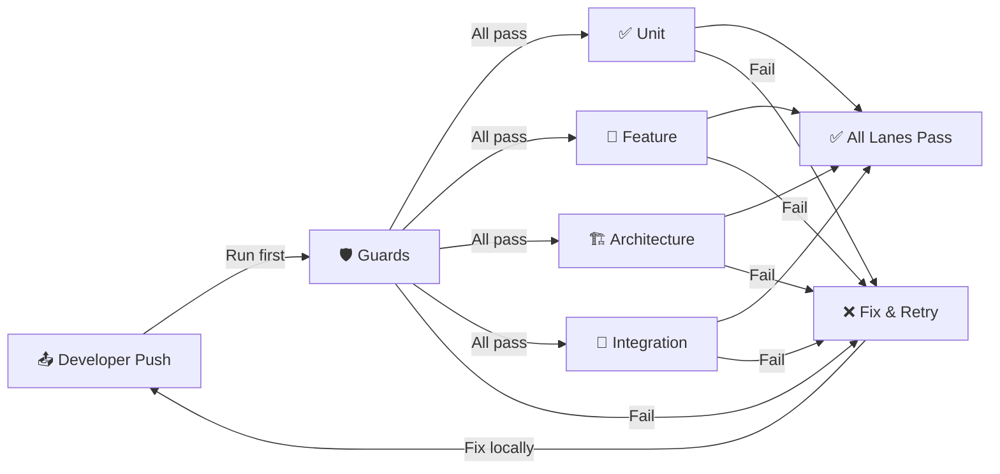

# CI Lanes Architecture (Phase 9)

## Overview

The testing infrastructure is split into **5 parallel lanes**, each with a specific purpose. This architecture improves both **developer feedback speed** and **CI transparency**.

```
┌─────────────────────────────────────────────────────────┐
│ Developer Pushes Code                                   │
└────────────────────────┬────────────────────────────────┘
                         │
                         ↓
        ┌────────────────────────────────┐
        │  🛡️ GUARDS (Earliest Feedback)│
        │  - Architecture Compliance     │
        │  - Module Isolation Guard      │
        │  - RefreshDatabase Guard       │
        └────────┬───────────────────────┘
                 │ All Guards PASS
                 ↓
        ┌────────────────────────────────┐
        │   5 Parallel Test Lanes        │
        │                                │
        ├─ ✅ Unit Tests                │
        ├─ 🧪 Feature Tests            │
        ├─ 🏗️ Architecture Tests       │
        ├─ 🔗 Integration Tests        │
        └─ 📊 Coverage Report          │
                 │
                 ↓
        ┌────────────────────────────────┐
        │  ✅ All Green → Merge          │
        │  ❌ Any Red → Fix & Retry      │
        └────────────────────────────────┘
```

---

## Lane Details

### 1️⃣ 🛡️ Guards Lane (Fail-Fast)

**Purpose:** Block obviously broken code before running expensive tests.

**What it does:**
- Runs all 16 architecture compliance scripts (core blindness, module isolation, atomic counters, etc.)
- Runs `ModuleUnitIsolationGuardTest` (detects RefreshDatabase in unit tests)
- Runs `RefreshDatabaseUsageGuardTest` (ensures DB hygiene)

**Time:** 30-60s
**When it fails:** Fix architectural violations immediately (see [CI_GUARD_STAGES.md](CI_GUARD_STAGES.md))

**Key Scripts:**
- `scripts/ci/check-architecture-compliance.sh` (orchestrator, runs 7 core checks)
- `scripts/ci/check-cross-module-imports.sh` (prevents Model cross-talk)
- `scripts/ci/check-core-blindness.sh` (prevents app/ importing Modules/)
- `scripts/ci/check-atomic-counters.sh` (enforces AtomicCounterService usage)

**Typical Failures:**
```
❌ FAIL: Core blindness check
   File: app/Services/BillingService.php
   Problem: Imports from Modules\PIB\Models\Invoice
   Fix: Use a contract interface instead (see TESTING_CONTRIBUTION_GUIDE.md)

❌ FAIL: Module isolation guard
   Test: ModuleUnitIsolationGuardTest
   Problem: tests/Unit/AppHealth/HistogramTest.php uses RefreshDatabase
   Fix: Move to tests/Feature/ or mock the database layer
```

---

### 2️⃣ ✅ Unit Tests Lane

**Purpose:** Fast logic validation with zero database access.

**What it does:**
- Runs `tests/Unit` directory (16 modules + app core)
- Generates coverage report for unit scope
- Runs in parallel (10 processes)

**Time:** 15-30s
**Database:** SQLite in-memory (no DB setup needed)
**Setup:** None (stateless, isolated tests)

**When it fails:**
- Fix the test or the logic it covers
- Check if you accidentally added a database call (should be mocked)
- See [TEST_REGRESSION_PREVENTION.md](TEST_REGRESSION_PREVENTION.md) → Regression Pattern #1: "Silent Logic Bugs"

**What should be tested here:**
```php
// ✅ Services (pure logic)
test('service calculates discount correctly', function () {
    $service = new DiscountService();
    expect($service->calculateDiscount(100, 10))->toBe(90);
});

// ✅ Value Objects
test('email validates domain', function () {
    expect(Email::make('user@example.com')->isValid())->toBeTrue();
});

// ✅ DTOs
test('dto transforms data correctly', function () {
    $dto = CustomerDTO::make(['name' => 'John', 'email' => 'john@example.com']);
    expect($dto->toArray())->toHaveKeys(['name', 'email']);
});

// ✅ Helpers
test('helper formats date correctly', function () {
    expect(formatDate('2024-01-15'))->toBe('Jan 15, 2024');
});
```

**What should NOT be tested here:**
```php
// ❌ Database (use tests/Feature or tests/Integration)
RefreshDatabase;

// ❌ HTTP (use tests/Feature)
$this->postJson('/api/endpoint');

// ❌ External APIs (use tests/Integration)
Http::asJson()->post('https://external-api.com/...');
```

---

### 3️⃣ 🧪 Feature Tests Lane

**Purpose:** Validate controller logic, forms, requests, authorization.

**What it does:**
- Runs `tests/Feature` directory
- Generates coverage report for feature scope
- Sets up MySQL database (tests use `RefreshDatabase`)
- Runs in parallel (10 processes)

**Time:** 30-60s
**Database:** Real MySQL (tests can use `RefreshDatabase`)
**Setup:** MySQL service, migrations, seeders

**When it fails:**
- Check controller/form logic
- Verify request validation rules
- Check authorization gates/policies
- See [FLAKY_TEST_TRIAGE.md](FLAKY_TEST_TRIAGE.md) if intermittent

**What should be tested here:**
```php
// ✅ Routes
test('user can view invoice', function () {
    $user = User::factory()->create();
    $response = $this->actingAs($user)->get('/invoices');
    expect($response->status())->toBe(200);
});

// ✅ Forms
test('form validation fails without email', function () {
    $response = $this->postJson('/users', ['name' => 'John']);
    expect($response->json('errors.email'))->toBeDefined();
});

// ✅ Authorization
test('user cannot delete another user', function () {
    $user = User::factory()->create();
    $other = User::factory()->create();
    $response = $this->actingAs($user)->delete("/users/{$other->id}");
    expect($response->status())->toBe(403);
});

// ✅ External APIs (mocked)
test('can send email through queue', function () {
    Mail::fake();
    Queue::fake();
    Mail::assertNothingSent(); // Verified before
    $this->post('/users', ...)->assertRedirect();
});
```

**What should NOT be tested here:**
```php
// ❌ Pure logic (use tests/Unit)
// Test the service, not the controller

// ❌ Integration tests (use tests/Integration)
// Test actual API calls to external services, not mocked
```

---

### 4️⃣ 🏗️ Architecture Tests Lane

**Purpose:** Validate module structure, contract binding, inheritance rules.

**What it does:**
- Runs `tests/Architecture` directory (65 tests, 84 assertions)
- Validates module boundaries and interdependencies
- Verifies service provider contracts are properly bound
- Checks inheritance and interface compliance

**Time:** 5-10s
**Database:** None
**Setup:** None (code-only analysis)

**When it fails:**
- Check the module structure matches published contracts
- Verify all services are registered in service providers
- See [CI_GUARD_STAGES.md](CI_GUARD_STAGES.md#architecture-test-failures)

**Key Tests:**
```php
// ✅ ModuleBoundaryContractsTest.php
// Verifies each module implements its published contracts

// ✅ EnhancedArchitectureTest.php
// Checks module structure, naming conventions, file organization
```

**Typical Failures:**
```
❌ FAIL: Service not implementing interface
   Module: CaseManager
   Problem: InvoiceService doesn't implement BillingService contract
   Fix: Add interface to service class or update contract binding

❌ FAIL: Module structure violation
   Module: KnowledgeBase
   Problem: Controllers in wrong directory
   Fix: Move to Modules/KnowledgeBase/Http/Controllers/
```

---

### 5️⃣ 🔗 Integration Tests Lane

**Purpose:** Validate cross-module communication, external APIs, complex workflows.

**What it does:**
- Runs `tests/Integration` directory
- Tests real API calls to internal & external services
- Validates data flow between modules
- Generates coverage report

**Time:** 30-60s
**Database:** Real MySQL
**Setup:** MySQL service, migrations, seeders, may hit real external APIs

**When it fails:**
- Check external API connectivity
- Verify complex workflows with multiple modules
- See [TEST_REGRESSION_PREVENTION.md](TEST_REGRESSION_PREVENTION.md#external-api-integration)

**What should be tested here:**
```php
// ✅ Cross-module workflows
test('invoice workflow: create → validate → send', function () {
    $order = Order::factory()->create();
    $invoice = $this->postJson('/invoices', ['order_id' => $order->id])
        ->json('data');

    // Verify Invoice module processed it
    expect(Invoice::query()->find($invoice['id']))->toBeDefined();
});

// ✅ External API calls (if not mocked in feature tests)
test('can fetch user data from external system', function () {
    $response = $this->postJson('/sync-external-users');
    expect($response->json('synced_count'))->toBeGreaterThan(0);
});

// ✅ Message queue workflows
test('async job processes invoice', function () {
    Queue::fake();
    $this->postJson('/invoices', [...])->assertQueued(ProcessInvoice::class);
});
```

---

## Lane Dependencies & Execution Order



**Key Rules:**
1. **Guards must pass first** (gated, fails fast)
2. **All other lanes run in parallel** (independent, fast)
3. **No lane waits for another** (except guards gate all others)
4. **Coverage reports combine** at the end (overall coverage % shown)

---

## Local Development Alignment

### Single Test Command (Run All Lanes)
```bash
php artisan test --parallel --processes=10
```

### Lane-Specific Commands (Run Before Pushing)

```bash
# 1. Guards (must pass before anything else)
bash scripts/ci/check-architecture-compliance.sh
php artisan test tests/Unit/ModuleUnitIsolationGuardTest.php -q

# 2. Just unit tests
php artisan test tests/Unit --parallel --processes=10

# 3. Just feature tests
php artisan test tests/Feature --parallel --processes=10

# 4. Just architecture tests
php artisan test tests/Architecture

# 5. Just integration tests
php artisan test tests/Integration
```

### Pre-Push Validation (Complete)
```bash
# This mirrors what CI will run
bash scripts/ci/check-architecture-compliance.sh && \
  php artisan test tests/Unit/ModuleUnitIsolationGuardTest.php \
               tests/Unit/RefreshDatabaseUsageGuardTest.php -q && \
  php artisan test --parallel --processes=10
```

---

## Artifacts & Reporting

### Generated Artifacts

| Artifact | Location | Purpose |
|----------|----------|---------|
| Test Results | `reports/test-results-latest.log` | Full test output, failures, timing |
| Unit Coverage | `reports/unit-coverage.xml` | Code coverage for unit tests |
| Feature Coverage | `reports/feature-coverage.xml` | Code coverage for feature tests |
| Master CI Log | `reports/ci_master.log` | All guard scripts output |
| Coverage Summary | Codecov Dashboard | Overall repo coverage % |

### Reading Reports

```bash
# Last test run summary
tail -n 100 reports/test-results-latest.log

# Just the failures
grep -A 10 "FAILED\|Failed" reports/test-results-latest.log

# Count failures by lane
grep "FAILED" reports/test-results-latest.log | grep -c "Unit"
grep "FAILED" reports/test-results-latest.log | grep -c "Feature"

# Guard failures
cat reports/ci_master.log | head -50
```

### Coverage Reporting

```bash
# Local coverage (after running tests)
php artisan test --parallel --processes=10 --coverage
# Opens: coverage/index.html in browser

# CI coverage
# Uploaded to codecov.io automatically
# View at: codecov.io/github/your-org/your-repo
```

---

## Troubleshooting

### 🛡️ Guards Failed

**Problem:** One or more architecture checks failed.

**Solution:**
1. Read the failure message in `reports/ci_master.log`
2. See [CI_GUARD_STAGES.md](CI_GUARD_STAGES.md) → Handling Guard Failures section
3. Common fixes:
   - Core blindness: Use contract interface, not module imports
   - Cross-module imports: Check for accidental Model references
   - Atomic counters: Use `AtomicCounterService` for financial operations

### ✅ Unit Tests Failed

**Problem:** A test in `tests/Unit/` is failing.

**Solution:**
1. Run it locally: `php artisan test --filter="TestName" -v`
2. Check if you accidentally added a database call (mock instead)
3. See [TEST_REGRESSION_PREVENTION.md](TEST_REGRESSION_PREVENTION.md) → Common Patterns

### 🧪 Feature Tests Failed

**Problem:** A test in `tests/Feature/` is failing intermittently.

**Solution:**
1. If **intermittent**: see [FLAKY_TEST_TRIAGE.md](FLAKY_TEST_TRIAGE.md)
2. If **consistent**:
   - Check route/controller logic
   - Verify request validation
   - Check authorization gates
   - See [TEST_REGRESSION_PREVENTION.md](TEST_REGRESSION_PREVENTION.md) → External API Integration

### 🏗️ Architecture Tests Failed

**Problem:** Module structure or contracts are wrong.

**Solution:**
1. Read the failure: which module, which contract?
2. Verify module provides the contract in service provider
3. Check file organization matches documented structure
4. See [TESTING_CONTRIBUTION_GUIDE.md](TESTING_CONTRIBUTION_GUIDE.md) → Module Structure

### 🔗 Integration Tests Failed

**Problem:** External API or cross-module workflow failed.

**Solution:**
1. Check external API status (is it up?)
2. Verify request format matches API spec
3. Check MySQL connection and migrations ran
4. See [TEST_REGRESSION_PREVENTION.md](TEST_REGRESSION_PREVENTION.md) → External API Integration

---

## Configuration Reference

### CI Workflow File

**Location:** `.github/workflows/test-lanes.yml`

**Key Sections:**
```yaml
jobs:
  guards:
    runs-on: ubuntu-latest
    # Runs architecture checks + isolation guards
    # Gates all other lanes

  unit-tests:
    needs: guards  # Waits for guards to pass
    runs-on: ubuntu-latest
    # No MySQL needed, SQLite in-memory

  feature-tests:
    needs: guards  # Waits for guards to pass
    services:
      mysql:  # Database for feature tests

  architecture-tests:
    needs: guards  # Waits for guards to pass
    # Code-only, no database

  integration-tests:
    needs: guards  # Waits for guards to pass
    services:
      mysql:  # Real database needed
```

### Local Configuration

**Test Configuration:** `phpunit.xml`
- Defines test directories
- SQLite in-memory database
- Parallel process settings
- Coverage configuration

**CI Configuration:** `.github/workflows/test-lanes.yml`
- Lane definitions
- Service setup (MySQL, Redis, etc.)
- Artifact publishing
- Dependency ordering

---

## Going Forward

### Adding a New Test

1. **Decide the lane:**
   - Pure logic? → `tests/Unit/`
   - Controller/route? → `tests/Feature/`
   - Module structure? → `tests/Architecture/`
   - Cross-module workflow? → `tests/Integration/`

2. **Run the appropriate lane locally:**
   ```bash
   php artisan test tests/Unit --parallel --processes=10
   ```

3. **Verify guards pass:**
   ```bash
   bash scripts/ci/check-architecture-compliance.sh
   ```

4. **Submit PR** (CI will run all lanes automatically)

### Adding a New Guard Check

1. Create script in `scripts/ci/check-something.sh`
2. Add to `scripts/ci/check-architecture-compliance.sh` orchestrator
3. Document in [CI_GUARD_STAGES.md](CI_GUARD_STAGES.md)
4. Test locally, then update workflow

### Modifying Lane Logic

1. Change `.github/workflows/test-lanes.yml`
2. Test locally (understand what CI will do)
3. Verify artifact paths don't conflict
4. Commit and verify in CI

---

**Phase Completion:** Phase 9 - Developer Experience (CI Lanes)
**Status:** ✅ Complete - 5 lanes designed and documented
**Test Result:** Validate on next CI run (Guards, Unit, Feature, Architecture, Integration)

For developer-focused quick start, see [TESTING_QUICK_START.md](TESTING_QUICK_START.md).
